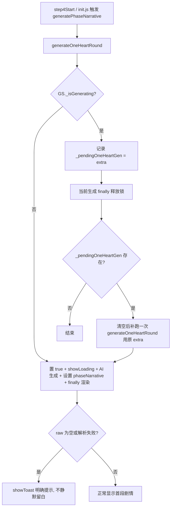

## 用户需求

1v1「只为你心动」· 娱乐圈世界观（队友的妹妹）新开存档进入 DAY1 时，中间剧情文字区域空白，底部 Tab（剧情/聊天/朋友圈/剧场）正常显示，但没有任何 loading 转圈、也没有报错弹窗。用户要求 DAY1 能正常生成并显示首段剧情。

## 产品概述

修复 1v1 模式首段剧情"静默空白"缺陷：根因是生成函数的重入守卫在"已有一次生成在飞"时会直接静默 return（早于 loading 与 finally 的渲染），导致屏幕停留在空白剧情区；同时 `!raw`（AI 返回为空）分支也无任何提示就清空返回。需要在不破坏既有时钟改造逻辑、不引入新依赖的前提下，让重入调用被协作补跑、空/失败返回给出明确提示、首段空结果自动重试。

## 核心特性

- 重入守卫协作化：当已有生成在飞时，记录待执行的生成参数，在当前生成释放锁后由 finally 自动补跑一次，避免并发两次 AI 调用又避免死空白
- `!raw`（AI 返回为空）分支补显式 toast 提示，与解析失败分支一致，不再静默留白
- 1v1 首段生成（step4Start）增加空结果自动重试，与 transfer 模式处理对齐
- init.js 自动生成增加 `_isGenerating` 去重判断，避免与 step4Start 并发重复触发
- 全程不影响 transfer 模式与其他 1v1 世界观，不影响已完成的 1v1 时钟确定性推进改造

## Tech Stack

- 语言/运行时：JavaScript (ES Modules)，Node.js 18+，Vanilla JS + Vite（与现有项目一致）
- 仅修改既有模块：`src/game-engine.js`、`src/ui-renderer.js`、`src/init.js`
- 遵循 AGENTS.md：使用 `var`、字符串拼接（不使用模板字符串）、不引入新依赖

## 实现方案

### 总体策略

针对"无 loading、无报错、空白"的三联征，定位到 `generateOneHeartRound` 开头的重入守卫（`game-engine.js:2284`）在"已有生成在飞"时直接 return，早于 `showLoading` 与 finally 的 `renderAll`，从而留下空白剧情区。修复分三层：(1) 重入不再丢弃，改为排队补跑；(2) `!raw` 空返回显式提示；(3) 首段与 init 路径去重/重试，确保 DAY1 一定拿到剧情或明确报错。

### 关键决策与权衡

1. **重入守卫协作化（而非简单去掉 guard）**：直接移除守卫会导致 init.js 自动生成与 step4Start 显式生成并发触发两次 AI 调用（双倍消耗、状态互相覆盖）。改为"记录 `_pendingOneHeartGen = extra`，finally 释放锁后若有则补跑一次"，既消除死空白又避免并发双调用，符合现有 `finally` 重置 `_isGenerating` 的结构。
2. **`!raw` 补 toast**：原 `!raw` 分支静默 `return` 是"无报错空白"的次要来源（三次重试全失败返回空 raw 时走入）。补 `showToast('⚠️ 剧情生成失败（AI 返回为空），请重试')`，与 2419 解析失败分支行为一致，便于用户感知。
3. **首段重试对齐 transfer**：`ui-renderer.js:1186-1189` 1v1 缺 transfer 模式 1757-1760 的 `if (!GS.phaseNarrative && GS.aiEnabled) { await generatePhaseNarrative(); }` 重试。补齐后，偶发空返回也能自愈，仍空则提示并提供重新生成入口。
4. **init.js 去重**：自动生成前加 `if (GS._isGenerating) return;`，与协作守卫配合形成双保险，避免旧存档/`step>=5` 状态下重复触发。

### 性能与可靠性

- 重入补跑仅在有在飞生成时发生，补跑用已保存参数，零额外 AI 调用（除非确实首次失败）；正常单路径流程无新增开销。
- `_pendingOneHeartGen` 在 finally 补跑后立即清空，避免累积重复。
- 不改动 `renderAll`/渲染层，`finally` 已负责最终刷新。

## 实现注意

- 沿用 `var` 声明与字符串拼接风格，不新增日志/依赖。
- 协作守卫补跑时复用与原始调用相同的 `extra` 参数（含 isDate/isVisit 等），确保时钟吸附等逻辑一致。
- `_pendingOneHeartGen` 需在 `state.js` 默认状态与 `migrateSave` 兜底中声明 `undefined`/不存在时安全读取（用 `GS._pendingOneHeartGen` 直接判断即可，无需持久化）。
- 不触碰已完成的时钟确定性推进代码块（2523-2558）。

## 架构设计



## 目录结构

```
src/
├── game-engine.js       # [MODIFY] 1) 2284 重入守卫改为"记录 _pendingOneHeartGen 而非静默 return"；
│                         #   2) 2411 !raw 分支补 showToast 提示；3) 2730 finally 释放锁后若 _pendingOneHeartGen
│                         #   存在则清空并补跑一次（用保存的 extra）。
├── ui-renderer.js       # [MODIFY] 1028-1190 的 1v1 step4Start：在 await generatePhaseNarrative() 后补
│                         #   transfer 同款空结果重试（1186-1189 区域）。
└── init.js              # [MODIFY] 100-104 自动生成前增加 if (GS._isGenerating) return; 去重判断。
```

## 关键代码结构

```js
// game-engine.js —— 重入守卫协作化（替换 2284 的静默 return）
if (GS._isGenerating) {
  GS._pendingOneHeartGen = extra; // 排队，待当前生成结束补跑，避免并发双调用与死空白
  return;
}

// game-engine.js —— finally 释放锁后补跑排队的生成（替换/扩展 2730 附近）
} finally {
  GS._isGenerating = false;
  window.__renderAll && window.__renderAll();
  hideLoading();
}
if (GS._pendingOneHeartGen) {
  var _pending = GS._pendingOneHeartGen;
  GS._pendingOneHeartGen = null;
  await generateOneHeartRound(_pending);
}

// game-engine.js —— !raw 分支显式提示（替换 2411 附近）
if (!raw) {
  GS.phaseNarrative = '';
  GS.currentOptions = [];
  GS.parsedNarrative = { narrative: '', directorOS: '', options: [] };
  showToast('⚠️ 剧情生成失败（AI 返回为空），请重试或换个指令');
  return;
}
```