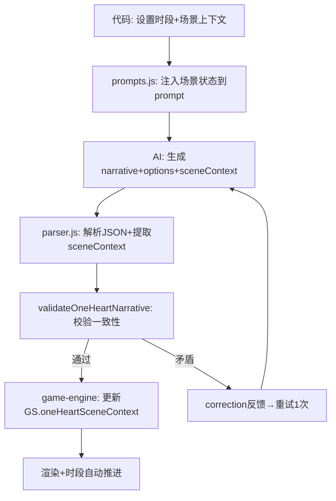

## 用户需求

1v1模式剧情频繁出现反常识逻辑错误。核心问题：AI完全控制了剧情走向（场景跳转、时间推进、人物位置），导致同车却群聊@、上段说下周聚餐下段就在聚餐等荒谬场景。

用户明确指示：**"只是用AI填充需要填充的内容，而不是完全用AI去控制应该去干嘛"**——即代码管骨架（场景、时间、人物、约定时机），AI管填充（文采、对话、氛围）。

## 产品概述

将1v1模式从"AI全权控制"转变为"代码骨架+AI填充"架构。代码追踪场景上下文（位置/在场人物/时段），控制时间推进和约定兑现时机，生成后校验一致性并correction重试。AI在代码约束的框架内发挥文采。

## 核心功能

- **场景上下文追踪**：代码维护当前位置和在场人物，AI输出sceneContext字段，代码校验连续性
- **时段自动推进**：代码按回合数自动推进时段（上午→下午→傍晚→深夜），AI不得自行跳转
- **约定兑现延迟**：代码记录约定创建回合，未经过足够轮次禁止兑现
- **生成后校验**：代码校验场景/时间/人物一致性，矛盾则correction重试
- **prompt辅助规则**：物品连续性、知识隔离、群聊可见性等代码难处理的仍靠prompt软约束

## Tech Stack

- Runtime: JavaScript (ES Modules), Node.js 18+
- Build: Vite 5.4
- Framework: Vanilla JS
- 修改文件: state.js, parser.js, game-engine.js, prompts.js（4个文件）

## Implementation Approach

### 架构原则：代码骨架 + AI填充 + 校验兜底

```
代码骨架层（state.js + game-engine.js）
  ├── 时段状态机：oneHeartTimeProgress (0-3) → 上午/下午/傍晚/深夜
  ├── 场景上下文：oneHeartSceneContext { location, present }
  ├── 约定延迟：oneHeartPromiseLog [{ text, createdAtRound }]
  └── 校验门禁：validateOneHeartNarrative → correction重试

AI填充层（prompts.js → AI → parser.js）
  ├── 输入：代码注入 [场景状态] + [当前时段] + 约束规则
  ├── AI输出：narrative(文采/对话/氛围) + options + sceneContext
  └── 解析：parseOneHeartNarrative 提取 sceneContext

校验层（parser.js + game-engine.js）
  ├── 位置连续性：新location vs 旧location，非"新的一天"不可跳转
  ├── 在场人物：对话对象必须在 present 列表中
  ├── 时段一致：narrative描写时段 vs oneHeartTimeOfDay
  └── 群聊检查：群聊@目标不得在 present 中
```

### 关键决策

1. **时段推进**：新增 `oneHeartTimeProgress` (0-3)，每回合+1，映射 上午/下午/傍晚/深夜。到深夜后下一步自然进入"新的一天"。现有"新的一天"按钮逻辑不变，但 `oneHeartTimeProgress` 重置为0。

2. **场景上下文**：AI JSON输出新增可选字段 `sceneContext: { location, present }`。代码存入 `GS.oneHeartSceneContext`，下回合注入prompt。校验时比对前后location是否一致（非"新的一天"时不允许跳转）。

3. **约定延迟**：`detectOneHeartPromises` 检测到约定时，记录 `createdAtRound`。prompt注入时只展示 `currentRound - createdAtRound >= 3` 的约定为"可兑现"，其余标"尚未到时机"。

4. **校验方式**：保留 `skipValidate: true`（不修改 generateWithRetry 内部逻辑），在 `generateOneHeartRound` 中 parse 后手动调用 `validateOneHeartNarrative`，若有corrections则手动重试1次。最小侵入现有重试机制。

5. **prompt辅助规则**：物品连续性、人物知识隔离、群聊消息可见性——这些需要语义理解，代码难硬校验，保留为prompt规则14-16。

### 性能与可靠性

- 校验重试最多1次（非3次），避免API成本翻倍
- sceneContext字段对AI是可选的，不输出时代码仅做prompt约束不阻断
- 新增状态字段通过migrateSave兜底，旧存档自动升级
- 时段推进是纯本地计算，零API成本

## Architecture Design

### 数据流



### 修改链路

```
state.js (新增字段+迁移)
  ↓
prompts.js (注入场景状态+请求sceneContext+辅助规则)
  ↓
AI生成
  ↓
parser.js (解析sceneContext + validateOneHeartNarrative校验函数)
  ↓
game-engine.js (调用校验+场景追踪+时段推进+约定延迟)
```

## Directory Structure

```
src/
├── state.js              [MODIFY] 新增 oneHeartSceneContext, oneHeartTimeProgress, oneHeartPromiseLog 字段 + migrateSave兜底
├── parser.js             [MODIFY] parseOneHeartNarrative 解析 sceneContext 字段 + 新增 validateOneHeartNarrative 校验函数
├── game-engine.js        [MODIFY] generateOneHeartRound: 校验调用+场景追踪+时段推进+约定延迟记录
└── prompts.js            [MODIFY] buildOneHeartSystemPrompt: 规则14-16 + buildOneHeartUserMessage: 注入场景状态+请求sceneContext+约定延迟展示
```

## Key Code Structures

### 场景上下文与校验接口

```javascript
// state.js - 新增字段
oneHeartSceneContext: { location: '', present: [] },
oneHeartTimeProgress: 0,  // 0=上午 1=下午 2=傍晚 3=深夜
oneHeartPromiseLog: [],   // [{ text, createdAtRound }]

// parser.js - 校验函数签名
function validateOneHeartNarrative(parsed, GS) {
  // 返回 corrections 字符串（如"场景矛盾：上段在车内，这段变成了家里"）或 null
  // 校验项：location连续性、present人物一致、时段一致、群聊@检查
}

// AI JSON 输出新增可选字段
{
  "blocks": [...],
  "options": [...],
  "sceneContext": { "location": "车内", "present": ["尹净汉", "崔瀚率"] }
}
```

## Agent Extensions

### SubAgent

- **code-explorer**
- Purpose: 实施前扫描 generateOneHeartRound、parseOneHeartNarrative、generateWithRetry 的精确函数签名和调用链，确认校验注入点
- Expected outcome: 输出精确行号、参数列表、返回值结构，确保校验逻辑正确接入现有重试机制