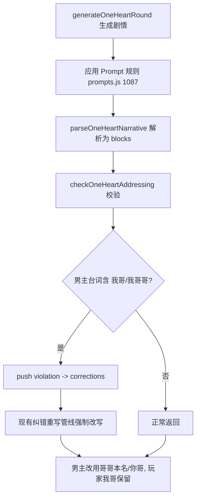

## 用户需求

在 1v1「只为你心动」· 娱乐圈世界观「队友的妹妹」设定下，男主（心动对象）的对话/独白中会出现「我哥」，但玩家并不知道这个「我哥」是谁，造成身份困惑。

## 产品概述

仅修复文本生成逻辑（用户已选择方案 A，不新增 UI、不让玩家选哥哥、不开局告知哥哥身份）。目标是让 AI 在生成时严格遵守：男主在故事里没有兄弟，因此绝对禁止说「我哥/我哥哥」；男主若要提及女主的哥哥，只能用哥哥的本名（如金珉奎）或「你哥」指代。玩家（女主）自己的「我哥」保持原样、不受影响。

## 核心特性

- 重写世界观关系角色 Prompt 规则：明确哥哥是女主亲哥、是男主队友、不是男主兄弟；男主禁说「我哥/我哥哥」，改用本名或「你哥」；女主可用「我哥」
- 新增校验器硬校验：对男主台词块（memberInterview 且为心动对象）检测「我哥/我哥哥」，命中即触发强制纠错重写，作为 Prompt 规则被忽略时的兜底
- 玩家自身「我哥」、男主用「你哥」或直呼哥哥本名均不受影响、不误伤

## 技术栈

- 语言/运行时：JavaScript (ES Modules)，Node.js 18+，Vanilla JS + Vite（与现有项目一致）
- 仅修改既有模块：`src/prompts.js`、`src/validator.js`
- 遵循 AGENTS.md：使用 `var`、字符串拼接（不使用模板字符串）、不引入新依赖、AI 文本经 `escHtml()` 转义（本改动不涉及 DOM 插入）

## 实现方案

### 总体策略

针对「男主说『我哥』导致身份不明」的根因（哥哥角色是女主亲哥、名字固定存于 `GS.oneHeartRelationCharacter.name`，而男主在故事中没有兄弟），采用「Prompt 规则 + 校验器硬校验」双层修复，与现有「生成→校验→纠错重写」管线完全对齐，不改动世界观文案、状态、UI 与哥哥身份生成逻辑。

### 关键决策与权衡

1. **Prompt 规则重写（主修复，生成层）**：`prompts.js:1087` 当前单行规则同时禁止男主视角「他哥」「你哥」却未明确禁止「我哥」，且表述易让 AI 误以为男主也能用「我哥」。重写为 4 行清晰约束：哥哥是女主亲哥（名字固定 `rel.name`）、是男主队友、不是男主哥；男主绝对禁止「我哥/我哥哥」；男主提及女主哥哥只能用本名或「你哥」；女主可用「我哥」。保留其后 `1088-1092` 妹妹称呼闸门逻辑不变，避免回归。
2. **校验器硬校验（兜底，纠错层）**：在 `validator.js` 的 blocks 循环（330-367）内，对 `block.type === 'memberInterview' && block.member === GS.oneHeartMember`（即男主台词）且正文匹配 `/我哥\b|我哥哥/` 的块 push violation，走现有 `corrections`（type:'address'）纠错重写管线。即便 AI 忽略 Prompt 也能被强制修正。
3. **不误伤女主与合理指代**：女主（`speaker.isPlayer`）的「我哥」保持豁免（与现有 352-360 亲哥豁免一致）；男主用「你哥」（意为"你的哥哥"）或直呼哥哥本名均为合法，校验器不拦截。`narrative` 正文块（397-409）因难以判定说话人不做 blanket 禁「我哥」，避免误伤女主内心戏，男主台词主要由 memberInterview 块承载，校验覆盖该路径即可。

### 性能与可靠性

- 校验器仅在妹妹设定 + 男主台词块上做一次正则匹配，O(块数) 且正则极轻量，无额外 AI 调用、无性能负担。
- 复用现有 `checkOneHeartAddressing` 返回结构与纠错管线，无新增状态字段、无持久化改动，向后兼容（旧存档 `oneHeartRelationCharacter` 已含 `name`）。
- 不触碰 `state.js`/`ui-renderer.js` 的哥哥生成逻辑，哥哥身份随机分配行为完全不变，符合用户所选 A。

## 实现注意

- 沿用 `var` 声明与字符串拼接风格；新增校验文本使用 `GS.oneHeartRelationCharacter.name`，无该字段时退化提示「哥哥本名」（用 `GS.oneHeartRelationCharacter && GS.oneHeartRelationCharacter.name` 安全读取）。
- 校验正则 `\b` 用于「我哥」后边界（避免「我哥们」等误判），同时覆盖「我哥哥」。
- 改动集中在两处，需确保 `npm run build` 通过（PowerShell 下用 `node ./node_modules/vite/bin/vite.js build` 绕过 npm.ps1 执行策略拦截）。

## 架构设计



## 目录结构

```
src/
├── prompts.js     # [MODIFY] 1087 重写关系角色 block 中「我哥」相关规则：
│                   #   明确哥哥是女主亲哥/男主队友/非男主兄弟；男主禁说「我哥/我哥哥」，
│                   #   改用本名或「你哥」；女主可用「我哥」。其后 1088-1092 妹妹称呼闸门不变。
└── validator.js   # [MODIFY] checkOneHeartAddressing 的 blocks 循环（330-367）内
                    #   新增：block.type==='memberInterview' && block.member===GS.oneHeartMember
                    #   且正文匹配 /我哥\b|我哥哥/ 时 push violation，走现有纠错重写。
```

## 关键代码结构

```js
// prompts.js —— 1087 附近重写（替换原单行规则）
parts += '⚠️ 他是你的亲哥哥，名字固定为「' + rel.name + '」，是男主的队友，不是男主的哥哥。\n';
parts += '⚠️ 男主（他）在对话或独白中绝对禁止说「我哥」「我哥哥」——本故事里男主没有兄弟，"我哥"是错误指代，会让你（玩家）不知道指谁。\n';
parts += '⚠️ 男主若要提及你（女主）的哥哥，只能直呼其名「' + rel.name + '」或称「你哥」（意为"你的哥哥"），绝不可用「我哥」。\n';
parts += '⚠️ 你（女主）称亲哥哥可用「我哥」或「' + rel.name + '」，这是被允许的。\n';

// validator.js —— blocks 循环内新增男主「我哥」硬校验
if (block.type === 'memberInterview' && block.member === GS.oneHeartMember) {
  if (/我哥\b|我哥哥/.test(content)) {
    var _bname = (GS.oneHeartRelationCharacter && GS.oneHeartRelationCharacter.name) ? GS.oneHeartRelationCharacter.name : '哥哥本名';
    violations.push('男主（' + memberName + '）说出"我哥/我哥哥"——本故事里男主没有兄弟，请改用哥哥本名「' + _bname + '」或"你哥"指代。');
  }
}
```