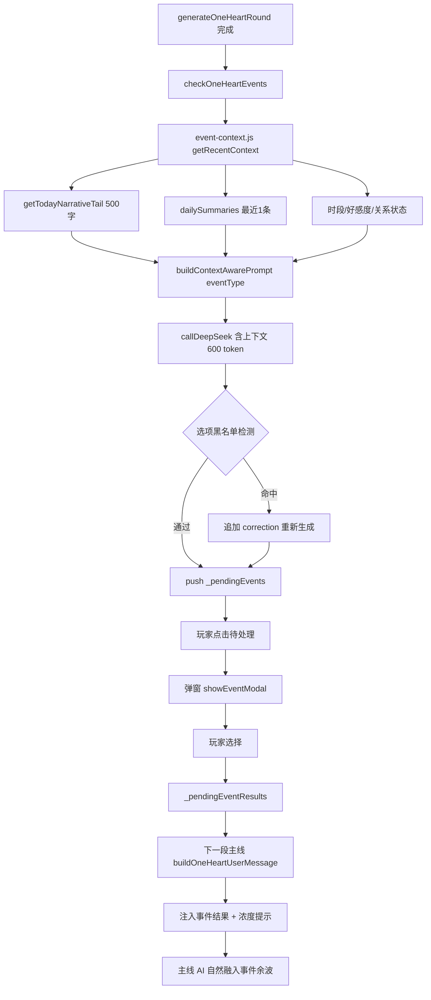

## 产品概述

针对 1v1「只为你心动」模式的事件系统进行重构，解决事件与主线剧情脱节的核心体验问题。当前所有事件（嫉妒/惊喜/情敌/争吵/意外池/小事件）生成时完全没有注入主线剧情上下文，AI 凭空编造场景，导致"主线平平淡淡，突然弹出高浓度事件"的割裂感。重构后事件作为主线剧情的自然转折点，场景承接当前时空，浓度跟随主线，选项风格对齐。保留弹窗形式不变。

## 核心功能

- 上下文注入：新建 event-context.js 模块，提取最近 500 字主线剧情 + 最近 1 条每日摘要 + 当前时段/好感度/关系状态，构建结构化上下文块
- 事件 Prompt 重构：所有事件生成（checkOneHeartEvents / tryPoolEvent / pickSmallEvent）注入上下文块，场景字数从 50 提升至 150，选项字数从 20 提升至 30-40
- 通用选项黑名单：检测"跟着直觉走/冷静观察/大胆行动"等模板选项，命中则重新生成或由 AI 重新生成
- 硬编码兜底事件增强：fallback 事件 prepend 当前情境描述（如"此刻你们在练习室，刚结束排练"），使硬编码场景也能承接时空
- 事件结果回流增强：prompts.js 已有的事件结果注入逻辑保留，增加"浓度提示"（如"这个事件是激烈争吵，请在下一段剧情中体现情绪余波"）

## Tech Stack Selection

- 纯 JavaScript（ES Modules），Vanilla JS + Vite，无新依赖
- 遵循项目代码风格：`var` 而非 `let/const`，字符串拼接用 `+`

## Implementation Approach

### 核心思路

新建 `src/event-context.js` 模块，封装"主线上下文提取"和"事件 prompt 构建"两个核心能力。在 `game-engine.js` 中所有事件生成点（checkOneHeartEvents / tryPoolEvent / pickSmallEvent）调用新模块替换现有裸 prompt。事件生成时注入最近 500 字主线剧情 + 每日摘要 + 当前时段/好感度/关系状态，要求 AI 生成的场景必须承接当前时空。token 上限从 300 提升至 600 以容纳更丰富的场景和选项。

### 关键技术决策

1. **独立模块而非内联**：上下文提取逻辑约 80 行，事件 prompt 构建约 100 行，抽成 `event-context.js` 保持 `game-engine.js` 可读性。与现有 `memory.js` / `prompts.js` 的模块化模式一致

2. **上下文来源复用现有函数**：`getTodayNarrativeTail(500)` 已在 memory.js:53 实现，直接复用。`GS.dailySummaries` 已有数据。不新造数据结构

3. **token 上限 300→600**：场景从 50 字提升到 150 字（约 +100 token），选项从 20 字提升到 30-40 字 ×3（约 +60 token），加上上下文注入（约 +200 token），总计约 +360 token，600 上限足够

4. **通用选项检测而非强制重试**：检测到 AI 返回的选项包含黑名单关键词时，在 prompt 中追加 correction 重新生成 1 次（复用现有 callDeepSeek 而非 generateWithRetry，因为事件不走 validate 流程）。仍失败则保留原选项但 prepend 情境描述

5. **硬编码兜底 prepend 而非改写**：硬编码事件（如 JEALOUSY_EVENTS）的场景是固定文本，不改写内容，而是在场景前 prepend 一句当前情境描述（如"此刻你们刚结束排练，在练习室休息——"），使场景有时空锚点

6. **浓度对齐通过 prompt 指令**：在事件 prompt 中注入"当前剧情浓度"（平淡/日常/紧张/高潮），要求 AI 生成的事件浓度不超过主线浓度 +1 档。浓度推断基于最近好感度变化和 oneHeartAffHistory

### 性能考量

- `getTodayNarrativeTail(500)` 为 O(n) 字符串切片，n=今日文本长度，通常 < 5000 字，可忽略
- 上下文注入增加约 200 token prompt 长度，单次 callDeepSeek 延迟增加 < 0.5 秒
- 事件生成本身是异步非阻塞，不影响主线渲染
- 通用选项检测为 O(k) 正则匹配，k=3（选项数量），零开销

## Implementation Notes

- **复用 getTodayNarrativeTail**：memory.js:53 已实现，直接 import。不要重新实现文本提取逻辑
- **GS.oneHeartLastCompressedIdx**：slice 起始索引，getTodayNarrativeTail 内部已处理，不需要手动 slice
- **事件池缓存带上下文**：现有 oneHeartJealousyPool 等缓存的是"通用场景"，从池子取出时也要 prepend 当前情境描述。池子里的场景本身不带上下文，prepend 在消费时做
- **不破坏 _pendingEventResults 回流**：prompts.js:1148-1165 已有事件结果注入主线逻辑，保留不动。只在其后追加浓度提示
- **callDeepSeek 签名**：`callDeepSeek(systemPrompt, userPrompt, maxTokens, useSystem, temperature)`，事件生成用的是简短 prompt，不传 system prompt（第 1 参数传场景描述，第 4 参数 false）
- **事件好感度硬编码**：ui-renderer.js:2309-2346 的事件好感度硬编码本次不改（属于好感度修复方案的范围），本次只改事件生成的上下文和浓度
- **blast radius**：所有改动在 1v1 分支内（checkOneHeartEvents / tryPoolEvent / pickSmallEvent 只在 gameMode === 'oneHeart' 时调用），不触碰换乘模式

## Architecture Design



## Directory Structure

```
src/
├── event-context.js             # [NEW] 事件上下文提取与 prompt 构建模块
│   ├── getRecentNarrativeContext()       提取最近500字主线+1条每日摘要+时段/好感度，返回结构化上下文字符串
│   ├── getCurrentIntensity()             基于 oneHeartAffHistory 推断当前剧情浓度（平淡/日常/紧张/高潮）
│   ├── buildContextAwarePrompt(eventType, opts)  构建含上下文的事件生成 prompt（场景150字+选项30-40字）
│   ├── enhanceFallbackEvent(event, contextStr)   硬编码兜底事件 prepend 当前情境描述
│   └── GENERIC_OPTION_PATTERNS          通用选项黑名单正则数组
│
├── game-engine.js                # [MODIFY] 事件生成逻辑替换
│   ├── checkOneHeartEvents 行1982-2229：
│   │   嫉妒/争吵/惊喜/情敌 4 处 callDeepSeek → 调用 buildContextAwarePrompt
│   │   token 300→600
│   │   硬编码兜底 → 调用 enhanceFallbackEvent
│   ├── tryPoolEvent 行2232-2276：
│   │   意外池 callDeepSeek → 调用 buildContextAwarePrompt
│   │   token 300→600
│   │   兜底场景 → enhanceFallbackEvent
│   └── pickSmallEvent 行1921-1979：
│       小事件 callDeepSeek → 调用 buildContextAwarePrompt
│       token 300→600
│       兜底 → enhanceFallbackEvent
│
├── prompts.js                    # [MODIFY] 事件结果回流增强
│   └── 行1148-1165 区域：
│       在事件结果注入后追加浓度提示（如"这个事件是激烈争吵，请在下一段剧情中体现情绪余波，但不要跳过时间线"）
│
└── modals/event-modal.js         # [MODIFY] 场景展示区适配
    └── showEventModal 行40：
        scenario 文本区 max-height 从无限制改为 max-height:200px; overflow-y:auto
        适配 150 字场景（原 50 字不需要滚动）
```

## Key Code Structures

```javascript
// event-context.js — 核心接口签名

// 提取最近主线上下文
export function getRecentNarrativeContext() {
  // 返回：{ narrative: '最近500字...', summary: '最近1条摘要...', timeOfDay: '下午', aff: 65, affDesc: '❤️ ...', coldWar: false }
}

// 推断当前剧情浓度
export function getCurrentIntensity() {
  // 返回：'平淡' | '日常' | '紧张' | '高潮'
  // 基于 oneHeartAffHistory 最近变化幅度
}

// 构建含上下文的事件 prompt
export function buildContextAwarePrompt(eventType, opts) {
  // opts: { member, rival, aff, worldConfig, context }
  // 返回：完整 prompt 字符串（含上下文块 + 事件类型描述 + 场景/选项要求 + 浓度约束）
}

// 硬编码兜底事件增强
export function enhanceFallbackEvent(event, contextStr) {
  // 返回：{ scenario: '情境描述 + 原场景', options: event.options }
}

// 通用选项检测
export function hasGenericOptions(options) {
  // 返回：boolean（检测是否包含"跟着直觉走/冷静观察/大胆行动"等模板）
}
```

## Agent Extensions

### SubAgent

- **code-explorer**
- Purpose: 在实现阶段需要跨文件搜索事件生成的所有调用点，确保不遗漏任何 event prompt
- Expected outcome: 确认 checkOneHeartEvents / tryPoolEvent / pickSmallEvent 中所有 callDeepSeek 调用均已替换