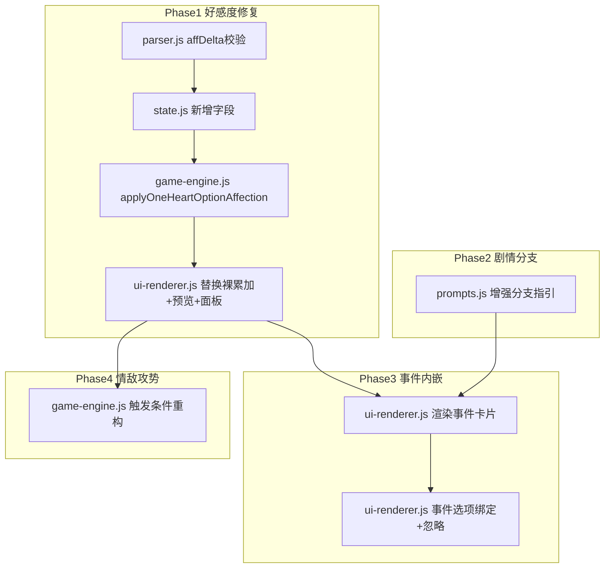

## 产品概述

对 1v1「只为你心动」模式进行好感度系统与事件系统的全面重构，涵盖四个方向：好感度修复（防通胀/校验/日志/可见性）、剧情分支线路（好感度区间决定剧情风格）、事件内嵌（移除弹窗，事件直接作为主选项）、情敌攻势重构（触发频率与正主好感度负相关）。

## 核心功能

### 好感度修复

- affDelta 范围校验 -5~5，与 rivalAffDelta 校验对齐
- 高分段边际递减：好感度 40+ 封顶+3，60+ 封顶+2，80+ 封顶+1，负向不受影响
- 正主下限 -20，情敌下限 0（已有）
- 正主复用 addAffectionLog，情敌新增 GS.oneHeartRivalAffLog
- 选项预览显示情敌变化（橙色标注），好感度面板显示情敌档位（不显示数值）
- 选项好感度逻辑提取到 game-engine.js 统一管理

### 剧情分支线路

- 低好感（<20）虐心线：误会/冷战/分手边缘
- 中好感（20-50）试探线：暧昧/吃醋/拉扯
- 高好感（50-80）甜宠线：表白/约会/日常糖
- 极高好感（80+）深度线：未来规划/承诺
- 增强 prompts.js:1040-1044 现有的关系氛围注入，从简单标签升级为详细剧情方向指引

### 事件内嵌

- 移除"📋 待处理"按钮和弹窗调用
- 有事件时，操作区直接显示事件场景卡片 + 事件选项 + 忽略按钮，隐藏主线选项
- 玩家选事件选项 → 好感度变化 + 结果存入 _pendingEventResults + 推进下回合
- 玩家点忽略 → 事件丢弃 + 显示主线选项

### 情敌攻势重构

- 触发条件从 rivalAff >= 15 改为正主好感度负相关
- 正主好感 < 20：概率 30%（关系未稳固，情敌活跃）
- 正主好感 20-40：概率 20%
- 正主好感 40-60：概率 10%
- 正主好感 60-80：概率 5%
- 正主好感 80+：概率 0%（情敌知难而退）
- 情敌好感度只影响攻势激烈程度，不影响触发频率
- 新增情敌退出机制：正主好感 >= 80 且情敌好感 < 30 → 情敌退出故事

## Tech Stack

- 纯 JavaScript（ES Modules），Vanilla JS + Vite，无新依赖
- 遵循项目代码风格：var 而非 let/const，字符串拼接用 +

## Implementation Approach

### 核心思路

四个方向按依赖顺序实施：好感度修复（基础）→ 剧情分支（prompt层）→ 事件内嵌（交互层）→ 情敌攻势（事件触发层）。好感度修复是其他三个方向的基础，必须先完成。

### 关键技术决策

1. **防通胀用高分段递减**：1v1 只有一个正主，换乘模式的疲劳机制会导致全程挫败感。分段封顶模拟"关系已经很好提升变慢"的自然规律，负向扣分不受影响保持戏剧张力

2. **选项好感度逻辑提取到 game-engine.js**：与换乘模式的 triggerAffectionFromChoice 放在同一文件，保持单一职责。ui-renderer.js 只负责渲染和事件绑定

3. **剧情分支增强现有 _mood 注入**：prompts.js:1040-1044 已有简单的关系氛围标签（4档），在其后追加详细的剧情方向指引（每档3-4条具体题材建议），而非新建独立的分支系统

4. **事件内嵌不改事件生成逻辑**：checkOneHeartEvents / tryPoolEvent / pickSmallEvent 的事件生成代码完全不动，只改事件如何呈现给玩家（渲染 + 绑定）。事件数据结构 _pendingEvents 不变

5. **事件好感度也走 updateAffection**：当前 ui-renderer.js:2309-2346 的事件好感度是裸操作 GS.affection，重构后通过 updateAffection + addAffectionLog 走正规路径，让面板能看到事件引起的好感度变化

6. **情敌触发改为正主好感度负相关**：符合现实逻辑——关系未稳固时情敌有可乘之机，关系深入后情敌知难而退。情敌好感度仍影响攻势内容（发消息→约见面→表白），但不影响触发频率

### 防通胀分段规则

| 当前好感度 | 正向加分封顶 | 负向扣分 | 说明 |
| --- | --- | --- | --- |
| 0~39 | 原值（+1~5） | 原值（-2~5） | 初识/普通期，正常成长 |
| 40~59 | 封顶 +3 | 原值 | 暧昧期，减速 |
| 60~79 | 封顶 +2 | 原值 | 升温期，明显减速 |
| 80+ | 封顶 +1 | 原值 | 热恋期，趋近饱和 |


### 情敌攻势触发规则

| 正主好感度 | 触发概率 | 说明 |
| --- | --- | --- |
| < 20 | 30% | 关系未稳固，情敌活跃 |
| 20-40 | 20% | 关系发展中，情敌仍有机会 |
| 40-60 | 10% | 关系深入，情敌减少 |
| 60-80 | 5% | 关系稳固，情敌勉强挣扎 |
| 80+ | 0% | 情敌知难而退 |


情敌退出：正主好感 >= 80 且情敌好感 < 30 → GS.oneHeartRival.name = '' （情敌退出故事）

## Implementation Notes

- **updateAffection 已包含飘字+里程碑**：affection.js:7-17，1v1 复用此路径。调用后移除 ui-renderer.js 中的手动 spawnAffFloat 调用
- **情敌不调 updateAffection**：直接操作 GS.oneHeartRivalAff（情敌不是 MEMBERS 成员），不调 spawnAffFloat('rival')（本来就坏了，用户确认不修）
- **事件内嵌渲染逻辑**：ui-renderer.js:1230-1237 的选项渲染区，当 GS._pendingEvents.length > 0 时渲染事件卡片替代主线选项；GS._pendingEvents.length === 0 时正常渲染主线选项
- **事件选项 data-idx**：事件选项用 data-event-idx 属性（0/1/2），忽略按钮用 data-event-idx="-1"，与主线选项的 data-idx 区分
- **事件好感度硬编码保留**：ui-renderer.js:2309-2346 的好感度数值（如 jealousy [2,1,3]）是游戏设计，不改数值，只改应用方式（裸操作 → updateAffection + addAffectionLog）
- **prompts.js:1040-1044 已有 4 档氛围**：在其后追加详细剧情方向，不替换原有逻辑，保持向后兼容
- **callDeepSeek 签名**：callDeepSeek(systemPrompt, userPrompt, maxTokens, useSystem, temperature)
- **冷战阈值不受影响**：防通胀只影响正向加分，负向扣分原样传递，冷战"连续2回合下降3点"仍可正常触发
- **blast radius**：所有改动在 1v1 分支内，不触碰换乘模式

## Architecture Design



## Directory Structure

```
src/
├── game-engine.js                # [MODIFY] 两处改动
│   ├── 新增 applyOneHeartOptionAffection(opt) 函数
│   │   封装 1v1 选项好感度全部逻辑：
│   │   1. 读取当前好感度分段，计算 finalDelta（防通胀递减）
│   │   2. 调用 updateAffection（含飘字+里程碑解锁）
│   │   3. 正主下限 -20 保护
│   │   4. 调用 addAffectionLog（记录日志）
│   │   5. 情敌好感度累加 + 下限 0 + 日志（不调 spawnAffFloat）
│   │
│   └── 行2156 情敌事件触发条件重构
│       从 rivalAff >= 15 改为正主好感度负相关
│       新增情敌退出机制（aff >= 80 && rivalAff < 30）
│
├── ui-renderer.js                # [MODIFY] 三处改动
│   ├── 行1230-1248 选项区渲染重构：
│   │   有 _pendingEvents 时渲染事件卡片（场景+选项+忽略）
│   │   无 _pendingEvents 时正常渲染主线选项
│   │   移除"📋 待处理"按钮
│   │   选项预览追加情敌变化标注（橙色"情敌 ±N"）
│   │
│   ├── 行2054-2085 选项点击事件：
│   │   替换裸累加为调用 applyOneHeartOptionAffection(opt)
│   │   移除手动 spawnAffFloat 调用
│   │
│   └── 行2277-2353 事件处理重构：
│       移除 pendingEventBtn 弹窗流程
│       新增事件选项内嵌绑定（data-event-idx）
│       事件好感度走 updateAffection + addAffectionLog
│       忽略按钮：shift 事件 + 显示主线选项
│
├── parser.js                     # [MODIFY] 补充 affDelta 校验
│   └── 行590-597 区域：
│       在 rivalAffDelta 校验旁补充 affDelta -5~5 边界修正
│
├── state.js                      # [MODIFY] 新增情敌日志字段
│   ├── 行47 后：新增 oneHeartRivalAffLog: []
│   └── 行434 后：新增 migrateSave 兜底初始化
│
├── prompts.js                    # [MODIFY] 剧情分支增强
│   └── 行1040-1044 区域：
│       增强现有 4 档关系氛围注入，追加详细剧情方向指引
│       低好感：误会/冷战/分手边缘题材建议
│       中好感：暧昧/吃醋/拉扯题材建议
│       高好感：表白/约会/日常糖题材建议
│       极高好感：未来规划/承诺题材建议
│
└── modals/affection-panel.js     # [MODIFY] 追加情敌卡片
    └── members 循环结束后：
        if (GS.gameMode === 'oneHeart' && GS.oneHeartRival && GS.oneHeartRival.name) {
          追加情敌卡片：emoji + 名字 + getAffectionDesc(rivalAff) 档位
          不显示数值，只显示档位描述
          显示最近 3 条情敌日志
        }
```

## Key Code Structures

```javascript
// game-engine.js — 1v1 选项好感度应用
export function applyOneHeartOptionAffection(opt) {
  // 正主：分段递减 → updateAffection → 下限-20 → addAffectionLog
  // 情敌：直接累加 → 下限0 → 日志（不调 spawnAffFloat）
  // 返回 void
}

// game-engine.js — 情敌攻势触发（替换行2156）
// var _rivalChance = 0;
// if (aff < 20) _rivalChance = 0.30;
// else if (aff < 40) _rivalChance = 0.20;
// else if (aff < 60) _rivalChance = 0.10;
// else if (aff < 80) _rivalChance = 0.05;
// else _rivalChance = 0; // 情敌知难而退
// 情敌退出：if (aff >= 80 && rivalAff < 30) GS.oneHeartRival.name = '';

// ui-renderer.js — 事件内嵌渲染（替换行1230-1248）
// if (GS._pendingEvents && GS._pendingEvents.length > 0) {
//   var ev = GS._pendingEvents[0];
//   渲染事件卡片：场景 + 选项A/B/C + 忽略按钮
// } else {
//   正常渲染主线选项
// }
```

## Agent Extensions

### SubAgent

- **code-explorer**
- Purpose: 在事件内嵌实现后，全局搜索确认所有事件弹窗调用（showJealousyEvent/showSurpriseEvent等）在 1v1 路径下不再被触发，确保无遗漏
- Expected outcome: 确认 ui-renderer.js 事件处理已完全内嵌，event-modal.js 在 1v1 模式下不再被调用