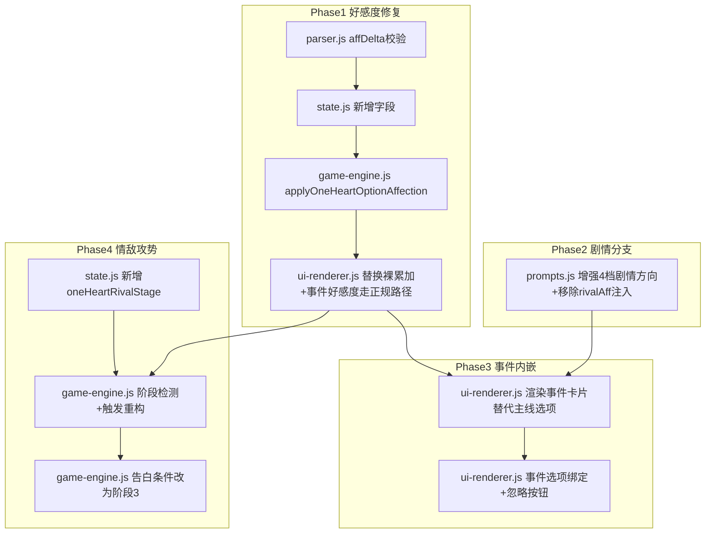

## 产品概述

对 1v1「只为你心动」模式进行好感度系统与事件系统的全面重构，涵盖四个方向：好感度修复（防通胀/校验/日志/下限保护）、剧情分支线路（好感度区间决定剧情风格）、事件内嵌（移除弹窗，事件直接作为主选项+忽略按钮）、情敌攻势重构（去掉情敌好感度，改为正主好感度分阶段触发，每阶段固定1次随机攻势）。

## 核心功能

### 好感度修复

- affDelta 范围校验 -5~5，与 rivalAffDelta 校验对齐
- 高分段边际递减：40+封顶+3，60+封顶+2，80+封顶+1，负向不受影响
- 正主下限 -20
- 正主复用 addAffectionLog 记录日志
- 选项好感度逻辑提取到 game-engine.js 统一管理
- 事件好感度也走 updateAffection + addAffectionLog（当前是裸操作）

### 剧情分支线路

- 低好感(<20)虐心线、中好感(20-50)试探线、高好感(50-80)甜宠线、极高好感(80+)深度线
- 增强 prompts.js:1040-1044 现有4档氛围，追加详细剧情方向指引

### 事件内嵌

- 移除弹窗和"待处理"按钮
- 有事件时操作区显示事件场景卡片+选项+忽略按钮，隐藏主线选项
- 玩家选事件选项 → 好感度变化+结果存入_pendingEventResults+推进下回合
- 玩家点忽略 → 事件丢弃+显示主线选项

### 情敌攻势重构

- 去掉情敌好感度（GS.oneHeartRivalAff 保留字段兼容旧存档，不再增长不再影响触发）
- 正主好感度分5阶段，每阶段约5回合
- 每阶段情敌固定出现1次，时机随机（阶段内随机回合）
- 出现时从该阶段攻势类型中随机选1种
- 告白：阶段3（正主好感40-60）情敌出现时告白
- 退出：正主好感度100时情敌彻底退出

## Tech Stack

- 纯 JavaScript（ES Modules），Vanilla JS + Vite，无新依赖
- 遵循项目代码风格：var 而非 let/const，字符串拼接用 +

## Implementation Approach

### 核心思路

四个方向按依赖顺序实施：好感度修复（基础）→ 剧情分支（prompt层）→ 事件内嵌（交互层）→ 情敌攻势（事件触发层）。

### 关键技术决策

1. **防通胀用高分段递减**：1v1 只有一个正主，疲劳机制会导致全程挫败感。分段封顶模拟"关系已经很好提升变慢"的自然规律

2. **选项好感度逻辑提取到 game-engine.js**：与换乘模式 triggerAffectionFromChoice 放在同一文件，保持单一职责

3. **剧情分支增强现有 _mood 注入**：prompts.js:1040-1044 已有4档氛围标签，在其后追加详细剧情方向指引，不替换原有逻辑

4. **事件内嵌不改事件生成逻辑**：checkOneHeartEvents / tryPoolEvent / pickSmallEvent 事件生成代码不动，只改事件如何呈现给玩家

5. **事件好感度也走 updateAffection**：当前 ui-renderer.js:2309-2346 是裸操作 GS.affection，重构后走正规路径

6. **情敌去掉好感度，改为阶段触发**：新增 GS.oneHeartRivalStage 追踪当前阶段、是否已触发、阶段起始回合数。在 generateOneHeartRound 的好感度历史记录后检测阶段变化

7. **告白事件保留 rival swap 机制**：玩家接受告白时情敌转正为主角，但不依赖 rivalAff 数值，新主角好感度设为合理初始值（如40）

### 防通胀分段规则

| 当前好感度 | 正向加分封顶 | 负向扣分 |
| --- | --- | --- |
| 0~39 | 原值(+1~5) | 原值(-2~5) |
| 40~59 | 封顶+3 | 原值 |
| 60~79 | 封顶+2 | 原值 |
| 80+ | 封顶+1 | 原值 |


### 情敌阶段攻势表

| 阶段 | 正主好感 | 攻势类型（随机选1） | 告白 |
| --- | --- | --- | --- |
| 1 | <20 | 偶遇/打招呼/点赞朋友圈/找借口聊天 | 否 |
| 2 | 20-40 | 送小礼物/约吃饭/制造独处机会 | 否 |
| 3 | 40-60 | 频繁联系/言语暗示/关心私事 | 是 |
| 4 | 60-80 | 送大礼/制造正主误会/暗示竞争 | 否 |
| 5 | 80-99 | 偶尔刷存在感 | 否 |
| 退出 | 100 | 不出现 | 否 |


### 阶段追踪机制

新增 `GS.oneHeartRivalStage = { stage, stageStartGenCount, eventTriggered, eventRound }`

- 阶段检测：在 generateOneHeartRound 好感度记录后（game-engine.js:1794），根据当前好感度判断是否进入新阶段
- 进入新阶段时重置 eventTriggered=false，记录 stageStartGenCount
- 阶段内每回合检查：若 eventTriggered=false 且 距阶段开始 >= 1回合，随机概率触发（确保5回合内至少触发1次，第3回合起概率递增）
- 触发后 eventTriggered=true

### 性能考量

- 防通胀 O(1) 数值比较，零开销
- 阶段检测 O(1)，在已有的好感度历史记录流程中追加
- 无重试/无额外AI调用（情敌事件复用现有 callDeepSeek）

## Implementation Notes

- **updateAffection 已包含飘字+里程碑**（affection.js:7-17），1v1 复用此路径
- **情敌好感度保留不删**：GS.oneHeartRivalAff 字段保留兼容旧存档，但所有 rivalAff 读取处改为不依赖（返回0或忽略）
- **事件好感度硬编码数值保留**：ui-renderer.js:2309-2346 的数值（如 jealousy [2,1,3]）是游戏设计，不改数值，只改应用方式（裸操作→updateAffection）。移除所有 rivalAff 操作
- **告白 rival swap**：保留转正机制，但不设 rivalAff=60，新主角好感度设为40
- **prompts.js:1073-1083 rivalAff 注入**：整段移除（情敌不再有好感度暗示）
- **prompts.js:1063-1071 情敌出场**：保留首次出场触发，移除 % 10 周期触发（改为阶段触发）
- **冷战阈值不受影响**：防通胀只影响正向加分
- **blast radius**：所有改动在 1v1 分支内，不触碰换乘模式

## Architecture Design



## Directory Structure

```
src/
├── game-engine.js                # [MODIFY] 三处改动
│   ├── 新增 applyOneHeartOptionAffection(opt) 函数
│   │   1. 读取当前好感度分段，计算 finalDelta（防通胀递减）
│   │   2. 调用 updateAffection（含飘字+里程碑解锁）
│   │   3. 正主下限 -20 保护
│   │   4. 调用 addAffectionLog（记录日志）
│   │   5. rivalAffDelta 忽略不处理（情敌好感度已废弃）
│   │
│   ├── 行1787-1805 阶段检测追加：
│   │   在 oneHeartAffHistory.push 后追加情敌阶段变化检测
│   │   进入新阶段时重置 oneHeartRivalStage
│   │
│   └── 行2155-2202 情敌事件触发重构：
│       从 rivalAff >= 15 概率触发 改为 阶段内固定1次随机触发
│       攻势类型根据当前阶段随机选取
│       告白事件条件改为阶段3
│
├── ui-renderer.js                # [MODIFY] 三处改动
│   ├── 行1230-1248 选项区渲染重构：
│   │   有 _pendingEvents 时渲染事件卡片（场景+选项+忽略）
│   │   无 _pendingEvents 时正常渲染主线选项
│   │   移除"📋 待处理"按钮
│   │
│   ├── 行2054-2085 选项点击事件：
│   │   替换裸累加为调用 applyOneHeartOptionAffection(opt)
│   │   移除手动 spawnAffFloat 调用
│   │
│   └── 行2277-2353 事件处理重构：
│       移除 pendingEventBtn 弹窗流程
│       新增事件选项内嵌绑定（data-event-idx）
│       事件好感度走 updateAffection + addAffectionLog
│       移除所有 rivalAff 操作
│       告白rival swap保留但不设rivalAff
│       忽略按钮：shift事件+显示主线选项
│
├── parser.js                     # [MODIFY] 补充 affDelta 校验
│   └── 行590-597：在 rivalAffDelta 校验旁补充 affDelta -5~5
│
├── state.js                      # [MODIFY] 新增字段
│   ├── 行47后：新增 oneHeartRivalStage: { stage: 0, stageStartGenCount: 0, eventTriggered: false, eventRound: -1 }
│   └── migrateSave：兜底初始化 oneHeartRivalStage
│
├── prompts.js                    # [MODIFY] 两处改动
│   ├── 行1040-1044：增强4档氛围，追加详细剧情方向指引
│   └── 行1063-1083：情敌出场保留首次触发，移除rivalAff暗示注入
│
└── modals/affection-panel.js     # [MODIFY] 
    └── 1v1模式追加情敌事件历史记录（不显示好感度档位）
```

## Key Code Structures

```javascript
// game-engine.js — 1v1 选项好感度应用
export function applyOneHeartOptionAffection(opt) {
  // 正主：分段递减 → updateAffection → 下限-20 → addAffectionLog
  // rivalAffDelta：忽略不处理
  // 返回 void
}

// game-engine.js — 情敌阶段检测（追加在行1795后）
// var _newStage = getRivalStage(curAff);
// if (_newStage !== GS.oneHeartRivalStage.stage) {
//   GS.oneHeartRivalStage = { stage: _newStage, stageStartGenCount: GS.oneHeartGenCount, eventTriggered: false, eventRound: -1 };
// }

// game-engine.js — 情敌事件触发（替换行2156）
// var _rs = GS.oneHeartRivalStage || {};
// if (hasRival && !_rs.eventTriggered) {
//   var _roundsInStage = (GS.oneHeartGenCount || 0) - (_rs.stageStartGenCount || 0);
//   var _triggerChance = 0;
//   if (_roundsInStage >= 1) _triggerChance = 0.15;
//   if (_roundsInStage >= 2) _triggerChance = 0.30;
//   if (_roundsInStage >= 3) _triggerChance = 0.50;
//   if (_roundsInStage >= 4) _triggerChance = 0.80;
//   if (_roundsInStage >= 5) _triggerChance = 1.0; // 必触发
//   if (Math.random() < _triggerChance) { ... 触发事件 ... _rs.eventTriggered = true; }
// }
```

## Agent Extensions

### SubAgent

- **code-explorer**
- Purpose: 事件内嵌实现后，全局搜索确认所有事件弹窗调用（showJealousyEvent/showSurpriseEvent等）在 1v1 路径下不再被触发，以及所有 rivalAff 读取处已正确处理
- Expected outcome: 确认 ui-renderer.js 事件处理已完全内嵌，game-engine.js 和 prompts.js 中 rivalAff 不再影响逻辑