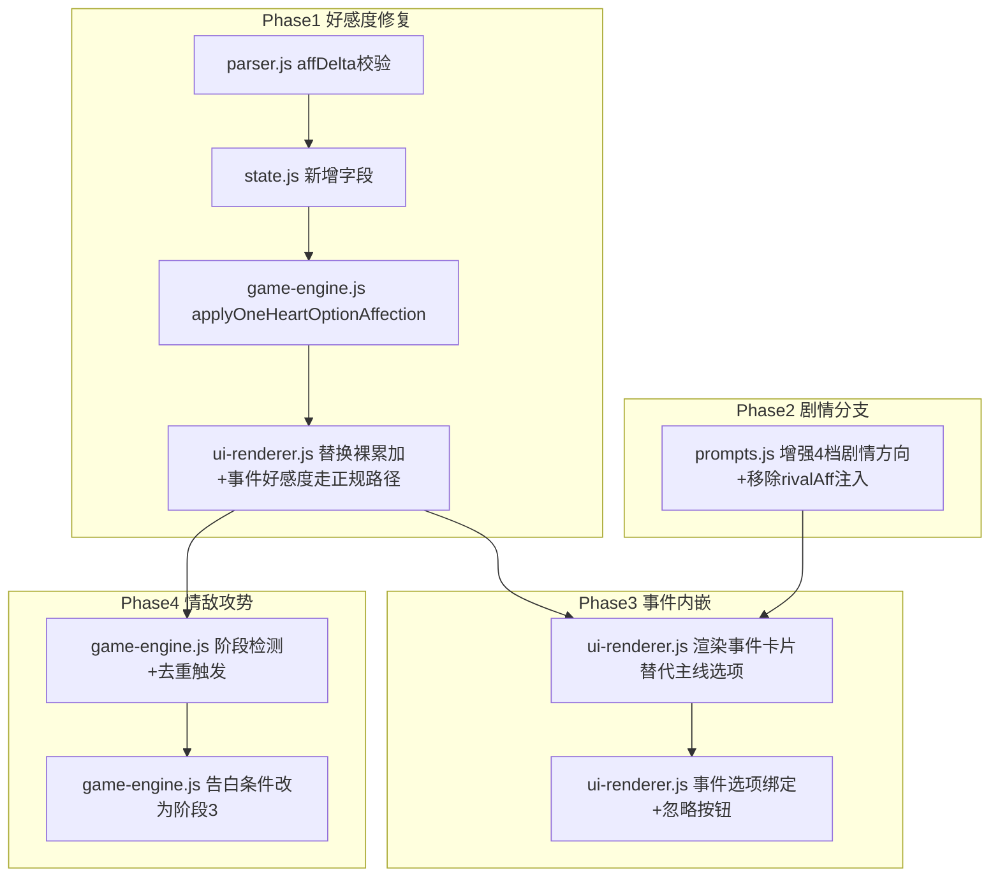

## 产品概述

对 1v1「只为你心动」模式进行好感度系统与事件系统的全面重构，涵盖四个方向：好感度修复（防通胀/校验/日志/下限保护）、剧情分支线路（好感度区间决定剧情风格）、事件内嵌（移除弹窗，事件直接作为主选项+忽略按钮）、情敌攻势重构（去掉情敌好感度，改为正主好感度阶段变化触发，事件不重复）。

## 核心功能

### 好感度修复

- affDelta 范围校验 -5~5，与 rivalAffDelta 校验对齐
- 高分段边际递减：40+封顶+3，60+封顶+2，80+封顶+1，负向不受影响
- 正主好感度下限 -20
- 正主复用 addAffectionLog 记录日志
- 选项好感度逻辑提取到 game-engine.js 统一管理
- 事件好感度也走 updateAffection + addAffectionLog（当前是裸操作）

### 剧情分支线路

- 低好感(<20)虐心线：误会/冷战/分手边缘
- 中好感(20-50)试探线：暧昧/吃醋/拉扯
- 高好感(50-80)甜宠线：表白/约会/日常糖
- 极高好感(80+)深度线：未来规划/承诺
- 增强 prompts.js:1040-1044 现有4档氛围，追加详细剧情方向指引

### 事件内嵌

- 移除弹窗和"待处理"按钮
- 有事件时操作区显示事件场景卡片+选项+忽略按钮，隐藏主线选项
- 玩家选事件选项 → 好感度变化+结果存入_pendingEventResults+推进下回合
- 玩家点忽略 → 事件丢弃+显示主线选项

### 情敌攻势重构

- 去掉情敌好感度（GS.oneHeartRivalAff 保留字段兼容旧存档，不再增长不再影响触发）
- 正主好感度分5阶段（<20 / 20-40 / 40-60 / 60-80 / 80-99）
- 每次阶段变化（不管涨跌）都触发1次情敌事件
- 事件不重复：记录已触发的攻势ID，从当前阶段未触发的中随机选1
- 告白：阶段3（正主好感40-60）情敌事件附带告白
- 退出：正主好感度100时情敌彻底退出
- 攻势内容区分涨跌：涨=升级攻势，跌=卷土重来

## Tech Stack

- 纯 JavaScript（ES Modules），Vanilla JS + Vite，无新依赖
- 遵循项目代码风格：var 而非 let/const，字符串拼接用 +

## Implementation Approach

### 核心思路

四个方向按依赖顺序实施：好感度修复（基础）→ 剧情分支（prompt层）→ 事件内嵌（交互层）→ 情敌攻势（事件触发层）。

### 关键技术决策

1. **防通胀用高分段递减**：1v1 只有一个正主，换乘模式的疲劳机制会导致全程挫败感。分段封顶模拟"关系已经很好提升变慢"的自然规律，负向扣分不受影响保持戏剧张力

2. **选项好感度逻辑提取到 game-engine.js**：与换乘模式 triggerAffectionFromChoice 放在同一文件，保持单一职责。ui-renderer.js 只负责渲染和事件绑定

3. **剧情分支增强现有 _mood 注入**：prompts.js:1040-1044 已有4档氛围标签（初识/暧昧/暧昧升温/热恋），在其后追加详细剧情方向指引（每档3-4条具体题材建议），不替换原有逻辑

4. **事件内嵌不改事件生成逻辑**：checkOneHeartEvents / tryPoolEvent / pickSmallEvent 事件生成代码不动，只改事件如何呈现给玩家（渲染+绑定）。事件数据结构 _pendingEvents 不变

5. **事件好感度也走 updateAffection**：当前 ui-renderer.js:2309-2346 是裸操作 GS.affection，重构后走正规路径（updateAffection + addAffectionLog），让面板能看到事件引起的好感度变化。移除所有 rivalAff 操作

6. **情敌去掉好感度，改为阶段触发**：新增 GS.oneHeartRivalStage 追踪当前阶段。在 generateOneHeartRound 的好感度历史记录后（game-engine.js:1794）检测阶段变化。每次阶段变化（涨或跌）重置 eventTriggered=false 并立即触发1次情敌事件

7. **事件不重复机制**：新增 GS.oneHeartRivalTriggeredActions = [] 记录已触发的攻势ID。触发时从当前阶段未触发的攻势中随机选1。若该阶段所有攻势都已触发过，重置该阶段的记录重新随机

8. **告白事件保留 rival swap 机制**：玩家接受告白时情敌转正为主角，新主角好感度设为40（不依赖 rivalAff）

9. **攻势类型代码强制选定**：代码选定具体攻势类型后注入 prompt，AI 只写场景文案，不能自选攻势类型

10. **剧情分支代码校验**：解析 AI 返回剧情后检测是否包含不符合当前好感度阶段的内容（如低好感出现表白/甜蜜），命中则注入 correction 重试

11. **事件选项通用模板检测**：检测 AI 返回的事件选项是否包含"跟着直觉走/冷静观察/大胆行动"等模板，命中则注入 correction 重试

### 防通胀分段规则

| 当前好感度 | 正向加分封顶 | 负向扣分 |
| --- | --- | --- |
| 0~39 | 原值(+1~5) | 原值(-2~5) |
| 40~59 | 封顶+3 | 原值 |
| 60~79 | 封顶+2 | 原值 |
| 80+ | 封顶+1 | 原值 |


### 情敌阶段攻势表（带唯一ID）

| 阶段 | 正主好感 | 攻势ID及类型 | 告白 |
| --- | --- | --- | --- |
| 1 | <20 | s1_meet(偶遇) / s1_greet(打招呼) / s1_like(点赞朋友圈) / s1_chat(找借口聊天) | 否 |
| 2 | 20-40 | s2_gift(送小礼物) / s2_meal(约吃饭) / s2_alone(制造独处) | 否 |
| 3 | 40-60 | s3_contact(频繁联系) / s3_hint(言语暗示) / s3_care(关心私事) | 是 |
| 4 | 60-80 | s4_bigift(送大礼) / s4_misunderstand(制造误会) / s4_compete(暗示竞争) | 否 |
| 5 | 80-99 | s5_presence(刷存在感) / s5_reminisce(回忆过去) / s5_retreat(试探退意) | 否 |
| 退出 | 100 | 不出现 | 否 |


### 阶段追踪与去重机制

新增 `GS.oneHeartRivalStage = { stage, stageStartGenCount, eventTriggered, lastDirection }`
新增 `GS.oneHeartRivalTriggeredActions = []`

- 阶段检测：在 game-engine.js:1794 oneHeartAffHistory.push 后追加检测
- 阶段变化（不管涨跌）→ 重置 eventTriggered=false，记录 lastDirection（'up'/'down'）
- 触发情敌事件时：从当前阶段攻势列表中过滤掉 oneHeartRivalTriggeredActions 已记录的ID，随机选1
- 若该阶段所有ID都已触发过 → 重置该阶段的ID记录，重新随机
- 触发后将该攻势ID push 到 oneHeartRivalTriggeredActions
- 告白在阶段3触发时附带

### 代码硬约束（AI 无法违反）

| 约束 | 约束方式 | 实现位置 |
| --- | --- | --- |
| affDelta 范围 -5~5 | parser.js 正则修正到边界 | parser.js |
| 高分段封顶 +3/+2/+1 | Math.min(affDelta, cap) | game-engine.js |
| 正主下限 -20 | if < -20 then = -20 | game-engine.js |
| 好感度日志 | addAffectionLog() 函数调用 | game-engine.js |
| 事件好感度走正规路径 | updateAffection() 替换裸累加 | ui-renderer.js |
| 事件内嵌渲染 | if _pendingEvents.length > 0 条件分支 | ui-renderer.js |
| 移除弹窗 | 删除 pendingEventBtn 绑定 | ui-renderer.js |
| 阶段变化触发 | getRivalStage(aff) + if !== 检测 | game-engine.js |
| 事件不重复 | oneHeartRivalTriggeredActions 数组过滤 | game-engine.js |
| 告白在阶段3 | if stage === 3 | game-engine.js |
| 好感100退出 | if aff >= 100 then name = '' | game-engine.js |
| **攻势类型代码强制选定** | 代码选定后注入 prompt，AI 只写文案 | game-engine.js |
| **剧情分支代码校验** | 解析后检测不符好感度的内容，correction 重试 | game-engine.js |
| **事件选项通用模板检测** | 检测黑名单关键词，correction 重试 | game-engine.js |


### 代码约束实现细节

**1. 攻势类型代码强制选定**

```javascript
// 代码选定具体攻势（如 s2_gift），AI 只负责写场景文案
var _action = pickRivalAction(stage, triggeredActions); // 返回 {id, desc, detail}
var _prompt = '生成情敌事件场景。攻势类型必须是：' + _action.desc +
  '（' + _action.detail + '）。方向：' + (direction === 'up' ? '升级攻势' : '卷土重来');
// AI 不能自选攻势类型，只能基于指定的攻势写场景
```

**2. 剧情分支代码校验**

```javascript
// 解析 AI 返回的剧情后，检测是否包含不符合当前好感度阶段的内容
function validateStoryBranch(parsed, aff) {
  if (aff < 20) {
    // 低好感时检测甜宠关键词
    if (/表白|告白|我喜欢你|在一起|甜蜜|吻|拥抱/.test(parsed.narrative || '')) {
      return '当前好感度低于20，不应出现表白/甜蜜剧情，请改为误会/冷战/分手边缘风格';
    }
  }
  if (aff >= 80) {
    // 高好感时检测虐心关键词（可选，高好感也可以有小摩擦）
  }
  return null; // null 表示通过
}
// 命中则注入 correction 重试 1 次
```

**3. 事件选项通用模板检测**

```javascript
var GENERIC_EVENT_OPTIONS = ['跟着直觉走', '冷静观察', '大胆行动', '靠近他说话', '保持沉默观察', '转身离开现场'];
function hasGenericEventOptions(options) {
  if (!options || !Array.isArray(options)) return false;
  for (var i = 0; i < options.length; i++) {
    var optText = typeof options[i] === 'string' ? options[i] : (options[i].text || '');
    for (var j = 0; j < GENERIC_EVENT_OPTIONS.length; j++) {
      if (optText.indexOf(GENERIC_EVENT_OPTIONS[j]) >= 0) return true;
    }
  }
  return false;
}
// 命中则注入 correction 重试 1 次："选项过于通用，请基于当前场景生成具体选项"
```

## Implementation Notes

- **updateAffection 已包含飘字+里程碑**（affection.js:7-17），1v1 复用此路径。调用后移除 ui-renderer.js 中的手动 spawnAffFloat 调用
- **情敌好感度保留不删**：GS.oneHeartRivalAff 字段保留兼容旧存档，但所有 rivalAff 读取处改为不依赖
- **事件好感度硬编码数值保留**：ui-renderer.js:2309-2346 的数值（如 jealousy [2,1,3]）是游戏设计，不改数值，只改应用方式（裸操作→updateAffection）。移除所有 rivalAff 操作
- **告白 rival swap**：保留转正机制（ui-renderer.js:2326-2341），但不设 rivalAff=60，新主角好感度设为40
- **prompts.js:1073-1083 rivalAff 注入**：整段移除（情敌不再有好感度暗示）
- **prompts.js:1063-1071 情敌出场**：保留首次出场触发（行1065-1067），移除 % 10 周期触发（行1068-1070，改为阶段触发）
- **冷战阈值不受影响**：防通胀只影响正向加分，冷战"连续2回合下降3点"仍可正常触发
- **addAffectionLog 使用 GS.day/GS.phaseIndex**：1v1 模式下这两个值仍然存在，面板显示可接受
- **事件内嵌渲染**：ui-renderer.js:1230-1237 的选项渲染区，当 GS._pendingEvents.length > 0 时渲染事件卡片替代主线选项
- **事件选项 data-idx 区分**：事件选项用 data-event-idx 属性（0/1/2），忽略按钮用 data-event-idx="-1"，与主线选项的 data-idx 区分
- **blast radius**：所有改动在 1v1 分支内，不触碰换乘模式

## Architecture Design



## Directory Structure

```
src/
├── game-engine.js                # [MODIFY] 三处改动
│   ├── 新增 applyOneHeartOptionAffection(opt) 函数
│   │   1. 读取当前好感度分段，计算 finalDelta（防通胀递减）
│   │   2. 调用 updateAffection（含飘字+里程碑解锁）
│   │   3. 正主下限 -20 保护
│   │   4. 调用 addAffectionLog（记录日志）
│   │   5. rivalAffDelta 忽略不处理（情敌好感度已废弃）
│   │
│   ├── 行1794后 阶段检测追加：
│   │   在 oneHeartAffHistory.push 后追加情敌阶段变化检测
│   │   阶段变化时重置 oneHeartRivalStage
│   │
│   └── 行1994-2202 情敌事件触发重构：
│       告白条件从 rivalAff>=40 改为阶段3
│       情敌事件从 rivalAff>=15概率触发 改为 阶段变化触发+去重
│       攻势类型根据阶段+涨跌方向选取
│
├── ui-renderer.js                # [MODIFY] 三处改动
│   ├── 行1230-1248 选项区渲染重构：
│   │   有 _pendingEvents 时渲染事件卡片（场景+选项+忽略）
│   │   无 _pendingEvents 时正常渲染主线选项
│   │   移除"📋 待处理"按钮
│   │
│   ├── 行2054-2085 选项点击事件：
│   │   替换裸累加为调用 applyOneHeartOptionAffection(opt)
│   │   移除手动 spawnAffFloat 调用
│   │
│   └── 行2277-2353 事件处理重构：
│       移除 pendingEventBtn 弹窗流程
│       新增事件选项内嵌绑定（data-event-idx）
│       事件好感度走 updateAffection + addAffectionLog
│       移除所有 rivalAff 操作
│       告白rival swap保留但不设rivalAff
│       忽略按钮：shift事件+显示主线选项
│
├── parser.js                     # [MODIFY] 补充 affDelta 校验
│   └── 行591-597：在 rivalAffDelta 校验循环内补充 affDelta -5~5
│
├── state.js                      # [MODIFY] 新增字段
│   ├── 行47后：新增 oneHeartRivalStage 和 oneHeartRivalTriggeredActions
│   └── migrateSave 行459后：兜底初始化
│
├── prompts.js                    # [MODIFY] 两处改动
│   ├── 行1040-1044：增强4档氛围，追加详细剧情方向指引
│   └── 行1063-1083：情敌出场保留首次触发，移除rivalAff暗示注入
│
└── modals/affection-panel.js     # [MODIFY]
    └── 1v1模式追加正主好感度卡片（当前面板只显示selectedMembers换乘模式）
```

## Key Code Structures

```javascript
// game-engine.js — 1v1 选项好感度应用
export function applyOneHeartOptionAffection(opt) {
  // 正主：分段递减 → updateAffection → 下限-20 → addAffectionLog
  // rivalAffDelta：忽略不处理
}

// game-engine.js — 情敌阶段检测（追加在行1795后）
// var _newStage = getRivalStage(curAff);
// if (_newStage !== GS.oneHeartRivalStage.stage) {
//   var _direction = _newStage > GS.oneHeartRivalStage.stage ? 'up' : 'down';
//   GS.oneHeartRivalStage = { stage: _newStage, stageStartGenCount: GS.oneHeartGenCount, eventTriggered: false, lastDirection: _direction };
// }

// game-engine.js — 情敌事件触发（替换行2155-2202）
// 阶段变化时触发：从当前阶段攻势列表过滤已触发ID，随机选1
// 若全部已触发：重置该阶段ID记录，重新随机
```

## Agent Extensions

### SubAgent

- **code-explorer**
- Purpose: 事件内嵌实现后，全局搜索确认所有事件弹窗调用（showJealousyEvent/showSurpriseEvent等）在 1v1 路径下不再被触发，以及所有 rivalAff 读取处已正确处理
- Expected outcome: 确认 ui-renderer.js 事件处理已完全内嵌，game-engine.js 和 prompts.js 中 rivalAff 不再影响逻辑