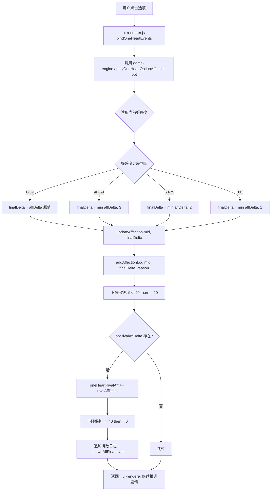

## 产品概述

针对 1v1「只为你心动」模式的好感度系统进行修复，解决四个核心问题：裸累加无防通胀、affDelta 无范围校验、无好感度日志、正主好感度无下限。纯逻辑层优化，不涉及 UI 改动。

## 核心功能

- affDelta 范围校验：parser.js 补充 -5~5 边界修正，与 rivalAffDelta 校验对齐
- 高分段边际递减防通胀：好感度 40+ 后正向加分逐段封顶（40-59 封顶 +3 / 60-79 封顶 +2 / 80+ 封顶 +1），负向扣分不受影响
- 好感度日志：正主复用 addAffectionLog，情敌新增独立日志数组 GS.oneHeartRivalAffLog
- 正主好感度下限 -20：允许低谷但防止离谱下滑
- 选项好感度应用逻辑从 ui-renderer.js 提取到 game-engine.js 统一管理，保持单一职责

## 技术栈

- 纯 JavaScript（ES Modules），Vanilla JS + Vite
- 无新依赖，全部使用现有模块和函数
- 遵循项目代码风格：`var` 而非 `let/const`，字符串拼接用 `+`

## 实现方案

### 核心思路

在 `game-engine.js` 新增 `applyOneHeartOptionAffection(opt)` 函数，封装 1v1 选项好感度的全部应用逻辑（防通胀递减 + 下限保护 + 日志记录 + 飘字），替换 `ui-renderer.js:2062-2077` 的裸累加代码。在 `parser.js` 补充 affDelta 范围校验。所有改动在 1v1 分支内，不触碰换乘模式。

### 关键技术决策

1. **防通胀用高分段递减而非疲劳机制**：1v1 只有一个正主，换乘模式的疲劳机制（连续对同一人递减）会导致全程挫败感。改用分段封顶——低好感度正常加分，高好感度边际递减，模拟"关系已经很好，提升变慢"的自然规律。负向扣分不受影响，保持戏剧张力
2. **提取到 game-engine.js 而非内联**：好感度逻辑属于游戏引擎职责，ui-renderer.js 只负责渲染。与换乘模式的 `triggerAffectionFromChoice` 放在同一文件一致
3. **正主下限 -20 而非 0**：允许低谷期存在（与 💔 5档描述最低档语义一致），但不至于 -100 离谱值。情敌保持 0 下限（已有）
4. **情敌日志独立存储**：情敌不是 MEMBERS 成员，无法复用 `addAffectionLog(memberId, ...)`。新建 `GS.oneHeartRivalAffLog` 数组，结构 `{delta, reason, round}`
5. **不强制情敌联动**：正主扣分时不自动给情敌加分，保持两者独立的灵活性。prompt 已约定 rivalAffDelta 可选，由 AI 决定是否联动

### 防通胀分段规则

| 当前好感度 | 正向加分封顶 | 负向扣分 | 说明 |
| --- | --- | --- | --- |
| 0 ~ 39 | 原值（+1~5） | 原值（-2~5） | 初识/普通期，正常成长 |
| 40 ~ 59 | 封顶 +3 | 原值 | 暧昧期，减速 |
| 60 ~ 79 | 封顶 +2 | 原值 | 升温期，明显减速 |
| 80+ | 封顶 +1 | 原值 | 热恋期，趋近饱和 |


### 性能考量

- 防通胀为 O(1) 数值比较，无性能影响
- 日志追加为 O(1)，限制数组长度 50 条（与 chatHistory 一致）
- 无重试/无 AI 调用，零额外延迟

## 实现要点

- **affDelta 校验**：在 `parser.js` 的 `validateOneHeartNarrative` 中，紧跟 rivalAffDelta 校验之后，补充 `if (_opt.affDelta < -5) _opt.affDelta = -5; if (_opt.affDelta > 5) _opt.affDelta = 5;`
- **防通胀函数**：`applyOneHeartOptionAffection(opt)` 内部先读取当前好感度，判断分段，计算 finalDelta，再调 `updateAffection` + `addAffectionLog`
- **`updateAffection` 已包含飘字**：换乘模式通过 `updateAffection` 触发 `spawnAffFloat`，1v1 复用此路径，移除 ui-renderer.js 中的手动 `spawnAffFloat` 调用
- **情敌好感度**：仍直接操作 `GS.oneHeartRivalAff`（不经过 updateAffection），手动 `spawnAffFloat('rival', ...)` + 追加日志
- **下限保护**：正主 `if (GS.affection[mid] < -20) GS.affection[mid] = -20;`，情敌已有 `if < 0 then = 0`
- **冷战阈值**：当前"连续2回合下降3点"不变，防通胀只影响正向加分，不削弱负向扣分，冷战仍可正常触发

## 架构设计



## 目录结构

```
src/
├── game-engine.js          # [MODIFY] 新增 applyOneHeartOptionAffection 函数
│   └── 新增导出函数，封装 1v1 选项好感度全部逻辑：
│       1. 读取当前好感度分段，计算 finalDelta（防通胀递减）
│       2. 调用 updateAffection（含飘字+里程碑解锁）
│       3. 调用 addAffectionLog（记录日志）
│       4. 正主下限 -20 保护
│       5. 情敌好感度累加 + 下限 0 + 日志 + 飘字
│
├── ui-renderer.js           # [MODIFY] 简化选项点击事件
│   └── 行 2062-2077 区域：
│       删除裸累加代码，替换为 import 并调用 applyOneHeartOptionAffection(opt)
│       移除手动 spawnAffFloat 调用（已封装在函数内）
│
├── parser.js                # [MODIFY] 补充 affDelta 范围校验
│   └── 行 590-597 区域：
│       在 rivalAffDelta 校验循环内，补充 affDelta 的 -5~5 边界修正
│
└── state.js                 # [MODIFY] defaultGameState 新增字段
    └── 新增 GS.oneHeartRivalAffLog = []（情敌好感度日志数组）
        migrateSave 中补充兜底初始化
```

## 关键代码结构

```javascript
// game-engine.js — 1v1 选项好感度应用（签名）
export function applyOneHeartOptionAffection(opt) {
  // 正主：分段递减 → updateAffection → addAffectionLog → 下限-20
  // 情敌：直接累加 → 下限0 → 日志 → 飘字
  // 返回 void，ui-renderer 不需要返回值
}

// parser.js — affDelta 校验（追加在现有 rivalAffDelta 校验旁）
// if (_opt.affDelta < -5) _opt.affDelta = -5;
// if (_opt.affDelta > 5) _opt.affDelta = 5;
```