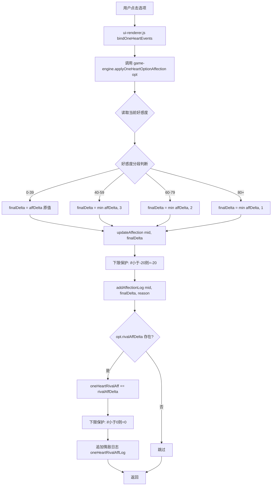

## 产品概述

针对 1v1「只为你心动」模式的好感度系统进行修复，解决五个核心问题：裸累加无防通胀、affDelta 无范围校验、无好感度日志、正主好感度无下限、情敌好感度完全不可见。纯逻辑层 + 轻量 UI 优化。

## 核心功能

- affDelta 范围校验：parser.js 补充 -5~5 边界修正，与 rivalAffDelta 校验对齐
- 高分段边际递减防通胀：好感度 40+ 后正向加分逐段封顶（40-59 封顶 +3 / 60-79 封顶 +2 / 80+ 封顶 +1），负向扣分不受影响
- 好感度日志：正主复用 addAffectionLog，情敌新增独立日志数组 GS.oneHeartRivalAffLog
- 正主好感度下限 -20：允许低谷但防止离谱下滑
- 选项上显示情敌变化：1v1 选项预览追加"情敌 ±N"标注（橙色区分），不做飘字
- 好感度面板显示情敌档位：1v1 模式下追加情敌卡片，只显示档位描述（如"情敌对你有好感"），不显示数值
- 选项好感度应用逻辑从 ui-renderer.js 提取到 game-engine.js 统一管理

## Tech Stack

- 纯 JavaScript（ES Modules），Vanilla JS + Vite
- 无新依赖，全部使用现有模块和函数
- 遵循项目代码风格：`var` 而非 `let/const`，字符串拼接用 `+`

## Implementation Approach

### 核心思路

在 `game-engine.js` 新增 `applyOneHeartOptionAffection(opt)` 函数，封装 1v1 选项好感度的全部应用逻辑（防通胀递减 + 下限保护 + 日志记录），替换 `ui-renderer.js:2062-2077` 的裸累加代码。在 `parser.js` 补充 affDelta 范围校验。在 `ui-renderer.js:1233` 选项预览中追加情敌变化标注。在 `affection-panel.js` 追加情敌档位卡片。所有改动在 1v1 分支内，不触碰换乘模式。

### 关键技术决策

1. **防通胀用高分段递减而非疲劳机制**：1v1 只有一个正主，换乘模式的疲劳机制（连续对同一人递减）会导致全程挫败感。改用分段封顶——低好感度正常加分，高好感度边际递减，模拟"关系已经很好，提升变慢"的自然规律。负向扣分不受影响，保持戏剧张力

2. **提取到 game-engine.js 而非内联**：好感度逻辑属于游戏引擎职责，ui-renderer.js 只负责渲染。与换乘模式的 `triggerAffectionFromChoice` 放在同一文件一致

3. **正主下限 -20**：允许低谷期存在（与 getAffectionDesc 最低档 💔 语义一致），但不至于 -100 离谱值。updateAffection 内部已有 -100 下限，我在 1v1 路径追加更严格的 -20

4. **情敌日志独立存储**：情敌不是 MEMBERS 成员，无法复用 `addAffectionLog(memberId, ...)`。新建 `GS.oneHeartRivalAffLog` 数组，结构 `{round, change, reason, total}`，用 `oneHeartGenCount` 而非 `day/phase`（1v1 不使用天数/时段制）

5. **情敌变化显示用橙色**：与正主的绿色/红色区分，避免混淆。情敌 +N 意味着对玩家不利（橙红 #e65100），情敌 -N 意味着对玩家有利（但情敌好感度下限 0，实际不会出现负值变化后低于 0 的情况）

6. **情敌档位复用 getAffectionDesc**：rivalAff=35 时显示 "😐 情敌还在观察你"，rivalAff=65 时显示 "❤️ 情敌对你有好感"，不显示具体数值

### 防通胀分段规则

| 当前好感度 | 正向加分封顶 | 负向扣分 | 说明 |
| --- | --- | --- | --- |
| 0 ~ 39 | 原值（+1~5） | 原值（-2~5） | 初识/普通期，正常成长 |
| 40 ~ 59 | 封顶 +3 | 原值 | 暧昧期，减速 |
| 60 ~ 79 | 封顶 +2 | 原值 | 升温期，明显减速 |
| 80+ | 封顶 +1 | 原值 | 热恋期，趋近饱和 |


### 性能考量

- 防通胀为 O(1) 数值比较，无性能影响
- 日志追加为 O(1)，限制数组长度 50 条
- 无重试/无 AI 调用，零额外延迟

## Implementation Notes

- **updateAffection 已包含飘字+里程碑**：换乘模式通过 `updateAffection` 触发 `spawnAffFloat` + 里程碑 Toast，1v1 复用此路径。调用后移除 ui-renderer.js 中的手动 `spawnAffFloat(mid, ...)` 调用
- **情敌不调 updateAffection**：直接操作 `GS.oneHeartRivalAff`，不调 `spawnAffFloat('rival', ...)`（该调用本来就坏了，用户确认不修飘字）
- **addAffectionLog 使用 GS.day/GS.phaseIndex**：1v1 模式下这两个值仍然存在（defaultGameState 初始化为 1/0），面板显示"Day 1 上午"可接受。情敌日志用 `GS.oneHeartGenCount` 更准确
- **下限保护时机**：在 `updateAffection` 之后追加 `if (GS.affection[mid] < -20) GS.affection[mid] = -20;`，再调 `addAffectionLog`（此时 total 已正确）
- **冷战阈值不受影响**：防通胀只影响正向加分，负向扣分原样传递，冷战"连续2回合下降3点"仍可正常触发
- **1v1 选项渲染在 ui-renderer.js:1231-1236 内联**，不走 option-panel.js，情敌变化标注改这一行即可

## Architecture Design



## Directory Structure

```
src/
├── game-engine.js          # [MODIFY] 新增 applyOneHeartOptionAffection 函数
│   └── 新增导出函数，封装 1v1 选项好感度全部逻辑：
│       1. 读取当前好感度分段，计算 finalDelta（防通胀递减）
│       2. 调用 updateAffection（含飘字+里程碑解锁）
│       3. 正主下限 -20 保护
│       4. 调用 addAffectionLog（记录日志）
│       5. 情敌好感度累加 + 下限 0 + 日志（不调 spawnAffFloat）
│
├── ui-renderer.js           # [MODIFY] 两处改动
│   ├── 行 1233：选项预览 affTag 追加 rivalAffDelta 标注（橙色"情敌 ±N"）
│   └── 行 2062-2077：删除裸累加代码，替换为调用 applyOneHeartOptionAffection(opt)
│       移除手动 spawnAffFloat 调用（已封装在函数内）
│       import 行追加 applyOneHeartOptionAffection
│
├── parser.js                # [MODIFY] 补充 affDelta 范围校验
│   └── 行 590-597 区域：
│       在 rivalAffDelta 校验循环内，补充 affDelta 的 -5~5 边界修正
│
├── state.js                 # [MODIFY] 新增情敌日志字段
│   ├── defaultGameState 行 47 后：新增 oneHeartRivalAffLog: []
│   └── migrateSave 行 434 后：新增 if (!Array.isArray(...)) 兜底初始化
│
└── modals/affection-panel.js # [MODIFY] 1v1 模式追加情敌卡片
    └── 在 members 循环结束后：
        if (GS.gameMode === 'oneHeart' && GS.oneHeartRival && GS.oneHeartRival.name) {
          追加情敌卡片：emoji + 名字 + getAffectionDesc(rivalAff) 档位
          不显示数值，只显示档位描述
          显示最近 3 条情敌日志（round/change/reason）
        }
```

## Key Code Structures

```javascript
// game-engine.js — 1v1 选项好感度应用（签名）
export function applyOneHeartOptionAffection(opt) {
  // 正主：分段递减 → updateAffection → 下限-20 → addAffectionLog
  // 情敌：直接累加 → 下限0 → 日志（不调 spawnAffFloat）
  // 返回 void
}

// parser.js — affDelta 校验（追加在现有 rivalAffDelta 校验旁）
// if (_opt.affDelta < -5) _opt.affDelta = -5;
// if (_opt.affDelta > 5) _opt.affDelta = 5;

// ui-renderer.js — 选项预览追加情敌标注
// var rivalTag = (opt && opt.rivalAffDelta && GS.oneHeartRival && GS.oneHeartRival.name)
//   ? ' <span style="font-size:10px;color:#e65100;font-weight:600">情敌 ' + (opt.rivalAffDelta > 0 ? '+' : '') + opt.rivalAffDelta + '</span>'
//   : '';
```