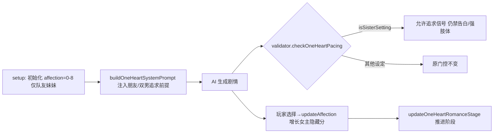

## 产品概述

在《换乘恋爱 × SEVENTEEN》1v1 模式下的「娱乐圈 · 队友妹妹」世界观中，将开局关系基调从「女主对男主已有好感」调整为「朋友 / 哥哥的队友」状态，并让男主与情敌都对女主有好感、主动追求；女主作为被追求者与最终选择者，其隐藏分数随剧情推进自然增长。

## 核心需求

- 保留「女主（你）对男主 / 情敌的隐藏分数」语义不变（`affection[oneHeartMember]` = 女主对男主好感，`oneHeartRivalAff` = 女主对情敌倾向），不新增任何指标。
- 开局女主只把男主与情敌视为「哥哥的队友」，关系属于朋友，而非暗恋对象。
- 男主与情敌（沿用现有 `oneHeartRival`，不新增选择步骤）均对女主有好感并主动追求。
- 改动仅对 `isSisterSetting()`（1v1 + 娱乐圈 + 关系角色为哥哥）生效，不影响其他 1v1 世界观与换乘模式。
- 男主在朋友期即可显现「主动关心 / 在意 / 比普通队友更关照」的追求信号，但仍禁止过早告白与强肢体 / 私密越界。

## 技术栈

- 语言 / 运行时：JavaScript（ES Modules），浏览器原生运行（Vite 构建）
- 现有模块：`src/ui-renderer.js`（setup 入口）、`src/prompts.js`（Prompt 构建）、`src/validator.js`（AI 一致性门控）、`src/state.js` / `src/game-engine.js`（状态与阶段）
- 不引入新依赖，遵循现有 `var` / 字符串拼接 / `isSisterSetting()` 门控等代码约定

## 实现思路

整体采用「门控式前提改写」策略：在三个既有切入点用 `isSisterSetting()` 包裹新逻辑，不改变指标方向与数据模型，只调整开场数值与 AI 叙事前提、放宽初识期 pacing 压制。高层面：降低初始好感度数值 → 在 system prompt 注入「朋友 / 哥哥队友 + 双男追求」前提 → 让 validator 在队友妹妹设定下允许男主释放追求信号但不越界。

### 关键决策与权衡

1. **不开新好感度指标**：指标方向翻转成本极高（波及 validator / romanceStage / 结局判定 / 飘字动画）。用户已确认保留女主隐藏分语义，因此只在「数值」与「叙事前提」两层做文章，复杂度与回归风险最低。
2. **初始好感度降到 0-8**：`getAffectionDesc` 中 0-14 = 💙（初识），与「只当哥哥队友」基调契合；既消除开场即好感的观感，又不破坏 romanceStage=0 的初识门控。
3. **pacing 门控按 `isSisterSetting()` 分叉**：保留 `hotKw`（告白 / 我喜欢你 / 我爱你）与 `softKw`（埋肩窝 / 搂腰等强肢体）禁令，仅移除「初识期男主必须克制、不准主动关心」的压制，使「男主追求」在朋友期自然显现。
4. **情敌追求走既有通道**：`oneHeartRivalAff` 与情敌事件 / `oneHeartRivalStage` 已存在，仅需在 system prompt 前提中声明情敌同样暗恋追求，不新增数值逻辑。

## 实现注意

- 所有新增逻辑必须用 `isSisterSetting()` 包裹（定义在 `src/utils.js:31`），非队友妹妹世界观走原分支，保证零回归。
- `randInt(0,8)` 仅作用于 `isSisterSetting()` 分支；其他 1v1 仍用 `randInt(10,19)`。
- system prompt 注入位置优先选 `buildOneHeartSystemPrompt` 内 `if (isSisterSetting())` 专属块（约行 1104 后），避免污染通用逻辑；「已有事实」关系段（行 1264-1273）的开局描述同步改为「朋友（哥哥的队友）」。
- 飘字 / 结局 / 阶段推进依赖 `affection[oneHeartMember]` 与 `updateOneHeartRomanceStage()`，方向不变，无需改动；仅确认 `oneHeartRivalAff` 开局为 0（state.js 默认已是 0，迁移兜底行 525 已覆盖）。
- 日志 / 调试：沿用 `console.warn` 既有风格，不新增日志噪声。

## 架构设计

本改动为局部前提改写，不引入新架构层。数据流保持：
`setup 初始化 affection → buildOneHeartSystemPrompt 注入前提 → AI 生成剧情（validator 做 pacing 硬兜底）→ 玩家选择 → updateAffection 增长女主隐藏分 → updateOneHeartRomanceStage 推进阶段`。



## 目录结构与文件改动

```
src/
├── ui-renderer.js   # [MODIFY] 1v1 Step4 确认开始处（约行 1040-1042）。
│                     # 在 isSisterSetting() 时把 GS.affection[oneHeartMember] 初始化为 randInt(0,8)，
│                     # 体现「只当哥哥队友」；其他设定保持 randInt(10,19)。确认 oneHeartRivalAff 开局为 0。
├── prompts.js       # [MODIFY] buildOneHeartSystemPrompt()：
│                     # 1) 行 1099-1114 队友妹妹专属块内追加前提（女主视男主为哥哥队友/朋友；
│                     #    男主与情敌均暗恋并主动追求女主）；
│                     # 2) 行 1056 好感度描述段在 isSisterSetting() 时补「关系尚属朋友」说明；
│                     # 3) 行 1264-1273「已有事实」开局关系读「朋友（哥哥的队友）」。
│                     # buildOneHeartChatSystemPrompt()（行 1289+，次要）：为队友妹妹补充
│                     # 「男主暗暗对你有好感」聊天基调，避免过于冷淡。
└── validator.js     # [MODIFY] checkOneHeartPacing()（行 34-71）。在 isSisterSetting() 分支下，
                      # 初识期移除「男主必须克制、不准主动关心」压制，保留 hotKw/softKw 强越界禁令，
                      # 使男主追求信号在朋友期可显现。
```

## 关键代码结构（门控示例）

仅给出需新增的门控判定骨架（不实现细节）：

```js
// validator.js checkOneHeartPacing() 内，stage<1 分支
if (_stage < 1) {
  if (isSisterSetting()) {
    // 队友妹妹：允许男主主动关心/追求信号，仅禁强越界
    var _hh = _hit(hotKw);
    if (_hh) corrections.push('[初识期门控] 当前仍是朋友期，' + _h + ' 等表白/强越界行为禁止，请改为暗暗在意与主动关心。');
    var _ss = _hit(softKw);
    if (_ss) corrections.push('[初识期门控] 朋友期禁止超出关系的肢体亲近（' + _ss + '），请保持克制。');
    return corrections;
  }
  // 原通用逻辑（不变）
  ...
}
```