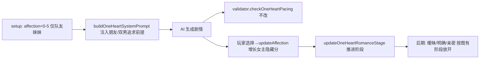

## 用户需求

当前 1v1 娱乐圈·队友妹妹设定下，进游戏后女主对男主已有好感。需要改为：开局是「第一次见面」，女主对男主/情敌都只是「哥哥的队友」，没有任何心动感觉；男主与情敌则从开局就对女主有意思、主动追求。后续剧情通过好感事件自然发展 → 谈恋爱 → 亲密举动（此推进链路游戏已有，无需新写）。

## 产品概述

在队友妹妹世界观下，把开局关系基调从「女主对男主有好感」调整为「第一次见面、零心动、只当哥哥队友」，同时让男主与情敌作为追求方主动制造好感事件。改动集中在初始好感度数值与 AI 叙事前提，不新增进度逻辑。

## 核心功能

- 开局女主对男主/情敌零心动（只当哥哥的队友），数值降为 randInt(0,5)
- System Prompt 注入「第一次见面 + 女主无心动 + 男主情敌主动追求」前提
- 解耦男主温度：男主/情敌的主动追求不随女主低好感变冷
- 后续好感→恋爱→亲密沿用既有 affection/romanceStage/pacing 体系，validator 不动
- 改动仅对 isSisterSetting() 生效，其他世界观与换乘模式零影响

## 技术栈

- 语言/运行时：JavaScript（ES Modules），Vite 构建，浏览器原生运行
- 涉及模块：`src/ui-renderer.js`（setup 入口）、`src/prompts.js`（Prompt 构建）、`src/utils.js`（`isSisterSetting()` 门控）
- 不引入新依赖，遵循现有 `var`/字符串拼接/`isSisterSetting()` 门控约定

## 实现思路

采用「门控式前提改写」：在两个既有切入点用 `isSisterSetting()` 包裹新逻辑，不改变指标方向与数据模型，只调整开场数值与 AI 叙事前提。

核心认知（修正前版计划错误）：

1. **validator 不需要改**——`checkOneHeartPacing()` 在 stage<1 只拦截 `hotKw`（表白/强肢体）和 `softKw`（亲密肢体），「主动关心/在意/眼神/试探/追求」从未在拦截列表里。它按阶段卡亲密的逻辑正好契合「后期才有亲密举动」，保持原样。
2. **真正杠杆在 prompt 前提 + 解耦男主温度**——`prompts.js:1056`「好感度影响互动距离：低好感→克制/疏离/客气」把男主行为温度和女主好感绑死，女主好感低时 AI 会把男主也写冷，与「男主追求」矛盾。必须在队友妹妹设定下解耦。

## 实现注意

- 所有新增逻辑用 `isSisterSetting()` 包裹（定义在 `src/utils.js:31-34`：`gameMode==='oneHeart' && worldSetting==='entertainment' && oneHeartRelationCharacter.role==='哥哥'`），非队友妹妹世界观走原分支，保证零回归。
- `randInt(0,5)` 仅作用于队友妹妹分支；其他 1v1 仍用 `randInt(10,19)`。0-5 与 10-19 同属 romanceStage 0 + 低好感档，数值改动主要让 UI/「已有事实」读起来是「初识/无感」，真正叙事效果由 prompt 前提决定。
- prompt 注入位置选 `buildOneHeartSystemPrompt` 内队友妹妹专属块（约行 1104 后），避免污染通用逻辑。
- 飘字/结局/阶段推进依赖 `affection[oneHeartMember]` 与 `updateOneHeartRomanceStage()`（`game-engine.js:2151`），方向不变，不改动；`oneHeartRivalAff` 开局为 0（state.js 默认 + 迁移兜底行 525），无需动。
- 日志沿用 `console.warn` 既有风格，不新增噪声。

## 架构设计

局部前提改写，不引入新架构层。数据流保持：



## 目录结构与文件改动

```
src/
├── ui-renderer.js   # [MODIFY] 1v1 Step4 确认开始处（约行 1040-1042）。
│                     # isSisterSetting() 时把 GS.affection[oneHeartMember] 初始化为 randInt(0,5)，
│                     # 体现「第一次见面零心动」；其他设定保持 randInt(10,19)。
├── prompts.js       # [MODIFY] buildOneHeartSystemPrompt()：
│                     # 1) 行 1056 好感度描述段在 isSisterSetting() 时改写为解耦版——
│                     #    女主好感度只反映她自己的内心温度（低=只当哥哥队友、无心动）；
│                     #    男主与情敌对女主已有好感、主动追求，其温度不随女主低好感变冷；
│                     # 2) 行 1099-1114 队友妹妹专属块内追加前提（本次第一次见面；
│                     #    女主视男主/情敌为哥哥队友、无心动；男主与情敌已被吸引并主动追求）；
│                     # 3) 行 1264-1273「已有事实」开局关系标签改为「初次见面·朋友（哥哥的队友）」。
│                     # buildOneHeartChatSystemPrompt()（行 1289+，次要）：为队友妹妹补充
│                     # 「男主暗暗对你有好感」聊天基调，避免低好感下聊天过冷。
└── utils.js         # [不改] 确认 isSisterSetting() 门控条件，仅引用。
```

注：`src/validator.js` 不改动；`src/state.js`/`src/game-engine.js` 不改动（阶段/结局逻辑方向不变）。