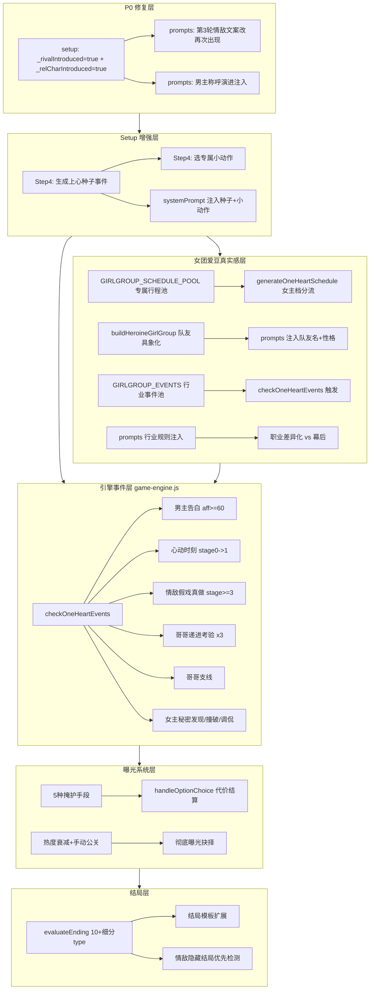

## 产品概述

在 1v1 娱乐圈·队友妹妹设定下，全面完善游戏体验。分为三大类：P0 矛盾修复（出场触发逻辑与「第一次见面」前提打架）+ 功能增强（男主告白事件、情敌假戏真做、哥哥递进考验与团队支线、女主秘密机制、心动时刻高光、地下恋 5 种掩护手段、行程条改进、朋友圈暗斗、聊天输入动效、剧场全开、7+ 多结局细分、情敌隐藏结局）+ 女团爱豆职业真实感增强（专属行程池、具象队友、行业事件、规则注入、职业差异化）。所有新增逻辑用 `isSisterSetting()` 门控，仅娱乐圈·队友妹妹生效，其他世界观与换乘模式零回归。

## 核心功能

**P0 修复**

- 情敌/哥哥出场触发与开局「第一次见面」前提矛盾修复
- 男主对女主称呼门控（第一次叫「XX 的妹妹」，熟络后直呼名）

**男主增强**

- 开局生成 1 次「上心种子事件」固定存档，类型从池中随机（哼歌/帮解围/某句话戳中/被哥哥吐槽瞬间被男主看到等），不固定哼歌；音乐类种子硬约束「女主主动哼唱→男主旁听」，禁止「男主未发表/无人听过的歌」
- 开局从预设选 1-2 个专属小动作（派生自 catchphrases/comforts），注入 prompt 反复引用

**哥哥机制扩展**

- 考验事件 2-3 次递进（中局试探/后局设局/结局前把关）；后局设局=哥哥故意安排妹妹和情敌独处看男主反应；失败=哥哥转 testing，连续失败才 protective
- 哥哥作为情敌队友察觉异常→私下警告/纠结/夹两队友间为难（三重身份张力）
- 哥哥支线：创作瓶颈/黑粉事件/队友矛盾（不影响剧情，哥哥吐槽，13 人关系好，绝不 SOLO 不分开）

**女主人设**

- 身份与职业分离：「队友的妹妹」是固定身份，职业从纯职业池自选（女团爱豆/练习生/化妆师等 14 种）
- 女主秘密（追过 EXO/瞒哥去签售会等 2-3 个随机）：男主发现=好感契机/被撞破=曝光素材/哥哥知道=调侃

**感情推进**

- 好感破 20 触发「心动时刻」300 字高光描写（无特效）
- 男主告白事件（好感>=60 且哥哥非 protective 且非冷战且已有独处约会，可选接受/拒绝/拖延）

**曝光/地下恋**

- 情敌假戏真做被拍（借公司营业 CP 之名靠近被狗仔拍到变绯闻）
- 5 种掩护手段（假装不熟/借哥打掩护/避嫌约会/营业掩护/公司掩护）各有代价
- 曝光阶梯式后果 + 热度衰减 + 彻底曝光公开抉择作为结局高潮

**社交/剧场**

- 朋友圈评论区男主情敌暗斗（彩蛋，随机 50%）
- 聊天「正在输入」时长随好感变（低好感 3-5 秒/高好感 0.5-1 秒）+ 偶尔「开会中晚点回」
- 剧场全开（婚后/校园 IF/男主视角/情敌 IF/哥哥视角），按阶段解锁

**结局**

- 3 档→10+ 细分：HE（公开婚礼/地下永久/带球跑）、NE（和平分手/远距离/暧昧未明）、BE（曝光塌房/情敌上位/哥哥反对）、隐藏（和情敌在一起）
- 情敌隐藏结局（女主对男主好感<40 + 情敌倾向>=50 + 接受情敌告白→转情敌线）
- 必须按阶段推进，不允许跳进度

**女团爱豆职业真实感增强（新增）**

- 女团专属行程池：回归期/打歌期/签售会/Vlive/合宿/画报/综艺/团务/空白期兼职，女主=女团爱豆时女主档优先抽该池
- 女团队友具象化：5 位姐姐生成化名+性格标签+与女主关系标签，剧情可客串
- 女团行业事件池：回归期撞男主巡演/直拍被扒同款/签售会被问恋爱/团内退团危机/part 争议/海外行程异地/ANTI 攻击/同台打歌避嫌
- 行业规则注入：恋爱禁令合约条款=地下恋根本压力、回归期忙空白期焦虑、同行共鸣是情感基础、粉丝经济=曝光即事业打击
- 职业差异化（vs 幕后）：台前曝光风险天然高/营业 CP 可被安排/同行 vs 工作关系/追 EXO 秘密对爱豆杀伤力更大

## 技术栈

- 语言/运行时：JavaScript（ES Modules），Vite 5.4 构建，浏览器原生运行
- 不引入新依赖，遵循现有约定：`var` 不用 let/const、字符串 `+` 拼接不用模板字符串、`isSisterSetting()` 门控保证零回归、所有 AI 文本插入 DOM 前 `escHtml()` 转义

## 实现方案

采用「门控式扩展」：所有新逻辑用 `isSisterSetting()`（`utils.js:31`：`gameMode==='oneHeart' && worldSetting==='entertainment' && role==='哥哥'`）包裹，非队友妹妹走原分支。女团爱豆专属逻辑再加 `profession==='女团爱豆'` 二级门控。新增状态字段在 `state.js:defaultGameState()` 定义 + `migrateSave()` 兜底。事件触发复用现有 `_pendingEvents` 队列 + `checkOneHeartEvents()` 链路。结局判定重写 `evaluateEnding()` 输出细分 type。

### 关键技术决策

1. **P0 出场矛盾**：setup Step4 队友妹妹下置 `GS._rivalIntroduced=true` + `GS._relCharIntroduced=true`（`ui-renderer.js:1218-1220` 已完成），使 `prompts.js:1518/1525`「第 3 轮首次引入」分支跳过；第 3 轮情敌文案改「再次出现」。

2. **男主上心种子**：setup Step4 用 `callDeepSeek` 生成种子事件存 `GS.oneHeartSeedEvent`（`ui-renderer.js:1237-1268` 已完成），含音乐方向硬约束 + 确定性代码护栏（正则拦截「男主写的冷门/无人听/未发表」）。`buildOneHeartSystemPrompt` 注入供后续回溯引用。

3. **男主告白事件**：复用情敌告白事件结构（`game-engine.js:3136-3198`），新增 `type:'mainConfession'`。触发：`affection>=60 && brotherStance!=='protective' && !GS._mainConfessionDone`。接受→stage 锁 2+ / 拒绝→aff-10+情敌+15 / 拖延→冷却 5 回合+哥哥-3+谈话支线。

4. **心动时刻**：`game-engine.js:2647-2652` 已实现（stage0→1 时插 300 字、`!extra.isEnding` 闸门、仅触发一次），无需改动。

5. **情敌假戏真做**：`entertainment.js` 新增 `RIVAL_CP_SCANDAL_EVENTS`，`checkOneHeartEvents` 中 stage>=3 概率命中，选项含澄清/不回应/借机公开。`_isIdol` 检测（`game-engine.js:2684`）已有职业分支（女团爱豆→可被当 CP 营业 / 幕后→其他女艺人女主吃醋）。

6. **5 种掩护手段**：作为选项 `coverMethod` 字段由 AI 返回，`handleOptionChoice` 解析代价。约会前弹小面板选择，累计 3 次粉丝起疑曝光+。

7. **7+ 多结局**：重写 `evaluateEnding()` 返回 10+ 细分 type，按哥哥立场×情敌倾向×曝光×是否公开×好感组合。`data.js:ONE_HEART_ENDING_TEMPLATES` 扩展。情敌隐藏结局优先检测（`aff<40 && rivalAff>=50 && GS._rivalConfessionAccepted`）。

8. **女团专属行程池**：`entertainment.js` 新增 `GIRLGROUP_SCHEDULE_POOL`，`generateOneHeartSchedule`（`game-engine.js:2165+`）中 `isSisterSetting() && profession==='女团爱豆'` 时女主档优先抽该池。

9. **女团队友具象化**：`buildHeroineGirlGroup`（`data.js:1233`）增强：5 位姐姐生成化名（韩式名池）+性格标签+与女主关系标签。`prompts.js:1039-1042` 注入时带队友名。

10. **女团行业事件池**：`entertainment.js` 新增 `GIRLGROUP_EVENTS`，`checkOneHeartEvents` 中 `profession==='女团爱豆'` 概率触发，复用 `_pendingEvents` 队列。

11. **行业规则注入**：`prompts.js` 女团分支 system prompt 追加恋爱禁令/回归期节奏/同行共鸣/粉丝经济规则。职业差异化（vs 幕后）作为 prompt 条件分支注入。

### 性能与可靠性

- 种子事件/心动时刻/告白场景 AI 调用失败均走兜底文案，不阻塞游戏流程
- 女团行业事件复用 `_pendingEvents` 队列（上限 2），不会刷屏
- 掩护手段代价结算复用现有 `updateAffection`/`updateBrotherStance`/`updateRivalTendency`
- 结局判定纯同步函数，无 AI 调用，零性能风险
- 女团专属行程池只是数组抽取，无额外开销

## 实现注意

- 所有新增状态字段必须在 `state.js:defaultGameState()` 定义 + `migrateSave()`（行 513-574 区间）兜底初始化
- `prompts.js` 注入位置统一在队友妹妹专属块（行 1092-1174）内追加；女团分支在行 1039-1042 附近扩展
- validator 不改：`checkOneHeartPacing` stage<1 禁 hotKw+softKw 但不禁「关心/在意/眼神/试探」，天然支持男主主动追求
- 行程条改进在 `generateOneHeartSchedule`（行 2165+）内调整角色窗口分配，女团行程池在同函数内分支抽取
- 女团队友具象化的化名池需避免与 SEVENTEEN 成员名冲突

## 架构设计



## 目录结构

```
src/
├── ui-renderer.js          # [MODIFY] setup Step2/Step4：队友妹妹下身份锁定、职业下拉收敛、
│                           #   Step4 置出场标志位(已完成)、生成种子事件(已完成)、选小动作、
│                           #   拼女团背景(buildHeroineGirlGroup 调用 1077-1080)
├── prompts.js              # [MODIFY] buildOneHeartSystemPrompt：注入种子+小动作+男主称呼演进；
│                           #   女团分支(1039-1042)扩展队友具象化+行业规则+职业差异化；
│                           #   buildOneHeartUserMessage：第3轮情敌文案改"再次出现"、心动/告白/掩护/秘密注入；
│                           #   buildOneHeartChatSystemPrompt：正在输入时长提示
├── game-engine.js          # [MODIFY] checkOneHeartEvents：+男主告白+情敌假戏真做+哥哥递进考验+
│                           #   支线+女主秘密+女团行业事件触发；
│                           #   generateOneHeartSchedule：行程条改进+女团专属行程池分流；
│                           #   handleOptionChoice：掩护手段代价结算；
│                           #   evaluateEnding：重写为10+细分type+情敌隐藏结局优先检测
├── state.js                # [MODIFY] defaultGameState+新字段(migrateSave兜底)：
│                           #   oneHeartSeedEvent(已有)/oneHeartMannerisms(已有)/
│                           #   _mainConfessionDone/oneHeartSecret/_brotherTestPhase/
│                           #   oneHeartCoverUsed/oneHeartManualPRUsed/oneHeartExposurePublic/
│                           #   oneHeartHeroineGroup(已有，结构扩展含队友化名)
├── data.js                 # [MODIFY] ONE_HEART_ENDING_TEMPLATES 扩展10+模板；
│                           #   SMALL_ACTION_PRESETS 小动作预设库；
│                           #   buildHeroineGirlGroup 增强(队友化名+性格+关系标签)；
│                           #   GIRLGROUP_MEMBER_NAMES 韩式化名池
├── worlds/entertainment.js # [MODIFY] BROTHER_EVENTS 追加递进考验/支线事件；
│                           #   RIVAL_CP_SCANDAL_EVENTS 假戏真做事件池；
│                           #   SISTER_SECRET_EVENTS 女主秘密事件池；
│                           #   GIRLGROUP_SCHEDULE_POOL 女团专属行程池(NEW)；
│                           #   GIRLGROUP_EVENTS 女团行业事件池(NEW)
├── validator.js            # [不改] 现有 stage<1 门控天然支持
├── utils.js                # [不改] isSisterSetting() 门控不变
├── modals/
│   ├── moments-modal.js    # [MODIFY] 朋友圈成员回复追加男主情敌暗斗 prompt
│   ├── chat-modal.js       # [MODIFY] 正在输入动效(时长随好感)+偶尔开会中晚点回
│   └── theater-modal.js    # [MODIFY] 剧场类型扩展为5种+按阶段解锁
```

## 关键代码结构

```javascript
// state.js 新增字段
_mainConfessionDone: false,   // 男主告白事件是否已触发
oneHeartSecret: null,         // {type:'追星'|'签售会', content:'', discovered:false, discoveredBy:''}
_brotherTestPhase: 0,         // 哥哥递进考验阶段 0未/1中局试探/2后局设局/3结局前把关
oneHeartCoverUsed: {},        // 本局已用掩护手段计数 {fake_stranger:0, brother_cover:0,...}
oneHeartManualPRUsed: 0,      // 手动公关已用次数（限量2次）
oneHeartExposurePublic: null, // 彻底曝光抉择 null/'public'/'private'

// buildHeroineGirlGroup 增强返回结构（data.js）
members[i] = {
  pos: i+1, role: '队长/主唱', name: '韩式化名',
  trait: '操心老妈子', relation: '最疼你的大姐', isHeroine: false
}

// game-engine.js evaluateEnding 细分返回
function evaluateEnding() {
  if (aff < 40 && rival >= 50 && GS._rivalConfessionAccepted)
    return {endingType:'HIDDEN_RIVAL', ...};
  var tier = (scandal>=3||rival>=50||aff<20||score<=0) ? 'BE'
           : (score>=35&&aff>=60&&brother==='supportive') ? 'HE' : 'NE';
  var sub = resolveEndingSubtype(tier, {brother, rival, scandal, aff, isPublic});
  return {endingType: sub, meters:{...}, score};
}
```