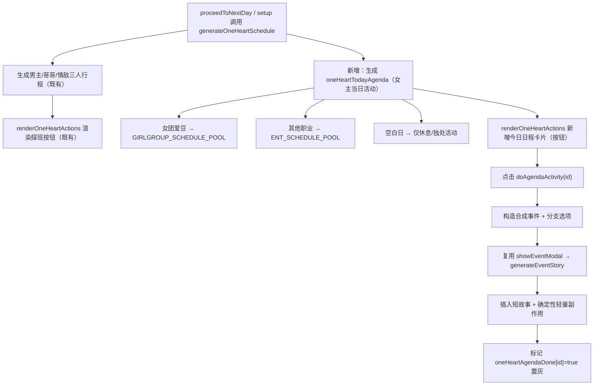

## 用户需求

在 1v1 娱乐圈·队友妹妹设定下，新增「女主每日可点日程表」功能。当前游戏只生成男主/哥哥/情敌三人的行程（用于约会空档与「探班」按钮），女主自己「今天要干什么」完全由 AI 隐式描写、玩家无法主动触发。本功能把女主本人的一天变成可见、可点、有真实娱乐圈质感的按钮，让玩家像真实 idol/艺人一样安排并体验当天。

## 核心功能

- 每日自动生成女主本人的工作/生活日程（1 个主活动 + 可选 1 个副活动），以按钮卡片呈现，显示活动内容与地点。
- 日程按真实娱乐圈质感产生分支：录节目/打歌/综艺等公开场合可能遇见哥哥和团员；练习/独处刷手机看到新闻（男主、自己团或情敌动态）；签售/粉丝活动被粉丝追问恋爱或收到应援；拍画报/杂志撞见某人或被拍；休息/空白日独处触发秘密、朋友圈或剧场。
- 点击日程按钮触发对应场景剧情，内置 2-3 个分支选项，自然带出人物互动与情绪。
- 部分活动带轻量好感/曝光影响（公开拍摄/签售小幅抬升曝光，练习看新闻按内容微调好感）。
- 女团爱豆职业使用专属行程池，其他职业使用通用娱乐圈行程池，全部以 `isSisterSetting()` 等与娱乐圈世界观门控。
- 已执行的当日活动按钮置灰（每天一次），与「约会/探班」互补互不冲突（日程是女主自己的一天，约会是私下见面）。

## 技术栈

- 语言/运行时：JavaScript（ES Modules），Vite 5.4 构建，浏览器原生运行（vanilla JS，无组件库）
- 复用现有约定：`var` 不用 let/const、字符串 `+` 拼接、所有 AI 文本 `escHtml()` 转义、禁 `alert/confirm` 用 `showToast/showConfirmModal`、`GS` 引用不可替换、新增状态字段在 `state.js:defaultGameState()` 定义并在 `migrateSave()` 兜底
- 不引入新依赖

## 实现方案

采用「数据生成 + UI 卡片 + 事件卡复用」三段式，全部复用现有架构，零回归非娱乐圈模式与换乘模式。

### 关键技术决策

1. **数据生成（复用 `generateOneHeartSchedule`）**：在 `game-engine.js:2314` 现有函数末尾扩展生成 `GS.oneHeartTodayAgenda`。门控 `worldSetting==='entertainment'`。活动池选择：女团爱豆（`isSisterSetting() && profession==='女团爱豆'`）抽 `GIRLGROUP_SCHEDULE_POOL`（由 idol-realism 任务新增），其余职业抽既有 `ENT_SCHEDULE_POOL`（`entertainment.js:32-73`）。空白日（现有每 5 天逻辑 `GS.oneHeartBlankDay`）→ agenda 仅含 1 个「休息日/独处」活动，点击触发秘密/朋友圈/剧场（复用 idol-realism 空白日逻辑）。
2. **活动结构**：每项 `{ id, task, place, cat, type(team|solo), encounterHint }`。`encounterHint` 由 `cat/type` 预设：team/公开类（录节目/打歌/综艺）→「可能遇见哥哥与团员」；solo/练习类 →「刷手机看到新闻」；签售/粉丝类 →「被粉丝问恋爱/收应援」；拍摄类 →「撞见某人/被拍」；休息类 →「独处（秘密/朋友圈/剧场）」。
3. **UI 呈现（复用 `renderOneHeartActions`）**：在 `ui-renderer.js:2474` 的 `#oneHeartScheduleStrip` 容器内、现有「探班」按钮旁新增「今日日程」小卡片，列出 agenda 按钮（图标+活动+地点）。已执行项（`GS.oneHeartAgendaDone[id]`）置灰并打勾。沿用现有 `.oneheart-action-btn` 样式与玻璃拟态风格，不新建 CSS 类。
4. **执行互动（复用事件卡链路）**：新增 `doAgendaActivity(activityId)`。点击后依据 activity + `encounterHint` 构造一个合成事件对象 `{ type:'agenda_'+cat, scenario, options }`，直接复用现有事件卡流程（`ui-renderer.js` 中 `showEventModal` → `generateEventStory()`，`game-engine.js:3805`），生成 150-200 字独立短故事并存入 `oneHeartEventCards`。分支选项按 `cat` 预设 2-3 个（如签售被问恋爱→「大方承认/含糊带过/玩笑化解」）。
5. **轻量副作用（确定性，不依赖 AI）**：按 `cat` 应用：`拍摄/签售/公开` → `exposureRisk += 1~3`；`练习看新闻` → 依据选项微调男主好感 ±1~2 或情敌倾向；`休息/空白` → 触发秘密/朋友圈/剧场入口。副作用走现有 `updateAffection/updateRivalTendency/accumulateScandalHeat` 结算，无新结算路径。

### 性能与可靠性

- 日程生成为数组随机抽取（O(1)），无额外开销；跨天随 `generateOneHeartSchedule` 一起生成，调用时机不变（`proceedToNextDay` 与 setup 已调用）。
- 场景 AI 生成复用 `generateEventStory`，失败走兜底文案（`ev.scenario + chosenOption`），不阻塞流程。
- 不新建事件队列，复用 `oneHeartEventCards` 存储，避免刷屏。
- 状态字段在 `state.js:defaultGameState()` 定义 + `migrateSave()` 兜底，旧存档不报错。

## 架构设计



## 目录结构

```
src/
├── game-engine.js          # [MODIFY] generateOneHeartSchedule：末尾新增 oneHeartTodayAgenda 生成（双池分流+空白日）；
│                           #   新增 doAgendaActivity(activityId)：构造合成事件→复用事件卡生成→应用按cat轻量副作用
├── ui-renderer.js          # [MODIFY] renderOneHeartActions：在 #oneHeartScheduleStrip 内新增「今日日程」卡片，
│                           #   渲染 agenda 按钮（图标+活动+地点），绑定点击调用 doAgendaActivity；已执行置灰
├── prompts.js              # [MODIFY] 新增 buildOneHeartAgendaPrompt(activity, encounterHint)：
│                           #   基于活动+encounterHint+当前好感/状态生成场景与分支选项；system 复用 buildOneHeartEventStorySystemPrompt
├── worlds/entertainment.js # [MODIFY] GIRLGROUP_SCHEDULE_POOL（由 idol-realism 任务新增，本功能引用其 team/solo/encounterHint 字段）
├── state.js                # [MODIFY] defaultGameState 新增 oneHeartTodayAgenda:[] / oneHeartAgendaDone:{}；migrateSave 兜底
└── data.js                 # [MODIFY] 可选：新增 AGENDA_EFFECT 常量（各 cat 的曝光/好感微调幅度），集中配置便于调参
```

## 关键代码结构

```javascript
// state.js 新增字段
oneHeartTodayAgenda: [],   // 女主当日活动数组 [{id,task,place,cat,type,encounterHint}]
oneHeartAgendaDone: {},    // 当日已执行活动标记 {activityId:true}

// game-engine.js 活动结构（generateOneHeartSchedule 内生成）
var _act = {
  id: pick.id,
  task: pick.task,
  place: pick.place,
  cat: pick.cat,
  type: _type,                       // team=公开场合 / solo=单人私密
  encounterHint: _encounterHint      // 按 cat/type 预设的遇见/看见提示
};

// game-engine.js doAgendaActivity 概要
export async function doAgendaActivity(activityId) {
  // 1. 取 activity；2. 构造合成事件 {type, scenario: encounterHint, options: 按cat分支}
  // 3. 复用 generateEventStory 生成短故事 → 存入 oneHeartEventCards
  // 4. 按 cat 应用确定性轻量副作用
  // 5. GS.oneHeartAgendaDone[activityId]=true; saveGame(); renderAll();
}
```

## 设计风格

在 1v1 剧情区下方的操作区（`#oneHeartScheduleStrip`）内，沿用现有玻璃拟态 + 圆角按钮风格，新增一块紧凑的「今日日程」卡片。卡片与既有「探班」按钮并排，视觉权重一致，不抢主线剧情。整体走现代、干净、略带娱乐圈质感的深色玻璃风。

## 页面区块设计（1v1 操作区）

- **区块一：日程标题条** — 一行小标题「今日日程 · Day N」，右侧显示天气/状态点缀，与现有哥哥立场/曝光指示同行，保持信息密度统一。
- **区块二：活动按钮组** — 横向自适应排列 1-3 个圆角玻璃按钮，每个按钮含：左侧小图标（如摄像机/音符/话筒/相机/月亮，按 cat 映射）、活动名（如「录节目」「练习」「签售会」）、下方小字地点（如「综艺摄影棚」）。按钮 hover 微抬升 + 边框高亮。
- **区块三：已执行态** — 当天点过的活动按钮变灰、图标加勾、禁用点击，提示「今日已完成」。
- **区块四：休息日态** — 空白日时卡片只显示 1 个「休息日 · 独处」按钮，点击进入秘密/朋友圈/剧场入口，文案引导「今天没有行程，做点自己的事」。

## 交互细节

- 点击活动按钮 → 弹出分支选择弹窗（复用现有事件卡弹窗样式），选完生成短故事并插入剧情流/事件卡。
- 按钮区与「探班」「新的一天」按钮视觉分组，不互相遮挡。
- 移动端/窄屏下按钮自动换行成两列，保持可点区域 ≥44px。

## 视觉规范

- 卡片底色：半透明深色玻璃（`rgba(255,255,255,0.06)` + 模糊），边框 `1px` 半透白。
- 按钮：圆角 12px，内边距 8-10px，主文字 13px、地点小字 11px 降透明度。
- hover：translateY(-2px) + 边框高亮 + 0.2s 缓动。
- 图标用系统 emoji 或简单 SVG，不用外部资源。