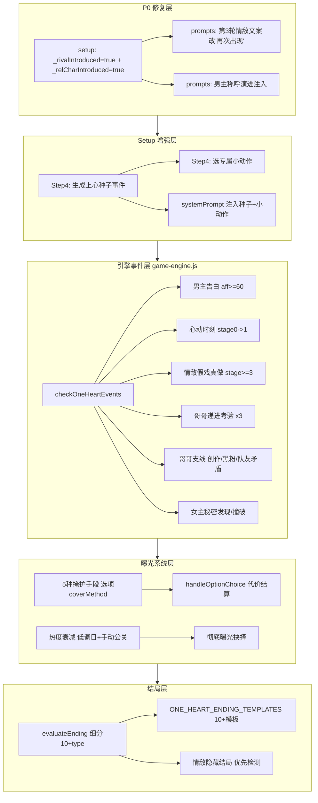

## 产品概述

在 1v1 娱乐圈·队友妹妹设定下，全面完善游戏体验。分为两大类：P0 矛盾修复（出场触发逻辑与「第一次见面」前提打架）+ 功能增强（男主告白事件、情敌假戏真做、哥哥递进考验与团队支线、女主秘密机制、心动时刻高光、地下恋 5 种掩护手段、行程条改进、朋友圈暗斗、聊天输入动效、剧场全开、7+ 多结局细分、情敌隐藏结局）。所有新增逻辑用 `isSisterSetting()` 门控，仅娱乐圈·队友妹妹生效，其他世界观与换乘模式零回归。

## 核心功能

**P0 修复**

- 情敌/哥哥出场触发与开局「第一次见面」前提矛盾修复
- 男主对女主称呼门控（第一次叫「XX 的妹妹」，熟络后直呼名）

**男主增强**

- 开局生成 1 次「上心种子事件」固定存档，后续 prompt 反复引用（防 AI 每轮重新发挥不稳）；类型从池中随机（哼歌/帮解围/某句话戳中/被哥哥吐槽瞬间被男主看到等），不固定哼歌
- 开局从 3 个预设选 1-2 个专属小动作（派生自 catchphrases/comforts），注入 prompt 反复引用

**哥哥机制扩展**

- 考验事件从 1 次扩展为 2-3 次递进（中局试探/后局设局/结局前把关）；后局设局=哥哥故意在男主面前安排妹妹和情敌独处（如让情敌送妹妹回家）看男主反应；失败=哥哥转 testing，连续失败才 protective
- 哥哥作为情敌队友察觉异常→私下警告/纠结/夹两队友间为难（三重身份张力）
- 哥哥支线：创作瓶颈/黑粉事件/队友矛盾（不影响剧情，哥哥吐槽，13 人关系好，绝不 SOLO 不分开）

**女主人设**

- **身份与职业分离**（关键澄清）："队友的妹妹"是固定【身份】（关系），不是【职业】。队友妹妹设定下，身份自动锁定为"哥哥的妹妹"，不再出现在职业下拉里。
- **职业可自选**，且必须能跟队友互动（非素人）：队友妹妹设定下，职业下拉收敛为**纯职业池**（剔除身份类项「队友的妹妹/同公司师妹/财阀千金/素人/站姐大粉」），提供专属互动职业列表：
`女团爱豆 / 练习生 / 化妆师 / 造型师 / 编舞助理 / 电台PD / 综艺作家 / 品牌方助理 / 女演员 / 百万网红博主 / 超模·平面模特 / 带货女主播 / 独立音乐人 / 体育生·运动员`
（例如「队友的妹妹 + 女团爱豆」完全成立）。保留「✍️ 自定义」入口。
- **身份固定为「哥哥的妹妹」**：队友妹妹设定下，身份字段自动锁定，不进职业下拉，圈层感由该固定身份隐含（无需再选「同公司师妹」等重叠项）。
- **情敌关系澄清（不变）**：哥哥=女主亲哥+SEVENTEEN成员；男主=另一SEVENTEEN成员；情敌=又一SEVENTEEN成员（真心喜欢女主）。三人均同团，设定自洽，无需改动。
- 女主秘密（追过别团/瞒哥去签售会）：男主发现=好感契机/被撞破=曝光素材/哥哥知道=调侃

**感情推进**

- 好感破 20 触发「心动时刻」高光描写（阶段转换仪式感）
- 男主告白事件（好感>=60 且哥哥非 protective 且非冷战且已有独处约会，可选接受/拒绝/拖延）——补现状男主无告白点的缺口；接受→stage 锁 2+ & 哥哥+5；拒绝→aff-10 & 情敌+15 & 看人设疏远（内向冷战2回合/外向表面正常疏远）；拖延→冷却5回合 & 哥哥-3 & 触发哥哥找女主谈话支线（不喜欢就说清楚别耽误人家）让玩家解释

**曝光/地下恋**

- 情敌假戏真做被拍（借公司营业 CP 之名靠近被狗仔拍到变绯闻）
- 5 种掩护手段（假装不熟/借哥打掩护/避嫌约会/营业掩护/公司掩护）各有代价
- 曝光阶梯式后果 + 热度衰减（低调日自动减 + 关键节点手动公关）
- 彻底曝光公开/不公开抉择作为结局高潮

**社交/剧场**

- 朋友圈评论区男主情敌暗斗（彩蛋）
- 聊天「正在输入」时长随好感变 + 偶尔「开会中晚点回」
- 剧场全开（婚后/校园 IF/男主视角/情敌 IF/哥哥视角）

**结局**

- 3 档→7+ 细分：HE（公开婚礼/地下永久/带球跑）、NE（和平分手/远距离/暧昧未明）、BE（曝光塌房/情敌上位/哥哥反对）
- 情敌隐藏结局（女主对男主好感<40 + 情敌倾向>=50 + 接受情敌告白→转情敌线）
- 必须按阶段推进，不允许跳进度

## 技术栈

- 语言/运行时：JavaScript（ES Modules），Vite 5.4 构建，浏览器原生运行
- 不引入新依赖，遵循现有约定：`var` 不用 let/const、字符串 `+` 拼接不用模板字符串、`isSisterSetting()` 门控保证零回归、所有 AI 文本插入 DOM 前 `escHtml()` 转义

## 实现方案

采用「门控式扩展」：所有新逻辑用 `isSisterSetting()`（`utils.js:31`：`gameMode==='oneHeart' && worldSetting==='entertainment' && role==='哥哥'`）包裹，非队友妹妹走原分支。新增状态字段在 `state.js:defaultGameState()` 定义 + `migrateSave()` 兜底。事件触发复用现有 `_pendingEvents` 队列 + `checkOneHeartEvents()` 链路。结局判定重写 `evaluateEnding()` 输出细分 type。

### 关键技术决策

1. **P0 出场矛盾**：在 setup Step4 开始时（`ui-renderer.js:1044` 附近）队友妹妹设定下置 `GS._rivalIntroduced = true` + `GS._relCharIntroduced = true`，使 `prompts.js:1518/1525` 的「第 3 轮首次引入」分支跳过；第 3 轮情敌提示文案改为「情敌再次出现制造张力」。改动极小，纯门控。

2. **男主上心种子**：setup Step4 用一次 `callDeepSeek` 生成种子事件文本存 `GS.oneHeartCrushSeed`，`buildOneHeartSystemPrompt` 注入「男主上心起源：{种子事件}，后续剧情可自然回溯引用」。复用现有昵称生成的 `callDeepSeek` 模式（`ui-renderer.js:1048-1056`），失败走兜底文案。

3. **男主告白事件**：复用情敌告白事件的结构（`game-engine.js:3136-3198` 的 `_pendingEvents.push({type:'confession'})` + `showConfessionEvent`），新增 `type:'mainConfession'`。触发条件：`affection>=60 && brotherStance!=='protective' && !GS._mainConfessionDone`，在 `checkOneHeartEvents` 中检测。玩家选接受→romanceStage 锁定 2+ / 拒绝→affection -10 + 情敌倾向 +15 / 拖延→进入冷却。

4. **心动时刻高光**：在 `updateOneHeartRomanceStage`（`game-engine.js:2151`）检测 stage 0→1 变化时，注入一段 `callDeepSeek` 生成的心动描写插入 narrative。复用 `nextEpisodePreview` 的「AI 调用失败静默跳过」容错模式。

5. **情敌假戏真做**：在 `BROTHER_EVENTS` 同级新增 `RIVAL_CP_SCANDAL_EVENTS`（entertainment.js），`pickRivalAction` 已有的阶段触发链路中，stage>=3 时概率命中「营业 CP 被拍」攻势，选项含「澄清只是营业/默认不回应/借机公开」分别影响曝光热度+情敌倾向。

6. **5 种掩护手段**：作为约会/公开场合选项的 `coverMethod` 字段，由 AI 在选项 JSON 中返回（类似现有 `rivalAffDelta`），`handleOptionChoice` 解析并应用代价（曝光风险±/哥哥支持度±/情敌倾向±）。不新建 UI，复用选项面板。

7. **7+ 多结局**：重写 `evaluateEnding()` 返回细分 type（如 `HE_PUBLIC`/`HE_UNDERGROUND`/`HE_PREGNANCY`/`NE_BREAKUP`/`NE_DISTANCE`/`NE_AMBIGUOUS`/`BE_SCANDAL`/`BE_RIVAL`/`BE_BROTHER`/`HIDDEN_RIVAL`），按 `哥哥立场 × 情敌倾向 × 曝光次数 × 是否公开 × 好感` 组合判定。`data.js:ONE_HEART_ENDING_TEMPLATES` 扩展为 10+ 模板。

8. **情敌隐藏结局**：`evaluateEnding` 优先检测隐藏条件（`aff<40 && rivalAff>=50 && GS._rivalConfessionAccepted`）返回 `HIDDEN_RIVAL`。

### 性能与可靠性

- 种子事件/心动时刻/告白场景的 AI 调用失败均走兜底文案，不阻塞游戏流程（复用 `nextEpisodePreview` 容错模式）
- 掩护手段代价结算复用现有 `updateAffection`/`updateBrotherStance`/`updateRivalTendency`，无新结算路径
- 结局判定纯同步函数，无 AI 调用，零性能风险
- 哥哥支线/情敌假戏真做复用 `_pendingEvents` 队列（上限 2），不会刷屏

## 实现注意

- 所有新增状态字段必须在 `state.js:defaultGameState()` 定义 + `migrateSave()`（行 513-574 区间）兜底初始化，否则旧存档会 `undefined` 报错
- `prompts.js` 注入位置统一在队友妹妹专属块（行 1092-1174）内追加，不污染通用逻辑；userMessage 注入在 `buildOneHeartUserMessage`（行 1510+）的情敌/哥哥出场段附近
- validator 不改：`checkOneHeartPacing` stage<1 禁 hotKw+softKw 但不禁「关心/在意/眼神/试探」，天然支持男主主动追求；男主告白在 stage2（aff>=60）触发，不在 stage<1 门控范围
- `checkOneHeartAddressing` 已有欧巴/称哥门控（stage>=1），男主称呼女主的演进由 prompt 注入，不需 validator 改（男主叫女主不涉及越界词）
- 行程条改进在 `generateOneHeartSchedule`（行 2165+）内调整角色窗口分配逻辑，不新建函数
- 朋友圈暗斗在 `moments-modal.js` 的成员回复生成中追加 prompt 指令，聊天输入动效在 `chat-modal.js` 的发送/接收流程中加 CSS 动画延时

## 架构设计



## 目录结构

```
src/
├── ui-renderer.js          # [MODIFY] setup Step2/Step4：队友妹妹下身份锁定"哥哥的妹妹"（职业下拉移除该项、过滤素人，提供互动职业列表：女团爱豆/练习生/化妆师等）；
│                           #   Step4 置 _rivalIntroduced/_relCharIntroduced=true；生成上心种子事件(callDeepSeek)；选专属小动作
├── prompts.js              # [MODIFY] buildOneHeartSystemPrompt：注入种子事件+小动作+男主称呼演进；
│                           #   队友妹妹专属块追加哥哥三重身份/支线/假戏真做前提；
│                           #   buildOneHeartUserMessage：第3轮情敌文案改"再次出现"；心动时刻/告白/掩护/秘密 prompt 注入；
│                           #   buildOneHeartChatSystemPrompt：正在输入时长提示
├── game-engine.js          # [MODIFY] checkOneHeartEvents：+男主告白+心动时刻+情敌假戏真做+哥哥递进考验+支线+女主秘密触发；
│                           #   generateOneHeartSchedule：行程条改进；handleOptionChoice：掩护手段代价结算；
│                           #   evaluateEnding：重写为10+细分type+情敌隐藏结局优先检测
├── state.js                # [MODIFY] defaultGameState+新字段：oneHeartCrushSeed/oneHeartSmallActions/
│                           #   _mainConfessionDone/oneHeartSecret/_brotherTestPhase/oneHeartCoverUsed/
│                           #   oneHeartManualPRUsed/oneHeartExposurePublic；migrateSave兜底
├── data.js                 # [MODIFY] ONE_HEART_ENDING_TEMPLATES 扩展10+模板；
│                           #   SMALL_ACTION_PRESETS 小动作预设库
├── worlds/entertainment.js # [MODIFY] BROTHER_EVENTS 追加递进考验/支线事件；
│                           #   RIVAL_CP_SCANDAL_EVENTS 假戏真做事件池；
│                           #   SISTER_SECRET_EVENTS 女主秘密事件池
├── validator.js            # [不改] 现有 stage<1 门控天然支持，无需调整
├── utils.js                # [不改] isSisterSetting() 门控不变
├── modals/
│   ├── moments-modal.js    # [MODIFY] 朋友圈成员回复追加"男主情敌评论区暗斗"prompt 指令
│   ├── chat-modal.js       # [MODIFY] 正在输入动效(时长随好感)+偶尔"开会中晚点回"
│   └── theater-modal.js    # [MODIFY] 剧场类型扩展为5种(婚后/校园IF/男主视角/情敌IF/哥哥视角)
```

## 关键代码结构

```javascript
// state.js 新增字段
oneHeartCrushSeed: '',        // 男主上心种子事件文本（setup生成一次固定）
oneHeartSmallActions: [],     // 男主专属小动作（1-2个，setup从预设选）
_mainConfessionDone: false,   // 男主告白事件是否已触发
oneHeartSecret: null,         // {type:'追星'|'签售会', content:'', discovered:false, discoveredBy:''}
_brotherTestPhase: 0,         // 哥哥递进考验阶段 0未/1中局试探/2后局设局/3结局前把关
oneHeartCoverUsed: {},        // 本局已用掩护手段计数 {fake_stranger:0, brother_cover:0,...}
oneHeartManualPRUsed: 0,      // 手动公关已用次数（限量）
oneHeartExposurePublic: null, // 彻底曝光抉择 null/'public'/'private'

// game-engine.js evaluateEnding 细分返回
function evaluateEnding() {
  // 优先检测情敌隐藏结局
  if (aff < 40 && rival >= 50 && GS._rivalConfessionAccepted) return {endingType:'HIDDEN_RIVAL',...};
  // 基础档位
  var tier = (scandal>=3||rival>=50||aff<20||score<=0) ? 'BE'
           : (score>=35&&aff>=60&&brother==='supportive') ? 'HE' : 'NE';
  // 细分（tier × 哥哥立场 × 情敌倾向 × 曝光 × 是否公开）
  var sub = resolveEndingSubtype(tier, {brother, rival, scandal, aff, isPublic});
  return {endingType: sub, meters:{...}, score};
}
```