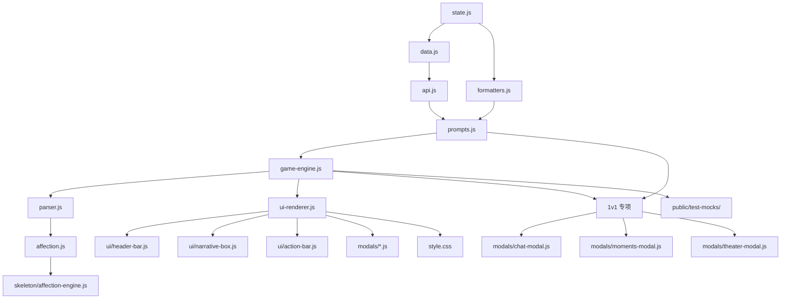

## 产品概述

《换乘恋爱 x SEVENTEEN》沉浸式恋爱文字游戏，包含两种模式：

1. **换乘恋爱（经典模式）**：1女+3名SEVENTEEN成员，12天心动小屋，含X前任、采访间、观察员、修罗场等完整综艺体验
2. **只为你心动（1v1模式）**：1女+1名成员，11个世界观可选（心动小屋/校园/办公室/邻居/旅途/恋综修罗场/古风仙侠/热血电竞圈/末世废土求生/娱乐圈地下恋/自定义世界），4种写作风格，底部5Tab（剧情/聊天/日记/朋友圈/剧场）

## 修复范围

全量覆盖77项修复，分为8个执行阶段：

1. **状态与数据层**（12项）：API提供商重构、生日取代星座、季节/日期/天气/节日系统、好感动延迟结算字段、状态隔离等
2. **Prompt规则**（10项）：读信字数/格式、短信采访间/保密/深夜禁发、私密体质专属、记忆压缩、标记防泄漏
3. **游戏引擎**（15项）：季节/日期/天气初始化、提问箱/电话亭/真心话重构、Day 8/9/11/12特殊流程、try/finally锁释放、scrollTo等
4. **好感度系统**（5项）：延迟结算、重复递减、疲劳值、风险扣分、修罗场强度
5. **1v1模式专项修复**（17项）：parseOneHeartNarrative定义、聊天JSON/纯文本矛盾、_isGenerating锁、Header好感度、事件弹窗、测试模式、回礼检测、聊天天限、约会/日记计数分离、选项显示、结局界面、关系角色生成、生日注入等
6. **UI交互**（12项）：Setup Wizard生日/API联动、选项自由输入次数、深夜隐藏选项、已改造标签、送礼prompt、提问箱/电话亭/真心话UI、导出按钮、moments prompt替换、getAddressRules动态化
7. **测试模式**（2项）：换乘+1v1双模式 test-mocks、Header开关
8. **验证**（4项）：运行dev、回归测试、重启验证1v1聊天、输出报告

## 关键修复：1v1聊天乱码

- **根因**：`buildOneHeartSystemPrompt` 要求AI输出JSON格式，`buildOneHeartUserMessage('chat')` 要求纯文本——AI优先遵循系统prompt输出JSON，`sendChatMessage` 按纯文本解析失败，取了 `{` `[` 等JSON字符
- **修复**：在 `buildOneHeartUserMessage('chat')` 末尾追加 "此场景不要输出JSON格式，直接输出纯文字回复内容"

## Tech Stack

- **Runtime**: JavaScript (ES Modules), Node.js 18+
- **Build**: Vite 5.4
- **Framework**: Vanilla JS
- **State**: localStorage + GS 全局对象
- **API**: DeepSeek（扩展硅基流动/千问）
- **Package**: npm

## Implementation Approach

### 策略

按底层(状态/数据) → 上层(Prompt/引擎/好感度) → 特殊(1v1) → UI → 测试的顺序分批实施。每个批次先改底层字段，再改调用方，最后补样式和测试。所有修改向后兼容，旧存档通过 `migrateSave()` 自动升级。

### 关键决策

1. **聊天乱码**：不改 `sendChatMessage` 解析逻辑（避免破坏已有稳定逻辑），改为在 `buildOneHeartUserMessage('chat')` 追加覆盖指令——告诉AI此场景不要JSON
2. **`parseOneHeartNarrative`**：在 `parser.js` 新增独立函数，结构同 `parseNarrative` 但只返回 1v1 需要的字段 `{ narrative, options, blocks }`
3. **`_isGenerating` 锁**：所有 try 块改为 try/finally，确保return/throw都释放锁
4. **saveGame 运行时锁**：存档时不再 delete `_isGenerating`，改为保存其值并在保存后恢复（防止刷新后残留 true）
5. **1v1 Header好感度**：单独用 `GS.oneHeartMember` 取成员，不依赖 `GS.selectedMembers`
6. **1v1事件弹窗**：在 `init.js` 或 `app.js` 中将 `event-modal.js` 的导出函数挂到 `window`
7. **1v1测试模式**：在 `_loadStoryArchive` 中新增 `GS.gameMode === 'oneHeart'` 分支，读取 `public/test-mocks/oneheart-*.txt`

### 性能与可靠性

- try/finally 确保 _isGenerating 锁永不残留
- saveGame 不删除运行时锁，防止刷新后卡死
- 1v1 测试模式完全本地读取，零 API 成本
- 所有 DOM 操作复用现有渲染路径

## 架构设计

### 修改链路图



### 数据流

```
用户操作 → ui-renderer.js 事件绑定 → game-engine.js 流程函数
  → prompts.js 构建 prompt → ai-generator.js → api.js
  → parser.js 解析 → 更新 GS → renderAll() → DOM 更新
```

## 目录结构

```
src/
├── state.js              [MODIFY] defaultGameState/migrateSave/resetGame/saveGame
├── data.js               [MODIFY] API_PROVIDERS, WEATHER_POOLS, HOLIDAYS, DATING_LOCATIONS, TRUTH_CARDS
├── api.js                [MODIFY] callDeepSeek 测试模式分支, loadTestScene 1v1 分支, saveGame 锁保护
├── formatters.js         [MODIFY] getZodiacFromBirthday, generateSeasonAndDates, generateOneHeartDates, generateDailyWeather, getMandatoryTask Day 3, rollDatingDice 长度校验, getAddressRules 动态女主名
├── prompts.js            [MODIFY] buildSystemPrompt: 短信采访间/保密/深夜禁发, system标记替换##, 私密体质三处声明, 读信字数/枚举; buildOneHeartSystemPrompt: birthday注入; buildOneHeartUserMessage: chat追加纯文本指令, phase字数调整, consequence字数调整
├── memory.js             [MODIFY] compressTodayToSummary 删除对话归属保留要求
├── x-archive.js          [MODIFY] X物品50容量缓存池,x档案显示物品,xItemsRevealState
├── parser.js             [NEW] parseOneHeartNarrative 函数, 真心话跳过喝酒标记, 严格丢弃未出场成员好感度
├── game-engine.js        [MODIFY] try/finally 锁释放(所有 async 函数), 季节/日期/天气/节日初始化, proceedToNextDay 天气/节日, resetPhaseState 保留约会状态, flushPendingAffection, 提问箱/电话亭, Day 8/9/11/12, scrollTo, 1v1回礼跳过, sendChatMessage天限修正, 约会/日记计数分离, 测试模式分支
├── ui-renderer.js        [MODIFY] Step 1 生日月/日+API联动, 日期X月X日, 选项/自由输入次数, 深夜隐藏选项, 保存清空输入, 已改造标签, 送礼prompt, 提问箱固定按钮, 电话亭记录按钮, 真心话折叠/卡片/计数, 导出按钮, 测试开关, 1v1事件挂载确认, 1v1选项affDelta显示, 1v1结局界面
├── ui/
│   ├── header-bar.js     [MODIFY] 1v1好感度提示用 oneHeartMember, getAddressRules 动态名
│   └── narrative-box.js  [MODIFY] 1v1 压缩跳过逻辑确认
├── modals/
│   ├── chat-modal.js     [MODIFY] (如果有需要)
│   ├── moments-modal.js  [MODIFY] 替换原生 prompt() 为自定义弹窗
│   ├── theater-modal.js  [MODIFY] (如果有需要)
│   ├── diary-modal.js    [MODIFY] (如果有需要)
│   └── index.js           [MODIFY] 导出补充
├── affection.js          [MODIFY] 重复递减,负面扣分,疲劳值,修罗场强度
├── skeleton/
│   └── affection-engine.js [MODIFY] 重复递减,负面扣分,疲劳值,修罗场强度,flushPendingAffection
├── style.css             [MODIFY] .aff-risk, .truth-card, .truth-round-summary, .truth-drink-panel, 1v1 option affDelta
└── app.js                [MODIFY] 事件弹窗函数挂载 window

public/test-mocks/        [NEW] 9个txt文件（换乘）+ 9个 oneheart-*.txt（1v1）
```

## 关键技术细节

### 1. 聊天乱码修复（prompts.js:1166）

在 `buildOneHeartUserMessage('chat')` 末尾（当前行1166之后）追加：

```javascript
'【重要】此场景不要输出JSON格式。'
```

### 2. parseOneHeartNarrative 新增（parser.js）

```javascript
export function parseOneHeartNarrative(rawText) {
  // 同 parseNarrative 主干逻辑，只返回 { narrative, options, blocks }
  // 1v1 不需要 interviews/xInterviews/observerOS/drinks 等字段
}
```

### 3. saveGame 锁保护（state.js:267-268）

```javascript
var savedLock = stateToSave._isGenerating;
delete stateToSave._isGenerating; // 存档时移除运行时锁
// ... 序列化 ...
stateToSave._isGenerating = savedLock; // 保存后恢复
```

### 4. try/finally 模式（game-engine.js 所有异步函数）

```javascript
GS._isGenerating = true;
try {
  // 原有逻辑...
} finally {
  GS._isGenerating = false;
}
```

## 使用的Agent Extensions

### SubAgent

- **code-explorer**
- 用途：在每个阶段执行前扫描目标文件，确认精确行号、函数位置、依赖关系，避免遗漏
- 预期成果：输出行号索引、函数调用链、待修改点位置列表

### Skill

- **agents-sdk / cloudflare**：本计划不涉及 Cloudflare Workers，不使用

### Skills 未选用的原因

- wrangler / workers-best-practices：本计划纯前端，不涉及 Cloudflare Workers
- web-perf / playwright-cli / agent-browser：本计划为代码修复，不需要浏览器自动化
- pdf / docx / xlsx / pptx：本计划不涉及文档处理
- 多模态内容生成：本计划不涉及媒体生成