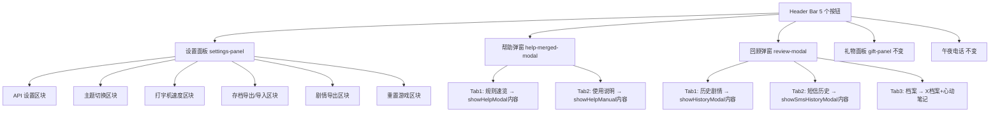

## 用户需求

整合 Header 按钮区，从当前 16 个控件精简为 5 个。具体规则：

1. **合并"帮助类"为 1 个按钮**：规则速览 + 使用说明 → 1 个帮助按钮，Tab 切换
2. **合并"文档查阅类"为 1 个"回顾"按钮**：历史剧情 + 短信历史 + 档案（X档案 + 心动笔记）→ 1 个回顾按钮，Tab 切换（剧情/短信/档案）
3. **设置按钮做一滑动的设置面板**，内容顺序：

- API 设置（在前）
- 主题切换
- 打字机速度
- 导出存档（JSON）
- 导入存档（JSON）
- 导出完整剧情（所有天数的文字剧情，当前 exportBtn 逻辑即遍历 dailyFullTexts 全量导出）
- 重置游戏

4. **档案做一个 Tab**，里面是 X 档案 + 心动笔记
5. 其他未归入按钮：礼物和午夜电话保持独立

## 最终 Header 按钮（5 个）

| 按钮 | 合并来源 |
| --- | --- |
| 设置 | API 设置 + 主题切换 + 打字机速度 + 导出存档 + 导入存档 + 导出剧情 + 重置游戏 |
| 帮助 | 规则速览 + 使用说明 |
| 回顾 | 历史剧情 + 短信历史 + 档案（X 档案 + 心动笔记） |
| 礼物 | 礼物面板（保持独立） |
| 电话 | 午夜电话记录（条件渲染，保持独立） |


## Tech Stack

- 语言/运行时：JavaScript (ES Modules), Node.js 18+
- 框架：Vanilla JS + Vite
- 样式：CSS 变量化（style.css），无新依赖
- 代码约定：使用 `var` 而非 `let/const`，字符串拼接用 `+`，所有 AI 文本插入 DOM 前经 `escHtml()` 转义

## Implementation Approach

### 整体策略

将 16 个 Header 控件精简为 5 个，采用**新建弹窗容器 + 复用已有弹窗函数**的方式，不重写已有弹窗的内部逻辑：

1. **设置面板**：改造 `api-settings-modal.js` 为多区块设置面板，将主题切换/打字机速度/存档导出导入/剧情导出/重置游戏的内联逻辑迁移进来
2. **帮助弹窗**：新建 `help-merged-modal.js`，Tab 切换调用 `showHelpModal()` / `showHelpManual()` 的内容
3. **回顾弹窗**：新建 `review-modal.js`，Tab 切换调用 `showHistoryModal()` / `showSmsHistoryModal()` / X档案+心动笔记内容
4. **Header 按钮区**：`header-bar.js` 从 16 控件改为 5 控件
5. **事件绑定**：`ui-renderer.js` 清理被合并按钮的旧绑定，新增 3 个按钮的绑定

### 关键技术决策

| 决策 | 理由 |
| --- | --- |
| 设置面板用滑出式而非居中弹窗 | 用户明确要求"滑动的设置面板"，右侧滑出更符合设置类交互习惯 |
| 回顾弹窗用 Tab 而非菜单 | 用户明确要求 Tab 切换，且各 Tab 内容量大，Tab 适合在同一弹窗内切换 |
| 帮助弹窗也用 Tab | 规则速览和说明书内容差异大但都是文档，Tab 切换最直观 |
| 已有弹窗函数保留不动 | `showHistoryModal`/`showSmsHistoryModal`/`showXArchiveModal`/`showHeartNotesModal`/`showHelpModal`/`showHelpManual` 已有完整内部逻辑，直接调用避免重写和回归风险 |
| 导出剧情逻辑迁移 | 当前 `exportBtn` 逻辑在 `ui-renderer.js:1125-1148`，迁入设置面板后复用相同代码 |
| 主题切换逻辑迁移 | `toggleTheme()` 函数从 header 按钮迁移到设置面板内的按钮 |
| 打字机速度迁移 | `<select>` 从 header 迁移到设置面板内 |


### 性能考量

- 弹窗按需创建（点击时才 `document.createElement`），不预渲染
- Tab 切换时只渲染当前 Tab 的内容，不一次性渲染所有 Tab（避免 DOM 膨胀）
- 被合并的 11 个按钮从 Header DOM 中移除，减少初始渲染节点数

## Implementation Notes

- **不修改已有弹窗文件**：`history-modal.js`、`sms-history-modal.js`、`x-archive-modal.js`、`heart-notes-modal.js`、`help-modal.js`、`help-manual.js` 保持原样，新弹窗通过调用它们的导出函数来复用内容
- **被移除的旧 ID**：`apiSettingsBtn`、`helpBtn`、`helpManualBtn`、`historyBtn`、`xArchiveBtn`、`smsHistoryBtn`、`heartNotesBtn`、`exportBtn`、`saveExportBtn`、`saveImportBtnLabel`、`saveImportInput`、`resetGameBtn`、`themeToggleBtn`、`typewriterSpeedSelect` —— 这些 ID 的事件绑定代码需从 `ui-renderer.js` 中清理
- **保留的 ID**：`giftBtn`、`midnightCallRecordBtn`、`affectionHint` —— 保持原样不动
- **设置面板内的事件绑定**：主题切换、打字机速度、存档导出/导入、剧情导出、重置游戏的事件绑定从 `ui-renderer.js` 迁移到新的设置面板模块内部
- **CSS**：新增滑出式面板动画 + Tab 切换样式，复用已有 CSS 变量（`--bg-card`、`--border-primary`、`--text-primary` 等）

## Architecture Design



## Directory Structure Summary

改动涉及 4 个文件修改 + 3 个新文件创建：

```
src/
├── ui/
│   └── header-bar.js              # [MODIFY] header-btns 区域从 16 控件→5 控件
├── ui-renderer.js                 # [MODIFY] 清理旧事件绑定 + 新增 3 个按钮绑定
├── modals.js                      # [MODIFY] 导出新弹窗函数
├── style.css                      # [MODIFY] 新增滑出面板+Tab 样式
├── modals/
│   ├── api-settings-modal.js      # [MODIFY] 改造为多区块设置面板
│   ├── help-merged-modal.js       # [NEW] 帮助 Tab 弹窗（规则速览+使用说明）
│   ├── review-modal.js            # [NEW] 回顾 Tab 弹窗（剧情+短信+档案）
│   └── (其他已有弹窗文件不变)
```

### 各文件详细说明

**`src/ui/header-bar.js`** [MODIFY]

- 将 header-btns 区域从 16 个控件替换为 5 个：设置(⚙️) + 帮助(❓) + 回顾(📚) + 礼物(🎁) + 电话(📞条件渲染)
- 删除 saveImportInput 隐藏 file input（迁移到设置面板内部）
- 删除 typewriterSpeedSelect 下拉框（迁移到设置面板内部）

**`src/ui-renderer.js`** [MODIFY]

- 清理被合并按钮的事件绑定（line 964-1024 中的 xArchiveBtn/smsHistoryBtn/heartNotesBtn/historyBtn/helpBtn/helpManualBtn/resetGameBtn/themeToggleBtn/typewriterSpeedSelect）
- 清理存档导出导入事件绑定（line 1027-1067 的 saveExportBtn/saveImportInput）
- 清理剧情导出事件绑定（line 1125-1148 的 exportBtn）
- 新增 3 个按钮绑定：settingsPanelBtn → showSettingsPanel、helpMergedBtn → showHelpMergedModal、reviewBtn → showReviewModal
- 保留：giftBtn（972行）、midnightCallRecordBtn（1073行）、affectionHint（1150行）的绑定不动
- import 行新增 showHelpMergedModal、showReviewModal、showSettingsPanel

**`src/modals/api-settings-modal.js`** [MODIFY] → 改名为设置面板

- 函数 `showApiSettingsModal` 改为 `showSettingsPanel`
- 在现有 API 设置区块下方追加 5 个新区块：
- 主题切换：3 个按钮（auto/light/dark），调用 applyTheme()
- 打字机速度：`<select>` 下拉框，change 事件更新 GS.typewriterSpeed
- 存档导出：按钮，复用 ui-renderer.js:1029-1041 的 JSON 导出逻辑
- 存档导入：隐藏 file input + 标签按钮，复用 ui-renderer.js:1047-1067 的导入逻辑
- 剧情导出：按钮，复用 ui-renderer.js:1128-1147 的 dailyFullTexts 全量导出逻辑
- 重置游戏：按钮，调用 resetGame() + renderAll()
- 面板样式改为右侧滑出（`transform: translateX(100%)` → `translateX(0)` 动画）
- 需要额外 import：`resetGame`、`setGS`、`renderAll`（或通过 window.\_\_renderAll）、`applyTheme`

**`src/modals/help-merged-modal.js`** [NEW]

- 导出 `showHelpMergedModal()`
- 创建 Tab 弹窗：Tab1「规则速览」+ Tab2「使用说明」
- Tab1 点击时调用 `showHelpModal()` 的内部内容（或直接内联 help-modal.js 的 HTML 生成逻辑）
- Tab2 点击时调用 `showHelpManual()` 的内部内容
- 使用 `createModal()` 创建 overlay

**`src/modals/review-modal.js`** [NEW]

- 导出 `showReviewModal()`
- 创建 Tab 弹窗：Tab1「📖 剧情」+ Tab2「📜 短信」+ Tab3「📋 档案」
- Tab1 点击时调用 `showHistoryModal()` 的内容
- Tab2 点击时调用 `showSmsHistoryModal()` 的内容
- Tab3 渲染 X 档案 + 心动笔记的合并内容（可分上下两个 section，或子 Tab）
- 使用 `createModal()` 创建 overlay

**`src/modals.js`** [MODIFY]

- 新增 export：`export { showHelpMergedModal } from './modals/help-merged-modal.js'`
- 新增 export：`export { showReviewModal } from './modals/review-modal.js'`
- 修改：`export { showSettingsPanel } from './modals/api-settings-modal.js'`（改名）

**`src/style.css`** [MODIFY]

- 新增 `.settings-panel` 滑出式面板样式（right: 0, transform 动画）
- 新增 `.settings-panel-section` 分区块样式
- 新增 `.tab-bar` / `.tab-btn` / `.tab-btn.active` Tab 切换样式
- 新增 `.tab-content` / `.tab-content.hidden` Tab 内容区样式
- 复用已有 CSS 变量保证深色模式兼容

## Agent Extensions

### SubAgent

- **code-explorer**
- Purpose: 在实施阶段探查各弹窗函数的内部 HTML 结构，确保 Tab 切换时正确调用和渲染
- Expected outcome: 确认 showHelpModal/showHelpManual/showHistoryModal/showSmsHistoryModal/showXArchiveModal/showHeartNotesModal 的返回值和 DOM 结构，确保 Tab 内嵌时不冲突