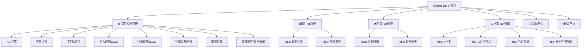

## 产品概述

将 SEVENTEEN 游戏 Header 按钮区从当前 16 个控件精简整合为 6 个按钮，通过 Tab 弹窗和滑出式面板收纳功能，提升界面整洁度。

## Core Features

- **⚙️设置**：弹窗外壳 + 内部滑动面板，9 个区块按顺序：API设置 → 主题切换 → 打字机速度 → 导入存档 → 导出存档 → 导出完整剧情 → 重置游戏 → 重置缓存
- **❓帮助**：Tab 弹窗（规则速览 + 使用说明）
- **📚回顾**：Tab 弹窗（历史剧情 + 短信历史）
- **📋档案**：Tab 弹窗（X档案 + X记忆物品 + 心动笔记 + 秘密任务历史）
- **🎁礼物**：保持独立
- **📞电话**：条件渲染保持独立
- **重置缓存**：独立按钮，弹出警告告知玩家本地文件清除、剧情需重新生成
- **秘密任务历史**：新增查看入口，渲染 GS.secretMissionHistory 数据

## Tech Stack

- 语言/运行时：JavaScript (ES Modules), Node.js 18+
- 框架：Vanilla JS + Vite
- 样式：CSS 变量化（style.css），无新依赖
- 代码约定：使用 `var` 而非 `let/const`，字符串拼接用 `+`，所有 AI 文本插入 DOM 前经 `escHtml()` 转义

## Implementation Approach

### 整体策略

将 16 个 Header 控件精简为 6 个，采用**新建弹窗容器 + 复用已有弹窗函数**的方式，不重写已有弹窗内部逻辑。

### 关键技术决策

| 决策 | 理由 |
| --- | --- |
| 设置面板用右侧滑出式而非居中弹窗 | 用户明确要求"滑动的设置面板"，右侧滑出符合设置类交互习惯 |
| 档案独立成按钮而非回顾的 Tab | 用户明确要求档案独立，内容量大（4 个 Tab）适合独立弹窗 |
| 已有弹窗函数保留不动 | showHistoryModal/showSmsHistoryModal/showXArchiveModal/showXItemsModal/showHeartNotesModal/showHelpModal/showHelpManual 已有完整逻辑，直接调用避免回归风险 |
| 重置游戏与重置缓存分开 | 用户明确要求两个独立操作，重置缓存需警告弹窗 |
| 秘密任务历史新建渲染逻辑 | 当前无查看入口，GS.secretMissionHistory 有数据但未展示，需新建渲染 |
| 导出剧情逻辑迁移 | 当前 exportBtn 遍历 dailyFullTexts 全量导出，直接复用 |


### 性能考量

- 弹窗按需创建（点击时才 createElement），不预渲染
- Tab 切换时只渲染当前 Tab 内容，不一次性渲染所有 Tab
- 被合并的 10 个按钮从 Header DOM 中移除，减少初始渲染节点数

## Implementation Notes

- **不修改已有弹窗文件**：history-modal.js、sms-history-modal.js、x-archive-modal.js、x-items-modal.js、heart-notes-modal.js、help-modal.js、help-manual.js 保持原样
- **被移除的旧 ID**：apiSettingsBtn、helpBtn、helpManualBtn、historyBtn、xArchiveBtn、smsHistoryBtn、heartNotesBtn、exportBtn、saveExportBtn、saveImportBtnLabel、saveImportInput、resetGameBtn、themeToggleBtn、typewriterSpeedSelect
- **保留的 ID**：giftBtn、midnightCallRecordBtn、affectionHint
- **重置缓存实现**：清除 localStorage 所有 svt_* 项 + local_game_state，弹出 showConfirmModal 二次确认，确认后 location.reload()
- **秘密任务历史渲染**：遍历 GS.secretMissionHistory，每条显示任务名/目标成员/完成状态/触发 Day
- **深色模式 OS/采访间背景修复**（style.css）：
- 当前问题：`.observer-os`/`.interview`/`.member-interview` 3 个选择器硬编码了浅色背景（`#fef9e7`/`#f5f0fa`/`#f0f4fa`），深色模式下显示过浅
- 修复方案：将硬编码背景改为 CSS 变量，并新增 `--bg-mc-interview` 变量
- 同步修复文字颜色对比度：`.observer-os .obs-name` 等 color 值在深色模式下改为亮色
- 浅色 `:root` 中变量值保持不变，深色 `[data-theme="dark"]` 中定义对应深色变体

## Architecture Design



## Directory Structure

```
src/
├── ui/
│   └── header-bar.js              # [MODIFY] header-btns 从 16 控件→6 控件
├── ui-renderer.js                 # [MODIFY] 清理旧绑定 + 新增 4 个按钮绑定
├── modals.js                      # [MODIFY] 导出新弹窗函数
├── style.css                      # [MODIFY] 滑出面板+Tab+警告样式
├── modals/
│   ├── api-settings-modal.js      # [MODIFY] 改造为滑出式设置面板(8区块)
│   ├── help-merged-modal.js       # [NEW] 帮助Tab弹窗(规则速览+使用说明)
│   ├── review-modal.js            # [NEW] 回顾Tab弹窗(剧情+短信)
│   ├── archive-modal.js           # [NEW] 档案Tab弹窗(X档案+X物品+心动笔记+秘密任务)
│   └── (其他已有弹窗文件不变)
```

### 各文件详细说明

**`src/ui/header-bar.js`** [MODIFY]

- header-btns 区域从 16 控件替换为 6 个：设置(⚙️) + 帮助(❓) + 回顾(📚) + 档案(📋) + 礼物(🎁) + 电话(📞条件渲染)
- 删除 saveImportInput 隐藏 file input、typewriterSpeedSelect 下拉框（迁移到设置面板）

**`src/ui-renderer.js`** [MODIFY]

- 清理 14 个旧按钮的事件绑定（apiSettingsBtn/helpBtn/helpManualBtn/historyBtn/xArchiveBtn/smsHistoryBtn/heartNotesBtn/exportBtn/saveExportBtn/saveImportInput/resetGameBtn/themeToggleBtn/typewriterSpeedSelect）
- 新增 4 个按钮绑定：settingsPanelBtn/helpMergedBtn/reviewBtn/archiveBtn
- 保留：giftBtn、midnightCallRecordBtn、affectionHint 不动
- import 行新增 showSettingsPanel/showHelpMergedModal/showReviewModal/showArchiveModal

**`src/modals/api-settings-modal.js`** [MODIFY]

- 函数 showApiSettingsModal 改为 showSettingsPanel
- 在现有 API 设置区块下方追加 7 个区块：主题切换/打字机速度/导出存档/导入存档/导出剧情/重置游戏/重置缓存
- 重置缓存：showConfirmModal 二次确认 → 清除 localStorage svt_* 项 + local_game_state → location.reload()
- 面板样式改为右侧滑出（transform: translateX 动画）
- 额外 import：resetGame、setGS、saveGame、applyTheme/toggleTheme

**`src/modals/help-merged-modal.js`** [NEW]

- 导出 showHelpMergedModal()
- Tab 弹窗：Tab1「规则速览」调用 showHelpModal 内容 + Tab2「使用说明」调用 showHelpManual 内容

**`src/modals/review-modal.js`** [NEW]

- 导出 showReviewModal()
- Tab 弹窗：Tab1「📖 剧情」调用 showHistoryModal 内容 + Tab2「📜 短信」调用 showSmsHistoryModal 内容

**`src/modals/archive-modal.js`** [NEW]

- 导出 showArchiveModal()
- Tab 弹窗 4 个 Tab：
- Tab1「📋 X档案」调用 showXArchiveModal 内容
- Tab2「🎁 X记忆物品」调用 showXItemsModal 内容
- Tab3「📝 心动笔记」调用 showHeartNotesModal 内容
- Tab4「🎯 秘密任务」新建渲染逻辑：遍历 GS.secretMissionHistory，每条显示任务名/目标成员/完成状态/触发Day

**`src/modals.js`** [MODIFY]

- 新增 export：showHelpMergedModal、showReviewModal、showArchiveModal
- 修改：showApiSettingsModal → showSettingsPanel

**`src/style.css`** [MODIFY]

- 新增 .settings-panel 滑出式面板样式（right:0, transform 动画 0.3s ease）
- 新增 .settings-panel-section 分区块样式
- 新增 .tab-bar / .tab-btn / .tab-btn.active Tab 切换样式
- 新增 .tab-content / .tab-content.hidden Tab 内容区样式
- 新增 .danger-btn 危险按钮样式（重置缓存用红色警示）
- 复用已有 CSS 变量保证深色模式兼容

## Agent Extensions

### SubAgent

- **code-explorer**
- Purpose: 在实施阶段探查各弹窗函数的内部 HTML 结构和返回值，确保 Tab 切换时正确调用和渲染
- Expected outcome: 确认 showHelpModal/showHelpManual/showHistoryModal/showSmsHistoryModal/showXArchiveModal/showXItemsModal/showHeartNotesModal 的 DOM 结构，确保 Tab 内嵌时不冲突