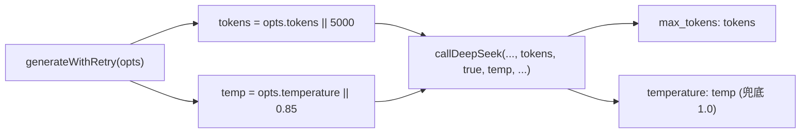

## 需求

用户反馈 `[ai-generator] attempt 1 failed with 1 error(s): [format] 剧情内容为空` 错误频繁出现。

## 原因分析

经代码检查，确认根因是 **max_tokens 偏小** 导致 AI 输出被截断：

- `TOKEN_CONFIG.phaseNarrative = 4000`（约 2800-3500 汉字），而 AI 需要同时输出多段剧情正文 + 选项 + 观察员评论 + 好感度 JSON 结构，空间偏紧
- `temperature = 0.85` 偏高，输出稳定性不够

## 修改目标

1. 增大 max_tokens，让 AI 有足够空间输出完整 JSON
2. 降低 temperature，让 AI 输出更稳定
3. consequence（0.75）、truth/questionBox（0.6）的有针对性调优保持不变

## 技术方案

### 参数传递链路

### 修改清单

**1. `src/data.js` — TOKEN_CONFIG 翻倍**

| 键 | 原值 | 新值 |
| --- | --- | --- |
| phaseNarrative | 4000 | 8000 |
| consequence | 2000 | 4000 |
| sms | 2000 | 3000 |
| stay | 2000 | 3000 |
| freeAction | 2000 | 3000 |
| finalResult | 4000 | 6000 |
| dailySummary | 2000 | 3000 |
| todayCompress | 6000 | 8000 |
| xMainStory | 6000 | 8000 |
| xMemberReason | 1500 | 2000 |
| xItems | 1500 | 2000 |

**2. `src/game-engine.js` — 降低 temperature（6 处）**

| 行号 | 场景 | 原值 | 新值 |
| --- | --- | --- | --- |
| 176 | phaseNarrative | 0.85 | 0.8 |
| 343 | jealousy 剧情 | 0.85 | 0.8 |
| 385 | drunk 剧情 | 0.85 | 0.8 |
| 805 | finalResult | 0.85 | 0.8 |
| 858 | freeAction | 0.85 | 0.8 |
| 1262 | stay | 0.85 | 0.8 |

> consequence(0.75)、truth(0.6)、questionBox(0.6) 保持不变。

**3. `src/ai-generator.js` — 默认 fallback temperature**

第 12 行：`var temp = opts.temperature || 0.85;` → `var temp = opts.temperature || 0.8;`

### 风险与影响

- **API 费用**：max_tokens 增大后，按 token 计费会略有上升，但实际输出长度由 AI 决定，max_tokens 只是上限
- **响应时间**：长文本可能增加 1-3 秒，但 90s 超时不变，在安全范围内
- **回退方案**：若新值导致问题，直接还原 TOKEN_CONFIG 或个别 temperature 即可