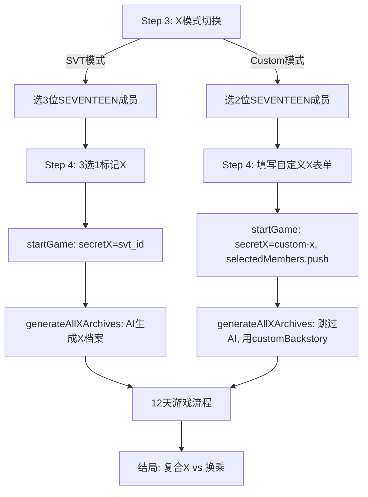

## 用户需求

玩家可以在游戏设置阶段选择"自定义X"模式，将自己捏的虚拟角色作为女主的秘密前任X入住心动小屋，替代从SEVENTEEN成员中选X的原有流程。

## 产品概述

在原有"从3位SEVENTEEN成员中选1位为X"的基础上，新增"自定义X"模式。自定义X作为第4位男嘉宾入住小屋（共2位SEVENTEEN + 1位自定义X + 女主 = 4人），参与日常互动、好感度、约会、最终选择。结局保留"复合X vs 换乘"二选一。

## 核心功能

- Step 3 新增X模式切换：「SEVENTEEN X」（选3位成员）vs「自定义X」（选2位成员）
- Step 4 自定义模式下展示X人设表单：基础信息/性格情感/附加设定/自由背景四个分组
- 自定义X参与全部12天游戏流程（好感度/短信/送礼/约会/真心话/结局）
- 自定义模式下跳过AI生成X恋爱档案，直接使用玩家填写的故事文本
- 自定义X无立绘时自动回退emoji显示

## Tech Stack

- 语言/运行时：JavaScript (ES Modules), Node.js 18+（保持现有栈）
- 框架：Vanilla JS + Vite（不变）
- 不引入新依赖，全部使用浏览器原生API

## 核心设计决策

### 决策1：`selectedMembers` 包含 `'custom-x'` 字符串

自定义模式下，`GS.selectedMembers = ['svt1', 'svt2', 'custom-x']`（长度仍为3）。这样：

- 所有 `selectedMembers.length === 3` 检查无需改动
- `selectedMembers.filter(id => id !== GS.secretX)` 自然过滤出2位SEVENTEEN "others"
- 好感度初始化 `GS.affection['custom-x']` 以 memberId 为索引，与现有系统完全兼容
- 短信/送礼/约会等系统以 memberId 存取，`'custom-x'` 作为 id 正常工作

### 决策2：新增 `getMemberById(id)` + `getXMember()` 统一出口

新建 `src/x-utils.js`，提供两个函数集中处理成员资料读取：

```js
export function getMemberById(id) {
    if (id === 'custom-x' && GS.xMode === 'custom' && GS.customXProfile) {
        return GS.customXProfile;
    }
    return MEMBERS.find(function(m) { return m.id === id; });
}

export function getXMember() {
    return getMemberById(GS.secretX);
}
```

全项目约25处 `MEMBERS.find(m => m.id === id)` 替换为 `getMemberById(id)`，约10处 `members.find(m => m.id === GS.secretX)` 替换为 `getXMember()`。这是一次性机械替换，风险可控。

### 决策3：食物禁忌从硬编码改为动态拼接

`prompts.js:109-111` 当前写死了全部13位成员的饮食禁忌。改为遍历 `selectedMembers`（含自定义X）动态拼接，只注入在场成员的禁忌，减少 prompt 噪音。

### 决策4：自定义X档案跳过AI生成

`generateAllXArchives()` 中判断 `GS.xMode === 'custom'`：

- `GS.xBackstory = GS.customXProfile.customBackstory`（用户填写的完整故事）
- `GS.xBackstoryHidden = ''`（自定义模式无隐藏信息）
- X记忆物品仍由AI基于用户故事生成（保留，体验更好）
- 2位SEVENTEEN成员的场外X档案仍由AI生成（不变）

## 实现要点

### 状态新增字段（state.js `defaultGameState()`）

```js
xMode: 'svt',           // 'svt' | 'custom'
customXProfile: null,    // 自定义X人设对象，结构与MEMBERS元素对齐
```

`customXProfile` 结构：

```js
{
  id: 'custom-x',
  name: '', stageName: '', emoji: '👤',
  age: '', job: '',
  personality: '', loveStyle: '', traits: '',
  zodiac: '', secondCareer: '', specialties: '',
  foodTaboos: [], habits: [], catchphrases: [],
  team: '自定义', pos: '心动小屋嘉宾', desc: '自定义角色',
  customBackstory: '',  // 用户填写的完整恋爱故事（相识+回忆+分手）
}
```

`migrateSave()` 兜底：`xMode = 'svt'`、`customXProfile = null`。

### Step 3/4 流程改造

**Step 3**（ui-renderer.js:260-271）：

- 顶部新增X模式切换按钮组：「SEVENTEEN X」/「自定义X」
- SVT模式：选3位SEVENTEEN成员（不变）
- Custom模式：选2位SEVENTEEN成员（提示文案变更，计数变更）
- `step3Next` 的 `length !== 3` 改为 `length !== (GS.xMode === 'custom' ? 2 : 3)`
- 模式切换时清空 `selectedMembers` 和 `secretX`

**Step 4**（ui-renderer.js:272-288）：

- SVT模式：原逻辑不变（3选1标记X）
- Custom模式：展示自定义X表单，字段分4组
- 表单验证：姓名 + personality + customBackstory 必填，其余可选
- 「开始游戏」点击时：

1. 构建 `GS.customXProfile` 对象
2. `GS.secretX = 'custom-x'`
3. `GS.selectedMembers.push('custom-x')`（使长度=3）
4. 调用现有的 `startGame` 逻辑（affection初始化等，无需改动）

### 食物禁忌动态拼接（prompts.js:109-111）

```js
var tabooLines = [];
for (var i = 0; i < members.length; i++) {
    var m = members[i];
    if (m.foodTaboos && m.foodTaboos.length > 0) {
        tabooLines.push('- ' + m.name + '：不吃' + m.foodTaboos.join('、'));
    }
}
var tabooSection = tabooLines.length > 0 ?
    '[SYSTEM] 饮食禁忌（必须严格遵守）\n' + tabooLines.join('\n') +
    '\n⚠️ 涉及用餐、做饭场景时，必须遵守以上禁忌。\n\n' : '';
```

### 立绘回退（portrait.js）

`renderMemberPortrait` 已有 `onerror` emoji回退机制。`getMemberPortrait('custom-x', aff)` 返回 `assets/members/custom-x/{tier}.png`（不存在），自动触发onerror显示emoji。无需特殊处理。

### 不修改的部分

- `data.js` MEMBERS数组不动
- 好感度引擎/记忆闪回/修罗场强度等骨架模块不动（以memberId为索引）
- `resetGame()` 自动重置（调用`defaultGameState()`）
- 测试模式 `quickStartTest()` 不在自定义X路径中

## 架构设计



## 目录结构

```
src/
├── x-utils.js              # [NEW] getMemberById() + getXMember() 统一成员读取出口
├── core.js                 # [MODIFY] 新增 export * from './x-utils.js'
├── state.js                # [MODIFY] defaultGameState() 新增 xMode/customXProfile + migrateSave() 兜底
├── ui-renderer.js          # [MODIFY] Step 3 模式切换 + Step 4 自定义X表单 + 事件绑定 + startGame 改造
├── prompts.js              # [MODIFY] getXMember()替换 + 动态食物禁忌 + 动态第二职业注入
├── game-engine.js          # [MODIFY] 3处 selectedMembers.map→getMemberById + members.find(secretX)→getXMember
├── x-archive.js            # [MODIFY] generateAllXArchives() 自定义模式跳过AI生成
├── validator.js            # [MODIFY] getXMember() 替换
├── portrait.js             # [MODIFY] getMemberPortrait 处理 custom-x（返回不存在路径触发回退）
├── utils.js                # [MODIFY] 2处 MEMBERS.find→getMemberById
├── prompts/
│   └── context-snapshot.js # [MODIFY] selectedMembers.map→getMemberById
├── skeleton/
│   ├── event-triggers.js   # [MODIFY] 3处 MEMBERS.find→getMemberById
│   ├── option-engine.js    # [MODIFY] 2处 selectedMembers.map→getMemberById
│   ├── drink-engine.js     # [MODIFY] MEMBERS.find→getMemberById (按name查找改用getAllParticipants)
│   └── scheduler.js        # [MODIFY] MEMBERS.find→getMemberById
└── modals/
    ├── archive-modal.js     # [MODIFY] 3处 selectedMembers.map→getMemberById + getXMember
    ├── x-archive-modal.js   # [MODIFY] selectedMembers.map→getMemberById + getXMember
    ├── x-items-modal.js     # [MODIFY] MEMBERS.find(secretX)→getXMember
    ├── sms-modal.js         # [MODIFY] selectedMembers.map→getMemberById
    ├── midnight-call.js     # [MODIFY] selectedMembers.map→getMemberById
    ├── help-modal.js        # [MODIFY] selectedMembers.map→getMemberById + getXMember
    ├── help-merged-modal.js # [MODIFY] selectedMembers.map→getMemberById + getXMember
    ├── heart-notes-modal.js # [MODIFY] selectedMembers.map→getMemberById
    ├── gift-panel.js        # [MODIFY] 2处 selectedMembers.map→getMemberById
    ├── drunk-select.js      # [MODIFY] selectedMembers.map→getMemberById
    ├── day10-dating.js      # [MODIFY] selectedMembers.map→getMemberById
    ├── dating-dice.js       # [MODIFY] selectedMembers.map→getMemberById
    └── affection-panel.js   # [MODIFY] selectedMembers.map→getMemberById
```

## 实现注意事项

- **性能**：`getMemberById` 在自定义模式下直接返回对象引用（O(1)），SVT模式下仍为 `MEMBERS.find`（O(13)，可忽略）。无性能瓶颈。
- **向后兼容**：旧存档 `xMode` 未定义，`migrateSave` 兜底为 `'svt'`，不影响现有存档。
- **爆破半径**：`MEMBERS.find → getMemberById` 是纯函数替换，不改变任何业务逻辑。自定义X的 `customXProfile` 结构与 MEMBERS 元素对齐，所有 `.name`/`.personality`/`.loveStyle` 等属性访问正常工作。
- **XSS安全**：自定义X表单输入的文本在插入DOM前必须经过 `escHtml()` 转义（与现有AI文本处理一致）。`customBackstory` 注入prompt时不经过DOM，无XSS风险。
- **字符串拼接**：遵循项目约定使用 `+` 运算符，不使用模板字符串。使用 `var` 而非 `let/const`。

## 设计风格

自定义X表单嵌入现有的Step 4设置流程中，保持与Step 2（女主人设）一致的视觉风格——粉色系暖色调、圆角卡片、chip多选组件。表单按4个分组纵向排列，每组有标题分隔，输入框样式与Step 2完全统一。

### 页面规划

仅改造Step 3和Step 4两个设置步骤，不涉及新页面。

### Step 3 改造

- **顶部模式切换**：两个并排按钮「SEVENTEEN X」（默认选中粉色填充）/「自定义X」（白底粉边）
- **计数提示**：SVT模式显示"已选 X/3"，Custom模式显示"已选 X/2"
- **成员网格**：不变，仅计数上限变化

### Step 4 自定义X表单

- **Block 1 - 模式提示**：顶部显示"你选择了自定义X模式"提示条
- **Block 2 - 基础信息**：姓名（必填）/ 昵称 / emoji选择器 / 年龄 / 职业，横向两列布局
- **Block 3 - 性格情感**：personality（textarea）/ loveStyle（textarea）/ traits（textarea），纵向排列
- **Block 4 - 附加设定**：星座 / 第二职业 / 特长 / 食物禁忌（逗号分隔输入），横向两列
- **Block 5 - 自由背景**：3个textarea纵向排列——相识场景 / 恋爱回忆 / 分手原因，每个有占位提示文字
- **Block 6 - 操作按钮**：「开始游戏」+「返回」，与原Step 4按钮位置一致