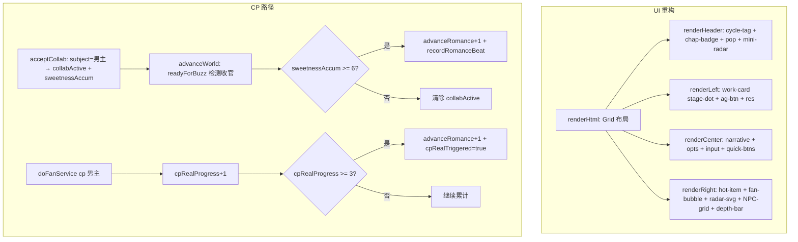

## 用户需求

### 产品概述

在娱乐圈模拟器（ent-sim）模式下，基于 preview HTML 的视觉风格重构 UI 渲染层，同时补全"因合作/营业CP顺其自然和男主在一起"的恋爱发展路径。

### 核心功能

**UI 重构（基于 preview 风格）**

- 将 preview HTML 的静态展示元素全部改为真实数据驱动：作品进度点（stage-dot）、热搜 fire emoji、粉丝气泡分类（topfan/passerby/hater）、NPC 三列网格、恋爱深度条（depth-bar）、mini-radar 雷达
- preview 的底部 4 tabs 去掉（ent-sim 无聊天/朋友圈/剧场）
- 保留现有功能但视觉对齐 preview：快捷指令按钮、危机公关、男主/哥哥/结局入口、合作/掩护/营业弹窗
- 中间剧情区域扩大，视觉更精致

**CP 路径补全**

- 合作企划 sweetness 驱动恋爱深度：接下与男主合作时 sweetness 累计推进 romanceDepth，合作期注入专属剧情引导（排练独处/对手戏心跳/舞台对视等），合作收官结算
- 营业CP 可指向男主（假戏真做→真CP）：选 cp 营业时弹对象选择，与男主累计 3 次后推进恋爱深度；也可指向情敌（烟雾弹）或其他男艺人（低风险）

## 技术栈

- 运行时：JavaScript (ES Modules), Node.js 18+
- 构建工具：Vite 5.4
- 状态管理：GS 全局对象 + saveGame() 持久化
- AI 生成：DeepSeek deepseek-chat 模型，JSON 结构化输出
- 代码风格：var 声明、字符串 + 拼接、浏览器原生 API（Canvas 2D / SVG / CSS 变量）

## 实现方案

### 核心策略

两部分合并执行：先改状态层和逻辑层（CP 路径），再改 UI 渲染层（preview 风格重构），最后改 prompt 和兼容层。

### 关键技术决策

1. **UI 布局从 flex 改为 CSS Grid**：preview 用 `grid-template-columns: 240px 1fr 280px`，当前用 flex。改为 Grid 可让中栏自适应填满剩余空间，解决"中间剧情部分太小"问题。移动端 `grid-template-columns: 1fr` 堆叠。

2. **preview 元素真实数据映射**：

- `stage-dot` → `getWorks()` 返回的 `w.stage`（0筹备/1制作/2在播），3 个 dot + 2 条 line，done=已完成、active=当前
- `hot-item fire` → `getDailyBuzz().hotSearch` 数组索引，前 3 条给不同数量 emoji
- `hot-item.me` → 热搜含女主名（已用 `{name}` 填充）即标记 me + pulse 动画
- `fan-bubble 分类` → `getDailyBuzz().fanDiscussion` 文本关键词判定（"美/状态/绝/配"→topfan，"翻车/无语/买"→hater，其余→passerby）
- `media tag` → `mediaTitle` + `getOpinionTier().tier` 作为定调
- `radar svg` → `getOpinionForRadar()` 返回 `[{key,label,value}]`，4 轴（粉丝/媒体/专业/黑粉），用 SVG polygon 绘制
- `NPC 3列网格` → `getNpcNodes()`，warn 状态 = stance 为 '盯梢'/'放料'/'回踩'/'黑'/'撤资'/'反对公开'
- `depth-bar` → `romanceDepth()` 0-5，on 格数 = depth
- `depth-label` → `ROMANCE_DEPTH_LABELS[depth].label` + `getRomanceRisk().level`
- `mini-radar` → 头部简化版 `getOpinionForRadar()`，用小 SVG polygon

3. **合作企划甜度驱动**：

- 接下与男主合作时：`E.romance.collabActive = {workId, subject, type, sweetness, sweetnessAccum, startedRound}`，sweetnessAccum += sweetness
- 若 sweetness >= 3 且 depth < 3：`advanceRomance(+1)`（接下时的心动推力）
- 合作收官（作品 stage 到 2）：若 sweetnessAccum >= 6 且 depth < 3：`advanceRomance(+1)` + `recordRomanceBeat`
- 合作对象非男主时：仅曝光累计，保持现状

4. **营业CP对象分流**：

- `doFanService(type, subject)` 增加 subject 参数
- type='cp' 且 subject='男主'：cpRealProgress += 1，达 3 且 depth < 3 时 advanceRomance(+1)，设 cpRealTriggered=true 防重复
- subject='情敌'/无 subject：现状逻辑（rival.intimacy+3）
- subject='其他男艺人'：纯烟雾弹，低风险低舆论
- AI 触发（engine.js:91）不带 subject → 默认走情敌分支

5. **设计 bug 修复**：

- CP 清零后可重复触发 → 改用 `cpRealTriggered: true` 一次性标记，不清零
- 合作收官 depth<3 死区 → 收官限制改为 `depth < 3`（即 depth<=2 才推进到 3），与接下时一致
- engine.js:164 `progressWorks()` 返回值丢弃 → 改为 `var readyForBuzz = progressWorks()`

6. **不新增 AI 输出字段**：合作期剧情引导通过 prompt 快照注入 + 现有 `romanceBeat` 字段实现

### 性能考量

- advanceWorld 每回合执行，新增合作收官检查为 O(n)（n=readyForBuzz 数组长度，通常 0-1），无额外遍历
- prompt 快照新增内容 < 100 字，不影响 token 消耗
- UI 渲染从条形图改为 SVG 雷达，SVG polygon 计算量极小（4 个顶点）

### 性能与日志

- 复用现有 `saveGame()` + `careerHistory.push()` 模式记录合作/CP 事件
- 合作收官时 `showToast` 提示玩家"合作收官，渐生情愫"
- 营业CP 假戏真做触发时 `showToast` 提示"假戏真做，营业CP转真"

### 爆炸半径控制

- 不改动换乘恋爱与 1v1 模式代码
- 不改动女主日程池（ENT_SIM_AGENDA_POOLS 已存在且完善）
- 不新建 UI 组件文件，重写 ui.js 的 render 函数 + 在 style.css 增/改 ent-sim 段落
- 旧存档通过 migrateSave + defaultGameState 兜底新字段

## 架构设计



## 目录结构

```
src/ent-sim/
├── data.js          # [MODIFY] FAN_SERVICE_TYPES.cp 增加 subjectOptions + realCpPotential 字段
├── collab.js        # [MODIFY] acceptCollab 增加与男主合作的甜度记录 + collabActive 设置；import advanceRomance
├── fan-service.js   # [MODIFY] doFanService 增加 subject 参数，cp 分流（男主/情敌/其他）；import advanceRomance
├── romance.js       # [MODIFY] 新增 applyCollabSweetness / applyCpRealProgress 辅助函数
├── state.js         # [MODIFY] initEntSimState 增加 collabActive/cpRealProgress/cpRealTriggered 初始化
├── engine.js        # [MODIFY] advanceWorld 捕获 readyForBuzz 检测合作收官；applySideEffects 兼容 cp subject
├── prompts.js       # [MODIFY] 快照注入合作期/营业CP转真进度 + 专属剧情引导
└── ui.js            # [MODIFY] 全面重写 render 函数对齐 preview 风格；onFanService 选 cp 弹对象选择；onCollab 显示合作期提示
src/
├── state.js         # [MODIFY] defaultGameState E.romance 增 collabActive/cpRealProgress/cpRealTriggered 字段
└── style.css        # [MODIFY] 重写 ent-sim 段落（2201-2347）：Grid 布局 + preview 视觉元素样式
```

### 文件改动详情

**src/ent-sim/data.js** [MODIFY]

- `FAN_SERVICE_TYPES.cp` 增加 `subjectOptions: ['男主', '情敌', '其他男艺人']` 和 `realCpPotential: true`
- 用途：让 UI 知道 cp 营业需要弹对象选择，且与男主搭档有假戏真做潜力

**src/ent-sim/state.js** [MODIFY]

- `initEntSimState` 的 `E.romance` 对象增加 `collabActive: null, cpRealProgress: 0, cpRealTriggered: false`
- 用途：初始化新字段，防止运行时 undefined 崩溃

**src/ent-sim/collab.js** [MODIFY]

- `acceptCollab` 增加：subject==='男主' 时设置 `E.romance.collabActive = {workId: id, subject, type: proposal.type, sweetness: proposal.sweetness, sweetnessAccum: proposal.sweetness, startedRound: E.cycle.roundTotal}`，若 sweetness>=3 且 depth<3 调用 `advanceRomance(+1)`
- import `advanceRomance` from `./romance.js`
- 用途：合作企划甜度驱动恋爱深度

**src/ent-sim/romance.js** [MODIFY]

- 新增 `applyCollabSweetness(sweetness, isFinale)` 辅助函数：封装甜度→深度推进逻辑，接下时 isFinale=false，收官时 isFinale=true
- 新增 `applyCpRealProgress()` 辅助函数：cpRealProgress+1，达 3 且 !cpRealTriggered 且 depth<3 时 advanceRomance(+1) + 设 cpRealTriggered=true
- 用途：集中恋爱推进逻辑，供 collab.js 和 fan-service.js 调用

**src/ent-sim/fan-service.js** [MODIFY]

- `doFanService(type, subject)` 增加 subject 参数
- type='cp' 且 subject='男主'：正常舆论影响 + `applyCpRealProgress()` + 曝光累计 risk*1.5
- subject='情敌'/无 subject：现状逻辑（rival.intimacy+3）
- subject='其他男艺人'：纯烟雾弹，舆论影响减半
- import `applyCpRealProgress` from `./romance.js`
- 用途：营业CP可指向男主（假戏真做）

**src/ent-sim/engine.js** [MODIFY]

- `advanceWorld`：`var readyForBuzz = progressWorks()`（修复返回值丢弃 bug），检测 `E.romance.collabActive` 是否在 readyForBuzz 中，是则结算合作收官
- `applySideEffects`：`doFanService(extras.fanServiceNote.type)` 不变（AI 触发默认无 subject → 走情敌分支）
- import `applyCollabSweetness` from `./romance.js`
- 用途：合作期推进与收官结算

**src/ent-sim/prompts.js** [MODIFY]

- `buildEntSimContextSnapshot`：若 `E.romance.collabActive` 存在，注入"当前与男主合作期（第X回合，类型：Y，甜度累积：Z）" + 按 type 派生剧情引导词
- 若 `cpRealProgress > 0`，注入"与男主营业CP假戏真做进度：X/3"
- 用途：让 AI 知道合作期状态，自然写出合作期渐生情愫的剧情

**src/ent-sim/ui.js** [MODIFY]

- `renderHtml`：外层从 `es-body` flex 改为 `es-grid` CSS Grid 布局
- `renderHeader`：对齐 preview 的 cycle-tag（pulse 动画）+ chap-badge + pop + mini-radar svg
- `renderLeft`：work-card 用 stage-dot 进度条 + stage-line + work-sub + warn；今日日程用 ag-btn 样式（带 ic/loc/done 状态）；res 星星
- `renderCenter`：narrative 增加 buzz-inline 样式；opts 增加 risk 标签；保留快捷指令
- `renderRight`：hot-item 带 rank + fire emoji + me 高亮；fan-bubble 分类（topfan/passerby/hater）；media 带 tag；radar 用 SVG polygon；NPC 3 列网格 warn 状态；depth-bar 5 格
- `onFanService`：选 cp 时先弹对象选择弹窗（男主/情敌/其他男艺人），选完再执行 doFanService
- `onCollab`：collabActive 已存在时显示"合作进行中"而非弹新提案
- 用途：全面对齐 preview 视觉风格 + CP 路径的 UI 交互

**src/state.js** [MODIFY]

- `defaultGameState` 的 `entSim.romance` 增加 `collabActive: null, cpRealProgress: 0, cpRealTriggered: false`
- 用途：定义默认值，migrateSave 的 defState 兜底循环（712 行）会自动补齐旧存档

**src/style.css** [MODIFY]

- 重写 2201-2347 段落：
- `.es-body` → `.es-grid`（`display: grid; grid-template-columns: 240px 1fr 280px`）
- 新增 `.es-work-card / .es-stage-dot / .es-stage-line / .es-work-sub / .es-warn`
- 新增 `.es-ag-btn / .es-ag-btn .ic / .es-ag-btn .loc / .es-ag-btn.done`
- 新增 `.es-res`（星星样式）
- 新增 `.es-hot / .es-hot-item / .es-hot-rank / .es-hot-fire / .es-hot-item.me`
- 新增 `.es-fan / .es-fan-bubble / .es-fan-bubble.topfan / .es-fan-bubble.passerby / .es-fan-bubble.hater`
- 新增 `.es-media / .es-media .tag`
- 新增 `.es-radar-wrap / .es-legend`
- 新增 `.es-npc-grid / .es-npc-node / .es-npc-node.warn / .es-npc-avatar`
- 新增 `.es-depth / .es-depth-bar / .es-depth-cell / .es-depth-cell.on / .es-depth-label`
- 新增 `.es-mini-radar`
- 新增 `.es-buzz-inline`
- 移动端 `@media(max-width:900px)` 改为 `grid-template-columns: 1fr`
- 用途：preview 视觉效果的 CSS 落地

## 设计风格

采用与 preview HTML 一致的暗色系赛博朋克娱乐圈驾驶舱风格。主色调为深紫黑背景（#1A1626）+ 紫色主色（#7C6FF0/#9D8BFF），搭配玻璃拟态（glassmorphism）面板、blur 背景模糊、pulse 脉冲动画。三栏 CSS Grid 布局（240px / 1fr / 280px），中栏剧情区自适应填满。

### 页面规划

单页面三栏布局，无 tab 切换（ent-sim 为单页面模式）：

**Header（顶部导航栏）**

- 左：cycle-tag（周期相位 + pulse 动画）+ chap-badge（章节徽章）+ pop（人气数值）
- 右：mini-radar（SVG 小雷达）+ 男主/哥哥/结局按钮 + 狗仔/颁奖 badge

**左栏（事业面板）**

- work-card：作品名 + stage-dot 三点进度条（done/active/未开始）+ work-sub 阶段文字 + warn 警告（在播时显示）
- 今日日程：ag-btn 按钮（带 emoji 图标 + 地点 + done 状态）
- res：资源等级星星

**中栏（剧情区，重点扩大）**

- narrative：剧情正文（min-height 220px，buzz-inline 热搜内联标签）
- opts：选项按钮（带 risk 标签 low/mid/high）
- inputbar：自由输入框 + 发送按钮
- quick-btns：5 个快捷指令按钮（拉回主线/随机事件/营业/合作企划/掩护）

**右栏（舆论驾驶舱）**

- hot：热搜列表（带排名 + fire emoji + me 高亮 pulse）
- fan：粉丝讨论气泡（topfan 紫色 / passerby 灰色 / hater 红色，左侧色条）
- media：媒体标题（带定调 tag）
- radar-wrap：SVG 四维雷达图（粉丝/媒体/专业/黑粉）+ legend 图例
- NPC-grid：3 列网格（7 类 NPC，warn 状态红色边框 + pulse）
- depth-bar：恋爱深度 5 格进度条 + depth-label
- 危机公关按钮

**底部（精简）**

- 去掉 preview 的 4 tabs（ent-sim 无聊天/朋友圈/剧场）
- 保留快捷指令在剧情区下方

### 响应式

- 900px 以下三栏堆叠为单列
- 字体/间距/圆角与 preview 一致