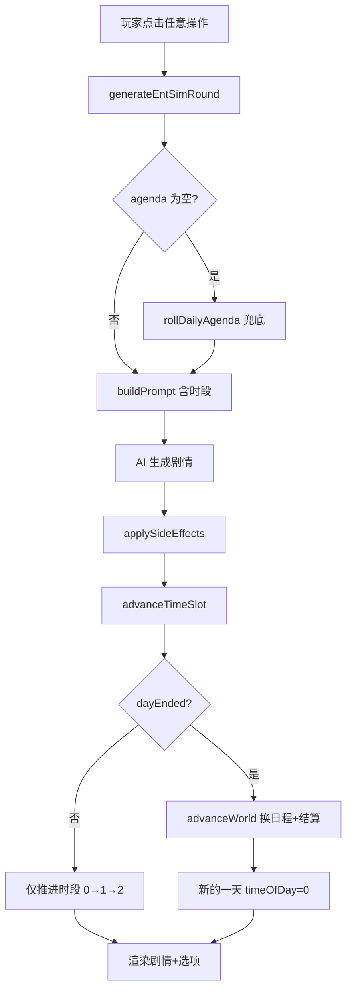

## 用户需求

用户反馈 entSim 娱乐圈模拟器存在日程与剧情不一致的问题：当前点击一次任意操作（选项/日程/自由输入）就会推进一天并更换新日程，导致剧情里写的行程和左栏显示的日程对不上。用户的心智模型是"一天 = 早→午→晚多个时段，点一次选项只推进一个时段，走完一天（到夜晚）才换新日程"。

## 产品概述

将 entSim 的"每次操作 = 换新日程 + 过一天"改为"一天三时段（上午/下午/夜晚）"制：每次生成剧情只推进一个时段，日程在整个白天保持不变，只有走完夜晚时段才换新日程并结算世界状态。

## 核心功能

- 一天分为 3 个时段：上午、下午、夜晚
- 点击选项/日程/自由输入/快捷操作 → 生成当前时段剧情 → 推进到下一时段（不换日程）
- 夜晚时段激活晚档按钮（约会/探班/休息），选择后生成夜晚剧情并结束当天
- 左栏日程在白天保持不变，走完夜晚才抽新日程
- 左栏显示"第X天 · 时段"
- Prompt 注入当前时段，AI 按时段写场景（上午工作/下午社交/夜晚私密）

## 技术栈

- 纯 JavaScript (ES Modules) + Vite，无新依赖
- 复用现有 `cycle.js` / `engine.js` / `prompts.js` / `ui.js` / `state.js` 架构
- 遵循 `var` + 字符串拼接代码风格

## 实现方案

### 核心策略

引入"时段"概念，将 `advanceWorld()`（换日程+推进世界）的调用时机从"每次生成后"改为"仅夜晚时段结束后"：

1. **cycle.js** 新增 `advanceTimeSlot()` — 递增 `timeOfDay`，到夜晚末（slot 2→0）返回 `{ dayEnded: true }`
2. **engine.js** `generateEntSimRound` 中：用 `advanceTimeSlot()` 替换 `advanceWorld()`，仅当 `dayEnded` 时才调 `advanceWorld()`
3. **prompts.js** 注入当前时段 + 天数到状态快照
4. **ui.js** 左栏显示天数时段、晚档按钮仅在夜晚激活、`onEveningChoice` 改为触发剧情生成
5. **state.js** 初始状态和 `migrateSave` 补全新字段

### 数据流

```
玩家点击(上午) → generateEntSimRound → AI生成上午剧情 → advanceTimeSlot → timeOfDay:0→1(下午)
玩家点击(下午) → generateEntSimRound → AI生成下午剧情 → advanceTimeSlot → timeOfDay:1→2(夜晚)
玩家点击夜晚(晚档/选项) → generateEntSimRound → AI生成夜晚剧情 → advanceTimeSlot → timeOfDay:2→0(新天) → advanceWorld(换日程+结算)
```

### 关键技术决策

- **3 时段制**：匹配现有 UI 结构（主档/相关档/晚档），每条约 3 段剧情/天，节奏适中
- **`advanceWorld()` 不拆分**：保持原样，仅改调用时机（仅在 dayEnded 时调），避免侵入 progressWorks/tickCollabRomance/dailyNpcRoll 等副作用
- **`rollDailyAgenda()` 留在 `advanceWorld` 内**：天结束时才换日程，白天日程稳定
- **空日程兜底**：`generateEntSimRound` 开头检查 agenda 是否为空，空则调 `rollDailyAgenda()`（修复首日空日程历史 bug）
- **晚档重置**：`rollDailyAgenda` 末尾加 `E.evening = ''`（清空上一天晚档选择）
- **章节阈值不变**：`roundTotal` 现在按天递增（而非按点击），章节推进节奏自动变慢约 3 倍，属合理范围，后续可调参

### 性能与可靠性

- 无额外 AI 调用开销：每段剧情仍一次 AI 调用，只是推进节奏变了
- `advanceWorld()` 调用频率降低约 3 倍，NPC 滚动/作品推进/狗仔等副作用也更合理
- 旧存档兼容：`migrateSave` 兜底 `timeOfDay: 0` + `dayCount: 1`，旧存档不会崩溃

## 架构设计



## 目录结构

```
src/ent-sim/
├── cycle.js     # [MODIFY] 新增 TIME_SLOTS 常量、getTimeOfDayLabel()、advanceTimeSlot()；rollDailyAgenda 末尾重置 evening
├── engine.js    # [MODIFY] generateEntSimRound 中 advanceWorld→advanceTimeSlot 条件调用；开头空 agenda 兜底
├── prompts.js   # [MODIFY] 状态快照注入"第X天 · 时段"+ 时段写作指引
├── ui.js        # [MODIFY] 左栏显示天数时段；esEveningBtn locked 逻辑改为 timeOfDay!==2；onEveningChoice 触发剧情生成
├── state.js     # [MODIFY] 新增 getTimeOfDayLabel 便捷取值函数
src/
└── state.js     # [MODIFY] defaultGameState entSim.cycle 加 timeOfDay/dayCount；migrateSave 兜底新字段
```

### 文件详细说明

**src/ent-sim/cycle.js** [MODIFY]

- 新增 `var TIME_SLOTS = ['上午', '下午', '夜晚']` 和 `var SLOTS_PER_DAY = 3`
- 新增 `export function getTimeOfDayLabel()` — 返回当前时段中文名
- 新增 `export function advanceTimeSlot()` — 递增 `GS.entSim.cycle.timeOfDay`，到 `SLOTS_PER_DAY` 时归零并返回 `{ dayEnded: true }`，否则返回 `{ dayEnded: false }`
- `rollDailyAgenda()` 末尾加 `E.evening = ''`（重置晚档选择，避免跨天残留）

**src/ent-sim/engine.js** [MODIFY]

- import 新增 `advanceTimeSlot` from `./cycle.js`
- `generateEntSimRound` 开头：`if (!E.agenda || !E.agenda.main) rollDailyAgenda()`（空日程兜底）
- `.then` 回调中：将 `advanceWorld()` 替换为 `var slotRes = advanceTimeSlot(); if (slotRes.dayEnded) advanceWorld();`

**src/ent-sim/prompts.js** [MODIFY]

- import 新增 `getTimeOfDayLabel` from `./state.js`（或直接从 cycle.js）
- 状态快照（约 line 97-115）加 `s += '当前时段：' + getTimeOfDayLabel() + '（第' + (E.cycle.dayCount||1) + '天）\n'`
- 写作指引加时段场景提示：上午偏工作/练习、下午偏社交/营业/互动、夜晚偏私密/放松/约会

**src/ent-sim/ui.js** [MODIFY]

- import 新增 `getTimeOfDayLabel`（从 cycle.js 或 state.js）
- `renderLeft()` 左栏日程区上方加 `📅 第X天 · 时段` 显示
- `esEveningBtn()` line 83：`var locked = (GS.entSim.cycle.timeOfDay || 0) !== 2`（仅夜晚可点）
- `onEveningChoice()` 改为：设 `E.evening` → `triggerEntSimEvent('夜晚·'+描述)` 触发剧情生成 → `.then(rerender)`（不再只 toast 不生成）

**src/ent-sim/state.js** [MODIFY]

- 新增 `export function getTimeOfDayLabel()` 便捷取值（从 cycle.js 转出或直接读取 `GS.entSim.cycle.timeOfDay`）

**src/state.js** [MODIFY]

- `defaultGameState` 中 `entSim.cycle` 加 `timeOfDay: 0, dayCount: 1`
- `migrateSave` entSim 块加：`if (GS.entSim.cycle && GS.entSim.cycle.timeOfDay === undefined) GS.entSim.cycle.timeOfDay = 0;` 和 `dayCount` 同理