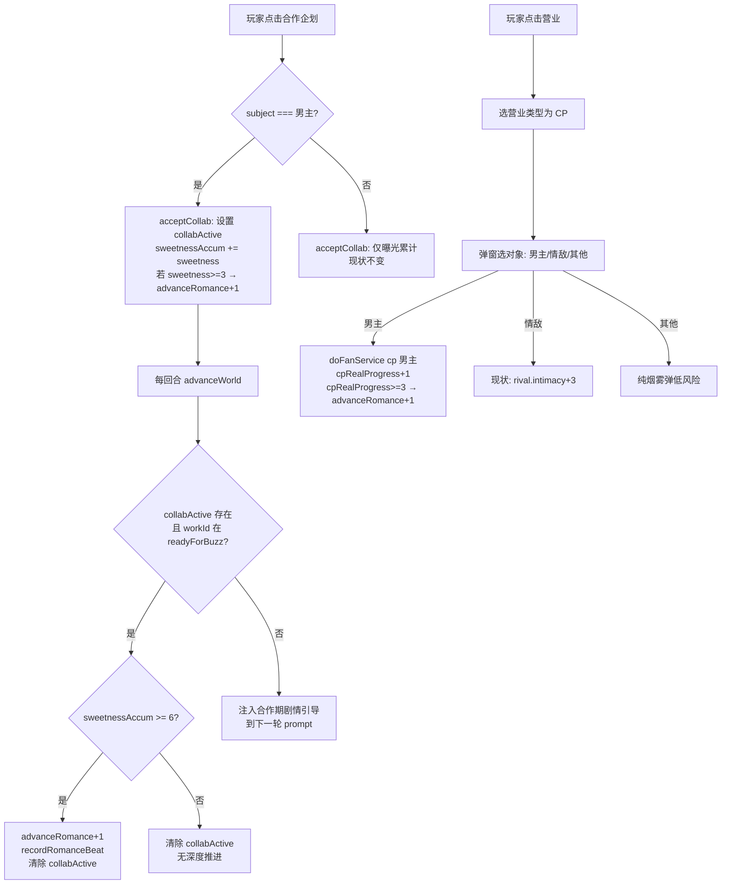

## 需求概述

在娱乐圈模拟器（ent-sim）模式下，补全两条"因工作顺其自然和男主在一起"的恋爱发展路径：

### 路径A：合作企划甜度驱动恋爱深度

- 现状：`COLLAB_TYPES` 定义了 6 型合作（合唱/对手戏/综艺同框/MV/广告/合作舞台），每型有 `sweetness` 字段，但 `acceptCollab` 只用了 `risk`（曝光风险），`sweetness` 完全没落地
- 需求：接下与男主的合作企划时，sweetness 累积驱动 `romanceDepth` 提升；合作期间高频同框触发专属剧情分支（排练独处/对手戏心跳/舞台对视等），让"因合作生情→顺其自然在一起"成为一条独立恋爱发展线
- 合作对象为情敌或哥哥团时，不推进恋爱深度，只产生曝光/舆论效果（保持现状）

### 路径B：营业CP可指向男主（假戏真做→真CP）

- 现状：`FAN_SERVICE_TYPES.cp` 的 `smoke=true` 只给情敌 `intimacy+3`（烟雾弹），不能指向男主
- 需求：营业CP可被公司安排与男主搭档（假戏真做→累计进度→真CP），也可与情敌/其他男艺人搭档（烟雾弹/被拍危机），两种走向都支持
- 与男主营业CP累计 3 次后，触发"假戏真做"进阶恋爱深度

### 约束

- 不新建 UI 组件，复用现有 ent-sim 面板与按钮（在现有弹窗内增加选择步骤）
- 不改动女主日程池（`ENT_SIM_AGENDA_POOLS` 已存在且完善）
- 不改动换乘恋爱与 1v1 模式代码
- 保持 `var` + 字符串拼接风格，不引入新依赖

## 技术栈

- 运行时：JavaScript (ES Modules), Node.js 18+
- 构建工具：Vite 5.4
- 状态管理：`GS` 全局对象 + `saveGame()` 持久化
- AI 生成：DeepSeek `deepseek-chat` 模型，JSON 结构化输出
- 代码风格：`var` 声明、字符串 `+` 拼接、浏览器原生 API

## 实现方案

### 核心策略

两条路径共用一套"累计甜度→自动推进恋爱深度"的机制，但触发源不同：

- **合作企划**：接下时一次性注入 sweetness，合作期每回合注入剧情引导，作品进入在播期（stage=2）时结算累计甜度
- **营业CP**：每次执行 cp 营业时 cpRealProgress+1，累计 3 次触发假戏真做

两者均调用已有的 `advanceRomance(delta)` 推进 `romance.depth`（0-5），复用 `recordRomanceBeat` 记录 beat，不新建恋爱系统。

### 关键技术决策

1. **甜度阈值设计**：合作企划 sweetness 范围 1-4，单次合作最多 +1 深度（接下时），合作期结束时若累计甜度 >=6 再 +1。营业CP 3 次触发 +1。这样一条纯合作线最多 +2 深度（接下+收官），CP 线最多 +1，不会跳过告白前置（depth>=3 才能告白），保持慢热节奏
2. **合作期检测**：利用 `progressWorks()` 返回的 `readyForBuzz` 列表，在 `advanceWorld` 中捕获并匹配 `collabActive.workId`，避免遍历全部作品槽
3. **营业CP对象分流**：`doFanService(type, subject)` 增加可选 `subject` 参数，AI 触发时（无 subject）默认走现状（情敌烟雾弹），玩家触发时通过 UI 弹窗选对象
4. **不新增 AI 输出字段**：合作期剧情引导通过 prompt 快照注入 + `romanceBeat` 现有字段实现，不需要 AI 额外返回新字段

### 性能考量

- `advanceWorld` 每回合执行，新增检查为 O(1)（直接读 `collabActive` 字段 + 从 `readyForBuzz` 数组匹配），无额外遍历
- prompt 快照新增内容 < 100 字，不影响 token 消耗

## 实现细节

### 状态新增（E.romance）

```javascript
collabActive: null,  // {workId, subject, type, sweetness, sweetnessAccum, startedRound} 或 null
cpRealProgress: 0    // 与男主营业CP累计假戏真做进度（0-3）
```

### 合作企划甜度落地（collab.js → acceptCollab）

- subject === '男主' 时：设置 `E.romance.collabActive`，sweetnessAccum += sweetness
- 若 sweetness >= 3 且 depth < 3：`advanceRomance(+1)`（接下时的心动初始推力）
- 记录 careerHistory："接下与男主合作《title》，合作期开始"

### 合作期推进与结算（engine.js → advanceWorld）

- 捕获 `progressWorks()` 返回的 `readyForBuzz`
- 若 `collabActive` 存在且对应 workId 在 `readyForBuzz` 中：合作收官
- `sweetnessAccum >= 6` 且 depth < 3：`advanceRomance(+1)` + `recordRomanceBeat`（note="合作收官，渐生情愫"）
- 清除 `collabActive`
- 记录 careerHistory

### 营业CP对象分流（fan-service.js → doFanService）

- `doFanService(type, subject)`：subject 可选参数
- type === 'cp' 且 subject === '男主'：
- 舆论影响（fan +5, media +4, anti +2，同现状）
- `cpRealProgress += 1`
- `cpRealProgress >= 3` 且 depth < 3：`advanceRomance(+1)` + 清零 + careerHistory "假戏真做，营业CP转真"
- 曝光累计比情敌线更高（risk * 1.5）
- subject === '情敌' 或无 subject：现状逻辑（rival.intimacy +3）
- subject === '其他男艺人'：纯烟雾弹，低风险低舆论

### Prompt 注入（prompts.js）

- `buildEntSimContextSnapshot`：若 `collabActive` 存在，注入"当前与男主合作期（第X回合，类型：Y，甜度累积：Z）"
- 若 `cpRealProgress > 0`，注入"与男主营业CP假戏真做进度：X/3"
- 按 collabActive.type 派生剧情引导词（drama→对手戏心跳、stage→舞台对视、mv→亲密镜头、song→合唱录音独处等）

### 旧存档兼容（state.js migrateSave）

- `E.romance.collabActive === undefined` → `null`
- `E.romance.cpRealProgress === undefined` → `0`

## 目录结构

```
src/ent-sim/
├── data.js          # [MODIFY] FAN_SERVICE_TYPES.cp 增加 subjectOptions + realCpPotential 字段
├── collab.js        # [MODIFY] acceptCollab 增加与男主合作的甜度记录 + collabActive 设置
├── fan-service.js   # [MODIFY] doFanance 增加 subject 参数，cp 分流（男主/情敌/其他）
├── romance.js       # [MODIFY] 新增 applyCollabSweetness / applyCpRealProgress 辅助函数
├── state.js         # [MODIFY] initEntSimState 增加 collabActive/cpRealProgress 初始化
├── engine.js        # [MODIFY] advanceWorld 捕获 readyForBuzz 检测合作收官；applySideEffects 兼容 cp subject
├── prompts.js       # [MODIFY] 快照注入合作期/营业CP转真进度 + 专属剧情引导
└── ui.js            # [MODIFY] onFanService 选 cp 时弹对象选择；onCollab 显示合作期提示
src/
└── state.js         # [MODIFY] defaultGameState E.romance 增字段 + migrateSave 兜底
```

## 架构设计

