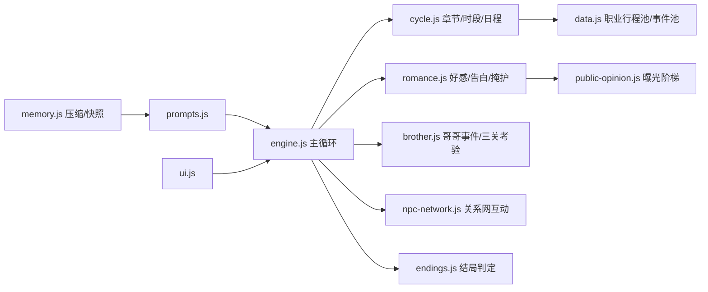

## 产品概述

依据《娱乐圈模拟器使用手册》对 `src/ent-sim/` 模块进行审计与修复，使当前代码真正实现手册中描述的娱乐圈地下恋模拟器。目标是让玩法逻辑、数值系统、事件池、UI 表达与手册一致，消除误导玩家的 P0 缺陷，补齐 P1 缺失功能。

## 核心修复范围

- P0 严重 bug：哥哥名字 undefined、NPC 互动次数失效、情敌隐藏结局无法触发、结局深度映射错误、走向结局无条件触发、拖延告白哥哥谈话未消费等。
- P1 缺失功能：章节推进、每日自动事件池 `checkOneHeartEvents`、女团专属行程与事件池、5 种掩护 UI、风险预估按钮、选择标签、哥哥递进考验、聊天上下文与"正在输入"动画、右栏恋情面板、媒体标题、曝光档位可视化。
- P2 体验与数据对齐：人气层级文案、快捷指令"自由推演"、行程条哥哥档、男主小动作池、聊天记录上限、死代码清理。

## Tech Stack Selection

- 保持项目现有栈：JavaScript (ES Modules)、Vanilla JS + Vite。
- 遵循项目约定：`var` 优先、字符串拼接用 `+`、不引入新依赖、DOM 文本全部 `escHtml()` 转义。
- 不新建后端，数据仍存 `localStorage`，新增字段通过 `migrateSave()` 兜底。

## Implementation Approach

- **最小侵入修复**：优先在现有函数与状态字段上打补丁，不重构 `ent-sim` 整体架构；所有新增字段必须在 `src/ent-sim/state.js` 与 `src/state.js` 的 `migrateSave` 中初始化。
- **数据驱动事件池**：在 `data.js` 中新增职业分支事件池与女团专属行程池，引擎通过概率与条件触发，保持 AI prompt 注入轻量。
- **UI 增量补全**：`ui.js` 中新增/复用现有 modal 与按钮，不引入新页面路由。
- **Prompt 与状态同步**：所有新 flag（如 `acceptedRival`、`talkPending`）必须在 `prompts.js` 的状态快照与事件注入中消费，避免状态孤岛。
- **可靠性**：新增函数添加空值守卫；重试与失败兜底沿用现有 `generateWithRetry` 与 `safeParseJson` 模式。

## Implementation Notes

- **性能**：`checkOneHeartEvents` 只在换天触发一次，避免每轮打 API；事件注入走 `_entSimPendingEvent` 已有链路，不重写。
- **日志**：人气/曝光/哥哥支持度变动继续写入 `careerHistory`，保持可追溯。
- **向后兼容**：旧存档通过 `migrateSave` 补全新字段；`chapter.index` 等已有字段继续复用。
- **Blast radius**：不改动换乘恋爱/1v1 模式代码；所有入口加 `if (GS.gameMode === 'entertainment')` 或复用 `ent-sim` 内部状态判断。

## Architecture Design



## Directory Structure

```
src/ent-sim/
├── state.js        # [MODIFY] 补 E.brother.name、男主 mannerisms、章节推进字段、迁移兜底
├── data.js         # [MODIFY] 新增女团行程池/行业事件池/职业分支事件池；清理死代码
├── engine.js       # [MODIFY] 修复聊天上下文、约会/告白副作用、走向结局条件消费
├── romance.js      # [MODIFY] 修复告白结果数值、掩护上限、风险预估接口
├── brother.js      # [MODIFY] 实现三关递进考验、talkPending 消费、哥哥被情敌牵动
├── npc-network.js  # [MODIFY] 修复 npcInteractionUsed 计数、情敌/男主情敌退出 flag
├── endings.js      # [MODIFY] 修复 depth 映射、acceptedRival 触发、结局条件校验
├── prompts.js      # [MODIFY] 注入章节/事件/掩护/哥哥谈话/小动作/职业规则
├── ui.js           # [MODIFY] 补 Header 章节名、右栏恋情面板/媒体标题、掩护按钮、风险预估按钮、选择标签、聊天动画
├── cycle.js        # [MODIFY] 按职业抽取日程、章节推进、哥哥档行程
├── immersion.js    # [MODIFY] 媒体标题显示修复
└── parser.js       # [MODIFY] 支持新增 extras 字段（cover/brotherTalk/acceptedRival 等）
```

## Agent Extensions

### SubAgent

- **code-explorer**
- Purpose: 在修复过程中跨文件搜索相关调用点与状态字段，验证新增字段是否被正确消费、死代码是否可安全清理。
- Expected outcome: 输出每个修复点涉及的精确文件/函数/行号引用清单，避免遗漏与循环依赖。