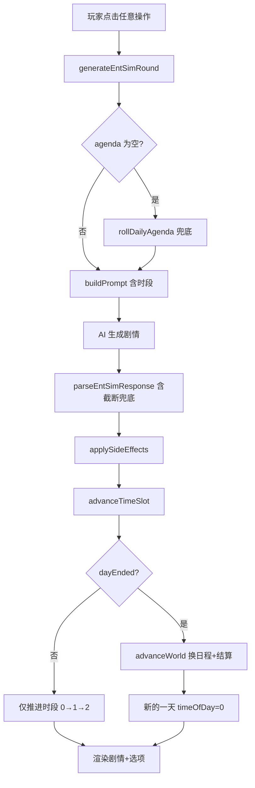

## 用户需求

用户反馈两个问题：

1. **日程与剧情不一致**：当前 entSim 娱乐圈模拟器中，点击一次任意操作（选项/日程/自由输入）就会推进一天并更换新日程，导致剧情里写的行程和左栏显示的日程对不上。用户期望"一天 = 早→午→晚多个时段，点一次选项只推进一个时段，走完一天（到夜晚）才换新日程"。

2. **JSON 截断导致剧情丢失**：点选项后控制台报"正文过短(0字) + 缺少 options"，但 rawText 里明明有约 600 字的完整 narrative。根因是 maxTokens 不足导致 AI 返回的 JSON 在 options 数组中间被截断，`extractBalancedObject` 找不到闭合括号返回 null，整个 JSON 解析失败，narrative 也提取不出来。重试后 AI 生成不同剧情，导致"剧情里却是另一个剧情"。

## 产品概述

将 entSim 的时间模型从"每次操作 = 换新日程 + 过一天"重构为"一天三时段（上午/下午/夜晚）"制：每次生成剧情只推进一个时段，日程在整个白天保持不变，只有走完夜晚时段才换新日程并结算世界状态。同时修复 JSON 截断导致的解析失败问题。

## 核心功能

- 一天分为 3 个时段：上午、下午、夜晚
- 点击选项/日程/自由输入/快捷操作 → 生成当前时段剧情 → 推进到下一时段（不换日程）
- 夜晚时段激活晚档按钮（约会/探班/休息），选择后生成夜晚剧情并结束当天
- 左栏日程在白天保持不变，走完夜晚才抽新日程
- 左栏显示"第X天 · 时段"
- Prompt 注入当前时段，AI 按时段写场景（上午工作/下午社交/夜晚私密）
- JSON 截断兜底：即使 AI 返回被截断，也能提取出已完成的 narrative 字段
- 提高 maxTokens 避免截断

## 技术栈

- 纯 JavaScript (ES Modules) + Vite，无新依赖
- 复用现有 `cycle.js` / `engine.js` / `prompts.js` / `ui.js` / `state.js` / `parser.js` 架构
- 遵循 `var` + 字符串拼接代码风格

## 实现方案

### 核心策略

**两个问题合并解决**，截断修复为前置（否则时段重构后点选项照样报错）：

**Part A：JSON 截断修复（前置）**

1. `src/parser.js` `safeParseJson` 增加截断兜底分支：当 `extractBalancedObject` 返回 null（找不到闭合括号）时，尝试从首个 `{` 到 rawText 末尾截取，用 `repairJson` 补全缺失的闭合括号后解析。`repairJson` 已有 `bracketStack` 补全逻辑（parser.js:112-127），但只在 `extractBalancedObject` 成功提取后才会走到。问题在于 `extractBalancedObject` 遇到截断直接返回 null，`repairJson` 的 bracketStack 补全逻辑根本没机会执行。
2. `src/ent-sim/engine.js:43` maxTokens 2200 → 3200，给 600-800 字 narrative + options + entSimExtras JSON 留足余量。

**Part B：一天多时段时间模型重构**

1. `cycle.js` 新增 `TIME_SLOTS` 常量 + `getTimeOfDayLabel()` + `advanceTimeSlot()`
2. `engine.js` 用 `advanceTimeSlot()` 替换无条件 `advanceWorld()`，仅当 dayEnded 时才 `advanceWorld()`
3. `prompts.js` 注入当前时段 + 天数 + 时段写作指引
4. `ui.js` 左栏显示天数时段、晚档按钮按时段锁定、`onEveningChoice` 触发剧情生成
5. `state.js` 初始状态 + `migrateSave` 补全新字段

### 数据流

```
玩家点击(上午) → generateEntSimRound → AI生成上午剧情 → advanceTimeSlot → timeOfDay:0→1(下午) → 不换日程
玩家点击(下午) → generateEntSimRound → AI生成下午剧情 → advanceTimeSlot → timeOfDay:1→2(夜晚) → 不换日程
玩家选晚档/点选项(夜晚) → generateEntSimRound → AI生成夜晚剧情 → advanceTimeSlot → timeOfDay:2→0(新天) → advanceWorld(换日程+结算)
```

### 关键技术决策

- **3 时段制**：匹配现有 UI 结构（主档/相关档/晚档），每条约 3 段剧情/天，节奏适中
- **`advanceWorld()` 不拆分**：保持原样，仅改调用时机（仅在 dayEnded 时调），避免侵入 progressWorks/tickCollabRomance/dailyNpcRoll 等副作用
- **`rollDailyAgenda()` 留在 `advanceWorld` 内**：天结束时才换日程，白天日程稳定
- **空日程兜底**：`generateEntSimRound` 开头检查 agenda 是否为空，空则调 `rollDailyAgenda()`（修复首日空日程历史 bug）
- **晚档重置**：`rollDailyAgenda` 末尾加 `E.evening = ''`（清空上一天晚档选择）
- **截断兜底不改动 `extractBalancedObject`**：在 `safeParseJson` 中增加截断分支，不影响现有平衡括号提取逻辑
- **章节阈值不变**：`roundTotal` 现在按天递增（而非按点击），章节推进节奏自动变慢约 3 倍，属合理范围

### 性能与可靠性

- 无额外 AI 调用开销：每段剧情仍一次 AI 调用，只是推进节奏变了
- `advanceWorld()` 调用频率降低约 3 倍，NPC 滚动/作品推进/狗仔等副作用也更合理
- 截断兜底确保即使 maxTokens 不足也不会完全丢失 narrative，减少重试次数
- 旧存档兼容：`migrateSave` 兜底 `timeOfDay: 0` + `dayCount: 1`，旧存档不会崩溃

## 实现注意事项

- **repairJson 的 bracketStack 补全逻辑已存在**（parser.js:104-127），截断兜底只需让它能被触发：在 `safeParseJson` 中 `extractBalancedObject` 返回 null 时，直接将 rawText 传给 `repairJson`
- **maxTokens 提高到 3200**：600-800 字中文约 1000-1300 token，options 约 200-300 token，entSimExtras JSON 约 400-500 token，总计约 1700-2100 token，3200 充裕且不浪费
- **晚档 `onEveningChoice` 改为触发剧情**：当前只设状态 + toast，不生成剧情。改为调 `triggerEntSimEvent` 生成夜晚剧情，利用 `advanceTimeSlot` 的 dayEnded 逻辑自然结束当天
- **`esEveningBtn` 锁定逻辑**：当前 `locked = chosen && chosen !== kind`（已选其它项则锁定），改为 `locked = (timeOfDay !== 2) || (chosen && chosen !== kind)`（非夜晚时段也锁定）

## 架构设计



## 目录结构

```
src/
├── parser.js              # [MODIFY] safeParseJson 增加截断兜底分支
└── ent-sim/
    ├── cycle.js           # [MODIFY] 新增 TIME_SLOTS 常量、getTimeOfDayLabel()、advanceTimeSlot()；rollDailyAgenda 末尾重置 evening
    ├── engine.js          # [MODIFY] maxTokens 2200→3200；advanceWorld→advanceTimeSlot 条件调用；开头空 agenda 兜底
    ├── prompts.js         # [MODIFY] 状态快照注入"第X天·时段"+ 时段写作指引
    ├── ui.js              # [MODIFY] 左栏显示天数时段；esEveningBtn locked 按时段；onEveningChoice 触发剧情生成
    └── state.js           # [MODIFY] 新增 getTimeOfDayLabel 便捷取值函数
src/
└── state.js               # [MODIFY] defaultGameState entSim.cycle 加 timeOfDay/dayCount；migrateSave 兜底新字段
```

### 文件详细说明

**src/parser.js** [MODIFY]

- `safeParseJson()` (line 72)：在 `extractBalancedObject` 返回 null 时，增加截断兜底分支：直接对 rawText 调用 `repairJson`（其 bracketStack 逻辑会补全缺失的闭合括号），再尝试 `JSON.parse`。当前代码 `extractBalancedObject` 返回 null 后直接走 line 82 `repairJson(s)` —— 但 line 82 的 `s` 是整个 rawText，`repairJson` 的 `firstBrace`/`lastBrace` 逻辑（line 90-93）在找不到 `lastBrace` 时不会截取，导致 `bracketStack` 补全逻辑虽然存在但 `s` 仍是整个 rawText。需要在 line 82 之前增加一个分支：当找不到 `lastBrace` 时，将 `s` 截取为从 `firstBrace` 到末尾，再走 `repairJson` 的 bracketStack 补全。

**src/ent-sim/cycle.js** [MODIFY]

- 新增 `var TIME_SLOTS = ['上午', '下午', '夜晚']` 和 `var SLOTS_PER_DAY = 3`
- 新增 `export function getTimeOfDayLabel()` — 返回当前时段中文名
- 新增 `export function advanceTimeSlot()` — 递增 `GS.entSim.cycle.timeOfDay`，到 `SLOTS_PER_DAY` 时归零并返回 `{ dayEnded: true }`，否则返回 `{ dayEnded: false }`
- `rollDailyAgenda()` 末尾加 `E.evening = ''`（重置晚档选择，避免跨天残留）

**src/ent-sim/engine.js** [MODIFY]

- import 新增 `advanceTimeSlot` from `./cycle.js`
- line 43：`maxTokens: 2200` → `maxTokens: 3200`
- `generateEntSimRound` 开头：`if (!E.agenda || !E.agenda.main) rollDailyAgenda()`（空日程兜底）
- `.then` 回调 (line 51)：将 `advanceWorld()` 替换为 `var slotRes = advanceTimeSlot(); if (slotRes.dayEnded) advanceWorld();`

**src/ent-sim/prompts.js** [MODIFY]

- import 新增 `getTimeOfDayLabel` from `./cycle.js`
- 状态快照 (line 97-115)：在章节行后加 `s += '当前时段：' + getTimeOfDayLabel() + '（第' + (E.cycle.dayCount||1) + '天）\n'`
- 写作指引 (line 33)：加时段场景提示：上午偏工作/练习、下午偏社交/营业/互动、夜晚偏私密/放松/约会

**src/ent-sim/ui.js** [MODIFY]

- import 新增 `getTimeOfDayLabel` from `./cycle.js`
- `renderLeft()` (line 106)：今日日程上方加 `📅 第X天 · 时段` 显示
- `esEveningBtn()` (line 81-84)：`locked` 改为 `(GS.entSim.cycle.timeOfDay || 0) !== 2 || (chosen && chosen !== kind)`（仅夜晚可点）
- `onEveningChoice()` (line 640-651)：改为设 `E.evening` 后调 `triggerEntSimEvent('夜晚·'+描述)` 触发剧情生成，`.then(rerender)`（不再只 toast 不生成）

**src/ent-sim/state.js** [MODIFY]

- 新增 `export function getTimeOfDayLabel()` 便捷取值（从 cycle 转出或直接读取 `GS.entSim.cycle.timeOfDay`）

**src/state.js** [MODIFY]

- `defaultGameState` (line 132)：`entSim.cycle` 加 `timeOfDay: 0, dayCount: 1`
- `migrateSave` (line 432-440)：entSim 块加 `if (GS.entSim.cycle && GS.entSim.cycle.timeOfDay === undefined) GS.entSim.cycle.timeOfDay = 0;` 和 `dayCount` 同理