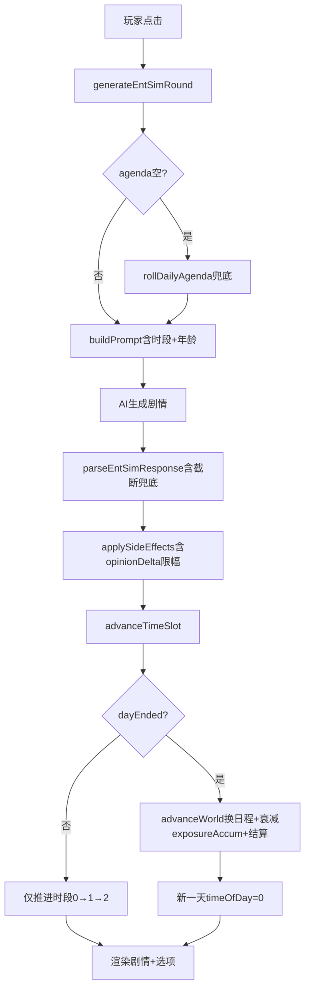

## 用户需求

用户反馈 entSim 娱乐圈模拟器存在以下问题，需全部修复：

### 数值系统问题

- 地下恋风险数值飙升过快，几段剧情就爆表
- 人气值只降不升（50→12→0），无任何正面回升途径

### 剧情与称呼问题

- 剧情跳跃错乱（练习室场景突然跳到酒会），场景缺乏连续性
- 称呼错误：玩家设置19岁，情敌却喊"姐姐"，AI不知道女主年龄

### UI问题

- 右侧雷达图标签被裁剪看不到文字
- 营业点击后只显示"营业完成"，无剧情生成，无实际反馈

### 时间模型问题

- 点击一次选项就推进一天换日程，日程与剧情对不上
- 应改为一天多时段（早→午→晚），点一次只推进一个时段

### 解析问题

- AI返回JSON被maxTokens截断，导致解析失败、正文判定为0字、重试覆盖剧情

## 产品概述

修复entSim的数值平衡、剧情连续性、UI渲染、时间推进模型和JSON解析五大类bug，使模拟器运行稳定、数值合理、剧情连贯、时间推进自然。

## 核心功能

- 风险值有衰减机制，不再单段剧情就爆表
- 人气有多途径回升（营业/作品/颁奖/合作），不会单调归零
- AI知道女主年龄，按年龄差正确称呼
- 剧情有场景连续性约束，不无故跳转
- 雷达标签完整可见
- 营业后生成剧情描述，有实质反馈
- 一天三时段制，日程当天稳定
- JSON截断时仍能提取narrative

## Tech Stack

- 纯 JavaScript (ES Modules) + Vite，无新依赖
- 复用现有 ent-sim 模块架构（cycle.js / engine.js / prompts.js / ui.js / state.js / parser.js / romance.js / public-opinion.js / fan-service.js / works.js / awards.js）
- 遵循 `var` + 字符串拼接代码风格

## Implementation Approach

### 整体策略：8个bug按优先级分6批修复

**P0 数值平衡** — 风险飙升 + 人气归零是最影响体验的问题，优先修复。
**P1 解析截断** — 不修复则后续所有改动都无法验证（点选项照样报错）。
**P2 Prompt注入** — 年龄/称呼/场景连续性。
**P3 UI修复** — 雷达溢出 + 营业无剧情。
**P4 时间模型** — 一天三时段重构，改动面最大放最后。

### 关键技术决策

**① 风险衰减（romance.js）**

- `assessRomanceRisk` 公式调整：base 从 `media*0.3+anti*0.5` 降到 `media*0.2+anti*0.3`，降低舆论对风险的敏感度
- `exposureAccum` 每回合衰减 ×0.85（放 `advanceWorld` 末尾），防止无限累积
- 单次 opinionDelta 限幅 ±8（在 `applyOpinionImpact` 中 clamp），防止AI给极端值

**② 人气回升（多模块）**

- `addPopularity` 现有但仅被 `applyDiscoveryBlowback` 调用（只减）。在以下处新增正向调用：
- `fan-service.js doFanService`：营业成功 +2~4
- `works.js progressWorks`：作品在播每回合 +1
- `awards.js`：颁奖 +8
- `romance.js tickCollabRomance`：合作收官 +5
- 所有正增量都经过 `addPopularity` 的 clamp(0,100)

**③ 年龄与称呼注入（prompts.js）**

- `buildEntSimUserMessage` 状态快照注入：`女主年龄：XX岁`
- system prompt 加称呼规则：比女主年长→姐/哥，年幼→妹/弟，同龄→直呼名
- 加场景连续性约束：延续当前日程场景，除非时间推进否则勿无故跳转

**④ 雷达溢出（ui.js radarSvg）**

- `R = size/2 - 14` → `R = size/2 - 26`，`off = 16` → `off = 10`
- 确保 `R + off (61+10=71) ≤ size/2 (75)`，标签不再溢出 viewBox

**⑤ 营业生成剧情（ui.js onFanService）**

- `doFanService` 后调 `triggerEntSimEvent('营业·'+label)` 生成剧情
- `.then(rerender)` 刷新界面

**⑥ JSON截断兜底（parser.js + engine.js）**

- `engine.js:43` maxTokens 2200→3200
- `parser.js safeParseJson`：`extractBalancedObject` 返回 null 时，截取首 `{` 到末尾，直接 `repairJson`（bracketStack 补全闭合括号）后 `JSON.parse`

**⑦ 一天三时段（cycle.js + engine.js + prompts.js + ui.js + state.js）**

- `cycle.js` 新增 `TIME_SLOTS=['上午','下午','夜晚']`、`getTimeOfDayLabel()`、`advanceTimeSlot()`
- `engine.js` 用 `advanceTimeSlot()` 替换无条件 `advanceWorld()`，仅 dayEnded 时调
- `prompts.js` 注入"第X天·时段" + 时段写作指引
- `ui.js` 左栏显示天数时段、晚档按钮按时段锁定、`onEveningChoice` 触发剧情
- `state.js` 初始状态 + `migrateSave` 补全 `timeOfDay/dayCount`

### 性能与可靠性

- opinionDelta 限幅 ±8 防止AI单次给极端值导致数值跳变（50→12→0）
- exposureAccum 衰减 ×0.85 确保风险有升有降，不会单调累积爆表
- 人气回升途径分散在多个模块，每条增量小（+1~8），不会出现人气暴涨
- 截断兜底确保即使 maxTokens 不足也能提取已完成的 narrative，减少重试覆盖
- advanceWorld 调用频率降低约3倍（时段制），NPC/作品/狗仔等副作用节奏更合理
- 旧存档兼容：migrateSave 兜底 timeOfDay:0 + dayCount:1

### 避免技术债

- 复用现有 `addPopularity` / `applyOpinionImpact` / `triggerEntSimEvent` 函数，不新建
- `advanceWorld()` 不拆分，仅改调用时机，避免侵入 progressWorks/tickCollabRomance/dailyNpcRoll 等副作用
- opinionDelta 限幅在 `applyOpinionImpact` 统一入口做，所有调用方自动受益

## Architecture Design



## Directory Structure

```
src/
├── parser.js                    # [MODIFY] safeParseJson 增加截断兜底：extractBalancedObject返回null时直接repairJson补全
└── ent-sim/
    ├── cycle.js                 # [MODIFY] 新增TIME_SLOTS/getTimeOfDayLabel/advanceTimeSlot；rollDailyAgenda末尾重置evening
    ├── engine.js                # [MODIFY] maxTokens→3200；advanceWorld→advanceTimeSlot条件调用；空agenda兜底；advanceWorld末尾exposureAccum衰减
    ├── prompts.js               # [MODIFY] 注入年龄+称呼规则+场景连续性约束+时段信息+时段写作指引
    ├── ui.js                    # [MODIFY] radarSvg R/off调整防溢出；onFanService营业后生成剧情；左栏显示天数时段；esEveningBtn按时段锁定；onEveningChoice触发剧情
    ├── state.js                 # [MODIFY] addPopularity已有；recomputeCareerLevel已有
    ├── romance.js               # [MODIFY] assessRomanceRisk降低base敏感度
    ├── public-opinion.js        # [MODIFY] applyOpinionImpact加opinionDelta单次clamp±8
    ├── fan-service.js           # [MODIFY] doFanService末尾加addPopularity正向回升
    ├── works.js                 # [MODIFY] progressWorks作品在播每回合addPopularity(+1)
    ├── awards.js                # [MODIFY] 颁奖后addPopularity(+8)
    └── cycle.js                 # [MODIFY] rollDailyAgenda末尾重置evening；advanceTimeSlot
src/
└── state.js                    # [MODIFY] defaultGameState cycle加timeOfDay/dayCount；migrateSave兜底新字段
```

### 文件详细说明

**src/parser.js** [MODIFY] — JSON截断兜底

- `safeParseJson()` (line 72)：在 `extractBalancedObject` 返回 null 后、line 82 之前，增加分支：截取首 `{` 到 rawText 末尾，直接调 `repairJson`（其 bracketStack 补全逻辑会补齐缺失的 `]` `}`），再 `JSON.parse`。当前 repairJson 的 firstBrace/lastBrace 逻辑在找不到 lastBrace 时不截取，需改为找不到 lastBrace 时用末尾索引。

**src/ent-sim/romance.js** [MODIFY] — 风险公式降温

- `assessRomanceRisk()` (line 11-25)：base 从 `media*0.3+anti*0.5` 改为 `media*0.2+anti*0.3`；exposureAccum 系数从 `*2` 降到 `*1.5`
- 其余逻辑不变

**src/ent-sim/public-opinion.js** [MODIFY] — opinionDelta限幅

- `applyOpinionImpact()` (line 12-27)：每个维度增量 clamp 到 ±8：`deltas[k] = Math.max(-8, Math.min(8, deltas[k]))`
- `applyDiscoveryBlowback()` (line 98-117)：保持不变（曝光反噬是剧情性惩罚，不受限幅）

**src/ent-sim/fan-service.js** [MODIFY] — 营业人气回升

- `doFanService()` (line 12-52)：末尾调 `addPopularity(def.fan > 3 ? 4 : 2)`（高粉丝收益营业+4，普通+2）
- import 新增 `addPopularity` from `./state.js`

**src/ent-sim/works.js** [MODIFY] — 作品在播人气回升

- `progressWorks()` (line 37-64)：作品 stage===2（在播）时每回合 `addPopularity(1)`
- import 新增 `addPopularity` from `./state.js`

**src/ent-sim/awards.js** [MODIFY] — 颁奖人气回升

- 颁奖结果处 (line 48 附近)：`addPopularity(8)`
- import 新增 `addPopularity` from `./state.js`

**src/ent-sim/engine.js** [MODIFY] — 核心修改最多

- import 新增 `advanceTimeSlot` from `./cycle.js`
- line 43：`maxTokens: 2200` → `maxTokens: 3200`
- `generateEntSimRound` 开头：`if (!E.agenda || !E.agenda.main) rollDailyAgenda()`（空日程兜底）
- `.then` 回调 (line 51)：`advanceWorld()` → `var slotRes = advanceTimeSlot(); if (slotRes.dayEnded) advanceWorld();`
- `advanceWorld()` (line 174) 末尾：加 `E.misc.exposureAccum = Math.floor((E.misc.exposureAccum||0) * 0.85)`（风险衰减）

**src/ent-sim/prompts.js** [MODIFY] — Prompt注入

- `buildEntSimSystemPrompt` (line 33附近)：加场景连续性约束 `场景需延续当前日程，除非明确推进时间否则勿无故跳转下一场景`
- system prompt 加称呼规则：`女主年龄XX岁，比女主年长者称姐/哥，年幼者称妹/弟，同龄直呼名`
- `buildEntSimUserMessage` (line 97-115)：加 `s += '女主年龄：' + (hp.age||20) + '岁\n'`；加 `s += '当前时段：' + getTimeOfDayLabel() + '（第' + (E.cycle.dayCount||1) + '天）\n'`
- 加时段写作指引：上午偏工作/练习、下午偏社交/营业、夜晚偏私密/放松/约会

**src/ent-sim/ui.js** [MODIFY] — UI修复多处

- `radarSvg()` (line 215-243)：`R = size/2 - 14` → `R = size/2 - 26`；`off = 16` → `off = 10`
- `onFanService()` (line 387-406)：`doFanService` 后调 `triggerEntSimEvent('营业·'+label).then(rerender)`
- `renderLeft()` (line 106)：今日日程上方加 `第X天·时段` 显示
- `esEveningBtn()` (line 81-84)：locked 改为 `(timeOfDay !== 2) || (chosen && chosen !== kind)`
- `onEveningChoice()` (line 640-651)：改为设 `E.evening` 后调 `triggerEntSimEvent('夜晚·'+描述).then(rerender)`

**src/ent-sim/cycle.js** [MODIFY] — 时段基础设施

- 新增 `var TIME_SLOTS = ['上午', '下午', '夜晚']`
- 新增 `export function getTimeOfDayLabel()`
- 新增 `export function advanceTimeSlot()` — 递增 timeOfDay，到3归零返回 `{dayEnded:true}`，否则 `{dayEnded:false}`，dayEnded 时 dayCount++
- `rollDailyAgenda()` 末尾加 `E.evening = ''`

**src/state.js** [MODIFY] — 状态初始化与迁移

- `defaultGameState` entSim.cycle 加 `timeOfDay: 0, dayCount: 1`
- `migrateSave` entSim 块兜底 `timeOfDay` 和 `dayCount`