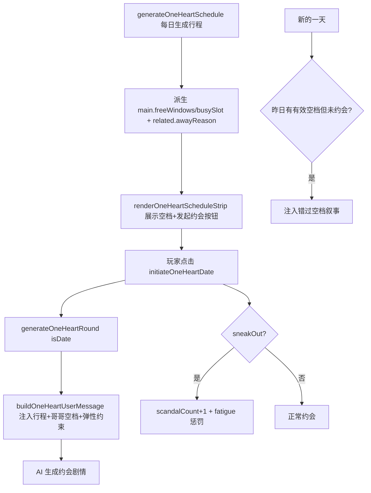

## 用户需求（背景澄清）

在 1v1「只为你心动」模式 → 娱乐圈世界观 → 「队友的妹妹」设定下，当前虽已有每日行程系统（男主/关系户/情敌各一条行程 + 哥哥在家/不在家派生 + 探班时间锁），但存在两个缺口：① 男主行程的 task/place 仅注入「探班」prompt，普通约会/自由剧情并不受行程约束，会出现「约会跟男主工作对不上」的违和；② 哥哥空档未强制约束普通剧情。用户希望在「队友的妹妹」语境下补齐时间/事件约束。

## 产品概述

为娱乐圈 1v1 模式增加「行程约束 + 主动约会」机制：普通约会剧情须遵守男主当日行程与哥哥空档；允许男主「偷偷溜出来/翘班」赴约（贴合地下恋核心张力），但须体现被拍/赶场风险；玩家可在行程条看到男主空档与哥哥是否在家，并主动发起约会；翘班或错过有效空档均有叙事/数值后果。

## 核心功能

### 🅰 时间 / 行程约束

- 行程模型增强：为男主派生「空闲时段 / 在忙时段」，为哥哥暴露「不在家原因」，新增当日是否已约会标记。
- 普通剧情 prompt 约束注入：把男主当日行程、空闲时段、哥哥空档与「弹性约会」指令注入剧情生成与聊天生成，使 AI 写约会时不违背行程、并体现地下恋张力。
- 玩家主动发起约会：行程条新增「发起约会」入口，展示男主空档与哥哥在家/不在家状态，按约束校验后生成约会场景。
- 错过/翘班后果：翘班会推高曝光风险与疲劳值；当日存在有效空档（哥哥不在家 + 男主有空）但玩家未约会，跨天注入「错过空档」叙事后果。

### 🅱 妹妹设定增强（复用现有字段 / 钩子）

- **B1 主动「💬 找哥哥聊聊」**：在 2×3 动作网格（ui-renderer.js:1486）追加按钮（仅 `role==='哥哥'` 显示）→ 轻量选项（报备进展 / 探他对男主看法 / 撒娇让他打掩护）→ 调 `updateBrotherStance(delta,reason)`（game-engine.js:1938）产出专属回应。
- **B2 哥哥门控告白**：`oneHeartRomanceStage` 推到"明确(2)/高潮(3)"前，若 `brotherStance` 仍 `testing`/`protective`，注入哥哥搅局/提醒曝光风险（复用 romanceStage + brotherStance 门控）。
- **B3 妹妹正当接近权·降曝光**：出现在他工作场合解释为"来找哥哥"，`oneHeartScandalCount` 打折（区别于站姐/素人）。
- **B4 哥哥行程临时变更（空档泡汤）**：小概率"临时加录/提前回"→ `brotherAtHome` 中途可变，原定空档消失（与"错过空档"叙事呼应）。
- **B5 哥哥×情敌交叉**：`brotherStance` 与 `oneHeartRivalAff` 联动（哥哥欣赏情敌→不拦妹妹靠近情敌）。
- **B6 哥哥情报源**：行程条/聊天补充男主当天状态（借 `idolFatigue`+`oneHeartSchedule`）。
- **B7 家属局支线**（后置，scope 较大）：哥哥回父母家是否带妹妹同去（轻量见家长）。

## 技术栈

- 沿用现有栈：Vanilla JS（ES Modules）+ Vite，浏览器原生 API，无新依赖。
- 仅作用于 `gameMode === 'oneHeart' && worldSetting === 'entertainment'`，不改动换乘模式与其他世界观。

## 实现方案

### A. 行程模型增强（game-engine.js `generateOneHeartSchedule`）

- 为 `main` 增加派生字段：`busySlot`（其 task 所在 `timeOfDay`）、`freeWindows`（除 busySlot 外、按 `cat` 强度过滤出的可约时段：录音/舞蹈→傍晚/深夜；综艺/拍摄/粉丝/跨界→深夜；行程(海外/品牌公开)→空，即不在首尔）。
- 为 `related`(哥哥) 增加 `awayReason`（其 task 文案，如「录节目」），UI 用于「哥哥今天 XX，不在家」。
- 在 `state.js` 的 `defaultGameState()` 与 `migrateSave()` 兜底新增：`oneHeartDateToday`（当日是否已发起约会）、`oneHeartDateWindowAvailable`（昨日是否存在有效空档，供跨天错过判定）。
- 复用既有 `brotherAtHome` 与 `idolFatigue` 累积逻辑，不重写。

### B. 普通剧情 prompt 约束注入（prompts.js `buildOneHeartUserMessage`）

- 在 `type==='phase'` 的 `[场景状态]` 区块（约 1354 行）之后注入：男主当日行程文本、空闲时段、以及「弹性约会」指令——约会优先排空档；若剧情落在工作时段须写成偷偷溜出/翘班赶场并体现被拍与时间紧迫张力。
- 若 `oneHeartRelationCharacter.role === '哥哥'`，注入哥哥空档约束：哥哥在家时男主不能登门、只能在外部低调匆匆见；哥哥不在家(出差/录节目)才是正当空档可来住处。
- `type==='chat'` 区段（约 1457 行时段→活动推断）同步注入男主行程，使聊天内容贴合「他正在忙 XX / 刚收工」。

### C. 玩家主动发起约会 UI（ui-renderer.js `renderOneHeartScheduleStrip`）

- 在现有行程条内新增「发起约会」按钮（复用现有渐变按钮样式 `#7c4dff→#651fff` 与 `var(--bg-card)` 卡片）。
- 展示男主空闲时段 chips 与在忙时段标记；复用现有哥哥 🏠/✈️ 展示并补充不在家原因文案。
- 点击校验：`brotherAtHome` 为真→只能外部匆匆见（置 `brotherHome=true`）；选定 `timeOfDay` 若等于 `busySlot`→`sneakOut=true`；当日已约会则禁用。校验后调用 `initiateOneHeartDate({timeOfDay, sneakOut, brotherHome})`。

### D. 约会发起流程与后果（game-engine.js）

- 新增 `initiateOneHeartDate(opts)`：置 `oneHeartDateToday=true`、`oneHeartTimeOfDay=opts.timeOfDay`、`pendingChoiceText='发起约会（时段）'+ (sneakOut?'·他偷偷溜出来':'')`，调用 `generateOneHeartRound({isDate:true, sneakOut, brotherHome, timeOfDay})`。
- `sneakOut` 后果：`oneHeartScandalCount += 1`（已接入结局仪表盘 `endingMeters.scandal`）+ `idolFatigue` 加惩罚值，并在 prompt 注入「被拍/经纪人电话」张力。
- 跨天错过判定：在 `generateOneHeartRound` 的「新的一天」分支（现有 `_lockMorning` 区，约 2117-2134 行，调用 `generateOneHeartSchedule` 前）检测「昨日 `oneHeartDateWindowAvailable` 为真但 `oneHeartDateToday` 为假」→ 注入 `_pendingEventResults` 风格的「错过空档」叙事（哥哥提前回/他赶回工作），并重置当日标记。

### E. 兼容性与边界

- 所有新增逻辑以 `GS.gameMode==='oneHeart' && GS.worldSetting==='entertainment'` 守卫；`prompts.js` 注入与 `ui-renderer.js` 按钮均已有同类守卫。
- 换乘模式代码路径完全不受影响；新增 GS 字段在 `migrateSave` 兜底，避免旧存档崩溃。

### F. 妹妹设定增强 — P0（主动找哥哥聊 + 哥哥门控告白）

#### B1 主动「💬 找哥哥聊聊」

- 条件渲染：仅当 `GS.oneHeartRelationCharacter.role === '哥哥'`，在 `renderOneHeartGameScreen` 的 2×3 动作网格（`ui-renderer.js:1486-1493`）追加按钮：

```html
<button class="oneheart-action-btn" data-cmd="brother_chat">💬 找哥哥聊聊</button>
```

- `ui-renderer.js` 的 `data-cmd` 分发器（现有 `rewind`/`random` 等分支）新增 `case 'brother_chat'` → 调 `window.handleBrotherChat()`。
- `game-engine.js` 新增 `handleBrotherChat()`：弹 `showConfirmModal` 风格的选项（报备进展 / 探他对男主看法 / 撒娇让他打掩护）→ 各选项带 `brotherStance` delta（`updateBrotherStance(delta, reason)`）→ 用 `oneHeartRomanceStage`/`brotherStance` 生成一段哥哥专属回应（调用 `generateOneHeartRound({isBrotherChat:true, tone})` 或直接拼接轻量叙事）。
- 复刻既有 `BROTHER_EVENTS`（worlds/entertainment.js:109-128）的 `stanceDelta` 正负向写法，不新增数据表。

#### B2 哥哥门控告白

- 在 `prompts.js` 的 `oneHeartRomanceStage` 注入区（约 1292 行 `_rs`）扩展：当 `GS.oneHeartRomanceStage >= 2`（明确/高潮）且 `GS.brotherStance` 为 `testing`/`protective` 时，注入「哥哥搅局提醒」指令——剧情中自然体现哥哥提醒曝光风险 / 旁敲侧击拦你摊牌，使哥哥成为关系进阶的软门槛。
- 复用既有 `endingMeters.brotherStance`（ui-renderer.js:1532 已展示）作为反馈。

### G. 妹妹设定增强 — P1/P2（张力强化，与时间 plan 互补）

#### B3 妹妹正当接近权·降曝光

- 在 `prompts.js` 娱乐圈 `worldSetting==='entertainment'` 守卫区（`oneHeartRelationCharacter.role==='哥哥'`）注入规则：妹妹出现在男主工作场合时，解释为"来找哥哥"，`oneHeartScandalCount` 累加打折（如 ×0.5 或只在被拍时 +1 否则 0）。
- 实现：在 scandal 事件入队逻辑处（现有 `oneHeartScandalCount += 1` 调用点）判断若 `role==='哥哥'` 则按折扣 +1，并补日志 `reason:'妹妹身份掩护'`。

#### B4 哥哥行程临时变更（空档泡汤）

- `generateOneHeartSchedule()` 中为 `related`(哥哥) 增加小概率（~20%）"临时变更"：`away` 在当天中段翻转（本来 `away=false`→临时 `away=true` 提前回 / 本来 `away=true`→临时 `away=false` 提前走），同步更新 `brotherAtHome` 与 `awayReason`。
- 触发时通过 `_pendingEventResults` 风格注入「哥哥临时加录/提前回，原定空档没了」叙事，与 D 步"错过空档"呼应。

#### B5 哥哥×情敌交叉

- 在 `BROTHER_EVENTS` / 哥哥回应逻辑中读取 `GS.oneHeartRivalAff`：若 >= 20（妹妹对情敌有倾向），哥哥若持 `supportive` 则不拦、甚至助攻；`protective` 则更警惕。prompt 注入交叉约束。

#### B6 哥哥情报源

- 行程条（C 步）哥哥行补充"他今天录制累惨了/状态不错"等口语情报（由 `idolFatigue` + `oneHeartSchedule[main]` 派生）；聊天 `chat` 分支（B 步）同步可让哥哥透漏男主当天状态。

#### B7 家属局支线（后置）

- scope 较大，建议 P0/P1 完成后再开单独 plan；此处仅占位说明。

## 实现注意

- 性能：行程派生为 O(1) 本地计算，无额外 AI 调用；prompt 注入为纯字符串拼接，开销可忽略。
- 回归：仅扩展 `oneHeartSchedule` 对象字段，不删除既有字段；`renderOneHeartScheduleStrip` 仅在现有 DOM 容器内追加，不改动探班按钮既有行为。
- 日志：翘班/错过判定用 `console.warn` 等级，避免敏感信息；不输出完整 prompt。

## 架构设计



## 目录结构（仅列出将修改的文件）

```
src/
├── game-engine.js      # [MODIFY] generateOneHeartSchedule 派生 freeWindows/busySlot/awayReason；新增 initiateOneHeartDate；新的一天分支增加错过空档判定
├── prompts.js          # [MODIFY] buildOneHeartUserMessage 的 phase 与 chat 分支注入男主行程、空闲时段、哥哥空档与弹性约会指令
├── ui-renderer.js      # [MODIFY] renderOneHeartScheduleStrip 增加「发起约会」按钮、男主空档 chips、哥哥不在家原因；绑定 initiateOneHeartDate
├── state.js            # [MODIFY] defaultGameState 新增 oneHeartDateToday / oneHeartDateWindowAvailable；migrateSave 兜底初始化
└── worlds/entertainment.js  # [MODIFY/可选] 新增 cat→空闲时段映射表 ENT_DATEABLE_WINDOWS，供 generateOneHeartSchedule 复用
```

## 关键代码结构（新增/扩展）

```js
// generateOneHeartSchedule 产出的 main 行程对象扩展
schedule.main = {
  roleKey: 'main', memberId, timeOfDay, task, place, cat,
  visited: false, visitWindow: bool,
  busySlot: timeOfDay,                 // 工作时段
  freeWindows: ['傍晚','深夜']         // 可约时段（按 cat 推断）
};
schedule.related = { /* 既有字段 */ away: bool, awayReason: task };

// 新增约会发起入口
function initiateOneHeartDate(opts) {
  // opts: { timeOfDay, sneakOut:bool, brotherHome:bool }
}
```

## 设计风格

在现有「今日行程」卡片内扩展，沿用已有的卡片化 + 紫色渐变按钮视觉语言，不引入新框架。新增「发起约会」按钮复用 `#7c4dff→#651fff` 渐变与白色文字；男主空闲时段以可约标记列出、在忙时段以禁用灰显区分；哥哥状态行补充「不在家原因」文案，使空档可被玩家直观感知。整体保持沉浸、克制、带地下恋神秘感的氛围，不破坏既有排版。

## 页面区块（仅行程条内新增）

- 男主空档行：列出空闲时段 chips（可约高亮）+ 在忙时段（灰显），让玩家一眼看到何时能约。
- 哥哥空档行：沿用 🏠/✈️ 图标并补「今天录节目，不在家」原因文案。
- 发起约会按钮：渐变主按钮，置于行程条底部；哥哥在家时按钮仍可点但提示「只能外面匆匆见」，当日已约会则禁用。