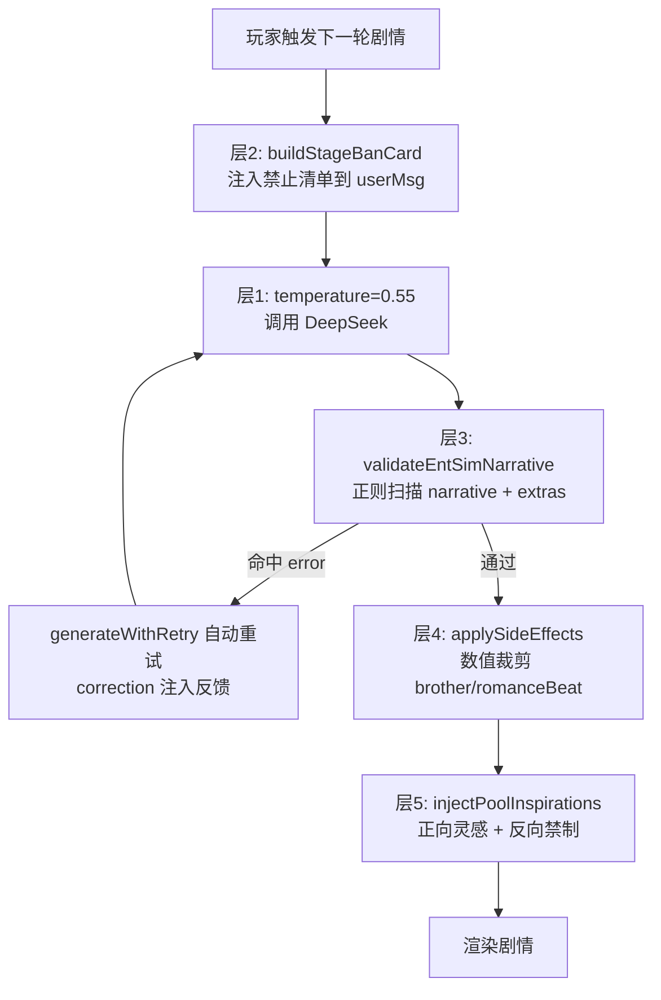

## 背景

用户存档分析发现AI主线剧情存在六大类跑偏问题，聊天/收尾系统已通过按人分阶段的池子化方案基本控制住，但**主线剧情正文、哥哥态度变化、careerHistory记录**仍完全由AI自由生成，仅靠prompt文字约束不足以让DeepSeek遵守规则。

## 核心需求

用**多层硬防线**替代纯prompt约束。每一层都是代码级的拦截，不是文字级的"建议"。按优先级从高到低：

### 层1：降低 AI 创意冲动

将 temperature 从 0.9 降至 0.5-0.6，减少随机采样带来的偏离。DeepSeek在0.5仍能产出自然文风，但跑偏率明显下降。

### 层2：生成前注入阶段禁制卡

每次调用AI前，根据当前 `genCount`/`affection`/`oneHeartRomanceStage`/`brother.support` 等状态，动态生成一段「本轮禁止清单」注入到 user message 末尾。利用 recency bias 让AI在生成时明确知道当前阶段的红线。

### 层3：生成后内容校验+自动驳回

在 `validateEntSimNarrative` 中加入正则/关键词扫描，对命中的违规内容标为 `severity: 'error'`，触发重试机制（现有 `generateWithRetry` 已支持 correction 反馈重试链路，只需加校验规则）。

### 层4：哥哥态度/男主行为数值门控

在 `applySideEffects` 中，对 AI 返回的 `extras.brother`、`extras.romanceBeat` 做数值裁剪：不合理的 `supportDelta` 不应用、不合理的 `event` 文本强制替换为中性描述。

### 层5：灵感池加入反向禁制

`injectPoolInspirations` 当前只注入正向场景灵感。改为同时注入一条「禁止场景」（如好感<30时注入"禁止写歌、禁止专属暗号、禁止暧昧双关语"），作为池子级别的硬约束。

## 技术栈

- JavaScript (ES Modules), Node.js 18+, Vite 5.4
- 修改文件：`src/ent-sim/engine.js`, `src/ent-sim/prompts.js`, `src/validator.js`, `src/ent-sim/brother.js`

## 实现方案

### 概述

五层防线从低到高逐层加固，每一层都是代码级拦截而非文字建议。现有代码结构（`generateWithRetry`重试链路、`applySideEffects`副作用处理、`injectPoolInspirations`灵感注入）均具备接入新防线的天然锚点。

### 层1：Temperature 降低

- **位置**：`engine.js:105`
- **当前**：`{ temperature: 0.9, maxTokens: 5000 }`
- **改为**：`{ temperature: 0.55, maxTokens: 5000 }`
- **原理**：0.9 给了 AI 太大随机空间，0.55 在创意和稳定性间取平衡。DeepSeek 0.5-0.6 仍能产出自然文风。

### 层2：阶段行为禁制卡

- **位置**：`prompts.js` `buildEntSimUserMessage` 函数末尾（`'请输出 JSON'` 行前）
- **新增函数**：`buildStageBanCard(E)` — 根据当前状态生成禁制清单
- **规则表**（按 `oneHeartRomanceStage` + `affection` + `genCount` 联合判定）：

| 状态 | 禁制内容 |
| --- | --- |
| stage=0 | 禁止写歌/写词/为你创作/专属旋律；禁止专属暗号/只有我们懂；禁止暧昧双关语；男主行为以"前辈对后辈的礼貌关注"为上限 |
| affection<20 | 禁止男主主动制造二人独处；禁止深夜联系；禁止"一直看/一直在意"类心理活动；泡泡发言禁止任何可指向特定人的内容 |
| genCount<10 | 禁止哥哥审查男主/牵线/撮合/推Kakao；哥哥态度上限为"隐约察觉但尊重" |
| brother.support<20 | 禁止哥哥站支持态度；禁止哥哥在男主面前提女主；禁止哥哥主动推动感情进展 |
| 天气非"雾" | 禁止出现雾/雾气/浓雾作为氛围元素 |


- **注入格式**：`'\n【本轮行为禁制·强制】请逐条确认以下行为在本轮不可出现：\n- ❌ 禁止：...\n- ❌ 禁止：...\n如果上一轮已有的标志性事件（写歌/暗号）与本轮阶段冲突，本轮主角应刻意拉开距离，不要延续上轮的越级行为。\n'`

### 层3：生成后内容校验驳回

- **位置**：`validator.js` `validateEntSimNarrative` 函数（第134行后）
- **新增**：在现有长度/格式校验后，加内容扫描
- **扫描规则**：

| 触发词 | 门控条件 | 严重度 |
| --- | --- | --- |
| 写歌/写词/为你创作/专属/旋律 | stage=0 且 affection<20 | error |
| 暗号/只有(我/你)懂/秘密约定 | affection<20 | error |
| 雾(气)?/浓雾/雾气弥漫 | 当前天气非"雾" | error |
| 拥抱/牵手/靠在(肩 | 怀)/擦(泪 | 眼角) | intimacy未解锁对应层级 | error |
| 审查/牵线/撮合/推Kakao/月老 | brother.support<20 | error |
| 情敌.*(写歌 | 暗号 | 专属) | 标签内容对象错位 | error |


- **命中 error 后**：返回 `{ severity: 'error', type: 'content', message: '...' }`，现有 `generateWithRetry` 会自动将 correction 拼入 userMsg 重试（ai-generator.js:85）。

### 层4：数值门控

- **位置**：`engine.js` `applySideEffects` 函数（第200行）
- **brother 门控**：
- `extras.brother.supportDelta`：若 `brother.support < 20` 且 `delta > 1`，强制裁剪为 `Math.min(delta, 1)`
- `extras.brother.note`：若与当前 `brother.stance` 矛盾（如 stance=观望但 note 写"牵线"），替换为中性文本 "本轮剧情影响"
- `extras.brother.stance`：禁止 AI 直接改 stance（除非通过特定的玩家选项事件）

- **romanceBeat 门控**：
- `extras.romanceBeat.event`：若包含禁制词（写歌/暗号等），替换为 "剧情互动"
- `extras.romanceBeat.affectionDelta`：受现有 `checkRomanceUnlock` + 日上限双重约束（已实现）

### 层5：灵感池反向禁制

- **位置**：`prompts.js` `injectPoolInspirations` 函数（第304行）
- **改为**：在返回的正向灵感文本末尾，追加一条反向禁制
- **格式**：`'\n【场景禁制】本轮禁止出现的场景类型：' + banLabel`
- **banLabel 示例**：
- stage=0：`'禁止男主"为你写歌""专属暗示""特殊对待"，禁止哥哥"审查感情""推Kakao牵线"'`
- affection<20：`'禁止二人深夜独处，禁止男主私下主动联系，禁止暧昧氛围描写'`

## 架构设计



## 目录结构

```
src/
├── ent-sim/
│   ├── engine.js          # [MODIFY] 层1: temperature 0.9→0.55, 层4: applySideEffects 加 brother/romanceBeat 数值门控
│   ├── prompts.js         # [MODIFY] 层2: 新增 buildStageBanCard + 注入点, 层5: injectPoolInspirations 加反向禁制
│   └── brother.js         # [MODIFY] 层4协同: maybeBrotherEvent 确认已不写 supportDelta(已完成,验证即可)
└── validator.js           # [MODIFY] 层3: validateEntSimNarrative 加 6条内容扫描规则
```

## 关键代码结构

### buildStageBanCard(E) 接口

```js
function buildStageBanCard(E) {
  // 返回本轮禁止清单文本，或空字符串
  // 输入: E = GS.entSim
  // 输出: '\n【本轮行为禁制·强制】...' 或 ''
  var bans = [];
  var stage = GS.oneHeartRomanceStage || 0;
  var aff = E.affection || 0;
  var broSup = (E.brother && E.brother.support) || 0;
  var genCount = GS.oneHeartGenCount || 0;
  var weather = (GS.season || '') + '-' + (GS.weather || '');

  if (stage === 0 && aff < 20) {
    bans.push('禁止男主写歌/写词/创作/专属旋律/专属暗示');
    bans.push('禁止"专属暗号""只有我们懂""秘密约定"');
  }
  if (genCount < 10 || broSup < 20) {
    bans.push('禁止哥哥审查男主感情/牵线/撮合/推Kakao');
  }
  if (weather.indexOf('雾') < 0) {
    bans.push('禁止雾/雾气/浓雾氛围描写');
  }
  // ... 更多规则
  return bans.length ? '\n【本轮行为禁制·强制】请逐条确认以下行为在本轮不可出现：\n- ❌ ' + bans.join('\n- ❌ ') + '\n' : '';
}
```

### validateEntSimNarrative 新增扫描

```js
// 在现有 validateEntSimNarrative 末尾（return corrections 前）插入
var contentBans = [
  { pattern: /写歌|写词|为你创作|专属旋律|专属的歌/, gate: function() { return stage === 0 && aff < 20; }, msg: '当前初遇阶段禁止写歌/写词/创作' },
  { pattern: /暗号|只有(我|你)懂|秘密约定|只属于/, gate: function() { return aff < 20; }, msg: '当前好感禁止专属暗号' },
  { pattern: /雾(?!化|霾)/, gate: function() { return (GS.weather || '').indexOf('雾') < 0; }, msg: '当前天气非雾天禁止雾氛描写' },
  { pattern: /审查.*感情|牵线|撮合|推.*Kakao|月老/, gate: function() { return broSup < 20; }, msg: '哥哥态度不足禁止牵线行为' },
];
for (var i = 0; i < contentBans.length; i++) {
  if (contentBans[i].gate() && contentBans[i].pattern.test(narrative)) {
    corrections.push({ severity: 'error', type: 'content', message: contentBans[i].msg + '。请重新生成。' });
  }
}
```

## Agent Extensions

### SubAgent

- **code-explorer**
- 用途：在实施阶段逐文件定位修改点（engine.js temperature行、prompts.js 注入点、validator.js 插入点），确保修改行号精确
- 预期结果：每个修改点的精确行号和上下文确认