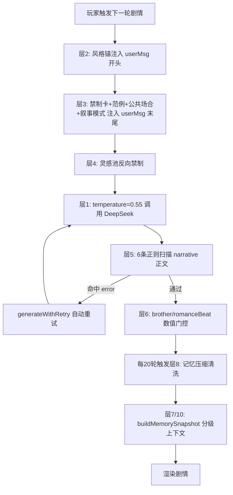

## 产品概述

为娱乐圈模拟器(entSim)新增十层防线，在生成前、生成时、生成后、压缩时四个环节逐层拦截AI剧情跑偏，实现视觉小说级稳定叙事体验——第三人称女主视角、细腻场景描写、节奏稳定、200轮长期不飘。

## 核心问题（来自用户存档 Day 43/好感8/初遇阶段）

- 好感8/初遇阶段：AI让男主Day2"为你写歌"、Day7"专属暗号"
- 哥哥5天从审查到牵线全流程走完，同一天态度5条矛盾记录
- "雾"作为氛围元素无天气校验
- 越级事件在记忆中被反复引用形成正反馈（"写歌"存进记忆后40轮持续被AI引用）
- 男主行为本质越级（"偷偷换水""队友起哄"），禁制词躲过了但结构暧昧仍在

## 十层防线

### 层1：Temperature 0.9 → 0.55

降低随机采样空间，DeepSeek 0.55仍能产出自然文风但跑偏率大幅下降。

### 层2：风格锚——每轮user message开头

注入永不压缩、永不变化的恒定风格参考（第三人称女主视角/动作代替情绪词/场景物理质感/对话精简），利用primacy bias锁定文风。

### 层3：阶段行为禁制卡——user message末尾

根据affection/stage/genCount/support动态生成禁止清单，附带❌错误vs✅正确范例，再加公共场合强制规则(stage<2禁止二人独处)和叙事模式(初遇=观察/暧昧=试探/明确=主动)。

### 层4：灵感池反向禁制

injectPoolInspirations返回值末尾追加一条禁止场景声明，防止正向灵感诱使AI越界发挥。

### 层5：生成后6条正则扫描

扫描narrative正文命中写歌/暗号/雾/牵线/越级亲密/对象错位时标为error，触发generateWithRetry自动重试。

### 层6：brother/romanceBeat数值门控

applySideEffects中裁剪不合理的supportDelta(非玩家驱动强制置0)、note(与stance矛盾替换为中性文本)、禁止AI直接改stance。

### 层7：记忆三级处理

T0核心里程碑永久保留、T1近期20轮完整文本、T2阶段摘要每20轮压缩。

### 层8：记忆压缩清洗

compressEntSimMemory中扫描违禁词(写歌/暗号/雾)，命中时降级为中性表述。

### 层9：叙事模式约束

初遇阶段男主只在场景中存在但不做指向女主的行为(观察模式)，暧昧阶段可以有模糊试探(试探模式)，明确阶段才能清楚表达意图(主动模式)。

### 层10：上下文隔离

buildMemorySnapshot按阶段分段注入——近期原文/中期摘要/远期摘要，不同阶段用分隔符隔开，AI不会混淆"初遇时的事"和"现在应该做的事"。

## 技术栈

- JavaScript (ES Modules), Node.js 18+, Vite 5.4
- 修改文件：src/ent-sim/engine.js、src/ent-sim/prompts.js、src/validator.js、src/ent-sim/memory.js

## 架构设计



## 实现方案

### 改1：engine.js:105 temperature 0.9→0.55

当前: `{ temperature: 0.9, maxTokens: 5000 }`
改为: `{ temperature: 0.55, maxTokens: 5000 }`

### 改2：prompts.js buildEntSimUserMessage——首段注入风格锚(层2)

在函数开头构建msg后，最先注入风格锚:

```js
var STYLE_ANCHOR = '\n【叙事风格·恒定参考·必须遵守】\n' +
  '- 第三人称，女主视角。只描写女主的所见所闻所感，不进入任何其他角色的内心。\n' +
  '- 用具体动作和感官细节代替情绪词：不写"她很紧张"，写"她把谱子折了又展开，展开又折"。\n' +
  '- 场景有物理质感：温度、光线、声音、空间大小。让人能"看见"这个练习室。\n' +
  '- 对话少而精，每句话都有信息量或性格辨识度。不写"嗯""哦""好的"等填充句。\n' +
  '- 篇幅500-700字，像一集五分钟的番剧，每轮讲好一件事。\n';
msg = STYLE_ANCHOR + msg;
```

### 改3：prompts.js 新建buildStageBanCard函数 + 注入点(层3)

在`buildEntSimUserMessage`的`'请输出 JSON'`行前注入。

规则表(联合判定stage/aff/genCount/broSup/weather):

| 门控 | 禁制 | 范例 |
| --- | --- | --- |
| stage=0, aff<20 | 禁止写歌/专属旋律 | ❌"他为你写了半首曲子" ✅"他路过练习室门口时停了半步，然后继续走过去" |
| stage=0, aff<20 | 禁止专属暗号/特殊对待 | ❌"只有你懂的暗号" ✅"他叫了你的名字，和叫其他练习生时一样" |
| genCount<10, broSup<20 | 禁止哥哥牵线/审查 | ❌"哥推了Kakao给你" ✅"哥发消息问今天练习怎么样" |
| 天气非"雾" | 禁止雾氛 | ❌"雾气弥漫的走廊" ✅"阳光透过练习室窗户照在地板上" |
| stage<2 | 禁止二人独处 | ❌"练习室只剩你们两个人" ✅"敏珠在角落拉伸，还有两个练习生在讨论编舞" |
| stage=0 | 男主行为上限=观察模式 | ❌"他偷偷帮你换了水" ✅"他进了录音室，门在你身后关上" |


叙事模式约束(层9):

```js
if (stage === 0) {
  bans.push('【叙事模式·初遇=观察模式】男主只能在场景中"存在"——他在走廊经过、他在休息室里打游戏、他的声音从某个房间传出来。女主通过自己的感官注意到他，不是他注意到女主。他不对女主做任何指向性的行为。');
}
```

注入格式:

```
【本轮行为禁制·强制】请逐条确认以下行为在本轮不可出现：
- ❌ 禁止：写歌/写词/旋律创作/专属暗示
  正确范例：他路过练习室门口时停了半步，然后继续走过去，没有推门。
- ❌ 禁止：专属暗号/秘密约定/"只有我们懂"
  正确范例：他叫了你的名字——和叫其他练习生时一样。
- ❌ 禁止：二人独处（当前阶段必须公共场合，有第三人在场）
- ❌ 禁止：雾/雾气氛围（当前天气非雾）
- ❌ 禁止：哥哥牵线/撮合/审查男主
【叙事模式·初遇·观察】男主本轮不做指向女主的行为。他只是一个"被看到的人"。
```

### 改4：prompts.js injectPoolInspirations末尾追加反向禁制(层4)

在第379行return前追加:

```js
var banLabel = '';
if (aff < 20) banLabel = '禁止男主"为你写歌""专属暗示""特殊对待"，禁止哥哥"审查感情""推Kakao牵线"';
if (stage < 2) banLabel += '，禁止二人深夜独处，禁止男主私下主动联系';
if (banLabel) out += '\n【场景禁制】本轮禁止出现的场景类型：' + banLabel + '\n';
```

### 改5：validator.js validateEntSimNarrative加6条内容扫描(层5)

在第153行末尾(return corrections前)插入:

```js
var E = GS.entSim;
var stage = GS.oneHeartRomanceStage || 0;
var aff = E.affection || 0;
var broSup = (E.brother && E.brother.support) || 0;
var weatherIsFog = (GS.weather || '').indexOf('雾') >= 0;

var contentBans = [
  { pattern: /写歌|写词|为你创作|专属旋律|给你写了/, gate: stage===0 && aff<20, msg: '当前初遇阶段禁止写歌/写词/创作' },
  { pattern: /暗号|只有(我|你)懂|秘密约定|只属于(我|你)/, gate: aff<20, msg: '当前好感禁止专属暗号/秘密约定' },
  { pattern: /雾(?!化|霾)/, gate: !weatherIsFog, msg: '当前天气非雾天禁止雾氛描写' },
  { pattern: /拥抱|牵手|靠(在|着)(肩|怀)|擦(泪|眼角)/, gate: true, msg: '当前阶段禁止肢体亲密接触' },
  { pattern: /(审查|牵线|撮合|推.*Kakao|月老).*(感情|男友|男主|圆佑)/, gate: broSup<20, msg: '哥哥支持度不足禁止牵线/审查行为' },
  { pattern: /(偷偷|悄悄).*(换|放|留|送).*(水|咖啡|饮料|零食)/, gate: stage===0, msg: '初遇观察模式禁止男主主动做指向女主的事（包括偷偷照顾）' },
];

for (var ci = 0; ci < contentBans.length; ci++) {
  var cb = contentBans[ci];
  if (cb.gate && cb.pattern.test(narrative)) {
    corrections.push({ severity: 'error', type: 'content', message: cb.msg + '。请重新生成。' });
  }
}
```

校验回路已存在：ai-generator.js:85会将error级correction注入`currentUserMsg`末尾重试，最多3次。

### 改6：engine.js applySideEffects加数值门控(层6)

在`applyBrotherEffect(line 272)`内，supportDelta更新前加裁剪:

```js
// 数值门控：support<20时delta上限+1
if (typeof b.supportDelta === 'number') {
  if (broSup < 20 && b.supportDelta > 1) b.supportDelta = Math.min(b.supportDelta, 1);
  if (broSup < 10 && b.supportDelta > 0 && !GS._playerDroveBrother) b.supportDelta = 0;
}
```

注意：需要确认`GS._playerDroveBrother`是否存在，若无则在第197行前新增`var _playerDrove = extra.choiceText && extra.choiceText.indexOf('哥哥') >= 0;`作为门控。

brother.note门控：若与stance矛盾(如stance='观望'但note含'牵线')，替换为'本轮剧情影响'。

brother.stance保护：禁止AI直接改stance——在`if (b.stance)`行改为`if (b.stance && GS._playerDroveBrother)`。

### 改7+8+10：memory.js 记忆三级处理+压缩清洗+上下文隔离

compressEntSimMemory(line 10)中，压缩时扫描关键词:

```js
var FORBIDDEN_IN_MEMORY = ['写歌', '写词', '专属暗号', '秘密约定', '雾中', '浓雾'];
for (var fi = 0; fi < FORBIDDEN_IN_MEMORY.length; fi++) {
  if (buf.indexOf(FORBIDDEN_IN_MEMORY[fi]) >= 0) {
    buf = buf.replace(new RegExp(FORBIDDEN_IN_MEMORY[fi], 'g'), '练习日偶遇');
  }
}
```

buildMemorySnapshot(line 64)改为三级结构:

```js
// T0: 核心里程碑（首次交谈/告白/公开）
var t0 = E.memory.milestones || [];
// T1: 最近20轮完整摘要
var t1 = E.memory.dailySummaries.slice(-20);
// T2: 阶段摘要（每20轮一个段落）
var t2 = E.memory.phaseSummaries || [];

return '【风格参考·最近20轮】\n' + t1.map(...).join('\n') +
  '\n【阶段背景】\n' + t2.slice(-3).join('\n') +
  '\n【重要节点】\n' + t0.slice(-5).map(function(m){return 'Day'+m.day+' '+m.text;}).join('\n');
```

### 改8确认：brother.js maybeBrotherEvent已修复

line 18-20已确认不写supportDelta，仅验证通过。

## 目录结构

```
src/
├── ent-sim/
│   ├── engine.js          # [MODIFY] 层1: temperature, 层6: applySideEffects数值门控
│   ├── prompts.js         # [MODIFY] 层2: 风格锚, 层3: buildStageBanCard+注入, 层4: 反向禁制
│   └── memory.js          # [MODIFY] 层7+8+10: 记忆三级处理+清洗+上下文隔离
└── validator.js           # [MODIFY] 层5: 6条内容正则扫描就现在而言，
```