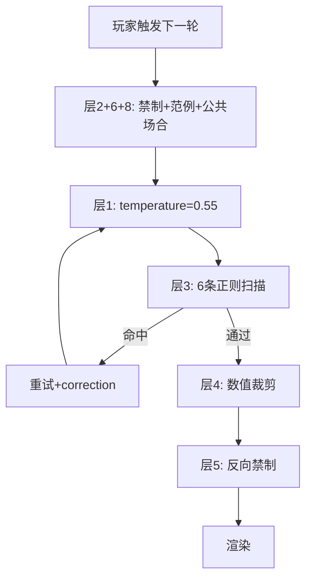

## 产品概述

针对《娱乐圈模拟器》AI主线剧情严重跑偏问题，用七层硬防线替代纯prompt约束，在生成前、生成时、生成后三个环节逐层拦截。同时根据用户存档（Day 39/好感8/初遇阶段/哥哥Joshua支持度5）模拟修复前后剧情对比，直观展示防线效果。

## 核心问题（来自用户存档）

- 好感8/初遇阶段：AI让男主Day2"为你写歌"、Day7"专属暗号"
- Day 39同一轮：哥哥态度5条矛盾记录（未出场→察觉→未介入→打电话审查）
- "雾"作为氛围元素频繁出现，无天气校验
- 哥哥5天从0到5牵线完成，全由AI自由生成非玩家选项驱动

## 七层防线

### 层1：Temperature 0.9 → 0.55

降低随机采样空间，DeepSeek 0.55仍能产出自然文风。

### 层2：阶段行为禁制卡

生成前根据affection/stage/genCount/support动态生成禁止清单，注入user message末尾，利用recency bias。

### 层3：生成后内容校验驳回

6条正则扫描（写歌/暗号/雾/牵线/越级亲密/对象错位），命中error触发generateWithRetry自动重试。

### 层4：数值门控

applySideEffects中裁剪不合理的brother.supportDelta（非玩家驱动强制置0）、brother.note（与stance矛盾替换为中性文本）、romanceBeat.event（禁制词替换）。

### 层5：灵感池反向禁制

injectPoolInspirations返回值末尾追加一条禁止场景声明。

### 层6：禁制卡附带范例对比

每条禁制附❌错误示范 vs ✅正确示范，LLM对具体例子服从率远高于抽象规则。

### 层8：公共场合强制规则

stage<2时禁止男主女主二人独处，所有互动须有第三人在场。

## 技术栈

- JavaScript (ES Modules), Node.js 18+, Vite 5.4
- 修改文件：`src/ent-sim/engine.js`, `src/ent-sim/prompts.js`, `src/validator.js`

## 实现方案

### 层1：engine.js:105 temperature 0.9→0.55

### 层2+6+8：prompts.js 新建 buildStageBanCard

规则表（联合判定 stage/aff/genCount/broSup/weather）：

| 状态门控 | 禁制 | 范例 |
| --- | --- | --- |
| stage=0, aff<20 | 禁止写歌/专属旋律 | ❌"他为你写了半首曲子" ✅"他路过练习室时停下听了一会儿，点点头走了" |
| stage=0, aff<20 | 禁止专属暗号 | ❌"只有你懂的暗号" ✅"他记住你的名字了，但只是普通地叫了一声" |
| genCount<10, broSup<20 | 禁止哥哥牵线 | ❌"哥推了Kakao给你" ✅"哥发消息问今天练习怎么样" |
| 天气非雾 | 禁止雾氛 | ❌"雾气弥漫的走廊" ✅"阳光透过练习室窗户照在地板上" |
| stage<2 | 禁止二人独处 | ❌"练习室只剩你们两个人" ✅"还有几个练习生在角落拉伸" |

注入位置：`buildEntSimUserMessage` 返回语句前一行，`'请输出 JSON'` 之前。

### 层3：validator.js validateEntSimNarrative 加6条正则

| 触发词 | 门控 | 严重度 |
| --- | --- | --- |
| 写歌/写词/为你创作/专属/旋律 | stage=0, aff<20 | error |
| 暗号/只有(我/你)懂/秘密约定 | aff<20 | error |
| 雾(气)?/浓雾/雾气弥漫 | 天气非雾 | error |
| 拥抱/牵手/靠在(肩 | 怀) | intimacy未解锁 | error |
| 审查/牵线/撮合/推Kakao | broSup<20 | error |
| 情敌.*(写歌 | 暗号 | 专属) | 标签错位 | error |

命中error后generateWithRetry自动带correction重试。

### 层4：engine.js applySideEffects 数值门控

- support<20时delta>1裁剪为Math.min(delta,1)
- note与stance矛盾替换为"本轮剧情影响"
- 禁止AI直接改stance

### 层5：prompts.js injectPoolInspirations 末尾追加反向禁制

### 架构流程

