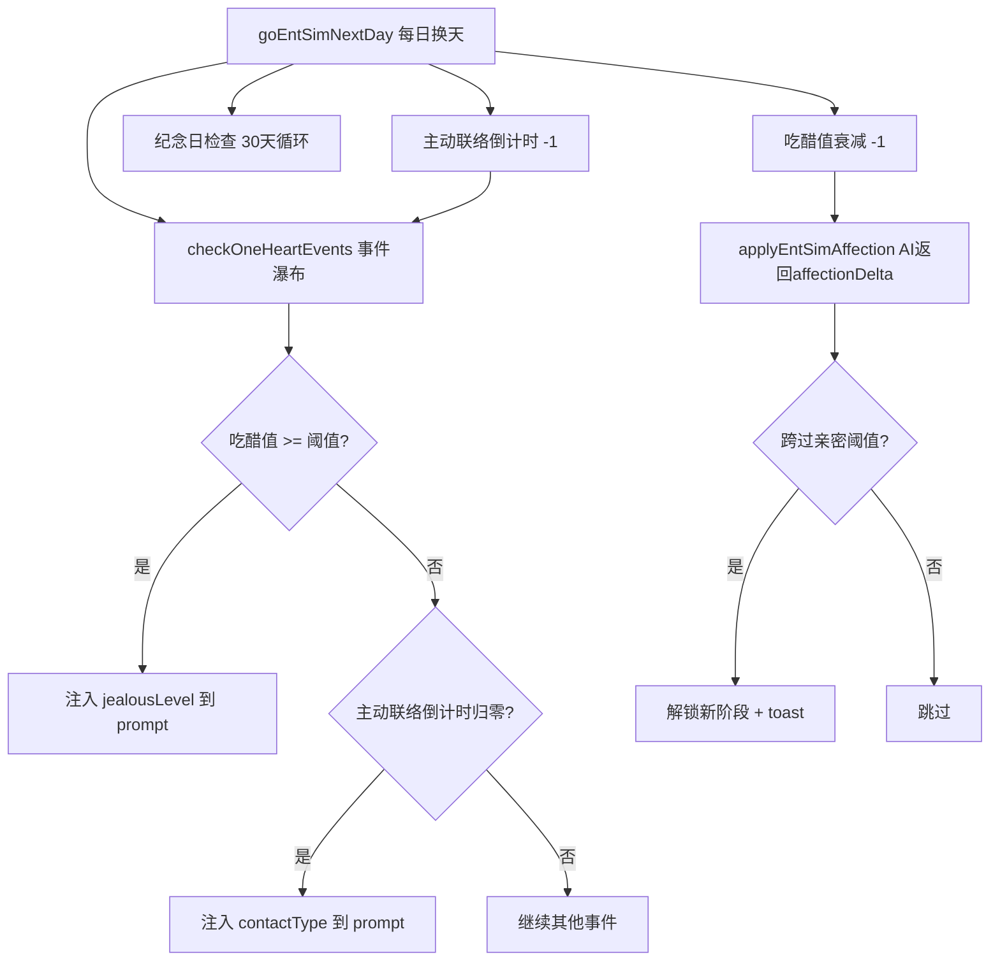

## 产品概述

为 SEVENTEEN 娱乐圈模拟器新增 4 项纯代码控制的游戏性功能，分别提升恋爱感、娱乐圈真实感和游戏目标感。

## 核心功能

### 1. 吃醋值系统（恋爱感增强）

- 代码追踪女主与情敌的互动次数（复用现有 npcEncounter.intimacyDelta > 0 即计数）
- 每日自动衰减 1 点，防止无限累积
- 达到 3/6/10 三档阈值时，向 AI prompt 注入「男主吃醋日」标记，AI 据此写出不同强度的吃醋剧情
- 触发后在恋情面板显示小火焰图标（提示当日有吃醋事件）

### 2. 亲密接触阶梯（恋爱感 + 进度感）

- 牵手（好感 ≥ 15）、拥抱（好感 ≥ 30）、接吻（好感 ≥ 50）三档解锁
- 每档只能由 AI 在已解锁范围内描写，代码注入 prompt 约束不可越级
- 首次解锁某档时弹出仪式感 toast，并记录日期作为纪念日
- 恋情面板显示当前亲密阶段图标（🤝/🤗/💋）

### 3. 关系纪念日追踪（游戏反馈感）

- 自动记录三个关键日期：第一次约会日、告白成功日、首次接吻日
- 每 30 天循环检查——若今天是某个纪念日的整数倍（30/60/90/100天），弹出 toast 提示
- 不阻塞游戏流程，仅作为温馨提醒增强恋爱沉浸感

### 4. 男主主动联络（恋爱感 + 新鲜感）

- 代码控制每 8-18 天随机触发一次，好感 ≥ 60 时缩短为 5-10 天
- 三种联络方式随机：主动打电话、发聊天消息、托哥哥转交小东西
- 通过 GS._entSimPendingEvent 注入事件文本，AI 据此生成叙事
- 不与玩家主动聊天/约会冲突——仅在当日无事发生时触发

## 技术方案

### 实现策略

四项功能全部在现有架构上拓展，核心原则：**代码决定「何时触发、触发什么、数值多少」，AI 只负责「把这件事写成故事」**。不新建 UI 页面，仅扩展现有状态字段和 prompt 注入点。

### 关键技术决策

| 决策 | 理由 |
| --- | --- |
| 复用 `_entSimPendingEvent` 注入通道 | 已有事件7级瀑布用同一通道，所有新事件可无缝进入剧情流 |
| 吃醋值 + 主动联络纳入 `checkOneHeartEvents` 瀑布 | 统一调度，避免冲突——每日只触发最高优先级一条 |
| 亲密接触阶梯写在 prompt 规则层 | 不增加 AI 判断负担，代码告诉 AI「当前允许牵手但不可拥抱」 |
| 纪念日追踪仅 toast 不弹窗 | 避免打断游戏节奏，温馨但不强制关注 |
| 所有状态字段在 `defaultEntSimState` 初始化 | 防止旧存档迁移报 undefined |

### 数据流

### 文件修改清单

| 文件 | 改动 |
| --- | --- |
| `state.js` | 新增 4 组状态字段初始化（jealousyGauge / intimacyLevel / milestones / _contactTimer） |
| `romance.js` | 新增 `checkIntimacyUnlock()` 、 `tickJealousyDecay()` 、 `recordMilestone()` ；在 `applyConfessionResult` 中记录告白日期 |
| `engine.js` | 在 `goEntSimNextDay` 挂入衰减/倒计时/纪念日检查；在 `initiateEntSimDate` 中记录首次约会日期；在 `applyNpcEncounter` 中累加吃醋值；在 `checkOneHeartEvents` 中新增吃醋/主动联络两个瀑布级 |
| `prompts.js` | 在 `buildEntSimSystemPrompt` 新增两段注入：亲密接触约束规则、吃醋日指令 |
| `ui.js` | 在 `renderLovePanel` 加入亲密阶段图标行 |
| `data.js` | 新增联络方式类型池（电话/消息/转交小东西） |

### 性能考量

- 所有检查均在 `goEntSimNextDay` 中同步执行（O(1) 的数值比较），无额外 AI 调用开销
- 吃醋值仅在 AI 返回 npcEncounter 时累加，不增加 prompt 长度
- 纪念日 toast 100ms 自动消失，零性能影响

### 向后兼容

- 所有新增字段在 `migrateEntSimState` 中兜底到默认值（0/null），旧存档加载不报错
- 亲密接触阶段从 0 开始，旧存档中已有高好感的玩家第一次 AI 返回 affectionDelta 后自动追认