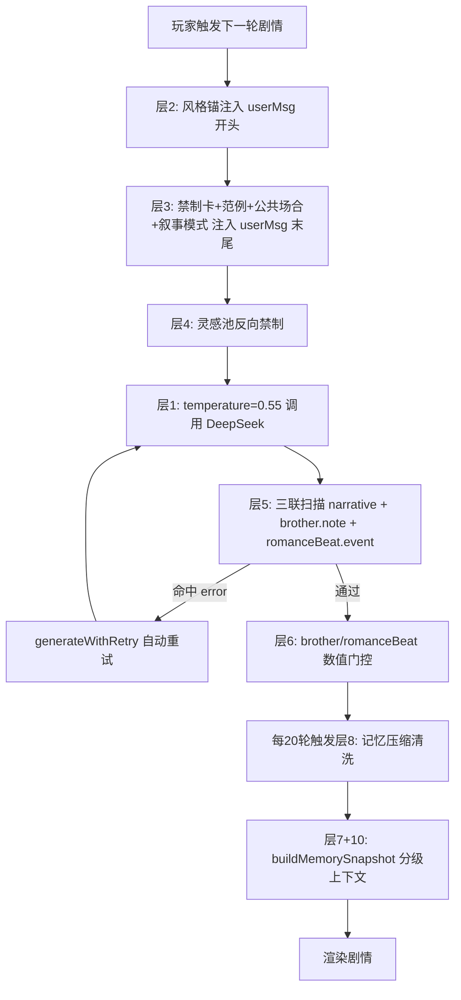

## 产品概述

为娱乐圈模拟器(entSim)新增完整十层防线，在生成前、生成时、生成后、压缩时四个环节逐层拦截AI剧情跑偏，实现视觉小说级稳定叙事体验——第三人称女主视角、细腻场景描写、节奏稳定、200轮长期不飘。

## 核心问题（来自用户存档 Day43/好感8/初遇阶段）

- 好感8/初遇阶段：AI让男主Day2为你写歌、Day7专属暗号
- 哥哥5天从审查到牵线全流程走完，同一天态度5条矛盾记录
- 雾作为氛围元素无天气校验，大量滥用
- 越级事件在记忆中被反复引用形成正反馈（写歌存进记忆后40轮持续被AI引用）
- 男主行为本质越级（偷偷换水、队友起哄），禁制词躲过了但结构暧昧仍在
- 用户开新档，不需旧存档清洗

## 用户最终要求

- 视觉小说感——第三人称女主视角、细腻场景描写、节奏稳定
- 200轮长期稳定性——记忆不能堆叠越级事件形成滚雪球
- 沉浸感——不能牺牲字数（否决了字数分层方案）
- 使用DeepSeek模型
- 能优化的全加上，不分必须和建议

## 十层防线

### 层1：Temperature 0.9 → 0.55

降低随机采样空间，DeepSeek 0.55仍能产出自然文风但跑偏率大幅下降。

### 层2：风格锚——每轮user message开头

注入永不压缩、永不变化的恒定风格参考（第三人称女主视角、动作代替情绪词、场景物理质感、对话精简），利用primacy bias锁定文风。

### 层3：阶段行为禁制卡——user message末尾

根据affection/stage/genCount/support动态生成禁止清单，附带范例对比，加公共场合强制规则和叙事模式。

### 层4：灵感池反向禁制

injectPoolInspirations返回值末尾追加一条禁止场景声明。

### 层5：三联内容扫描

扫描narrative正文 + extras.brother.note + extras.romanceBeat.event三轨全查，去掉窄正则改靠叙事模式约束。

### 层6：数值门控

_playerDroveBrother改为type===choice判断，support裁剪、note门控、stance保护。

### 层7+8+10：记忆三级处理+压缩清洗+上下文隔离

T0里程碑永久保留、T1近期20轮完整文本、T2阶段摘要每20轮压缩，压缩时关键词清洗，buildMemorySnapshot按阶段分段注入。

### 层9：叙事模式约束

初遇=观察模式、暧昧=试探模式、明确=主动模式。

### 层11：新状态字段

state.js新增memory.milestones和memory.phaseSummaries字段。

## 技术栈

- JavaScript (ES Modules), Node.js 18+, Vite 5.4
- 修改文件：src/ent-sim/engine.js、src/ent-sim/prompts.js、src/ent-sim/memory.js、src/ent-sim/state.js、src/validator.js

## 架构设计



## 实现方案

### 改1：engine.js:105 temperature 0.9→0.55（层1）

```js
// 当前: { temperature: 0.9, maxTokens: 5000 }
// 改为: { temperature: 0.55, maxTokens: 5000 }
```

### 改2：prompts.js buildEntSimUserMessage——首段风格锚（层2）

在函数第180行，构建msg后最先注入：

```js
var STYLE_ANCHOR = '\n【叙事风格·恒定参考·必须遵守】\n' +
  '- 第三人称，女主视角。只描写女主的所见所闻所感，不进入任何其他角色的内心。\n' +
  '- 用具体动作和感官细节代替情绪词：不写"她很紧张"，写"她把谱子折了又展开，展开又折"。\n' +
  '- 场景有物理质感：温度、光线、声音、空间大小。让人能"看见"这个练习室。\n' +
  '- 对话少而精，每句话都有信息量或性格辨识度。不写"嗯""哦""好的"等填充句。\n' +
  '- 篇幅500-700字，像一集五分钟的番剧，每轮讲好一件事。\n';
msg = STYLE_ANCHOR + msg;
```

### 改3：prompts.js 新建buildStageBanCard + 注入点（层3+9）

在`buildEntSimUserMessage`的`'请输出 JSON'`行前注入，规则表联合判定stage/aff/genCount/broSup/weather：

| 门控 | 禁制 | 范例 |
| --- | --- | --- |
| stage=0, aff<20 | 禁止写歌/专属旋律 | 错误："他为你写了半首曲子" 正确："他路过练习室门口时停了半步，然后继续走过去" |
| stage=0, aff<20 | 禁止专属暗号/特殊对待 | 错误："只有你懂的暗号" 正确："他叫了你的名字——和叫其他练习生时一样" |
| genCount<10, broSup<20 | 禁止哥哥牵线/审查 | 错误："哥推了Kakao给你" 正确："哥发消息问今天练习怎么样" |
| 天气非雾 | 禁止雾氛 | 错误："雾气弥漫的走廊" 正确："阳光透过练习室窗户照在地板上" |
| stage<2 | 禁止二人独处 | 错误："练习室只剩你们两个人" 正确："敏珠在角落拉伸，还有两个练习生在讨论编舞" |
| stage=0 | 男主行为上限=观察模式 | 错误："他偷偷帮你换了水" 正确："他进了录音室，门在你身后关上" |


叙式模式约束（层9）——当stage=0时追加：

```
【叙事模式·初遇=观察模式】男主只能在场景中"存在"——他在走廊经过、他在休息室里打游戏、他的声音从某个房间传出来。女主通过自己的感官注意到他，不是他注意到女主。他不对女主做任何指向性的行为。
```

### 改4：prompts.js injectPoolInspirations末尾反向禁制（层4）

在injectPoolInspirations函数第379行return out前追加：

```js
var banLabel = '';
if (aff < 20) banLabel = '禁止男主"为你写歌""专属暗示""特殊对待"，禁止哥哥"审查感情""推Kakao牵线"';
if (stage < 2) banLabel += '，禁止二人深夜独处，禁止男主私下主动联系';
if (banLabel) out += '\n【场景禁制】本轮禁止出现的场景类型：' + banLabel + '\n';
```

### 改5：validator.js validateEntSimNarrative三联扫描（层5）

在validateEntSimNarrative第159行（return corrections前）插入扫描代码，扫描对象从narrative扩展为narrative + brother.note + romanceBeat.event：

```js
var E = GS.entSim;
var stage = GS.oneHeartRomanceStage || 0;
var aff = E.affection || 0;
var broSup = (E.brother && E.brother.support) || 0;
var weatherIsFog = (GS.weather || '').indexOf('雾') >= 0;

// 三联扫描文本：正文 + brother.note + romanceBeat.event
var extras = parsed.extras || {};
var note = (extras.brother && extras.brother.note) || '';
var rev = (extras.romanceBeat && extras.romanceBeat.event) || '';
var scanText = narrative + ' ' + note + ' ' + rev;

var contentBans = [
  { pattern: /写歌|写词|为你创作|专属旋律|给你写了/, gate: stage===0&&aff<20, msg: '当前初遇阶段禁止写歌/写词/创作' },
  { pattern: /暗号|只有(我|你)懂|秘密约定|只属于(我|你)/, gate: aff<20, msg: '当前好感禁止专属暗号/秘密约定' },
  { pattern: /雾(?!化|霾)/, gate: !weatherIsFog, msg: '当前天气非雾天禁止雾氛描写' },
  { pattern: /拥抱|牵手|靠(在|着)(肩|怀)|擦(泪|眼角)/, gate: true, msg: '当前阶段禁止肢体亲密接触' },
  { pattern: /(审查|牵线|撮合|推.*Kakao|月老).*(感情|男友|男主|圆佑)/, gate: broSup<20, msg: '哥哥支持度不足禁止牵线/审查行为' },
  { pattern: /男主.*指向|对.*女主.*特别|(只|唯独).*对.*你/, gate: stage===0, msg: '初遇观察模式禁止男主做任何指向女主的事（叙事模式约束）' },
];

for (var ci = 0; ci < contentBans.length; ci++) {
  var cb = contentBans[ci];
  if (cb.gate && cb.pattern.test(scanText)) {
    corrections.push({ severity: 'error', type: 'content', message: cb.msg + '。请重新生成。' });
  }
}
```

### 改6：engine.js applySideEffects数值门控（层6）

在applyBrotherEffect(line 272)内，supportDelta更新前加裁剪：

```js
// 数值门控：type===choice时允许AI返回supportDelta（玩家选项驱动）
var _playerDrove = (GS._entSimCurrent && GS._entSimCurrent.type === 'choice');
if (typeof b.supportDelta === 'number') {
  // support<20时delta上限+1
  if (broSup < 20 && b.supportDelta > 1) b.supportDelta = Math.min(b.supportDelta, 1);
  // support<10且非玩家驱动时强制置0
  if (broSup < 10 && b.supportDelta > 0 && !_playerDrove) b.supportDelta = 0;
}
// brother.note门控：与stance矛盾时替换
var stance = E.brother.stance || '';
if (b.note && /牵线|撮合|审查感情|推.*Kakao|月老/.test(b.note) && broSup < 20) {
  b.note = '本轮剧情影响';
}
// brother.stance保护：只有玩家选项驱动时允许AI改stance
if (b.stance && !_playerDrove) delete b.stance;
```

### 改7+8+10：memory.js记忆三级处理+压缩清洗+上下文隔离

compressEntSimMemory(line 10)中，压缩时扫描关键词清洗：

```js
var FORBIDDEN_IN_MEMORY = /写歌|写词|专属暗号|秘密约定|雾中偶遇|浓雾/g;
buf = buf.replace(FORBIDDEN_IN_MEMORY, '练习日偶遇');
```

新增每20轮阶段摘要生成逻辑——在compressEntSimMemory完成后检查dayCount是否被20整除，若是则生成T2摘要。

buildMemorySnapshot(line 64)改为三级结构：

```js
var t0 = E.memory.milestones || [];
var t1 = E.memory.dailySummaries.slice(-20);
var t2 = E.memory.phaseSummaries || [];

return '【风格参考·最近20轮】\n' + t1.map(/*...*/).join('\n') +
  '\n【阶段背景】\n' + t2.slice(-3).join('\n') +
  '\n【重要节点】\n' + t0.slice(-5).map(function(m){return 'Day'+m.day+' '+m.text;}).join('\n');
```

### 改8：state.js新增字段（层11）

在E.memory初始化行（第103行）新增两个字段：

```js
E.memory = { dailySummaries: [], eventLog: [], milestones: [], phaseSummaries: [], lastCompressDay: 0 };
```

## 目录结构

```
src/
├── ent-sim/
│   ├── engine.js          # [MODIFY] 层1: temperature 0.55(第105行), 层6: applyBrotherEffect数值门控(第272行起)
│   ├── prompts.js         # [MODIFY] 层2: 风格锚(第180行后), 层3: buildStageBanCard+注入(第300行前), 层4: 反向禁制(第379行)
│   ├── memory.js          # [MODIFY] 层7+8+10: 压缩清洗(第10行), buildMemorySnapshot三级结构(第64行)
│   └── state.js           # [MODIFY] 层11: E.memory新增milestones/phaseSummaries(第103行)
└── validator.js           # [MODIFY] 层5: 三联扫描(第159行前)
```