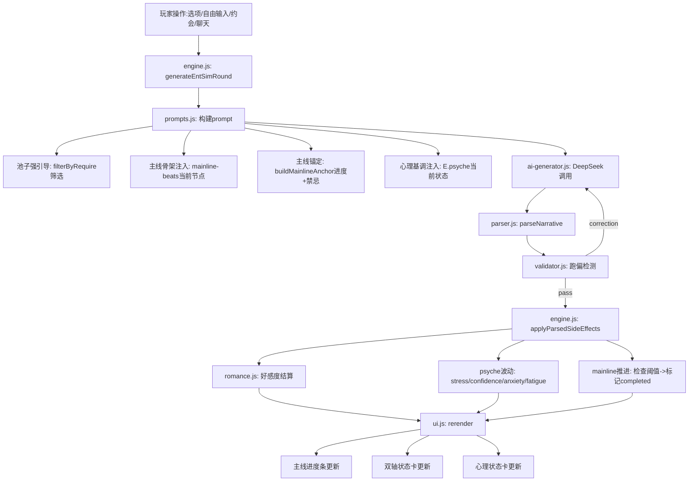
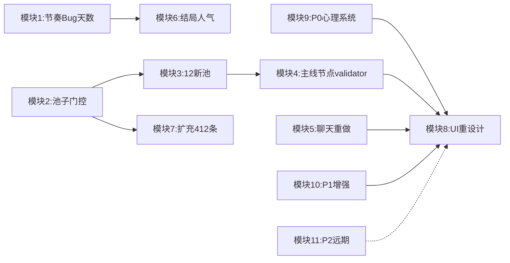

## 产品概述

娱乐圈模拟器（entSim）是《换乘恋爱 x SEVENTEEN》项目中的1v1娱乐圈恋爱模拟模式。玩家扮演女团爱豆/练习生，以"哥哥妹妹+同行业后辈"双重身份接触天团男主，在娱乐圈背景下展开地下恋故事，同时经营事业。游戏参考明星志愿系列，以3年现实时间为主线跨度。练习生6天（2+2+2）跨1年，出道后自由不限天数跨2年，玩家行为驱动人气/好感，结局由玩家主动触发。

## 核心功能

- 修复好感度节奏死锁（三重数值锁+stage0禁制+AI规则矛盾），让恋爱推进有感
- 修复5个已知Bug+buffer+参数失效+天数显示改_gameDayCount
- 池子强引导+主线节点系统（22节点骨架）+主线进度锚定+validator跑偏检测
- 人气x恋爱耦合：低人气自卑/高人气忙碌曝光，男主始终天团，家属身份日常遇见
- 结局改玩家主动触发，矩阵=好感x人气档位x曝光x告白x哥哥立场（约16种）
- 聊天快捷指令重做：预设-回复绑定，动态预设，话题引导用池子
- 12个新增池子（22节点+342条）+现有池子加门控+扩充412条+6个世界设定池接入setup
- UI重设计8大改动（配色不变）：主线进度条/人气x恋爱双轴卡/焦点布局/主线视觉区分/心理状态系统/章节跳跃蒙太奇/聊天嵌入/结局抉择时刻
- P0补充：练习生恋爱铺垫池+出道过渡事件链+心理状态系统（压力/自信/焦虑/疲劳影响选项和AI基调）
- P1增强：女团队友日常池+约会类型差异(4种)+约后余波+粉丝角色化(站姐/大粉/黑粉)+季节x节日x恋爱联动
- P2远期：社交运营深度+作品创作过程+重玩价值(图鉴/New Game+)+UI细节(数值日志/事件流)+平衡性测试方案

## 技术栈

- 语言/运行时：JavaScript (ES Modules)，Node.js 18+，遵循现有 `var` + 字符串拼接风格
- 构建工具：Vite 5.4
- AI API：DeepSeek (deepseek-chat)
- 无新依赖，所有修改为参数/条件调整 + prompt文本编辑 + 池子内容创作 + 新建JS模块 + CSS动画

## 实现方案

### 模块1：节奏与Bug修复+天数显示

**romance.js**：dailyCaps `[3,4,5,6,7]`->`[5,7,9,11,13]`；checkRomanceUnlock 阶段门控放宽（stage1移除tPhase/stage2-4保留debut降低阈值/移除chapter门控）；告白门槛80->60

**prompts.js**：stage0禁制放宽为允许微小互动；AI好感规则改为"男主在场且有微小互动时可返回+1"；告白文本80->60；池子注入 `Math.min(4,tmp.length)`->`Math.min(2,tmp.length)`

**engine.js**：联络门控 `isDebutPopup`->`E.affection>=10`；联络概率0.25->0.45；timer缩短；跨天快照修复（行357用_lastPopSnapshot读取/行758后更新）；泡泡解析正则容错；代言门槛20->15；传_affReason第二参数；buffer 6000->10000

**state.js**：_maleContactTimer初始缩短；_lastPopSnapshot初始化；CHAPTER_TIME_SKIP加大跨3年；careerHistory上限200

**brother.js**：事件触发率统一降40%；男主主动概率10->25；情敌告白标记

**ui.js**：代言dismiss补rerender()；星圈smartTruncate+7天过滤；粉丝去重

**天数显示**：12个careerHistory push点 day:dayCount->_gameDayCount；ui.js:274/1330读取点对齐；migrateSave清空旧careerHistory

### 模块2：池子门控+清理

**_utils.js**：增加 `mainline=节点ID` 和 `pop<N`/`pop>=N` 条件解析

**13个池子加mainline门控**：encounter-ml/drama-almost/romance-confession/secret-4个/drama-dating-rumor/dating-scandal-chain/dating-rumors/dispatch-news/rival-advance-events

**8个池子加pop门控**：brand-offers(pop>=15)/concert(pop>=60)/magazine(pop>=40)/job-offers(pop>=15)/variety-shows(pop>=25)/fansign(pop>=15)/career-setbacks(pop>=30)/sasaeng(pop>=40)

**6个世界设定池接入setup**：company-names/group-concepts/group-names/hit-songs/sister-roles/teammate-names

**删除3旧文件**：ent-schedule/trainee-chat/trainee-events

### 模块3：12个新增池子

mainline-beats.js(22节点)/insecurity-pool(30)/fame-pressure-pool(30)/family-encounter-pool(40)/junior-industry-pool(30)/mainline-anchor-text(32)/career-milestone-scenes(40)/rival-psychology(25)/fan-reactions-pool(40)/male-lead-perspective(30)/time-skip-transition(30)/ending-prelude(15)

### 模块4：主线节点系统+AI约束

**prompts.js**：池子注入标题改为"【本场核心事件·强引导】必须围绕展开"；pendingEvent改为"【本回合必须围绕展开的核心事件】"；新增骨架注入（按当前stage从mainline-beats抽1条）；新增buildMainlineAnchor(E)注入进度+方向+禁忌

**validator.js**（新建）：检测narrative含禁忌词（按阶段）；检测options越级；检测affectionDelta异常；返回corrections

**engine.js**：接入validator重试；mainline节点推进逻辑（好感达阈值+前置完成->标记completed->注入下一节点骨架）

**state.js**：新增 `E.mainline = { completed: [], currentNode: '' }`

### 模块5：聊天快捷指令重做

**ui.js**：sendQuickChat改预设-回复绑定对象（不再findChatPoolReply）；新建统一getChatPresets(channel)按频道x阶段x好感筛选返回[{label,reply}]；预设去重

**chat-modal.js**：话题引导按钮改为从池子取预设，替换硬编码topics

**频道结构统一**：CHAT_BROTHER/CHAT_RIVAL 条目对齐为 {q, r[]} 格式

### 模块6：结局系统重写+人气耦合

**engine.js:926**：移除自动触发，改为仅提示"可以走向大结局了"，结局唯一入口为玩家主动点按钮

**endings.js**：pickEnding增加人气档位维度（4档x4恋爱状态=16种）；情敌隐藏结局加rivalConfessionAccepted门控；HIDDEN_ROUTE_POOL隐藏路线

**engine.js handleEntSimChoice**：情敌告白选择检测

### 模块7：现有池子扩充+412条

行业事件C+73/聊天G+142/主线恋爱A+92/事业B+60/突发E+16/人物F+15/氛围H+14

### 模块8：UI重设计（配色不变，8大改动）

**ui.js renderHtml()** (行177-209)：三栏布局(es-left/es-center/es-right)改为焦点式布局——剧情区为主(80%)+侧栏可折叠(心理状态卡+人气x恋爱双轴卡)

**主线进度条** (renderHeader后新增renderMainlineBar)：22节点双线(粉色爱情/紫色情敌)，已完成高亮，当前节点脉冲动画，未来节点隐藏显示???；读取E.mainline.completed渲染

**人气x恋爱双轴状态卡** (侧栏新增)：横轴=人气(糊团->顶流)，纵轴=好感(初遇->深度)，女主状态点位置决定当前恋爱困境类型，旁附困境文字

**日常vs主线视觉区分** (renderCenter内)：主线轮story-card加金色边框+光效+"主线推进"角标；情敌轮紫色边框；日常轮普通边框

**心理状态系统UI** (侧栏新增renderPsycheCard)：压力/自信/焦虑/疲劳四色条；高压力时部分选项灰化显示"需休息"

**章节跳跃蒙太奇** (engine.js goEntSimNextDay内新增)：章节跳跃时插入全屏过渡动画——日历翻页CSS动画+"X个月后"大字+time-skip-transition池叙述+章节标题；3-5秒后自动消失

**聊天嵌入主界面** (renderCenter内新增msg-notif)：收到消息时顶部弹通知条(不遮挡剧情)；点击侧滑展开聊天面板(40%宽度，剧情区缩小不消失)；3个预设回复直接显示为气泡

**结局抉择时刻** (新建renderEndingChoice全屏)：玩家点"走向大结局"后进入特殊全屏——3年回顾蒙太奇(关键节点闪回)+当前状态展示(人气档位+恋爱状态+哥哥立场+心理状态)+2-3个结局选项

**style.css**：新增主线进度条/双轴卡/心理状态条/章节蒙太奇/结局抉择的CSS样式，复用现有CSS变量(var(--bg-dark)等)

### 模块9：P0核心体验补充

**新建pools/trainee-romance-pool.js** (~30条)：练习室走廊偶遇男主/月评紧张时他路过给眼神/训练间隙偷看/帮捡乐谱/借走廊碰肩。require按练习生阶段(early/mid/late)过滤。解决练习生6天18轮"干"的问题——初遇->心动发生在练习生期但缺恋爱铺垫

**新建pools/debut-transition.js** (~25条)：出道舞台紧张/第一次看自己海报/第一次被叫"爱豆"的恍惚/出道初期不适应/第一次签售会手抖。require: `debut===1 && _gameDayCount<=3`(出道后前3天)。解决"练习生突然就出道了"的断裂感

**心理状态系统** (跨state.js/engine.js/prompts.js/ui.js)：

- **state.js**：新增 `E.psyche = { stress: 0, confidence: 50, anxiety: 0, fatigue: 0 }`；migrateSave兜底初始化
- **engine.js**：事件触发心理波动（被拍->stress+10/anxiety+5；出道->confidence+20；曝光塌房->全线崩溃；工作完成->fatigue+5；约会->stress-10/confidence+5）；每自然日fatigue衰减-3；心理影响选项可用性（stress>=70时部分选项灰化"压力太大，无法做此选择"）
- **prompts.js**：注入心理基调（"女主当前压力值高，剧情应体现焦躁不安"）；心理影响AI生成剧情的情绪色彩
- **ui.js**：心理状态卡渲染（模块8已包含）

### 模块10：P1增强体验

**新建pools/sister-daily-pool.js** (~40条)：宿舍生活/日常对话/互相打气/造型提醒/偷吃宵夜/练习室自拍。5位姐姐存在感增强。require: `isSisterSetting()`。engine.js每日低概率触发注入pendingEvent

**约会系统深度** (engine.js:1250 initiateEntSimDate扩展)：

- 约会参数从venue扩展为 `{venue, type}` ，type支持4种：sneak(偷偷约/曝光低但心情紧张)/cover(借哥掩护/哥哥-3)/group(集体约/曝光0但好感+少)/birthday(生日约/特殊高光)
- 约后余波：约会后按type+人气计算被看到概率（sneak+pop>50=15%被拍）；被看到->dispatch-news池注入绯闻；心情变化->psyche波动；粉丝察觉->fan-reactions池注入
- engine.js新增 `checkDateAftermath(dateType, popularity)` 函数

**新建pools/fan-npc-pool.js** (~30条)：站姐(一直跟着你/拍到你和男主)/大粉(组织应援/脱粉回踩)/黑粉(造谣/ANTI攻击)/CP粉(嗑你和男主/发现蛛丝马迹)。require按人气档位过滤。brother.js低概率触发注入

**新建pools/season-romance-pool.js** (~40条)：情人节约会特殊事件/圣诞心动时刻/初雪牵手/夏天团建偶遇男主/秋天回归期忙到失联。require按month过滤(2月=情人节/12月=圣诞等)。engine.js每日检查月份匹配触发

### 模块11：P2锦上添花（远期，标记为后续迭代）

**社交运营深度**：泡泡内容策划系统（发自拍涨粉/发日常互动/回应争议）；engine.js泡泡生成逻辑扩展为多选项

**作品创作过程**：选歌/录音/MV拍摄/成绩反馈事件链；新建pools/music-creation-pool.js

**重玩价值**：结局图鉴(localStorage存储解锁记录)；New Game+(二周目继承男主小动作/种子事件类型)；人气档位挑战提示

**UI细节**：每日数值变动日志(折叠面板，careerHistory可视化)；圈内事件流展示(daily-buzz滚动条)；行程条可视化优化

**平衡性测试方案**：新建scripts/balance-test.mjs，模拟100局快速跑数值验证（人气增长曲线/好感增长曲线/心理状态波动范围/结局分布）

## 实现要点

- 保持 `var` + 字符串拼接风格，不引入 `let/const`/模板字符串
- 跨天快照修复需同步修改engine.js两处（读取357+更新758后）和state.js初始化
- 章节跳跃加大后dayCount跨度增大但不补人气（让人气自然停留在玩家达到的档位）
- mainline节点系统需在state.js新增 `E.mainline = { completed: [], currentNode: '' }` 字段
- 心理状态系统需在state.js新增 `E.psyche = { stress: 0, confidence: 50, anxiety: 0, fatigue: 0 }`，migrateSave兜底
- UI重设计配色完全复用现有CSS变量(var(--bg-dark)/var(--accent-primary)等)，不引入新色值
- 约会系统扩展需保持旧存档兼容（venue参数为字符串时fallback为type='normal'）
- P2模块标记为远期迭代，不在本轮执行，但plan中预留接口设计

## 架构设计

### 系统数据流



### 模块依赖关系



## 目录结构

```
src/ent-sim/
├── romance.js              # [MODIFY] 单日上限+阶段门控+告白门槛
├── prompts.js              # [MODIFY] stage0+AI规则+池子强引导+骨架注入+锚定+心理基调注入
├── engine.js               # [MODIFY] 联络+快照+泡泡+代言+传参+buffer+情敌检测+validator接入+结局改主动+mainline推进+心理波动+约会类型扩展+约后余波+章节蒙太奇
├── state.js                # [MODIFY] timer+快照+章节跳跃跨3年+careerHistory上限+mainline字段+psyche字段+天数迁移
├── brother.js              # [MODIFY] 事件率降40%+男主主动+情敌标记+sister-daily触发+fan-npc触发
├── endings.js              # [MODIFY] 人气档位维度+16种结局+隐藏路线
├── ui.js                   # [MODIFY] 天数显示+焦点布局+主线进度条+双轴卡+心理卡+主线视觉区分+聊天嵌入+结局抉择+代言+星圈+粉丝+getChatPresets
├── validator.js            # [NEW] 跑偏检测(禁忌词/越级选项/异常delta)
├── pools/index.js          # [MODIFY] 移除3旧export+新增12+5新池export
├── pools/_utils.js         # [MODIFY] 加mainline=和pop条件解析
├── pools/mainline-beats.js # [NEW] 22节点骨架
├── pools/insecurity-pool.js        # [NEW] 30条低人气自卑
├── pools/fame-pressure-pool.js     # [NEW] 30条高人气压力
├── pools/family-encounter-pool.js  # [NEW] 40条家属日常
├── pools/junior-industry-pool.js   # [NEW] 30条后辈同业
├── pools/mainline-anchor-text.js   # [NEW] 32条锚定文本
├── pools/career-milestone-scenes.js # [NEW] 40条事业里程碑
├── pools/rival-psychology.js       # [NEW] 25条情敌心理
├── pools/fan-reactions-pool.js     # [NEW] 40条粉丝反应
├── pools/male-lead-perspective.js  # [NEW] 30条男主视角
├── pools/time-skip-transition.js   # [NEW] 30条跳跃过渡
├── pools/ending-prelude.js         # [NEW] 15条结局前置
├── pools/trainee-romance-pool.js   # [NEW] 30条练习生恋爱铺垫(P0)
├── pools/debut-transition.js       # [NEW] 25条出道过渡事件链(P0)
├── pools/sister-daily-pool.js      # [NEW] 40条女团队友日常(P1)
├── pools/fan-npc-pool.js           # [NEW] 30条粉丝角色化(P1)
├── pools/season-romance-pool.js    # [NEW] 40条季节节日恋爱联动(P1)
├── modals/chat-modal.js    # [MODIFY] 话题引导用池子
├── pools/chat-stage/index.js # [MODIFY] getMaleLeadPresetsForChat统一
├── pools/chat-male-lead.js # [MODIFY] 频道结构对齐
├── pools/cheer-culture.js  # [MODIFY] 扩充17->30
├── pools/health-injury.js  # [MODIFY] 扩充15->30
├── pools/year-end-review.js # [MODIFY] 扩充10->25
├── pools/hiatus-anxiety.js # [MODIFY] 扩充10->25
├── pools/mv-filming.js     # [MODIFY] 扩充10->25
├── pools/toxic-fan-war.js  # [MODIFY] 扩充20->30
├── pools/dating-scandal-chain.js # [MODIFY] 扩充10->30
├── pools/rival-advance-events.js # [MODIFY] 扩充24->40
├── pools/drama-almost.js   # [MODIFY] 扩充27->35
├── pools/milestone-debut.js # [MODIFY] 扩充10->25
├── pools/variety-moment.js # [MODIFY] 扩充14->30
├── pools/job-grade.js      # [MODIFY] 扩充12->25
├── pools/secret-discovery-events.js # [MODIFY] 扩充19->35
├── pools/teammate-bond.js  # [MODIFY] 扩充20->35
├── pools/daily-detail.js   # [MODIFY] 扩充26->40
├── pools/chat-stage/*.js   # [MODIFY] 每成员扩充12->20条
├── pools/chat-ack/*.js     # [MODIFY] 每成员扩充15->20条
└── (6个世界设定池接入setup: company-names/group-concepts/group-names/hit-songs/sister-roles/teammate-names)
```

## 设计风格

保留现有深紫色调配色方案，重新设计信息架构和交互模式。从"功能罗列式"三栏布局转变为"焦点式"单焦点+可折叠侧栏布局。核心原则：屏幕上只显示"玩家当前需要关注的事"，用视觉引导注意力，用主线驱动节奏。

### 页面规划

**主游戏界面**（核心页面，包含所有日常游戏交互）：

- 顶部状态栏：Day N + 年月日季节 + 人气值(带档位标签) + 好感度(带阶段标签) + 走向大结局按钮
- 主线进度条：22节点双线，已完成高亮，当前脉冲，未来隐藏
- 焦点剧情区：主线轮金色边框+光效，日常轮普通，情敌轮紫色；选项含锁状态提示
- 侧栏(可折叠)：心理状态卡(压力/自信/焦虑/疲劳) + 人气x恋爱双轴卡(点位置+困境文字)
- 消息通知条：不遮挡剧情，点击侧滑展开聊天
- 底部操作栏：3 Tab(剧情/聊天/更多) + 行动菜单(抽屉式) + 下一天

**章节跳跃蒙太奇**（过渡动画，3-5秒）：

- 全屏深色遮罩 + 日历翻页CSS动画 + "X个月后"大字 + 过渡叙述文本 + 章节标题

**结局抉择界面**（特殊全屏，玩家主动触发）：

- 3年回顾蒙太奇(关键节点闪回) + 当前状态展示 + 2-3个结局选项

## Agent Extensions

### SubAgent

- **code-explorer**
- Purpose: 在实现阶段需要跨多文件搜索/确认代码位置时使用，特别是约会系统扩展(engine.js:1250)、心理状态系统接入点(state.js/engine.js/prompts.js/ui.js)、UI布局重构(ui.js:177-209 renderHtml)的精确行号确认
- Expected outcome: 确认所有修改点的精确行号和上下文，避免实现时定位错误