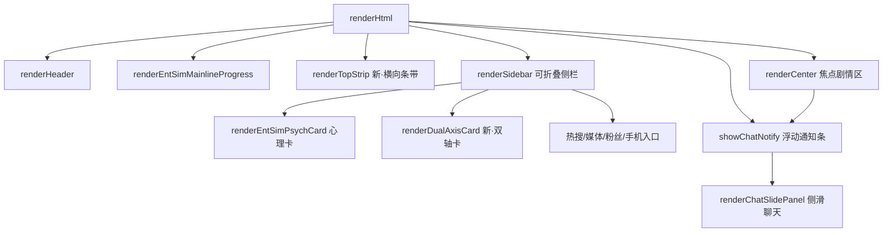

## 用户需求

用户要求将以下三项纳入计划并执行：

1. **全量审计前置**：逐行审计 ent-sim 下全部 JS 文件（~156个文件，含 pools/ 目录140个 + 根目录16个），逐一统计每个池子文件的当前条目数量是否达到 plan 要求，检查条目内容质量（重复/格式不一致/require门控缺失），审计 data.js/cycle.js/parser.js/test-mode.js 等未审查的核心文件完整逻辑。

2. **模块7·池子扩充412条**：按7大类向现有池子文件追加412条事件文本（行业C+73/聊天G+142/恋爱A+92/事业B+60/突发E+16/人物F+15/氛围H+14），每条遵循各文件现有格式。

3. **模块8剩余3项UI视觉增强**：

- 焦点布局重构（三栏 es-left/es-center/es-right → 焦点式+可折叠侧栏）
- 人气x恋爱双轴状态卡（新建渲染函数，纯CSS定位）
- 聊天嵌入通知条+侧滑面板（消息到达时顶部弹通知，点击侧滑展开）

## 产品概述

entSim 娱乐圈模拟器的收尾工程：先做全量代码审计确保现有代码质量，再扩充412条池子事件文本丰富游戏内容，最后完成3项UI视觉增强提升交互体验。审计作为前置任务，发现的问题在扩充和UI改造时一并修复。

## 核心功能

- 全量审计：用 code-explorer 扫描 ent-sim 全部156个JS文件，输出条目数统计表+质量问题清单
- 池子扩充：向约50个现有池子文件追加412条事件文本，保持格式一致性，合理设置require门控
- 焦点布局：三栏改为顶部条带+焦点剧情区(70%)+可折叠侧栏(340px)，侧栏含心理卡/双轴卡/热搜/手机入口
- 双轴卡：人气(横轴0-100)x好感(纵轴0-100)的二维状态可视化，状态点位置决定困境类型
- 聊天嵌入：男主新消息时剧情区顶部弹非遮挡通知条(3秒淡出)，点击侧滑展开40%宽度聊天面板含3个预设回复

## 技术栈

- 语言/运行时：JavaScript (ES Modules)，Node.js 18+，遵循现有 `var` + 字符串拼接风格
- 构建：Vite 5.4
- 无新依赖，所有修改为池子文本追加 + CSS/JS布局调整 + 新增渲染函数

## 实现方案

### 前置审计（code-explorer subagent）

用 code-explorer 对 ent-sim 全部文件做三轮扫描：

1. **条目数统计**：对 pools/ 目录每个 .js 文件搜索条目模式（`{key:` / `{t:` / `{q:` / `{text:` / `{brand:` / `{phase:`），输出文件名+条目数+目标条目数+差额
2. **格式一致性检查**：检查每个文件的条目是否遵循统一格式（字段名/require语法/exposure/popDelta等），标记格式异常条目
3. **核心文件审计**：逐行审查 data.js / cycle.js / parser.js / test-mode.js / public-opinion.js / npc-network.js / immersion.js / memory.js 的逻辑正确性、未定义引用、边界处理

审计输出一份清单：哪些池子需要补多少条、哪些有条目质量问题、哪些核心文件有逻辑bug。后续扩充和UI改造时一并修复。

### 模块7·池子扩充（412条）

按审计输出的差额表，向各池子文件追加条目。分3批并行执行：

**批次1·行业+聊天（+215条）**：

- incident-events.js(+20) / special-events.js(+15) / company-events.js(+18) / dating-scandal-chain.js(+10) / dispatch-news.js(+10) = +73
- chat-stage/13成员文件各+8=104 / chat-male-lead.js(+20) / chat-brother.js(+8) / chat-rival.js(+6) / chat-manager.js(+4) = +142

**批次2·恋爱+事业（+152条）**：

- romance-backstage(+8) / romance-latenight(+8) / romance-public(+8) / romance-crisis(+6) / romance-jealousy(+6) / romance-confession(+6) / secret-comms(+6) / secret-nearmiss(+6) / secret-fan-clues(+6) / secret-company-warning(+6) / drama-almost(+6) / drama-misunderstand(+6) / drama-coldwar(+6) / drama-dating-rumor(+6) / drama-dilemma(+6) = +92
- brand-offers(+8) / variety-shows(+8) / magazine-shoots(+6) / comeback-cycle(+6) / concert-pool(+6) / music-show-pool(+6) / fansign-pool(+6) / milestone-debut(+5) / job-grade(+5) / career-setbacks(+4) = +60

**批次3·突发+人物+氛围（+45条）**：

- health-injury(+4) / sasaeng-escalation(+3) / toxic-fan-war(+3) / cheer-culture(+2) / year-end-review(+2) / mv-filming(+2) = +16
- encounter-ml(+3) / encounter-rival(+3) / encounter-brother(+3) / encounter-others(+3) / teammate-bond(+3) = +15
- atmosphere-weather(+5) / atmosphere-mood(+5) / atmosphere-his-state(+4) = +14

条目格式严格遵循各文件现有结构。require字段使用_utils.js已支持语法：`aff>=N` / `popularity>=N` / `debut` / `trainee` / `traineePhase=N` / `month=N` / `season=X`。

### 模块8-A·焦点布局重构

**当前结构**（ui.js:205-209）：

```
es-grid → es-left(240px) + es-center(flex:1) + es-right(280px)
```

**目标结构**：

```
es-focus-layout
  ├─ es-top-strip（横向条带：行程+队友，可折叠为单行摘要）
  ├─ es-main-row
  │   ├─ es-focus-center（flex:1，剧情区+选项+自由输入）
  │   └─ es-sidebar（340px，可折叠，含心理卡+双轴卡+热搜+手机入口）
  └─ es-chat-notify（浮动通知条，绝对定位）
```

**修改点**：

- ui.js renderHtml()（行205-209）：重写grid HTML结构，renderLeft内容改为顶部条带，renderRight改为可折叠侧栏
- ui.js 新增 toggleSidebar() 函数 + GS._entSimSidebarCollapsed 状态
- style.css：新增 .es-focus-layout / .es-top-strip / .es-sidebar / .es-sidebar-collapsed 样式，复用现有CSS变量
- 响应式：768px以下侧栏全宽纵向堆叠（保持现有行为）
- bindEntSimEvents中事件绑定不受影响（选择器仍在DOM中，只是层级变了）

### 模块8-B·人气x恋爱双轴状态卡

新建 `renderDualAxisCard(E)` 函数（ui.js，放在renderEntSimPsychCard附近）：

- 卡片尺寸280x180px，横轴人气0-100（糊团/新人/上升/顶流/传奇），纵轴好感0-100（初遇/暧昧/明确/深度/极致）
- 状态点：CSS绝对定位 left=popularity%, bottom=affection%，8px圆形紫色发光+脉冲动画
- 困境文字：根据象限组合生成（低人气高好感=自卑距离感/高人气高好感=曝光高危区/低人气低好感=默默无闻/高人气低好感=忙碌疏离）
- 背景网格：淡紫色虚线，4象限分色（左下蓝/右下绿/左上黄/右上红）
- 插入位置：侧栏中心理卡下方

### 模块8-C·聊天嵌入通知条+侧滑面板

**触发点**：所有 `GS._entSimChatHistory.maleLead.push({ role: 'ai', content: ... })` 之后调用 `showChatNotify(content)`

- 通知条：浮动在es-focus-center顶部，绝对定位，深色半透明+紫色边框，含头像+消息预览+展开按钮，3秒自动淡出
- 侧滑面板：从右侧滑入，宽度40%（min 320px），半透明遮罩覆盖剩余区域，含最近5条消息+3个预设回复气泡+输入框
- 新建函数：showChatNotify(msg) / renderChatSlidePanel() / toggleChatSlide()
- style.css新增 .es-chat-notify / .es-chat-slide / .es-chat-overlay 动画样式
- 消息气泡复用现有bubble-chat样式

## 实现要点

- 审计作为前置任务，发现的问题在扩充和UI改造时一并修复（不单独开修复任务）
- 池子扩充时保持现有条目的require门控风格，新增条目按好感/人气/阶段合理设置require
- 焦点布局重构需保持renderLeft/renderCenter/renderRight三个函数内部逻辑不变，只改外层HTML结构和CSS
- 双轴卡用纯CSS定位（absolute + 百分比），不用Canvas（轻量+响应式友好）
- 聊天通知条用CSS animation（slideIn+fadeOut），不引入JS动画库
- 所有新增HTML中AI生成文本必须经escHtml()转义
- 侧栏折叠状态用GS._entSimSidebarCollapsed持久化到存档

## 架构设计



## 目录结构

```
src/ent-sim/
├── ui.js                    # [MODIFY] renderHtml焦点布局+renderDualAxisCard+showChatNotify+renderChatSlidePanel+toggleSidebar
├── style.css                # [MODIFY] 新增es-focus-layout/es-top-strip/es-sidebar/es-dual-axis/es-chat-notify/es-chat-slide样式
├── pools/
│   ├── incident-events.js   # [MODIFY] +20条行业突发
│   ├── special-events.js    # [MODIFY] +15条特殊事件
│   ├── company-events.js    # [MODIFY] +18条公司事件
│   ├── dating-scandal-chain.js # [MODIFY] +10条绯闻链
│   ├── dispatch-news.js     # [MODIFY] +10条D社新闻
│   ├── chat-stage/*.js      # [MODIFY] 13文件各+8条=104条
│   ├── chat-male-lead.js    # [MODIFY] +20条男主预设
│   ├── chat-brother.js      # [MODIFY] +8条哥哥预设
│   ├── chat-rival.js        # [MODIFY] +6条情敌预设
│   ├── chat-manager.js      # [MODIFY] +4条经纪人预设
│   ├── romance-backstage.js # [MODIFY] +8条
│   ├── romance-latenight.js # [MODIFY] +8条
│   ├── romance-public.js    # [MODIFY] +8条
│   ├── romance-crisis.js    # [MODIFY] +6条
│   ├── romance-jealousy.js  # [MODIFY] +6条
│   ├── romance-confession.js # [MODIFY] +6条
│   ├── secret-comms.js      # [MODIFY] +6条
│   ├── secret-nearmiss.js   # [MODIFY] +6条
│   ├── secret-fan-clues.js  # [MODIFY] +6条
│   ├── secret-company-warning.js # [MODIFY] +6条
│   ├── drama-almost.js      # [MODIFY] +6条
│   ├── drama-misunderstand.js # [MODIFY] +6条
│   ├── drama-coldwar.js     # [MODIFY] +6条
│   ├── drama-dating-rumor.js # [MODIFY] +6条
│   ├── drama-dilemma.js     # [MODIFY] +6条
│   ├── brand-offers.js      # [MODIFY] +8条
│   ├── variety-shows.js     # [MODIFY] +8条
│   ├── magazine-shoots.js   # [MODIFY] +6条
│   ├── comeback-cycle.js    # [MODIFY] +6条
│   ├── concert-pool.js      # [MODIFY] +6条
│   ├── music-show-pool.js   # [MODIFY] +6条
│   ├── fansign-pool.js      # [MODIFY] +6条
│   ├── milestone-debut.js   # [MODIFY] +5条
│   ├── job-grade.js         # [MODIFY] +5条
│   ├── career-setbacks.js   # [MODIFY] +4条
│   ├── health-injury.js     # [MODIFY] +4条
│   ├── sasaeng-escalation.js # [MODIFY] +3条
│   ├── toxic-fan-war.js     # [MODIFY] +3条
│   ├── cheer-culture.js     # [MODIFY] +2条
│   ├── year-end-review.js   # [MODIFY] +2条
│   ├── mv-filming.js        # [MODIFY] +2条
│   ├── encounter-ml.js      # [MODIFY] +3条
│   ├── encounter-rival.js   # [MODIFY] +3条
│   ├── encounter-brother.js # [MODIFY] +3条
│   ├── encounter-others.js  # [MODIFY] +3条
│   ├── teammate-bond.js     # [MODIFY] +3条
│   ├── atmosphere-weather.js # [MODIFY] +5条
│   ├── atmosphere-mood.js   # [MODIFY] +5条
│   └── atmosphere-his-state.js # [MODIFY] +4条
└── (共约50个池子文件追加内容)
```

## 设计风格

保留现有深紫色调配色方案，在焦点布局下优化信息层级和视觉引导。从"功能罗列式"三栏布局转变为"焦点式"单焦点+可折叠侧栏布局。核心原则：屏幕上只显示"玩家当前需要关注的事"，用视觉引导注意力。

### 布局变化

- 顶部条带（es-top-strip）：将原左侧栏的行程+队友信息压缩为横向条带，高度约80px，可折叠收起为单行摘要
- 焦点剧情区（es-focus-center）：占据主视觉区域，宽度提升至70%+，剧情文本最大高度增大，沉浸感增强
- 可折叠侧栏（es-sidebar）：340px固定宽度，右侧浮动，含心理卡+双轴卡+热搜+手机入口；折叠后缩为48px图标条
- 聊天通知条：浮动在剧情区右上角，深色半透明背景+紫色边框，含头像+消息预览+展开按钮，3秒淡出

### 双轴卡设计

- 卡片尺寸：280x180px
- 横轴标签：糊团 / 新人 / 上升 / 顶流 / 传奇
- 纵轴标签：初遇 / 暧昧 / 明确 / 深度 / 极致
- 状态点：8px圆形，紫色发光，带脉冲动画
- 困境标签：状态点旁浮出文字气泡，颜色随困境类型变化（红=高危/黄=焦虑/绿=安全/蓝=平淡）
- 背景网格：淡紫色虚线网格，4象限分色（左下蓝/右下绿/左上黄/右上红）

### 聊天侧滑面板

- 宽度40%（min 320px），从右侧滑入
- 半透明遮罩（rgba(0,0,0,.3)）覆盖剩余区域
- 面板内：消息列表（最近5条）+ 3个预设回复气泡 + 输入框
- 消息气泡样式复用现有bubble-chat样式

## Agent Extensions

### SubAgent

- **code-explorer**
- Purpose: 全量审计ent-sim目录下全部156个JS文件——统计每个池子文件的精确条目数、检查格式一致性（字段名/require语法/exposure值）、审计data.js/cycle.js/parser.js/test-mode.js等核心文件的逻辑正确性和未定义引用
- Expected outcome: 输出完整的审计报告，包含：(1)每个池子文件的文件名+当前条目数+目标条目数+差额表；(2)格式异常条目清单（字段缺失/require语法错误/重复key）；(3)核心文件逻辑bug清单。后续池子扩充和UI改造时根据此报告执行