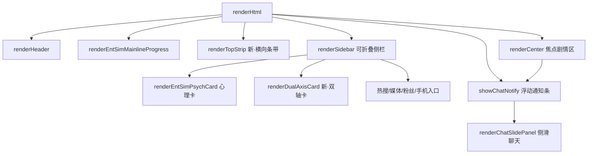

## 产品概述

完成 entSim 娱乐圈模拟器剩余远期项：模块7现有池子扩充412条事件文本 + 模块8剩余3项UI视觉增强（焦点布局重构、人气x恋爱双轴状态卡、聊天嵌入通知条）。

## 核心功能

- 模块7：按7大类向现有池子文件追加412条事件文本（行业C+73/聊天G+142/恋爱A+92/事业B+60/突发E+16/人物F+15/氛围H+14），每条遵循各文件现有格式（key/text/require字段），require使用_utils.js已支持的语法（aff>=N/popularity>=N/debut/trainee/month=N等）
- 模块8-A：将ui.js renderHtml的三栏布局（es-left 240px / es-center flex:1 / es-right 280px）重构为焦点式布局——剧情区为主焦点（70%宽度）+ 可折叠右侧侧栏（30%，含心理卡/热搜/手机入口），左侧栏（行程/队友）改为顶部横向条带或折叠抽屉
- 模块8-B：新建人气x恋爱双轴状态卡渲染函数，横轴=人气（糊团0→顶流100），纵轴=好感（初遇0→深度100），女主状态点位置决定当前恋爱困境类型（如低人气高好感="自卑距离感"、高人气低好感="忙碌疏离"、双高="曝光高危区"），纯CSS+JS定位实现
- 模块8-C：聊天嵌入通知条——男主推送新消息时在剧情区顶部弹出非遮挡通知条（3秒自动消失或点击展开），点击后侧滑展开聊天面板（40%宽度覆盖在剧情区上方，剧情区不消失只缩小），含3个预设回复气泡

## 技术栈

- 语言：JavaScript (ES Modules)，Node.js 18+，遵循现有 `var` + 字符串拼接风格
- 构建：Vite 5.4
- 无新依赖，所有修改为池子文本追加 + CSS/JS布局调整 + 新增渲染函数

## 实现方案

### 模块7·池子扩充（412条纯内容）

按7大类分批追加，每批内按文件粒度操作。条目格式严格遵循各文件现有结构：

- 行业事件类（C+73）：incident-events.js用`{cat:'xxx',t:'文本',popDelta:N,aff:N}`格式；special-events.js用`{key:'xxx',text:'文本',exposure:N,popDelta:N}`格式；company-events.js用`{key:'xxx',text:'文本',require:'xxx'}`
- 聊天类（G+142）：chat-stage/目录13成员文件每文件追加约8条`{q:'快捷文本',r:['回复1','回复2']}`；chat-male-lead.js追加`{q,r[]}`格式预设
- 恋爱类（A+92）：romance-*.js用`{key:'xxx',text:'文本',require:'aff>=N'}`格式；secret-*.js/drama-*.js同理
- 事业类（B+60）：brand-offers.js用`{brand:'xxx',desc:'文本',exposure:N,pop:N}`格式；variety-shows.js/magazine.js等同理
- 突发/人物/氛围（E+F+H=45条）：health-injury.js/sasaeng-escalation.js/encounter-*.js/atmosphere-*.js等按各自格式追加

require字段门控语法（_utils.js _checkSingle已支持）：`aff>=N` / `popularity>=N` / `debut` / `trainee` / `traineePhase=N` / `month=N` / `season=X` / `mainline=节点ID`

### 模块8-A·焦点布局重构

**当前结构**（ui.js:205-209）：

```
es-grid → es-left(240px) + es-center(flex:1) + es-right(280px)
```

**目标结构**：

```
es-focus-layout
  ├─ es-top-strip（横向条带：行程+队友，可折叠）
  ├─ es-main-row
  │   ├─ es-focus-center（flex:1，剧情区+选项+自由输入）
  │   └─ es-sidebar（340px，可折叠，含心理卡+双轴卡+热搜+手机入口）
  └─ es-chat-notify（浮动通知条，绝对定位）
```

**修改点**：

- ui.js renderHtml()（行205-209）：重写grid HTML结构，左侧栏内容（renderLeft）改为顶部条带，右侧栏（renderRight）改为可折叠侧栏
- ui.js 新增 toggleSidebar() 函数 + GS._entSimSidebarCollapsed 状态
- style.css：新增 .es-focus-layout / .es-top-strip / .es-sidebar / .es-sidebar-collapsed 样式，复用现有CSS变量
- 响应式：768px以下侧栏全宽纵向堆叠（保持现有行为）

### 模块8-B·人气x恋爱双轴状态卡

**新建函数** `renderDualAxisCard(E)`（ui.js，放在renderEntSimPsychCard附近）：

- 横轴：人气0-100（糊团→新人→上升→顶流→传奇），5档标签
- 纵轴：好感0-100（初遇→相识→暧昧→明确→深度→极致），对应AFFECTION_STAGES
- 状态点：CSS绝对定位，left=popularity%，bottom=affection%
- 困境文字：根据象限组合生成（低人气高好感=自卑/高人气高好感=曝光风险/低人气低好感=默默无闻/高人气低好感=忙碌疏离）
- 插入位置：renderRight()侧栏中，心理卡下方

### 模块8-C·聊天嵌入通知条

**触发点**：所有 `GS._entSimChatHistory.maleLead.push({ role: 'ai', content: ... })` 之后调用 `showChatNotify(content)`

- 通知条：浮动在es-focus-center顶部，绝对定位，3秒自动消失，点击展开侧滑面板
- 侧滑面板：从右侧滑入，宽度40%（min 320px），覆盖在剧情区上方（z-index高于剧情），含最近5条消息+3个预设回复气泡+输入框
- 关闭：点击遮罩或关闭按钮收起
- 新建函数：showChatNotify(msg) / renderChatSlidePanel() / toggleChatSlide()

## 实现要点

- 池子扩充时保持现有条目的require门控风格，新增条目按好感/人气/阶段合理设置require
- 焦点布局重构需保持renderLeft/renderCenter/renderRight三个函数的内部逻辑不变，只改外层HTML结构和CSS
- 双轴卡用纯CSS定位（absolute + 百分比），不用Canvas（轻量+响应式友好）
- 聊天通知条用CSS animation（slideIn+fadeOut），不引入JS动画库
- 所有新增HTML中AI生成文本必须经escHtml()转义
- 侧栏折叠状态用GS._entSimSidebarCollapsed持久化到存档

## 架构设计



## 目录结构

```
src/ent-sim/
├── ui.js                    # [MODIFY] renderHtml焦点布局重构+renderDualAxisCard新增+showChatNotify+renderChatSlidePanel+toggleSidebar
├── style.css                # [MODIFY] 新增es-focus-layout/es-top-strip/es-sidebar/es-dual-axis/es-chat-notify/es-chat-slide样式
├── pools/
│   ├── incident-events.js   # [MODIFY] +20条行业突发
│   ├── special-events.js    # [MODIFY] +15条特殊事件
│   ├── company-events.js    # [MODIFY] +18条公司事件
│   ├── dating-scandal-chain.js # [MODIFY] +10条绯闻链
│   ├── dispatch-news.js     # [MODIFY] +10条D社新闻
│   ├── chat-stage/*.js      # [MODIFY] 13文件各+8条=104条
│   ├── chat-male-lead.js    # [MODIFY] +20条男主预设
│   ├── chat-brother.js      # [MODIFY] +8条哥哥预设
│   ├── chat-rival.js        # [MODIFY] +6条情敌预设
│   ├── chat-manager.js      # [MODIFY] +4条经纪人预设
│   ├── romance-backstage.js # [MODIFY] +8条后台
│   ├── romance-latenight.js # [MODIFY] +8条深夜
│   ├── romance-public.js    # [MODIFY] +8条公共
│   ├── romance-crisis.js    # [MODIFY] +6条危机
│   ├── romance-jealousy.js  # [MODIFY] +6条吃醋
│   ├── romance-confession.js # [MODIFY] +6条告白
│   ├── secret-comms.js      # [MODIFY] +6条秘密通讯
│   ├── secret-nearmiss.js   # [MODIFY] +6条差点暴露
│   ├── secret-fan-clues.js  # [MODIFY] +6条粉丝线索
│   ├── secret-company.js    # [MODIFY] +6条公司警告
│   ├── drama-almost.js      # [MODIFY] +6条差点告白
│   ├── drama-misunderstand.js # [MODIFY] +6条误会
│   ├── drama-coldwar.js     # [MODIFY] +6条冷战
│   ├── drama-dating-rumor.js # [MODIFY] +6条绯闻
│   ├── drama-dilemma.js     # [MODIFY] +6条困境
│   ├── brand-offers.js      # [MODIFY] +8条代言
│   ├── variety-shows.js     # [MODIFY] +8条综艺
│   ├── magazine.js          # [MODIFY] +6条画报
│   ├── comeback-cycle.js    # [MODIFY] +6条回归
│   ├── concert.js           # [MODIFY] +6条演唱会
│   ├── music-show.js        # [MODIFY] +6条打歌
│   ├── fansign.js           # [MODIFY] +6条签售
│   ├── milestone-debut.js   # [MODIFY] +5条里程碑
│   ├── job-grade.js         # [MODIFY] +5条职级
│   ├── career-setbacks.js   # [MODIFY] +4条事业挫折
│   ├── health-injury.js     # [MODIFY] +4条健康
│   ├── sasaeng-escalation.js # [MODIFY] +3条私生
│   ├── toxic-fan-war.js     # [MODIFY] +3条粉战
│   ├── cheer-culture.js     # [MODIFY] +2条应援
│   ├── year-end-review.js   # [MODIFY] +2条年末
│   ├── mv-filming.js        # [MODIFY] +2条MV
│   ├── encounter-ml.js      # [MODIFY] +3条偶遇男主
│   ├── encounter-rival.js   # [MODIFY] +3条偶遇情敌
│   ├── encounter-brother.js # [MODIFY] +3条哥哥撞见
│   ├── encounter-others.js  # [MODIFY] +3条旁人
│   ├── teammate-bond.js     # [MODIFY] +3条羁绊
│   ├── atmosphere-weather.js # [MODIFY] +5条天气
│   ├── atmosphere-mood.js   # [MODIFY] +5条心情
│   ├── atmosphere-his-state.js # [MODIFY] +4条男主状态
└── (共约50个池子文件追加内容)
```

## 设计风格

保留现有深紫色调配色方案，在焦点布局下优化信息层级和视觉引导。

### 布局变化

- 顶部条带（es-top-strip）：将原左侧栏的行程+队友信息压缩为横向条带，高度约80px，可折叠收起为单行摘要
- 焦点剧情区（es-focus-center）：占据主视觉区域，宽度提升至70%+，剧情文本最大高度增大，沉浸感增强
- 可折叠侧栏（es-sidebar）：340px固定宽度，右侧浮动，含心理卡+双轴卡+热搜+手机入口；折叠后缩为48px图标条
- 聊天通知条：浮动在剧情区右上角，深色半透明背景+紫色边框，含头像+消息预览+展开按钮，3秒淡出

### 双轴卡设计

- 卡片尺寸：280x180px
- 横轴标签：糊团 / 新人 / 上升 / 顶流 / 传奇
- 纵轴标签：初遇 / 暧昧 / 明确 / 深度 / 极致
- 状态点：8px圆形，紫色发光，带脉冲动画
- 困境标签：状态点旁浮出文字气泡，颜色随困境类型变化（红=高危/黄=焦虑/绿=安全/蓝=平淡）
- 背景网格：淡紫色虚线网格，4象限分色（左下蓝/右下绿/左上黄/右上红）

### 聊天侧滑面板

- 宽度40%（min 320px），从右侧滑入
- 半透明遮罩（rgba(0,0,0,.3)）覆盖剩余区域
- 面板内：消息列表（最近5条）+ 3个预设回复气泡 + 输入框
- 消息气泡样式复用现有bubble-chat样式

## Agent Extensions

### SubAgent

- **code-explorer**
- Purpose: 在焦点布局重构时确认renderLeft/renderRight/renderCenter内部所有DOM选择器和事件绑定的精确位置，避免重构后事件丢失
- Expected outcome: 确认bindEntSimEvents中所有事件绑定对应的CSS选择器，确保布局重构后选择器仍能匹配