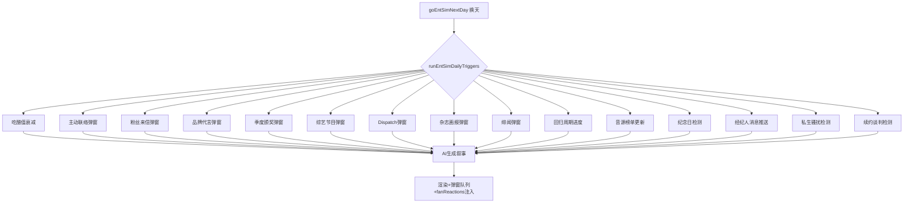
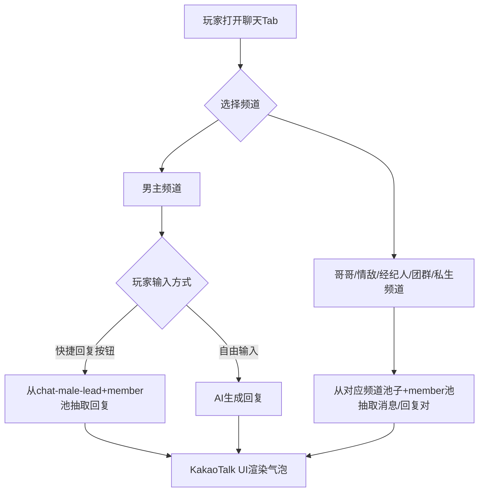

## 产品概述

entSim V6 终极架构：将娱乐圈模拟器的全部内容系统拆分为 54 个独立预写池子文件（约 7200 条预写内容），修复 6 个关键 Bug，触发间隔压缩至 1-4 天级，人气涨速降低 60-70%，引入 7 年游戏时间轴和 8 阶段事业路径。新建 KakaoTalk 风格 6 频道聊天系统（含 13 位 SEVENTEEN 成员独立行为池）、7 阶段亲密系统、4 维技能面板。总计约 58 个文件变更，全部代码驱动，AI 仅保留 7 处调用。

## 核心功能

### 1. 54 个预写池子（~7200 条）

旧池拆分 17 + AI 替代 2 + 增强模块 6 + 真实化模块 4 + 女团身份池 7 + 逆境池 1 + 聊天池 6 + 好感铺垫池 1 + 成员行为池 13 = 54。每个事件条目内嵌 fanReactions 子数组（5 条短评），触发时自动抽取 3 条注入右栏粉丝讨论区。pools/index.js 统一 re-export，pools/_utils.js 提供 pickFromPool() 函数（支持按 cat 过滤和轮替避免重复）。

### 2. 聊天系统架构（最终确认）

6 个聊天频道，KakaoTalk 风格手机框 UI。频道切换通过左侧对话列表（圆头像+名字+最后一条预览）。每个频道显示绿色/灰色气泡+时间戳+底部快捷回复按钮行。

AI 使用规则：

- 男主聊天：快捷回复按钮 → 从 chat-male-lead.js 池子抽取回复（不走 AI）；自由输入 → AI 生成回复
- 哥哥聊天：100% 池子，从 chat-brother.js + member-hoshi.js 抽取消息+回复对，不调 AI
- 情敌聊天：100% 池子，从 chat-rival.js + member-mingyu.js 抽取消息+回复对，不调 AI
- 经纪人聊天：100% 池子，从 chat-manager.js 抽取通知/警告/行程，不调 AI
- 团群聊 ECLIPSE：100% 池子，从 chat-group.js 按事件类型（初一位/绯闻/负面新闻/回归/日常）各抽 1-2 条，不调 AI
- 私生骚扰：100% 池子，从 chat-sasaeng.js 抽取，不可回复仅展示，人气≥25 后每天 8% 概率触发，触发后冷却 5 天，不调 AI

快捷回复按钮 3 行动态切换：低好感(0-20)仅问候类+舞台类，中好感(20-50)增加轻微暧昧，高好感(50+)增加直接表达+吃醋按钮，特定事件后临时出现上下文按钮。

### 3. 13 个 SEVENTEEN 成员行为池

每个成员 50 条，按本人的 loveStyle/personality/traits/catchphrases 写预写回复：

- S.Coups——沉稳大哥·话少但有分量·"决定了就别后悔"
- Jeonghan——温柔腹黑·笑着坑人·"我什么都没说哦"
- Joshua——绅士温柔·美式反应·"That's cool"
- Jun——安静神秘·突然金句·"……我觉得你做得对"
- Hoshi——热情活力·emoji 狂魔·"아!!!!대박!!"
- Wonwoo——低沉内敛·眼镜+书·"嗯。我在听。"
- Woozi——傲娇害羞·才华横溢·"…还可以吧"（其实开心）
- DK——阳光开朗·大嗓门·"하하하하하!!"
- Mingyu——温柔体贴·会做饭·"给你带了吃的"
- The8——冷静哲思·养生·"喝茶吗"
- Seungkwan——活泼搞笑·话多·"我跟你说!!!!"
- Vernon——随性酷帅·有点电波·"yeah that's dope"
- Dino——努力忙内·认真·"我会继续加油的"

聊天时按角色取对应池：男主=wonwoo 池 / 哥哥=hoshi 池 / 情敌=mingyu 池。团群聊里谁说话就取谁的池。

### 4. 修复 6 个 Bug

1. state.js migrateSave() 缺失 8 个 v2 字段兜底（_jealousLevel/_intimacyUnlocked/_romanceMilestones/_maleContactTimer/_lastFanLetterDay/_lastBrandOfferDay/_releaseCD/_lastAwardDay）
2. 主动联络无独立弹窗，需新增 showMaleContactPopup() 函数，在 engine.js goEntSimNextDay 中触发时推入 _entSimPopupQueue
3. CONTACT_TYPE_POOL 缺 brother_relay 和 brother_tentative 死代码分支
4. 纪念日仅 toast 一闪而过，需在恋情面板 renderLovePanel 新增纪念日折叠行
5. romance.js 第 116 行好感≥100 后 sweetMaxRound 每次好感变动都覆盖，导致结局按钮永远无法出现
6. romance.js 中 getRomanceStageLabel/getRomanceStageIcon/getRomanceEmotion/setEmotion 共 4 个函数缺 GS.entSim null 检查

### 5. 7 阶段亲密系统

牵手(好感≥15)→拥抱(≥30)→接吻(≥50)→同床(≥65)→同居(≥80)→公开恋情(≥90 主动弹窗选择)→求婚结婚(≥100)

### 6. 7 年游戏时间轴 + 8 阶段事业路径

~12 游戏天=1 游戏年，80 天约 7 年。Year0 练习生→Year1 出道→Year2 初一位→Year3 二线→Year4 当红→Year5 一线→Year6-7 传奇+续约/解散+结局。新增 debutDay/yearsActive/contractYears/contractRemaining 字段。UI 左栏显示"Year X 合约剩余 Y 年"。周年纪念事件触发，续约谈判 Y3/Y5/Y7。

8 阶段事业路径按人气阈值驱动：

- phase0 练习生(人气 0-9)→ phase1 出道(10-19)→ phase2 初一位(20-29)→ phase3 上升(30-39)→ phase4 二线(40-54)→ phase5 当红(55-69)→ phase6 一线(70-84)→ phase7 传奇(85+)

初一位条件：人气≥25 + 回归周期进行中 + 打歌第2-3天 + 50%概率，未过则下次概率+20%。

4 维技能面板：唱功初始 60 / 舞蹈初始 45 / 综艺初始 30 / 视觉初始 80，左栏紧凑展示。每次相关事件后 +1~2 点。

### 7. AI 保留（7 处）

剧情正文、选项、男主聊天自由输入回复、泡泡内容、日记填空、记忆压缩、种子/结局。

## 技术栈

- 语言：JavaScript (ES Modules)，使用 var 声明，字符串拼接用 + 运算符
- 架构：纯前端单页应用，Vite 构建
- 数据：预写静态池 + localStorage 存档
- AI：DeepSeek chat API（仅 7 处调用）

## 核心数据流



## 聊天系统数据流



## 目录结构（54 个池子文件）

```
src/ent-sim/pools/
├── index.js                    [NEW] 统一 re-export 54 池子+pickFromPool
├── _utils.js                   [NEW] pickFromPool(按cat过滤+轮替)
├── fan-letters.js              (200条,fanReactions)
├── brand-offers.js             (150条,fanReactions)
├── male-contact.js             (120条+options数组)
├── releases.js                 (120条,fanReactions)
├── awards.js                   (80条,fanReactions)
├── daily-buzz.js               (300条)
├── hot-search-replies.js       (200条,fanReplies+mediaTake) [NEW]
├── news-templates.js           (130条)
├── daily-engagement.js         (120条,fanReactions)
├── girlgroup-events.js         (120条,fanReactions)
├── oneheart-events.js          (80条)
├── svt-teammate.js             (100条)
├── ent-schedule.js             (150条,{morning,afternoon,evening})
├── brother-events.js           (80条)
├── male-lead-init.js           (80条)
├── special-events.js           (80条)
├── jealousy-events.js          (100条)
├── incident-events.js          (100条)
├── diary-templates.js          (60条) [NEW]
├── variety-shows.js            (100条,fanReactions) [NEW]
├── dispatch-news.js            (80条,fanReactions) [NEW]
├── magazine-shoots.js          (80条,fanReactions) [NEW]
├── music-charts.js             (60条,fanReactions) [NEW]
├── dating-rumors.js            (80条,fanReactions) [NEW]
├── comeback-cycle.js           (100条,fanReactions) [NEW]
├── concert-pool.js             (80条,fanReactions) [NEW]
├── music-show-pool.js          (60条,fanReactions) [NEW]
├── fansign-pool.js             (50条,fanReactions) [NEW]
├── career-setbacks.js          (200条,fanReactions) [NEW]
├── group-names.js              (60条,含fandom配对) [NEW]
├── company-names.js            (20条) [NEW]
├── group-concepts.js           (40条) [NEW]
├── hit-songs.js                (80条) [NEW]
├── teammate-names.js           (100条) [NEW]
├── sister-roles.js             (30条) [NEW]
├── contact-progression.js      (60条) [NEW]
├── chat-male-lead.js           (200条,含快捷回复选项) [NEW]
├── chat-brother.js             (80条,{from,msg,reply,time}) [NEW]
├── chat-rival.js               (60条,{from,msg,reply,time}) [NEW]
├── chat-manager.js             (40条,{from,msg,reply,time}) [NEW]
├── chat-group.js               (60条,按事件分类{first_win,scandal,negative_news,comeback,daily}) [NEW]
├── chat-sasaeng.js             (30条,{from,msg,time},不可回复) [NEW]
├── member-scoups.js            (50条,沉稳大哥) [NEW]
├── member-jeonghan.js          (50条,温柔腹黑) [NEW]
├── member-joshua.js            (50条,绅士温柔) [NEW]
├── member-jun.js               (50条,安静神秘) [NEW]
├── member-hoshi.js             (50条,热情活力) [NEW]
├── member-wonwoo.js            (50条,低沉内敛) [NEW]
├── member-woozi.js             (50条,傲娇害羞) [NEW]
├── member-dk.js                (50条,阳光开朗) [NEW]
├── member-mingyu.js            (50条,温柔体贴) [NEW]
├── member-the8.js              (50条,冷静哲思) [NEW]
├── member-seungkwan.js         (50条,活泼搞笑) [NEW]
├── member-vernon.js            (50条,随性酷帅) [NEW]
└── member-dino.js              (50条,努力忙内) [NEW]
```

## 聊天池子数据结构

男主池 chat-male-lead.js：

```js
var CHAT_MALE_LEAD = [
  { cat:'greet', q:'今天怎么样', r:['刚结束录音，嗓子有点哑。','在想你的舞台。'], aff:1 },
  { cat:'stage', q:'今天的舞台超棒', r:['你看到了？副歌改了一句。','我自己改的——想给你不一样的感觉。'], aff:2 },
  // ...共200条
];
```

成员行为池 member-wonwoo.js：

```js
var MEMBER_WONWOO = [
  { cat:'reply', trigger:'被夸舞台', r:['嗯。那个高音——我自己改了。','只是想试试不一样的。'], aff:1 },
  { cat:'reply', trigger:'被问心情', r:['还行。','没什么特别的。'], aff:0 },
  // ...共50条
];
```

团群聊 chat-group.js：

```js
var GROUP_CHAT = {
  first_win: [
    { from:'恩率', msg:'啊啊啊啊啊啊一位！！！', time:'18:02' },
    { from:'知允', msg:'我在待机室哭得妆全花了', time:'18:02' },
  ],
  scandal: [
    { from:'秀妍', msg:'看到新闻了。没事吧？', time:'09:15' },
    { from:'宥娜', msg:'公司说别回应，让他们说去', time:'09:17' },
  ],
  negative_news: [
    { from:'知允', msg:'别上网看评论。别看。', time:'14:22' },
  ],
  comeback: [
    { from:'恩率', msg:'预告照发了！评论区都在说蓝发', time:'00:01' },
  ],
  daily: [
    { from:'彩琳', msg:'谁把练习室的空调遥控器拿走了', time:'11:30' },
  ]
};
```

## 涉及修改的现有文件（12 个）

| 文件 | 改动 |
| --- | --- |
| src/state.js | migrateSave() 补 8 字段兜底，新增 _entSimPopupQueue/debutDay/yearsActive/contractYears/contractRemaining 字段 |
| src/ent-sim/state.js | career 新增 debutDay，起始人气固定 3，新增 skills:{vocal:60,dance:45,variety:30,visual:80} |
| src/ent-sim/engine.js | runEntSimDailyTriggers() 统一 14 触发器，间隔全缩短，人气涨速调低，聊天 pool+AI 混合调度，成员池接入，回归/演唱会周期管理 |
| src/ent-sim/ui.js | KakaoTalk 聊天 UI 重构（6 频道+手机框+快捷回复+频道切换），6 弹窗函数，恋情面板纪念日，技能条，回归进度条，时间轴，私生展示 |
| src/ent-sim/romance.js | Bug5/6 修复，亲密系统新增同床/同居/公开/结婚 4 阶段，纪念日面板数据函数 getMilestoneList() |
| src/ent-sim/prompts.js | 综艺/Dispatch/绯闻场景指令，日程三段式锁定，亲密阶段解锁提示，技能条标签，时间轴标签 |
| src/ent-sim/immersion.js | 热搜→hot-search-replies 关联，移除 AI 调用，新增 injectFanReactionsToPanel() |
| src/ent-sim/data.js | 移除 12 个旧池子定义，新增 careerMilestone/INTIMACY_STAGES 常量 |
| src/ent-sim/brother.js | 移除 BROTHER_EVENT_POOL/MALE_LEAD_INITIATIVE_POOL，改为 import pools |
| src/ent-sim/cycle.js | rollDailyAgenda 改为 ent-schedule 三段式组合 |
| src/worlds/entertainment.js | 移除 ENT_SCHEDULE_POOL，改为 import pools |
| src/data.js | 移除 GIRLGROUP_PRESETS，改为 import pools |


## 数值总结

| 维度 | 数值 |
| --- | --- |
| 池子文件数 | 54 个 |
| 预写内容总量 | ~7200 条 |
| 涉及修改现有文件 | 12 个 |
| 总文件变更 | 约 58 个 |
| AI 调用点 | 7 处 |
| 聊天频道 | 6 个（1 混合 + 5 纯池子） |
| 亲密阶段 | 7 阶段 |
| 事业阶段 | 8 阶段（phase0-7） |
| 技能维度 | 4 维 |
| 游戏时间轴 | 7 年（~80 天） |
| Bug 修复 | 6 个 |