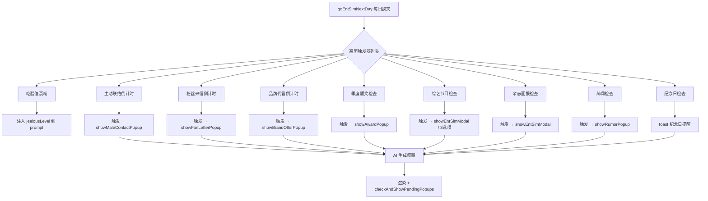

## 总览

对 entSim 娱乐圈模拟器进行三项并行工程：(A) 修复关键 Bug，(B) 全部池子独立分文件并扩充至 100-200 条，(C) 新增 6 个代码驱动的娱乐圈增强模块。所有功能改为短间隔触发（2-8 天级），每项功能增加 UI 快捷入口按钮，AI 只负责将事件写成叙事文案。

## A. 关键 Bug 修复

### A1. migrateSave() v2 字段兜底

- 问题：旧存档升级后 `_jealousLevel`、`_intimacyUnlocked`、`_romanceMilestones`、`_maleContactTimer`、`_lastFanLetterDay`、`_lastBrandOfferDay`、`_releaseCD`、`_lastAwardDay` 全部为 `undefined`，导致粉丝来信/品牌代言等立即异常触发
- 修复：在 `src/state.js` 的 migrateSave() 中新增 8 个 v2 字段的兜底初始化

### A2. 主动联络独立弹窗

- 问题：男主主动联络仅有文本注入 prompt，无独立 UI 弹窗，玩家容易错过
- 修复：仿照粉丝来信弹窗模式，为主动联络增加 `showMaleContactPopup()` 独立弹窗

### A3. CONTACT_TYPE_POOL 补充 brother 类型

- 问题：当前仅 80 条（call/call_jealous/msg/msg_code 各 20），engine.js 有 brother 死代码分支
- 修复：增加 brother_relay/brother_tentative 两个子池各 20 条，总数 120 条

### A4. 纪念日独立面板

- 问题：纪念日仅有 toast 一闪而过，无法回顾
- 修复：恋情面板增加"纪念日"折叠行，列出所有已记录的里程碑及天数

## B. 池子文件拆分与扩充

### B1. 目录结构

```
src/ent-sim/pools/
  index.js              ← 统一导出 + pickFromPool()
  fan-letters.js        ← FAN_LETTER_POOL (150-200 条: support×50/comeback×50/confession×50/roast×50)
  brand-offers.js       ← BRAND_OFFER_POOL (150 条: 10 类 × 15)
  male-contact.js       ← CONTACT_TYPE_POOL (120 条: 6 类 × 20)
  releases.js           ← RELEASE_POOL (120 条: 6 类 × 20)
  awards.js             ← AWARD_POOL (60-80 条: 3 类 × 20-25)
```

### B2. 删除旧集中式文件

- 删除 `src/ent-sim/pools-v2.js`
- 从 `src/ent-sim/data.js` 中移除 FAN_LETTER_POOL、BRAND_OFFER_POOL（保留其他数据结构）
- 所有引用改为 `import { ... } from './pools/index.js'`

## C. 新增 6 个娱乐圈增强模块

### C1. 综艺节目 VARIETY_SHOW_POOL

- 100 条，脱口秀/竞技/音乐/真人秀 4 类各 25 条
- 触发：每 3-5 天，人气 ≥25，60% 概率
- 特殊：被问理想型时弹出 3 选项（打太极/暗指男主/说队友），影响好感/吃醋/曝光
- UI 入口：快捷按钮「🎬综艺通告」

### C2. Dispatch 爆料 DISPATCH_POOL

- 80 条，偷拍照/新闻标题/圈内传闻
- 触发：曝光 ≥30 时每 4-6 天随机，3 选项公关（承认/否认/沉默）
- 影响：选错曝光+N 人气-N，选对曝光-N 人气+N
- UI 入口：快捷按钮「📰新闻室」

### C3. 粉丝圈反应 FAN_REACTION_POOL

- 80 条，Twitter/DCInside/TheQoo/微博风格短评
- 触发：每次营业/发歌/上节目后自动生成，右栏滚动展示
- 无独立弹窗，在右侧态势栏新增"粉丝反应"滚动区

### C4. 杂志画报 MAGAZINE_POOL

- 60 条，W Korea/Elle/Dazed/BAZAAR/Allure/Cosmopolitan 各 10 条
- 触发：每 5-7 天，人气 ≥40，40% 概率
- 影响：接受→曝光+N 人气+N，拒绝→无变化
- UI 入口：快捷按钮「📸杂志画报」

### C5. 音源榜单 CHART_POOL

- 50 条，Melon/Genie/Bugs/FLO 实时排名变化描述
- 触发：发布作品后每 2 天更新一次排名，最多持续 6 天
- 内容：排名上升/下降/逆袭/AKB/破表等状态描述
- UI 展示：发布作品后 6 天内右栏显示音源排名变化条

### C6. 绯闻/恋爱说 RUMOR_POOL

- 60 条，网友扒同款/私生拍到/公司否认/沉默应对
- 触发：好感 ≥50 且曝光 ≥40 后每 5-7 天，50% 概率
- 影响：3 选项（否认/沉默/承认），大幅影响好感/曝光/哥哥态度
- UI 入口：不设手动按钮（纯被动触发），但触发时显示独立弹窗

## D. 全部功能 UI 入口清单

| 功能 | 快捷按钮文案 | 触发方式 |
| --- | --- | --- |
| 发布作品 | 📀发布作品 | 手动（CD控制） |
| 粉丝来信 | 📬信箱 | 手动查看 + 自动触发 |
| 品牌代言 | 💼代言 | 手动查看 + 自动触发 |
| 颁奖记录 | 🏆奖项 | 手动查看历史 |
| 综艺节目 | 🎬综艺 | 手动触发 + 自动提示 |
| 杂志画报 | 📸画报 | 手动触发 + 自动提示 |
| 新闻室 | 📰新闻 | 手动查看 + 被动触发 |
| 主动联络 | — | 被动触发（弹窗提示） |
| 绯闻 | — | 被动触发（弹窗提示） |


## E. 触发间隔调整对照表

| 功能 | 旧间隔（天） | 新间隔（天） | 说明 |
| --- | --- | --- | --- |
| 粉丝来信 | 5-7 | 2-3 | 缩短 60% |
| 品牌代言 | 12 | 4-5 | 缩短 60% |
| 季度颁奖 | 30 | 8-10 | 缩短 70% |
| 发布作品 CD | 15 | 2-3 | 缩短 85% |
| 主动联络 | 8-18 | 3-5 | 缩短 60% |
| 综艺节目 | — | 3-5 | 新增 |
| Dispatch | — | 4-6 | 新增 |
| 杂志画报 | — | 5-7 | 新增 |
| 音源榜单 | — | 每2天×6次 | 新增 |
| 绯闻 | — | 5-7 | 新增 |
| SEVENTEEN 回归 | 15-20 | 保持原样 | 不调整 |


## 技术栈

- 语言：JavaScript (ES Modules)
- 架构：纯前端单页应用，无服务端
- 数据：预写静态池 + localStorage 存档
- AI：DeepSeek chat API（仅用于叙事文本生成）

## 实现策略

全部功能遵循同一模式：**代码决定「何时触发、触发什么、数值多少」，AI 只负责「把事件写成叙事文案」**。不新建 UI 页面类型，复用现有 `showEntSimModal()` / `showToast()` / `_entSimPendingEvent` 通道。

### 核心数据流



### 触发器统一管理

在 `goEntSimNextDay` 中新增 `runEntSimDailyTriggers()` 函数，统一管理所有定时触发器。每个触发器返回 `{ type, data }` 或 `null`，收集后按优先级排序（弹窗类 > 注入类），依次处理。避免当前零散的 if/else 堆叠。

### 弹窗队列机制

新增 `_entSimPopupQueue` 数组替代当前 `_entSimFanLetter` / `_entSimBrandOffer` / `_entSimAward` 三个独立标志。`checkAndShowPendingPopups()` 改为从队列依次弹出，前一个关闭后再展示下一个（通过弹窗关闭回调触发下一个），从根本上解决多弹窗并发问题。

### 池子文件独立化

每个池子独立文件，`pools/index.js` 统一管理：

```js
// pools/index.js
export { pickFromPool } from './_utils.js';
export { FAN_LETTER_POOL } from './fan-letters.js';
export { BRAND_OFFER_POOL } from './brand-offers.js';
export { CONTACT_TYPE_POOL } from './male-contact.js';
export { RELEASE_POOL } from './releases.js';
export { AWARD_POOL } from './awards.js';
export { VARIETY_SHOW_POOL } from './variety-shows.js';
export { DISPATCH_POOL } from './dispatch-news.js';
export { FAN_REACTION_POOL } from './fan-reactions.js';
export { MAGAZINE_POOL } from './magazine-shoots.js';
export { CHART_POOL } from './music-charts.js';
export { RUMOR_POOL } from './dating-rumors.js';
```

好处：每个池子可独立修改/扩充，互不干扰；新增池子只需新建文件 + 在 index.js 加一行 export。

### 弹窗工厂复用

所有新增弹窗（主动联络、综艺选项、绯闻公关、Dispatch 新闻）复用现有弹窗模板模式：`createOverlay()` → `overlay.className = 'es-stageup-overlay'` → 填充内容 → `document.body.appendChild(overlay)` → 关闭时 `removeChild(overlay)`。

## 性能与可靠性

- **池子加载**：11 个池子文件在模块 import 时一次性加载到内存，运行时零 I/O 开销
- **弹窗队列**：顺序展示避免 DOM 叠加导致的 z-index 冲突和性能问题
- **迁移兜底**：migrateSave() 中每个新字段一行 `if (typeof E._xxx !== 'number') E._xxx = default`，保证旧存档加载不报错
- **向后兼容**：所有新增字段在 initEntSimState() 中初始化默认值，migrateSave() 补充兜底，双重保障

## SubAgent

- **code-explorer**
- 用途：在计划执行前和过程中验证现有代码结构（state.js 迁移函数、engine.js 换天流程、ui.js 弹窗工厂和快捷按钮渲染、romance.js 纪念日函数、data.js 现有池子位置），确保所有修改点精准命中
- 预期结果：确认所有挂入点可行，不破坏现有事件瀑布优先级，不引入循环依赖