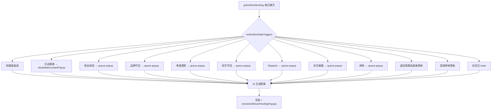

## 产品概述

对 entSim 娱乐圈模拟器进行 V3 全面池化改造：将 29 个内容池拆分为独立文件（每条内嵌 fanReactions 粉丝反应子数组），修复 4 个关键 Bug，触发间隔从 5-30 天大幅压缩至 1-4 天级，回归周期 14 天压缩为 4 天，演唱会 5 天压缩为 2 天。新增 10 个模块（4 真实化 + 6 增强），所有事件以独立弹窗或日程嵌套方式呈现。总计 31 个文件、约 4100 条预写内容。

## 核心功能

### 修复 4 个 Bug

1. migrateSave() 缺失 8 个 v2 字段兜底（_jealousLevel / _intimacyUnlocked / _romanceMilestones / _maleContactTimer / _lastFanLetterDay / _lastBrandOfferDay / _releaseCD / _lastAwardDay），旧存档升级后字段为 undefined 导致立即异常触发
2. 主动联络仅文本注入 prompt，无独立弹窗，玩家容易错过
3. CONTACT_TYPE_POOL 仅 80 条（4 子池），engine.js 有 brother 死代码分支
4. 纪念日仅有 toast 一闪而过，无独立面板回顾

### 间隔大幅压缩（每游戏日 = 3 时段 × 5-7 回合）

粉丝来信 每 1 天、品牌代言 2 天、季度颁奖 4 天、发布 CD 1 天、主动联络 2 天、综艺 2 天、Dispatch 3 天、杂志画报 3 天、绯闻 3 天、音源每 1 天。回归周期 14 天→4 天（D1预告→D2试听→D3回归→D4打歌）。演唱会 5 天→2 天。

### 事件内嵌 fanReactions

11 个事件池每个条目内嵌 fanReactions 子数组（5 条短评），事件触发时自动抽取 3 条写入右栏粉丝讨论区。

### 新增 10 个模块

真实化 4：回归周期(100 条)、演唱会(80 条)、打歌节目(60 条)、签售会(50 条)。增强 6：综艺节目(100 条，真实韩国节目名)、Dispatch 爆料(80 条)、杂志画报(80 条)、音源榜单(60 条)、绯闻(80 条)。

### 呈现方式

综艺(大型)：日程嵌套+关键环节弹窗。综艺(轻量)：纯独立弹窗。回归周期：右栏进度条+每阶段弹窗。演唱会：日程标记+节点弹窗。打歌：融入叙事+右栏反应。签售会：日程触发+互动弹窗。颁奖：大弹窗。所有弹窗关闭即结束。

### AI 使用边界

保留 AI（7 处）：剧情正文、选项、聊天回复、泡泡内容、日记填空、记忆压缩、种子/结局。池子替代 AI（3 处）：热搜关联(200 条)、日记模板(60 条)、粉丝反应（事件自带）。

## 技术栈

- 语言：JavaScript (ES Modules)，使用 var 声明
- 架构：纯前端单页应用，Vite 构建
- 数据：预写静态池 + localStorage 存档
- AI：DeepSeek chat API

## 实现策略

### 核心原则

代码决定触发时机、内容、数值，AI 只负责把事件写成叙事文案。不新建 UI 页面类型，复用 showEntSimModal() / showToast() / _entSimPendingEvent 通道。

### 池子文件独立化

每个池子独立文件，pools/index.js 统一 re-export，pools/_utils.js 提供 pickFromPool()。数据结构示例：

```js
export var VARIETY_SHOW_POOL = [
  { cat:'talk', t:'《认哥》——姜虎东突然问理想型，全场起哄。', pop:4, exp:2,
    fanReactions: ['姐姐综艺感绝了','这段我反复看了十遍','理想型说的是谁啊好想知道','综艺新人王','转圈圈.gif']
  }
];
```

### 弹窗队列机制

_entSimPopupQueue 数组替代 _entSimFanLetter / _entSimBrandOffer / _entSimAward 三个独立标志。checkAndShowPendingPopups() 从队列依次弹出，前一个关闭后回调触发下一个。

### 热搜关联改造

抽到一条热搜自动从 hot-search-replies.js 带出 3 条 fanReplies + 1 条 mediaTake，不调 AI。移除 generateBuzzRepliesAI 和 generateFanReaction。

### 日程池改造

从单 key 改为预设 {morning, afternoon, evening} 完整组合，AI 在给定框架内展开叙事。prompts.js 新增日程锁定规则。

### 泡泡 UI 改造

照片框从照相机图标改为显示 AI 返回的照片描述文字（如"练习室自拍·汗湿的刘海"），泡泡内容保持 AI 生成。

## 核心数据流



## 目录结构（31 个文件）

```
src/ent-sim/pools/
├── index.js                 ← 统一导出 29 个池子
├── _utils.js                ← pickFromPool 工具函数
├── fan-letters.js           (200条, fanReactions)
├── brand-offers.js          (150条, fanReactions)
├── male-contact.js          (120条)
├── releases.js              (120条, fanReactions)
├── awards.js                (80条, fanReactions)
├── daily-buzz.js            (300条)
├── hot-search-replies.js    (200条, fanReplies+mediaTake) [NEW]
├── news-templates.js        (130条)
├── daily-engagement.js      (120条, fanReactions)
├── girlgroup-events.js      (120条, fanReactions)
├── oneheart-events.js       (80条)
├── svt-teammate.js          (100条)
├── ent-schedule.js          (150条, {morning,afternoon,evening})
├── brother-events.js        (80条)
├── male-lead-init.js        (80条)
├── special-events.js        (80条)
├── jealousy-events.js       (100条)
├── incident-events.js       (100条)
├── diary-templates.js       (60条) [NEW]
├── variety-shows.js         (100条, fanReactions) [NEW]
├── dispatch-news.js         (80条, fanReactions) [NEW]
├── magazine-shoots.js       (80条, fanReactions) [NEW]
├── music-charts.js          (60条, fanReactions) [NEW]
├── dating-rumors.js         (80条, fanReactions) [NEW]
├── comeback-cycle.js        (100条, fanReactions) [NEW]
├── concert-pool.js          (80条, fanReactions) [NEW]
├── music-show-pool.js       (60条, fanReactions) [NEW]
└── fansign-pool.js          (50条, fanReactions) [NEW]
```

## 涉及修改的现有文件（10 个）

| 文件 | 改动内容 |
| --- | --- |
| src/state.js | migrateSave() 补 8 个 v2 字段兜底（第 495 行后新增 if 块），新增 _entSimPopupQueue / _entSimBubblePhotoDesc / _entSimChartTrack / _entSimComebackProgress / _entSimHotSearchStack 字段 |
| src/ent-sim/engine.js | 缩短全部间隔（第 308/322/331/340/342 行），新增 runEntSimDailyTriggers() 统一管理 12 个触发器，泡泡 UI 照片描述注入，日程池化改造，回归周期/演唱会进度管理 |
| src/ent-sim/ui.js | 新增 6 个快捷按钮（信箱/代言/奖项/综艺/画报/新闻室），新增 showMaleContactPopup/showVarietyShowPopup/showDispatchPopup/showMagazinePopup/showRumorPopup/showFansignPopup 弹窗函数，泡泡照片框改描述文字，纪念日面板，弹窗队列渲染，右栏回归进度条 |
| src/ent-sim/romance.js | 纪念日面板数据函数（返回 _romanceMilestones 格式化列表），checkAnniversaries 适配缩短间隔 |
| src/ent-sim/prompts.js | buildEntSimSystemPrompt 新增综艺/绯闻/Dispatch 场景指令 + 日程锁定规则（上午=主档/下午=关联/夜晚=自由），buildEntSimUserMessage 日程注入格式改为三段式 |
| src/ent-sim/immersion.js | generateDailyBuzz 改为从 hot-search-replies.js 抽取热搜自动带出 fanReplies+mediaTake，移除 generateBuzzRepliesAI 和 generateFanReaction 调用，新增 injectFanReactionsToPanel() 从事件条目 fanReactions 子数组抽取 |
| src/ent-sim/data.js | 移除 FAN_LETTER_POOL / BRAND_OFFER_POOL / GIRLGROUP_EVENTS / DAILY_BUZZ_TEMPLATES / NEWS_TEMPLATES / DAILY_ENGAGEMENT_POOL / ONE_HEART_RANDOM_EVENTS / SVT_TEAMMATE_EVENT_POOL / INDUSTRY_EVENTS / RIVAL_ADVANCE_EVENTS / SECRET_DISCOVERY_EVENTS / ENT_SCHEDULE_POOL（保留 TEAMMATE_FLAVOR / SVT_TEAMMATE_PROFILES / COVER_MECHANISMS 等基础设施数组） |
| src/ent-sim/pools-v2.js | 删除，内容迁移到 pools/releases.js / pools/male-contact.js / pools/awards.js |
| src/ent-sim/brother.js | 移除 BROTHER_EVENT_POOL / MALE_LEAD_INITIATIVE_POOL 定义，改为 import from pools/index.js |
| src/worlds/entertainment.js | 移除 ENT_SCHEDULE_POOL 定义，改为 import from pools/index.js |


## 性能与可靠性

- 31 个池子文件在模块 import 时一次性加载到内存，运行时零 I/O
- 弹窗队列顺序展示避免 z-index 冲突
- migrateSave() 每个新字段一行兜底，保证旧存档加载不报错
- initEntSimState() + migrateSave() 双重兜底
- 所有 AI 生成文本插入 DOM 前经 escHtml() 转义