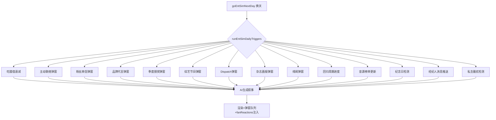

## 产品概述

entSim V5 终极架构：将娱乐圈模拟器的全部内容系统拆分为 41 个独立预写池子文件（约 5800 条，每条内嵌 fanReactions 粉丝反应子数组），修复 6 个关键 Bug，触发间隔压缩至 1-4 天级，人气涨速降低 60-70%，引入 7 年游戏时间轴和 8 阶段事业路径。新增 KakaoTalk 风格多角色聊天系统、7 阶段亲密系统、4 维技能面板。总计约 45 个文件变更。

## 核心功能

### 1. 41 个预写池子（pools/ 目录）

- 旧池拆分 17 个（fan-letters/brand-offers/male-contact/releases/awards/daily-buzz/news-templates/daily-engagement/girlgroup-events/oneheart-events/svt-teammate/ent-schedule/brother-events/male-lead-init/special-events/jealousy-events/incident-events）
- AI 替代 2 个（hot-search-replies 热搜关联带 fanReplies+mediaTake、diary-templates 日记模板框架）
- 增强模块 6 个（variety-shows 真实韩国节目名/dispatch-news/magazine-shoots/music-charts/dating-rumors）
- 真实化模块 4 个（comeback-cycle 回归周期压缩 14 天变 4 天/concert-pool 演唱会/music-show-pool 打歌/fansign-pool 签售会）
- 女团身份池 7 个（group-names 韩国风英文名配 fandom/company-names/group-concepts/fandom-names/hit-songs/teammate-names/sister-roles）
- 逆境池 1 个（career-setbacks 8 阶段各 25 条）
- 聊天池 6 个（chat-male-lead/chat-brother/chat-rival/chat-manager/chat-group/chat-sasaeng）
- 好感铺垫池 1 个（contact-progression）
- 每条事件内嵌 fanReactions 子数组（5 条短评），事件触发时自动抽取 3 条注入右栏粉丝讨论区
- pools/index.js 统一 re-export，pools/_utils.js 提供 pickFromPool()

### 2. 修复 6 个 Bug

1. state.js migrateSave() 缺失 8 个 v2 字段兜底
2. 主动联络无独立弹窗，需新增 showMaleContactPopup()
3. CONTACT_TYPE_POOL 缺 brother_relay/brother_tentative 死代码分支
4. 纪念日仅 toast，需在恋情面板新增纪念日折叠行
5. romance.js 好感≥100 后 sweetMaxRound 不断被重置
6. romance.js 中 4 个函数缺 GS.entSim null 检查

### 3. KakaoTalk 多角色聊天系统

- 6 个聊天频道：男主、哥哥、情敌、经纪人、团群聊 ECLIPSE、私生骚扰消息
- UI 改造：KakaoTalk 风格手机框，顶部头像+名字+在线状态，绿色/灰色气泡，时间戳，底部快捷回复按钮行
- 频道切换：左侧对话列表（圆头像+名字+最后一条预览）
- pool+AI 混合：简单交互从池子抽取回复，复杂/自由输入走 AI 生成

### 4. 7 阶段亲密系统

牵手(≥15)→拥抱(≥30)→接吻(≥50)→同床(≥65)→同居(≥80)→公开恋情(≥90)→求婚结婚(≥100)

### 5. 7 年游戏时间轴

~12 游戏天=1 游戏年，80 天约 7 年。Year0 练习生→Year1 出道→Year2 初一位→Year3 二线→Year4 当红→Year5 一线→Year6-7 传奇+续约/解散+结局。新增 debutDay/yearsActive/contractYears/contractRemaining 字段。左栏显示"Year X 合约剩余 Y 年"。续约谈判 Y3/Y5/Y7 触发。

### 6. 4 维技能面板

唱功(60)/舞蹈(45)/综艺(30)/视觉(80)，左栏 compact 技能条展示

### 7. 间隔全压缩 + 人气涨速控制

全部触发器间隔压缩至 1-4 天级。人气涨速降低 60-70%：发布作品 pop 1-2、品牌代言 pop 2-4、颁奖 pop 3-6、泡泡 pop 0-1。起始人气固定 3。

## 技术栈

- 语言：JavaScript (ES Modules)，var 声明，字符串拼接用 + 不用模板字符串
- 架构：纯前端单页应用，Vite 构建
- 数据：预写静态池 + localStorage 存档
- AI：DeepSeek chat API

## 核心数据流



## 目录结构（41 个池子文件）

```
src/ent-sim/pools/
├── index.js                    [NEW] 统一 re-export
├── _utils.js                   [NEW] pickFromPool
├── fan-letters.js              (200条,fanReactions)
├── brand-offers.js             (150条,fanReactions)
├── male-contact.js             (120条+options)
├── releases.js                 (120条,fanReactions)
├── awards.js                   (80条,fanReactions)
├── daily-buzz.js               (300条)
├── hot-search-replies.js       (200条,fanReplies+mediaTake) [NEW]
├── news-templates.js           (130条)
├── daily-engagement.js         (120条,fanReactions)
├── girlgroup-events.js         (120条,fanReactions)
├── oneheart-events.js          (80条)
├── svt-teammate.js             (100条)
├── ent-schedule.js             (150条,{morning,afternoon,evening})
├── brother-events.js           (80条)
├── male-lead-init.js           (80条)
├── special-events.js           (80条)
├── jealousy-events.js          (100条)
├── incident-events.js          (100条)
├── diary-templates.js          (60条) [NEW]
├── variety-shows.js            (100条,fanReactions) [NEW]
├── dispatch-news.js            (80条,fanReactions) [NEW]
├── magazine-shoots.js          (80条,fanReactions) [NEW]
├── music-charts.js             (60条,fanReactions) [NEW]
├── dating-rumors.js            (80条,fanReactions) [NEW]
├── comeback-cycle.js           (100条,fanReactions) [NEW]
├── concert-pool.js             (80条,fanReactions) [NEW]
├── music-show-pool.js          (60条,fanReactions) [NEW]
├── fansign-pool.js             (50条,fanReactions) [NEW]
├── career-setbacks.js          (200条,fanReactions) [NEW]
├── group-names.js              (60条,含fandom配对) [NEW]
├── company-names.js            (20条) [NEW]
├── group-concepts.js           (40条) [NEW]
├── fandom-names.js             (60条) [NEW]
├── hit-songs.js                (80条) [NEW]
├── teammate-names.js           (100条) [NEW]
├── sister-roles.js             (30条) [NEW]
├── contact-progression.js      (60条) [NEW]
├── chat-male-lead.js           (200条) [NEW]
├── chat-brother.js             (80条) [NEW]
├── chat-rival.js               (60条) [NEW]
├── chat-manager.js             (40条) [NEW]
├── chat-group.js               (60条) [NEW]
└── chat-sasaeng.js             (30条) [NEW]
```

## 涉及修改的现有文件（12 个）

| 文件 | 改动 |
| --- | --- |
| src/state.js | migrateSave() 补 8 字段兜底，新增 _entSimPopupQueue/_entSimBubblePhotoDesc/_entSimChartTrack/_entSimComebackProgress/debutDay/yearsActive/contractYears/contractRemaining |
| src/ent-sim/state.js | career 新增 debutDay 等字段，起始人气固定 3，新增 skills:{vocal:60,dance:45,variety:30,visual:80} |
| src/ent-sim/engine.js | runEntSimDailyTriggers() 统一 12+ 触发器，间隔全缩短，人气涨速调低，回归/演唱会周期管理，泡泡照片注入，日记模板化，聊天 pool+AI 混合 |
| src/ent-sim/ui.js | KakaoTalk 聊天 UI 重构（6 频道切换+快捷回复+手机框），新增 6 弹窗函数，恋情面板纪念日，右栏回归进度条，技能条渲染，时间轴显示 |
| src/ent-sim/romance.js | Bug5/6 修复，亲密系统新增 4 阶段，纪念日面板数据函数 |
| src/ent-sim/prompts.js | 综艺/Dispatch/绯闻场景指令，日程锁定规则，亲密阶段解锁提示，技能条提示，时间轴标签 |
| src/ent-sim/immersion.js | 热搜→hot-search-replies 池子关联，移除 AI 调用，新增 injectFanReactionsToPanel() |
| src/ent-sim/data.js | 移除 12 个旧池子定义，新增 careerMilestone 常量，新增 INTIMACY_STAGES 7 阶段定义 |
| src/ent-sim/brother.js | 移除旧池子定义，改为 import |
| src/ent-sim/cycle.js | rollDailyAgenda 改为 ent-schedule 三段式组合 |
| src/worlds/entertainment.js | 移除 ENT_SCHEDULE_POOL |
| src/data.js | 移除 GIRLGROUP_PRESETS，改为 import pools |