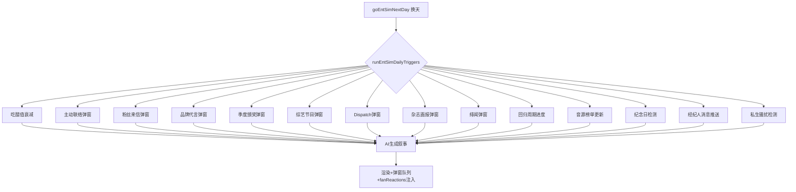
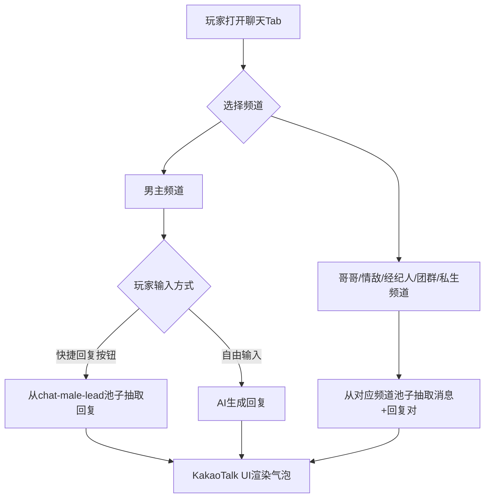

## 产品概述

entSim V5 终极架构：将娱乐圈模拟器的全部内容系统拆分为 41 个独立预写池子文件（约 5800 条），修复 6 个关键 Bug，触发间隔压缩至 1-4 天级，人气涨速降低 60-70%，引入 7 年游戏时间轴和 8 阶段事业路径。新建 KakaoTalk 风格 6 频道聊天系统、7 阶段亲密系统、4 维技能面板。总计约 45 个文件变更。

## 核心功能

### 1. 41 个预写池子

旧池拆分 17 + AI 替代 2 + 增强模块 6 + 真实化模块 4 + 女团身份池 7 + 逆境池 1 + 聊天池 6 + 好感铺垫池 1 = 41。每个事件条目内嵌 fanReactions 子数组（5 条短评），触发时自动抽取 3 条注入右栏粉丝讨论区。pools/index.js 统一 re-export，pools/_utils.js 提供 pickFromPool()。

### 2. 聊天系统架构（最终确认）

6 个聊天频道，KakaoTalk 风格手机框 UI。频道切换通过左侧对话列表（圆头像+名字+最后一条预览）。每个频道显示绿色/灰色气泡+时间戳+底部快捷回复按钮行。

AI 使用规则：

- 男主聊天：快捷回复按钮 → 池子抽取回复（不走 AI）；自由输入 → AI 生成回复
- 哥哥聊天：100% 池子，预写消息+回复对，不调 AI
- 情敌聊天：100% 池子，预写消息+回复对，不调 AI
- 经纪人聊天：100% 池子，预写通知/警告/行程，不调 AI
- 团群聊 ECLIPSE：100% 池子，队友互动消息，不调 AI
- 私生骚扰：100% 池子，不可回复仅展示，随机触发，不调 AI

### 3. 修复 6 个 Bug

1. state.js migrateSave() 缺失 8 个 v2 字段兜底
2. 主动联络无独立弹窗
3. CONTACT_TYPE_POOL 缺 brother 死代码分支
4. 纪念日仅 toast 无面板
5. 好感≥100 后 sweetMaxRound 不断重置
6. romance.js 中 4 个函数缺 null 检查

### 4. 7 阶段亲密系统

牵手(≥15)→拥抱(≥30)→接吻(≥50)→同床(≥65)→同居(≥80)→公开恋情(≥90)→求婚结婚(≥100)

### 5. 7 年游戏时间轴 + 8 阶段事业路径

~12 游戏天=1 游戏年，80 天约 7 年。Year0 练习生→Year1 出道→Year2 初一位→Year3 二线→Year4 当红→Year5 一线→Year6-7 传奇+续约/解散+结局。初一位条件：人气≥25+回归周期中+打歌第2-3天+50%概率。4 维技能面板（唱功60/舞蹈45/综艺30/视觉80）。

### 6. AI 保留（7 处）

剧情正文、选项、男主聊天自由输入回复、泡泡内容、日记填空、记忆压缩、种子/结局。

## 技术栈

- 语言：JavaScript (ES Modules)，var 声明，字符串拼接用 + 不用模板字符串
- 架构：纯前端单页应用，Vite 构建
- 数据：预写静态池 + localStorage 存档
- AI：DeepSeek chat API（仅 7 处调用）

## 核心数据流



## 聊天系统数据流



## 目录结构

```
src/ent-sim/pools/
├── index.js                    [NEW] 统一 re-export 41 池子+pickFromPool
├── _utils.js                   [NEW] pickFromPool(按cat过滤+轮替)
├── fan-letters.js              (200条,fanReactions)
├── brand-offers.js             (150条,fanReactions)
├── male-contact.js             (120条+options数组)
├── releases.js                 (120条,fanReactions)
├── awards.js                   (80条,fanReactions)
├── daily-buzz.js               (300条)
├── hot-search-replies.js       (200条,fanReplies+mediaTake) [NEW]
├── news-templates.js           (130条)
├── daily-engagement.js         (120条,fanReactions)
├── girlgroup-events.js         (120条,fanReactions)
├── oneheart-events.js          (80条)
├── svt-teammate.js             (100条)
├── ent-schedule.js             (150条,{morning,afternoon,evening})
├── brother-events.js           (80条)
├── male-lead-init.js           (80条)
├── special-events.js           (80条)
├── jealousy-events.js          (100条)
├── incident-events.js          (100条)
├── diary-templates.js          (60条) [NEW]
├── variety-shows.js            (100条,fanReactions) [NEW]
├── dispatch-news.js            (80条,fanReactions) [NEW]
├── magazine-shoots.js          (80条,fanReactions) [NEW]
├── music-charts.js             (60条,fanReactions) [NEW]
├── dating-rumors.js            (80条,fanReactions) [NEW]
├── comeback-cycle.js           (100条,fanReactions) [NEW]
├── concert-pool.js             (80条,fanReactions) [NEW]
├── music-show-pool.js          (60条,fanReactions) [NEW]
├── fansign-pool.js             (50条,fanReactions) [NEW]
├── career-setbacks.js          (200条,fanReactions) [NEW]
├── group-names.js              (60条,含fandom配对) [NEW]
├── company-names.js            (20条) [NEW]
├── group-concepts.js           (40条) [NEW]
├── hit-songs.js                (80条) [NEW]
├── teammate-names.js           (100条) [NEW]
├── sister-roles.js             (30条) [NEW]
├── contact-progression.js      (60条) [NEW]
├── chat-male-lead.js           (200条,含快捷回复选项) [NEW]
├── chat-brother.js             (80条,{from,msg,reply,time}) [NEW]
├── chat-rival.js               (60条,{from,msg,reply,time}) [NEW]
├── chat-manager.js             (40条,{from,msg,reply,time}) [NEW]
├── chat-group.js               (60条,{from,msg,reply,time}) [NEW]
└── chat-sasaeng.js             (30条,{from,msg,time},不可回复) [NEW]
```

## 聊天池子数据结构

男主池 chat-male-lead.js：

```
var CHAT_MALE_LEAD = [
  { cat:'greet', q:'今天怎么样', r:['刚结束录音，嗓子有点哑。','在想你的舞台。'], aff:1 },
  { cat:'stage', q:'今天的舞台超棒', r:['你看到了？副歌改了一句。','我自己改的——想给你不一样的感觉。'], aff:2 },
  ...
];
```

其他5频道池子（chat-brother/chat-rival/chat-manager/chat-group/chat-sasaeng）：

```
var CHAT_BROTHER = [
  { from:'opp', msg:'今天月末评价怎么样', reply:'还行…B+', time:'19:30' },
  { from:'you', msg:'哥我今天出道名单看到了', reply:'早知道了。恭喜。', time:'15:22' },
  ...
];
```

## 涉及修改的现有文件（12 个）

| 文件 | 改动 |
| --- | --- |
| src/state.js | migrateSave() 补 8 字段兜底，新增 _entSimPopupQueue/debutDay/yearsActive/contractYears 等字段 |
| src/ent-sim/state.js | career 新增 debutDay，起始人气固定 3，新增 skills:{vocal,dance,variety,visual} |
| src/ent-sim/engine.js | runEntSimDailyTriggers() 统一 12+ 触发器，间隔全缩短，人气涨速调低，聊天 pool+AI 混合调度 |
| src/ent-sim/ui.js | KakaoTalk 聊天 UI 重构（6 频道+手机框+快捷回复+频道切换），6 弹窗函数，恋情面板纪念日，技能条，回归进度条，时间轴 |
| src/ent-sim/romance.js | Bug5/6 修复，亲密系统新增同床/同居/公开/结婚 4 阶段，纪念日面板数据 |
| src/ent-sim/prompts.js | 综艺/Dispatch/绯闻场景指令，日程锁定规则，亲密阶段解锁提示，技能条提示 |
| src/ent-sim/immersion.js | 热搜→hot-search-replies 关联，移除 AI 调用，新增 injectFanReactionsToPanel() |
| src/ent-sim/data.js | 移除旧池子定义，新增 careerMilestone/INTIMACY_STAGES 常量 |
| src/ent-sim/brother.js | 移除旧池子定义，改为 import pools |
| src/ent-sim/cycle.js | rollDailyAgenda 改为 ent-schedule 三段式组合 |
| src/worlds/entertainment.js | 移除 ENT_SCHEDULE_POOL |
| src/data.js | 移除 GIRLGROUP_PRESETS，改为 import pools |