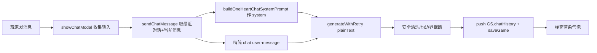

## 用户需求

把此前分析确认的全部优化点一次性纳入实现，覆盖「只为你心动」1v1 模式（娱乐圈世界观·队友的妹妹设定）下的聊天修复与多项体验优化：

- 恢复聊天气泡入口，并根因修复此前聊天「错乱 / 不显示 / 乱说」三类毛病。
- 约会入口优化：无空档日显示禁用态按钮（而非纯文字，避免玩家误以为功能损坏）。
- 约会加轻量好感/阶段门槛，避免前期无门槛频密约会稀释戏剧重量。
- 「找哥哥聊聊」加每日一次限制，避免无限刷哥哥好感。
- B2 哥哥门控告白、B5 情敌×哥哥交叉由纯 prompt 软指令升级为代码护栏，保证必然触发且权重可控。
- 新增「男主本人示好哥哥」链路，让哥哥好感可经男主行为推高（补足当前只靠妹妹选择推高的缺口）。

## 核心功能

- 独立聊天系统 prompt，消除与叙事 JSON prompt 的冲突；多轮上下文连贯；失败兜底显示。
- 底部聊天 Tab 恢复，点击打开聊天弹窗。
- 行程条：无空档日渲染禁用态「无法约会」按钮；低好感时约会 chip 禁用并提示。
- 发起约会按门槛校验（普通空档约 / 高风险翘班约分别设门槛）。
- 找哥哥聊聊每日限一次（跨天重置）。
- 关系进阶且哥哥仍试探时，本段剧情强制出现哥哥拦门；情敌倾向高时按哥哥立场调整助攻/拦门权重。
- 男主进家门见哥哥时哥哥好感 +1；新增哥哥事件「男主示好」并接入抽选。

## 兼容性

- 全部以 `GS.gameMode==='oneHeart' && GS.worldSetting==='entertainment'` 守卫，换乘模式与其他世界观完全不受影响。
- 保留既有聊天好感/次数机制、`GS.chatHistory` 持久化、约会每日重置、哥哥立场推导等既有行为。

## 技术栈

- 现有项目：Vanilla JS + Vite（ES Modules），无新增依赖，沿用浏览器原生 API。
- 复用既有：`buildOneHeartSystemPrompt` / `buildOneHeartUserMessage` 的 1v1 prompt 体系、`sendChatMessage`、`showChatModal`、`updateBrotherStance`、`BROTHER_EVENTS`、`GS.chatHistory`、`ONE_HEART_TOKEN_CONFIG`。

## 实现方案

### 总体策略

聊天毛病根因是 `sendChatMessage` 复用叙事系统 prompt（`buildOneHeartSystemPrompt` 强制只输出 JSON 长剧情），与聊天角色扮演指令冲突 → 模型吐 JSON/长剧情/旁白（乱说），叠加脆弱后处理（`slice(-50)` 半句截断、JSON 提取失败残留）与失败 `return ''`（不显示）。解法：为聊天新建专用 system prompt，user-message 退化为「最近对话 + 当前消息」，后处理只做安全清洗，失败给兜底文案，入口在 Tab 栏接回。其余优化点均为局部代码护栏与 UI 态控制，按既有守卫包裹，不引入新架构。

### 关键技术决策

1. **新增 `buildOneHeartChatSystemPrompt()`**（prompts.js）：与 `buildOneHeartSystemPrompt` 并列，固化「角色本人 / 手机聊天 / 仅 1-3 句口语 / 禁 JSON / 禁导演旁白 / ≤约 80 字」硬约束，并内置人设、好感档位、时段、（娱乐圈）当日行程、冷战 / 情敌状态。上下文稳定、不被 user-message 覆盖。
2. **chat 分支精简**（prompts.js `buildOneHeartUserMessage` type==='chat'）：移除已上移到 system 的上下文，仅注入 `GS.chatHistory` 最近约 10 轮（role/content）+ 当前 `userMessage`，解决多轮跑偏。
3. **后处理简化**（game-engine `sendChatMessage`）：仅 `raw.replace(/^[\s"'```]+|[\s"'```]+$/g,'')`；首字符为 `{`/`[` 时稳健提取 `content`/`narrative`/拼接 `blocks[].content`；最终按句边界（`。！？`）在约 200 字内截断，**删除 `slice(-50)`**；失败不再 `return ''`，返回友好兜底文案，保证弹窗始终有内容。
4. **恢复入口**（ui-renderer）：Tab 栏加回聊天按钮（带通知红点占位），分发器加 `case 'chat': showChatModal(); break;`，与 diary/event/moments/theater 同构。
5. **降 token**（data.js）：`chatReply` 1000→400，抑制长输出。
6. **无空档禁用态**（ui-renderer `renderOneHeartScheduleStrip`）：`_free.length===0` 时渲染禁用按钮「今天他不在首尔，无法约会」（灰态），非纯文字。
7. **约会轻量门槛**（game-engine `initiateOneHeartDate`）：普通空档约需 `oneHeartRomanceStage>=1 || affection>=20`；翘班(sneakOut)约需 `stage>=2 || affection>=40`；不达标时 chip 禁用 + 提示，函数内加 guard 防直触。
8. **哥哥聊天每日限一次**（state.js + game-engine + ui-renderer）：state 加 `oneHeartBrotherChatToday:false`（default + migrate）；`handleBrotherChat` 开头若已用则 `showToast` 返回；`generateOneHeartSchedule` 每日重置该标记；action-grid `brother_chat` 按钮在该标记为真时禁用。
9. **B2/B5 代码护栏**（game-engine + prompts.js）：`initiateOneHeartDate`/`generateOneHeartRound` 计算 `enforceBrotherStop = (oneHeartRomanceStage>=2 && brotherStance∈{testing,protective})` 与 `brotherAssist`（rivalAff>=20 时 supportive→提升助攻权重、protective→降拦门概率），随 `extra` 传入；prompts.js B2 段在 flag 命中时把「可自然体现」改为强制指令，保证必然发生。
10. **男主示好哥哥链路**：① `initiateOneHeartDate` 当 `brotherHome===true`（男主进家门见哥哥）时调用 `updateBrotherStance(1,'男主在你家主动跟哥哥套近乎')`；② `entertainment.js` 新增 `bro_meet`（男主请哥哥吃饭/敬酒示好，stanceDelta +2，minRound 4，prob 0.15）并接入既有抽选；让哥哥好感可经男主本人行为推高。

### 实现要点（防回归）

- 仅修改 `sendChatMessage` 的 system prompt 来源与后处理段，不破坏其 `GS.chatHistory.push` / `saveGame` 与好感次数逻辑。
- 新 system prompt 复用 `buildOneHeartUserMessage` 既有上下文字段，避免重复计算。
- 失败兜底文案计入 `chatHistory` 的 ai 角色，确保重开仍可见、不丢轮次。
- 不在聊天路径注入叙事 correction 反馈（避免污染角色口吻）。
- 代码护栏以 `extra` 标志位驱动 prompt 措辞强弱，避免大段重写既有 prompt 结构。

## 架构设计

本次为局部修复与增强，不引入新架构。聊天数据流：



哥哥/约会增强数据流仍以既有 `initiateOneHeartDate` → `generateOneHeartRound` → `buildOneHeartUserMessage` 为主，新增 `extra.enforceBrotherStop` / `extra.brotherAssist` 标志位与 `updateBrotherStance` 代码调用，全部以娱乐圈+哥哥守卫包裹。

## 目录结构

```
src/
├── prompts.js            # [MODIFY] 新增 buildOneHeartChatSystemPrompt()（独立聊天 system prompt）；精简 buildOneHeartUserMessage 的 chat 分支（移上下文到 system，user 仅带最近对话+当前消息）；B2 段在 enforceBrotherStop 命中时改为强制指令
├── game-engine.js        # [MODIFY] sendChatMessage：改用新聊天 system prompt、简化后处理、失败兜底文案；initiateOneHeartDate：加约会门槛 guard + brotherHome 时 updateBrotherStance(+1)；handleBrotherChat：每日限一次；generateOneHeartRound/initiateOneHeartDate：计算 enforceBrotherStop/brotherAssist 随 extra 传入；generateOneHeartSchedule：每日重置 oneHeartBrotherChatToday
├── ui-renderer.js        # [MODIFY] renderOneHeartScheduleStrip：无空档渲染禁用态按钮、低好感约会 chip 禁用+提示；底部 Tab 栏加回聊天 Tab；分发器加 case 'chat'；brother_chat 按钮在每日限次时禁用
├── state.js              # [MODIFY] defaultGameState + migrateSave 加 oneHeartBrotherChatToday:false
├── worlds/entertainment.js # [MODIFY] BROTHER_EVENTS 新增 bro_meet（男主示好，stanceDelta +2，minRound 4，prob 0.15）
├── data.js               # [MODIFY] ONE_HEART_TOKEN_CONFIG.chatReply 由 1000 降至 400
└── modals/chat-modal.js  # [NO CHANGE] showChatModal 主体正常，恢复 Tab 入口后即被调用
```

## 关键代码结构（接口级）

```js
// prompts.js —— 新增独立聊天 system prompt（与 buildOneHeartSystemPrompt 并列）
export function buildOneHeartChatSystemPrompt() {
  // 返回字符串：角色本人 + 手机聊天 + 仅输出 1-3 句口语短消息 + 严禁 JSON/markdown/导演旁白/心理分析 + ≤约80字
  // 内置：人设(member) / 好感度档位 / 时段 / (娱乐圈)当日行程 / 冷战 / 情敌状态
}

// game-engine.js —— sendChatMessage 调用点变更
var sysMsg = buildOneHeartChatSystemPrompt();   // 原 buildOneHeartSystemPrompt()
var userMsg = buildOneHeartUserMessage('chat', { userMessage: userMessage.trim(), recentHistory: GS.chatHistory.slice(-10) });

// game-engine.js —— 哥哥拦门代码护栏标志位（随 extra 传入 prompts）
var enforceBrotherStop = (GS.oneHeartRomanceStage || 0) >= 2 && (_bs === 'testing' || _bs === 'protective');
var brotherAssist = (GS.oneHeartRivalAff || 0) >= 20 && _bs === 'supportive';
```