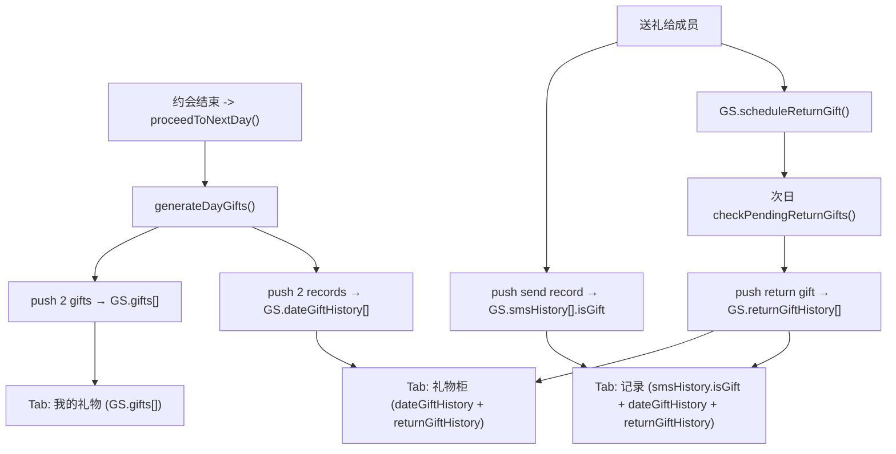

## 需求概述

重构礼物系统为三个清晰的分区：

1. **我的礼物** — 当前持有的可送人礼物库存（即现在的"礼物柜"tab，保留送礼功能，显示对口/通用提示）
2. **礼物柜** — 收到的礼物展示（包括约会后自动获得的礼物 + 送礼后收到的回礼），每条标注来源成员和日期
3. **记录** — 完整的收送流水（按时间倒序排列：你送出的 + 约会收到的 + 回礼收到的）

同时补上：

- Day 9（X 约会双向读信）后自动生成 2 份礼物
- Day 10（自由约会）后自动生成 2 份礼物

## 技术方案

### 数据结构

新增 `GS.dateGiftHistory[]` 字段，用于记录约会后收到的礼物（独立于回礼记录）：

```js
// 约会礼物历史（新增）
dateGiftHistory: []  // { memberId, giftName, giftDesc, day, isExclusive }
```

已有相关字段：

- `GS.gifts[]` — 库存（可送人），含 `fromPartner/fromDay`
- `GS.returnGiftHistory[]` — 回礼记录 `{ memberId, gift, day }`
- `GS.smsHistory[].isGift` — 送出记录

### 数据流



### Tab 切换逻辑

- Tab 1「我的礼物」: `renderMyGifts()` — 渲染 `GS.gifts[]`，可选择成员送出，与当前"礼物柜"逻辑一致，仅改名
- Tab 2「礼物柜」: `renderReceivedGifts()` — 先显示 `GS.dateGiftHistory[]`（约会收到的，标注"🎯 约会礼物"），再显示 `GS.returnGiftHistory[]`（回礼，标注"📩 回礼"），按天倒序
- Tab 3「记录」: `renderAllGiftRecords()` — 合并三个来源（smsHistory.isGift + dateGiftHistory + returnGiftHistory），统一按 day 倒序排列，标注"送出"/"约会收到"/"回礼收到"

### Day 9/10 礼物生成

#### Day 9

`generateDayGifts()` 已通过 `GS.currentDatingPartner` 获取约会对象（Day 9 在 `game-engine.js` 第 232-234 行已设为 `GS.secretX`），只需将条件 `(GS.day === 4 || GS.day === 6 || GS.day === 8)` 扩展为 `(GS.day === 4 || GS.day === 6 || GS.day === 8 || GS.day === 9)`。

#### Day 10

当前 `day10-dating.js` 弹窗选择后只设 `GS.day10ChosenDate`，不设 `GS.currentDatingPartner`。需在 `showDay10DatingModal` 的 `onChosen` 回调位置（或弹窗内部确认后），将 `GS.day10ChosenDate` 同步赋给 `GS.currentDatingPartner`。由于 `generateDayGifts()` 在 `proceedToNextDay()` 中执行时 `GS.day` 为 10，需将 Day 10 加入条件。

### 修改文件清单

| 文件 | 改动内容 |
| --- | --- |
| `src/state.js` | ① `defaultGameState()` 添加 `dateGiftHistory: []` ② `migrateSave()` 添加 `if (!Array.isArray(GS.dateGiftHistory)) GS.dateGiftHistory = []` |
| `src/skeleton/scheduler.js` | `generateDayGifts()`: ① 条件扩展为 `(GS.day === 4 \ | \ | GS.day === 6 \ | \ | GS.day === 8 \ | \ | GS.day === 9 \ | \ | GS.day === 10)` ② 每次 push 到 `GS.gifts[]` 后，同时 push 到 `GS.dateGiftHistory[]`（含成员名、礼物名、描述、day） |
| `src/modals/day10-dating.js` | 用户选择约会对象后，同步设置 `GS.currentDatingPartner = chosenId` |
| `src/modals/gift-panel.js` | ① Tab 改为 3 个按钮：我的礼物 / 礼物柜 / 记录 ② 新增 `renderMyGifts()`（复制当前 renderGiftInventory，仅改 tab 名）③ 新增 `renderReceivedGifts()`（显示 dateGiftHistory + returnGiftHistory）④ 新增 `renderAllGiftRecords()`（合并三源按天倒序）⑤ 事件委托兼容新 tab 切换 |


### 兼容性

- `dateGiftHistory` 为新字段，旧存档加载时 `migrateSave()` 自动兜底初始化为空数组，不影响旧存档
- 各 tab 数据源独立，切换时无性能开销

## 扩展使用

使用 [subagent:code-explorer] 在 Plan 阶段的探索已辅助确认了 Day 9/10 的约会流程和数据结构，确保方案准确。