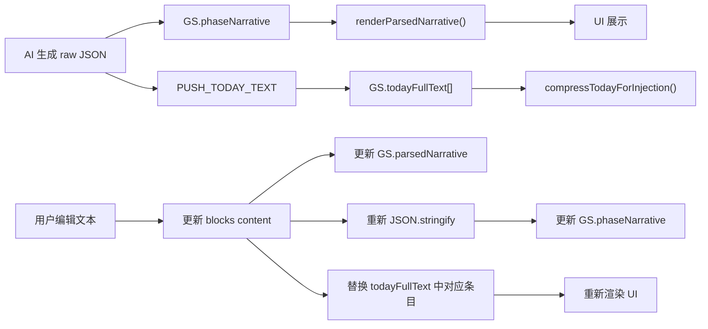

## 产品概述

在游戏剧情展示界面添加一个"编辑"功能，让玩家可以实时修改 AI 生成的剧情文本（如修正上午/下午写错、事件不对等问题）。修改后的版本会同步更新到游戏状态和记忆系统中，后续 AI 压缩和生成将基于修正版，使剧情更加准确。

## 核心功能

- 剧情展示完毕后出现一个编辑入口（如"编辑"按钮）
- 点击后打开编辑弹窗，展示当前剧情的纯文本内容（不含 JSON 格式）
- 玩家可在编辑框中自由修改文本
- 保存后：更新界面显示、更新 GS.phaseNarrative（原始 JSON）、更新 GS.todayFullText（记忆压缩数据源）
- 修改后的文本会在下一轮 AI 生成时被记忆系统使用，使后续剧情更准确

## 技术栈

沿用现有项目技术栈：Vanilla JS + Vite，无新增依赖。

## 实现方案

### 数据流分析

### 核心设计决策

**1. 编辑内容范围：** 只编辑纯文本内容（narrative/采访间/OS 等所有 block 的 content），不编辑 JSON 结构、选项、好感度等。保证编辑操作简单安全。

**2. 重新构建 JSON：** 保存时将编辑后的文本按原有 blocks 结构重新分配——保持 block 类型、数量不变，只更新 `content` 字段。逐 block 用新文本对应覆盖，不足的补空，多余的截断。

**3. 同步 todayFullText：** 找到 `GS.todayFullText[]` 中与当前阶段对应的那条记录（通过前缀匹配 `【上午】`等阶段标签），将其整体替换为新 JSON。

**4. UI 触发时机：** 剧情打字机效果播放完毕后（`startTypewriter` 中的 `clearInterval` 处），在叙事框右上角显示小编辑按钮。

### 修改文件清单

| 文件 | 改动内容 |
| --- | --- |
| `src/ui/narrative-box.js` | 1) 打字机完成后触发编辑按钮显示 2) 新增 `showNarrativeEditor()` 函数（弹窗+编辑框） 3) 新增 `saveNarrativeEdit()` 函数（更新 GS + 重建 JSON + 同步 todayFullText + 重渲染） 4) 新增一个轻量 CSS 样式（编辑按钮+编辑弹窗） |
| `src/style.css` | 新增 `.narrative-edit-btn`、`.narrative-editor-overlay`、`.narrative-editor-textarea` 等样式 |

### 方案优势

- **零新依赖**：纯 DOM 操作，不需要第三方编辑器或库
- **不影响现有逻辑**：编辑只在用户主动触发时执行，不改变原有游戏流程
- **全链路同步**：UI / phaseNarrative / todayFullText 三处同时更新，记忆压缩使用修正版
- **低风险**：编辑只涉及文本 content，不修改 blocks 结构、选项、好感度等数据

### 执行注意事项

- 编辑按钮仅在 `GS.phaseNarrative` 非空时显示
- 编辑弹窗中的 textarea 只展示 plain text（从 blocks 提取 content 拼接，不含 JSON 标签）
- 保存时需 `escHtml()` 转义后重新构建 blocks content
- 保存完成后调用 `saveGame()` 持久化
- 考虑"取消"按钮恢复原始状态

### 性能影响

- 编辑操作为用户手动触发，无自动性能开销
- 重建 JSON 和替换 todayFullText 为 O(n) 操作（n = blocks 数量，通常 <= 20），可忽略不计