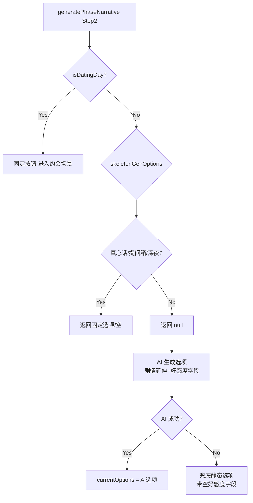

## 用户需求

用户希望所有时段的选项都从剧情内容延伸而来（而非静态词库模板），并且每个选项都一致地携带好感度字段（affName/affDelta/affReason），消除"有时有+好感度、有时没有"的不一致体验。约会场景和普通时段都需要此改造。

## 问题诊断

当前选项生成存在两条路径：

- **骨架引擎路径**（`skeletonConfig.optionEngine` 默认开启）：从静态词库伪随机拼出选项（如"和XX并肩散步"），**不带** affName/affDelta/affReason 字段
- **AI 生成路径**（骨架引擎关闭时）：读取当前剧情文本，AI 生成贴合剧情的选项，**带** affName/affDelta/affReason 字段

由于骨架引擎默认开启，大部分时段走静态词库路径，导致选项与剧情脱节且好感度字段缺失。而 `triggerAffectionFromChoice` 优先读取 `opt.affName`，缺失时 fallback 到文本匹配 + 随机值，造成好感度变化不一致。

## 改造范围

- 约会场景中（phase>=1）的选项：从静态词库改为 AI 剧情延伸
- 普通时段（非真心话/提问箱/深夜/约会配对入口）的选项：从静态词库改为 AI 剧情延伸
- 保留不动：约会配对日上午固定按钮、真心话模式（返回空）、提问箱固定两按钮、深夜时段（返回空）——这些是流程必需的固定选项

## 视觉效果

改造后用户在每个可选时段看到 3 个贴合当段剧情的选项，每个选项选择后都会一致地显示好感度变化（绿色+N/红色-N 飘字 + Toast 汇总），不再出现"选了选项但没有好感度反馈"的情况。

## 技术栈

- 现有项目：Vanilla JS (ES Modules) + Vite
- 无新增依赖，纯逻辑改造

## 实现方案

### 核心思路

让骨架引擎对"普通时段"和"约会场景"两个分支返回 `null`，使 `game-engine.js` 自动 fall through 到已有的 AI 生成路径。AI 生成路径已完整实现（prompt 已要求剧情延伸 + affName/affDelta/affReason），只需打通调用链路即可。

### 关键技术决策

1. **返回 null 而非删除函数**：保留 `generateStandardOptions`/`generateDatingOptions` 函数体和静态词库，仅将返回值改为 `null`。这样 `window.__skeleton.disable('optionEngine')` 调试开关仍可切回词库模式（虽然实际效果相同），且不破坏可能的引用。

2. **重构 if-else 结构**：当前 `game-engine.js:238-271` 的 `else if → else` 结构导致骨架返回 null 时无法 fall through 到 AI。改为 `if-else` 嵌套：先尝试骨架，null 时进入 AI 分支。

3. **prompts.js 无需改动**：约会约束（`prompts.js:351-360`）位于 `buildUserMessage` 通用段，对所有 message type 生效（包括 `generateOptions`），AI 生成约会选项时已知道"3个选项必须全部只涉及与XX的互动"。

4. **好感度一致性保证**：

- AI 路径：选项带 affName/affDelta/affReason → `triggerAffectionFromChoice` 优先读取 → 精确加分
- 兜底选项：已带空字段（affName:'' / affDelta:0）→ fallback 到文本匹配
- 特殊场景（真心话/提问箱）：由 `handleOptionChoice` 特殊处理，不走 `triggerAffectionFromChoice`

### 性能与可靠性

- **性能影响**：每个普通/约会 phase 多一次 AI 调用（~2-5s + ~500-1000 token），已有 loading 提示"正在根据剧情生成选项..."
- **稳定性**：AI 失败时使用静态兜底选项（已实现，game-engine.js:256-269），保证可用
- **日志**：复用现有 `console.warn`/`console.error` + `showToast`，无新增日志需求

## 架构设计



## 目录结构

```
src/
├── skeleton/
│   └── option-engine.js    # [MODIFY] generateStandardOptions() 和 generateDatingOptions() 返回 null
├── game-engine.js          # [MODIFY] 重构 Step2 if-else 结构，骨架返回 null 时 fall through 到 AI
└── prompts.js              # [无改动] 约会约束已在通用段注入，generateOptions prompt 已完备
```

### 文件详细说明

**`src/skeleton/option-engine.js`** [MODIFY]

- `generateStandardOptions()`（第42行）：函数体保留，返回值改为 `return null`
- `generateDatingOptions()`（第67行）：函数体保留，返回值改为 `return null`
- 不改动：`generateOptions()` 中对真心话/提问箱/约会配对日上午/深夜的分支判断
- 不删除：`_activities`/`_datingActivities`/`randomActivity*` 静态词库（保留以支持调试切换）

**`src/game-engine.js`** [MODIFY]

- 第231-271行：重构 Step2 选项生成分支
- 改前结构：`if (isDatingDay) {} else if (optionEngine) { skeleton } else { AI }`
- 改后结构：`if (isDatingDay) {} else { skeleton = optionEngine ? genOptions() : null; if (skeleton && skeleton.length > 0) { use skeleton } else { AI generate } }`
- AI 生成逻辑（现有244-270行）原位保留，仅调整外层条件包裹
- 兜底选项保留现有静态文案