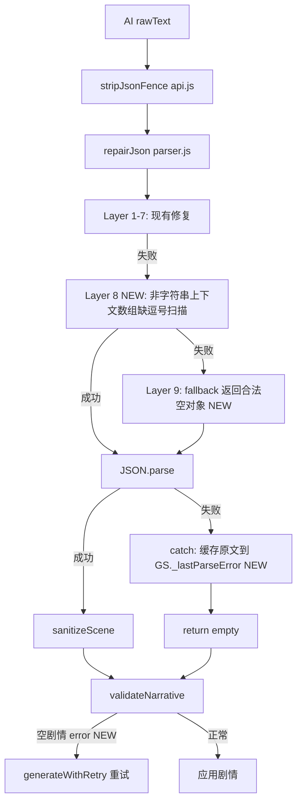

## 用户需求

游戏运行时 AI 返回的 JSON 偶发解析失败，报错 `Expected ',' or ']' after array element in JSON at position 2777`。`repairJson` 现有 7 层修复未覆盖"数组元素之间缺逗号"的全部场景（如 `}"`、`]{`、`"[` 等），且最终 fallback 返回非法 JSON 导致 `JSON.parse` 必然抛错。需增强 JSON 修复能力 + 增加调试信息 + 确保降级路径安全。

## 产品概览

针对 `src/parser.js` 的 `repairJson` 函数进行容错增强，覆盖 6 种数组缺逗号场景，修复最终 fallback 返回合法空对象，并在 `validator.js` 增加空剧情检测确保重试机制正常工作。

## 核心功能

- 增强 `repairJson` 数组缺逗号修复（6 种场景，非字符串上下文扫描）
- `repairJson` 最终 fallback 返回合法空 JSON 对象而非非法字符串
- `parseNarrative` catch 块缓存完整 AI 原文到 `GS._lastParseError` 供调试
- `validateNarrative` 增加空剧情 error 检测，确保 `generateWithRetry` 触发重试

## Tech Stack

- 现有项目：Vanilla JS (ES Modules) + Vite 5.4
- 代码约定：`var` 而非 `let/const`，字符串拼接用 `+`，不引入新依赖

## Implementation Approach

### 1. 增强 repairJson 数组缺逗号修复（parser.js:48-50 附近）

现有 `:49` 只修复 `}{` 场景。新增一个独立的"非字符串上下文扫描"函数，逐字符遍历 `result`，在非字符串区域检测以下 6 种缺逗号模式并插入逗号：

- `}` + 空白 + `"`（对象后跟字符串）
- `]` + 空白 + `{`（数组后跟对象）
- `"` + 空白 + `{`（字符串后跟对象，排除转义引号）
- `}` + 空白 + `[`（对象后跟数组）
- `]` + 空白 + `"`（数组后跟字符串）
- `]` + 空白 + `[`（数组后跟数组）

实现方式：复用现有 `inString` 状态机思路（parser.js:26-44 已有），但作为独立函数处理 `result`（因为现有状态机已执行完毕）。函数返回修复后的字符串，再 `JSON.parse` 验证。

关键决策：用字符状态机而非纯正则，因为正则无法区分字符串内部和外部的 `}"` 序列。状态机可精确跟踪是否在字符串内部，只在非字符串上下文做替换。

### 2. repairJson 最终 fallback 返回合法空对象（parser.js:101）

将 `return result;` 改为 `return '{"blocks":[],"observers":[],"options":[],"smsDrafts":[],"drinks":[]}';`

这样 `parseNarrative:129` 的 `JSON.parse(repaired)` 不会抛错，而是得到空结构。`sanitizeScene` 处理后返回 empty 对象，`generateWithRetry` 的 validator 判定为 error 并重试。

### 3. parseNarrative catch 块缓存原文（parser.js:130-132）

catch 块中增加：

- `GS._lastParseError = { time, rawText, error: e.message }`
- `console.error` 打印完整 `rawText`（移除 `.slice(0,400)` 限制或扩展到 2000）
- 保留 `return empty`

### 4. validateNarrative 增加空剧情检测（validator.js）

在现有校验规则前增加：

```javascript
if (blocks.length === 0 && (!parsed.narrative || parsed.narrative.length === 0)) {
  corrections.push({ severity: 'error', message: '剧情内容为空，可能是 AI 返回了无效 JSON' });
}
```

## Implementation Notes

- **repairJson 现有 7 层修复逻辑全部保留**，新增的数组缺逗号扫描插入到 `:50`（content 裸引号修复）之前
- **不改动 generateWithRetry**（ai-generator.js），其 3 次重试机制本身没问题
- **不改动 callDeepSeek / stripJsonFence**（api.js），已正确处理 ```json 围栏和外围文字
- **性能**：新增的字符状态机扫描复杂度 O(n)，仅在前面 7 层修复都失败时执行（即 JSON 本身就有问题需要修复时），不影响正常路径性能
- **blast radius**：修复仅影响 JSON 解析容错路径，正常 JSON 解析（99%+ 场景）在第一层 `JSON.parse(raw)` 就成功返回，不进入新增逻辑

## Architecture Design



## Directory Structure

```
src/
├── parser.js        [MODIFY] repairJson 增强数组缺逗号修复(6种场景) + fallback返回空对象 + catch块缓存原文
└── validator.js     [MODIFY] validateNarrative 增加空剧情 error 检测
```

## Key Code Structures

### 非字符串上下文数组缺逗号扫描函数

```javascript
// parser.js — 新增辅助函数
function fixMissingCommasInArrays(str) {
  var inStr = false;
  var esc = false;
  var result = '';
  for (var i = 0; i < str.length; i++) {
    var ch = str[i];
    if (esc) { result += ch; esc = false; continue; }
    if (ch === '\\') { result += ch; esc = true; continue; }
    if (ch === '"') { inStr = !inStr; result += ch; continue; }
    if (!inStr) {
      // 检测当前字符与前一个非空白字符之间是否缺逗号
      // 当前字符是 { " [ → 前一个非空白字符是 } ] " → 插入逗号
      if (ch === '{' || ch === '"' || ch === '[') {
        var trimmed = result.replace(/\s+$/, '');
        var lastChar = trimmed.charAt(trimmed.length - 1);
        if (lastChar === '}' || lastChar === ']' || lastChar === '"') {
          result = trimmed + ',' + result.slice(trimmed.length);
        }
      }
    }
    result += ch;
  }
  return result;
}
```