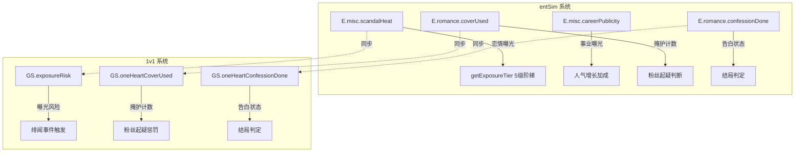

## 需求概述

对娱乐圈模拟器（entSim）进行全面代码审计与修复，覆盖5个层面：曝光术语拆分、两套系统状态统一、阶段约束修正、8个已知Bug修复、以及参考明星志愿123的游戏性增强建议。

## 核心功能

### 1. "曝光"术语拆分（P0 核心修复）

当前 `GS.entSim.misc.exposureAccum` 被同时用于"恋情曝光风险"和"事业曝光度"两种语义，导致发布作品/品牌代言等正常事业活动错误累积恋情风险值，触发不该触发的绯闻/塌房事件。需拆分为两个独立字段：

- `scandalHeat`：恋情曝光风险（约会/深夜见面/被拍），驱动绯闻阶梯
- `careerPublicity`：事业曝光度（发布作品/代言/综艺），仅影响人气增长速率，不影响恋情风险

涉及修改位置：`public-opinion.js`（阶梯函数改用scandalHeat）、`ui.js`（4处事业操作改操作careerPublicity）、`engine.js`（日程结算改操作careerPublicity）、`brother.js`（事件曝光改用addExposure函数）、`state.js`（新增两字段及迁移兼容）

### 2. 两套系统状态同步

entSim模式和1v1 oneHeart模式各有独立状态（exposureRisk vs exposureAccum、oneHeartCoverUsed vs romance.coverUsed等），互不知晓对方变更。需在关键节点建立双向同步机制，确保两套系统对同一语义的状态保持一致。

### 3. 阶段/时段约束修复

- entSim的 `checkRomanceUnlock()` 需同时参考 `oneHeartRomanceStage`
- 修复深夜约会门槛（补回>=40的拦截逻辑）
- 两套掩护系统互通知

### 4. 8个Bug修复

按优先级P0/P1/P2分类修复：空值检查、saveGame遗漏、affection/popularity范围夹紧、parseInt基数规范化

### 5. 游戏性增强建议文档

参考明星志愿123的核心系统（属性/竞争者/通告/培训/奖项/销量/粉丝），输出结构化建议文档

## 技术方案

### 1. 曝光字段拆分方案

**核心思路**：新增 `scandalHeat`（恋情曝光风险，范围0-25+）和 `careerPublicity`（事业曝光度，范围0-100），废弃 `exposureAccum` 的混用语义。旧存档的 `exposureAccum` 全量迁移为 `scandalHeat`（保守策略：旧存档的历史值视为恋情风险）。

**修改文件清单**：

| 文件 | 修改内容 |
| --- | --- |
| `src/ent-sim/public-opinion.js` | `getExposureTier()`从`scandalHeat`读取；`addExposure()`写入`scandalHeat`；新增`addCareerPublicity(mag, reason)`写`careerPublicity` |
| `src/ent-sim/state.js` | `initEntSimState()`中`E.misc`新增`scandalHeat:0`和`careerPublicity:0`；保留`exposureAccum`仅作兼容读取 |
| `src/state.js` | `migrateSave()`将旧`exposureAccum`迁移到`scandalHeat`，`careerPublicity`初始化为0 |
| `src/ent-sim/engine.js` | 日程结算行（548）改用 `addCareerPublicity(d.exp, '日程·' + typeLabel)` |
| `src/ent-sim/ui.js` | 4处事业操作（2516/2566/2582/3018）改用`addCareerPublicity()`；UI展示层同时显示两个值 |
| `src/ent-sim/brother.js` | 事件exposure增量（122）改用`addExposure(ev.exposure, '事件·' + ev.text)`（已有函数，仅改为调用而非直接赋值） |


**向后兼容**：`getExposureTier()`保留 `scandalHeat || E.misc.exposureAccum || 0` 的fallback读取（迁移过渡期）。

### 2. 双系统状态同步方案

在 `src/ent-sim/engine.js` 的 `goEntSimNextDay()` 末尾新增 `syncOneHeartState()` 函数，将 `E.misc.scandalHeat` 映射写入 `GS.exposureRisk`、`E.romance.coverUsed` 写入 `GS.oneHeartCoverUsed` 等。在 `src/game-engine.js` 的1v1约会/告白结算处也反向同步。

### 3. Bug修复方案

- **B1**：`applyConfessionResult()` 函数顶部加 `if (!E) return result;`
- **B2**：`ui.js:2890/3128/2943` 和 `brother.js:137` 每处末尾补 `saveGame()`
- **B3**：`engine.js:883` 加 `Math.max(0, Math.min(100, ...))`
- **B4**：`ui.js:2890/3017/3128` 和 `engine.js:547` 用 `Math.max(0, Math.min(100, ...))` 包裹
- **B5**：`game-engine.js:3744` 和 `moments-modal.js:71` 加夹紧
- **B6**：`romance.js:161` 加 `Math.max(0, ...)`，`romance.js:168` 加 `Math.min(100, ...)`
- **B7**：批量给 `parseInt` 加基数 `10`
- **B8**：`romance.js:161` 和 `romance.js:168` 加 `|| 0` 兜底

### 4. 架构设计



### 5. 目录结构

```
src/
├── ent-sim/
│   ├── public-opinion.js    # [MODIFY] 曝光阶梯改用scandalHeat；新增addCareerPublicity
│   ├── state.js             # [MODIFY] 初始化两新字段；UI辅助getter
│   ├── engine.js            # [MODIFY] 日程结算改操作careerPublicity；新增syncOneHeartState；B3修复；B4修复
│   ├── ui.js                # [MODIFY] 4处事业操作改addCareerPublicity()；B2补saveGame()；B4修复；B7修复
│   ├── romance.js           # [MODIFY] B1空值检查；B6双向夹紧；B8 NaN修复
│   └── brother.js           # [MODIFY] 曝光改用addExposure()；B2补saveGame()
├── state.js                 # [MODIFY] migrateSave新增scandalHeat/careerPublicity迁移
├── game-engine.js           # [MODIFY] B5 affection夹紧；1v1→entSim同步
├── modals/moments-modal.js  # [MODIFY] B5 affection夹紧
├── ui-renderer.js           # [MODIFY] B7 parseInt基数
├── modals/api-settings-modal.js # [MODIFY] B7 parseInt基数
└── scripts/
    └── gameplay-suggestions.md  # [NEW] 明星志愿123参考建议文档
```

## Agent Extensions

### SubAgent

- **code-explorer**
- 目的：在实施阶段对每个修改文件进行精确的行号确认和上下文验证，确保所有 `exposureAccum` 引用都被正确识别和替换
- 预期结果：生成完整的引用位置列表，确保无遗漏的混用代码