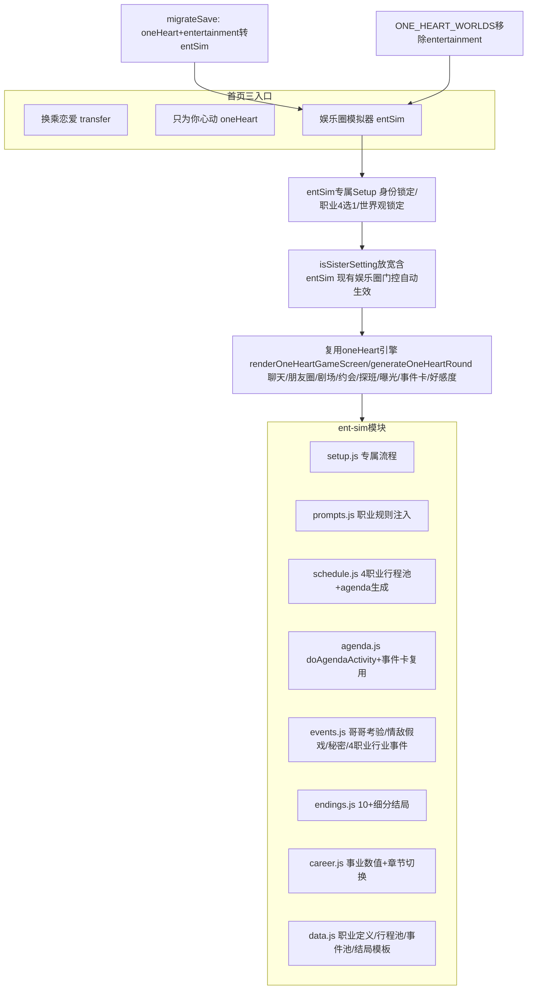

## 产品概述

新增首页第三入口「娱乐圈模拟器」(gameMode='entSim')，与换乘恋爱/只为你心动并列的独立模式。玩家身份锁定=队友的妹妹(亲哥是SEVENTEEN成员)+圈内艺人，职业4选1(练习生/爱豆/solo歌手/演员)。世界观锁定娱乐圈，分章节推进(练习生期8回合/出道期15回合/巅峰期无限)。恋爱为主、事业为辅，复用oneHeart恋爱引擎，娱乐圈特化逻辑集中到src/ent-sim/独立模块。旧oneHeart的entertainment世界观移除并入新模式，旧存档迁移。

## 核心功能

**模式入口与Setup**

- 首页第三按钮「娱乐圈模拟器」设gameMode='entSim'；专属4步setup(选男主+职业4选1+女主信息 / 选哥哥情敌系统随机推荐+写作风格 / 确认+生成种子事件小动作女团背景秘密 / 开始)；身份世界观锁定不选；女主必须比全团13人都小(忙内妹妹)；不开放自定义职业

**分章节事业线**

- 三章节：练习生期(8回合,仅练习生职业经历,出道评估达标转爱豆)→出道期(15回合,爱豆/solo/演员直接从此章开始)→巅峰期(无限,到达成结局)；章节间时间跳跃+过渡剧情；章节切换固定回合触发
- 事业数值：人气0-100+事业等级派生分档(<20新人/20-50上升/50-80当红/80+顶流)；晋升保档、塌房(人气<10)强制降级；独立事业面板按钮点开看详情；涨跌来源=日程活动成败+大事件(回归/获奖)+曝光塌房-

**每日可点日程表**

- 每天生成女主1-3个活动按钮(随机数量)；日程非必做(做有加成+偶遇剧情，不做视作做了无加成)；一天日程1件+约会/探班1件(互斥沿用现有)；活动有概率成败影响人气
- 4职业专属行程池：练习生(练习室/月末评价/出道组竞争)、爱豆(回归/打歌/签售/Vlive/合宿)、solo(专辑/demo/音源/独立舞台)、演员(片场/试镜/拍摄/杀青)
- 真实娱乐圈分支：录节目遇哥哥团员(team)、练习刷手机看新闻(solo)、签售被粉丝问恋爱(粉丝)、拍画报撞见某人(拍摄)、休息日独处触发秘密/朋友圈/剧场(休息)
- 分支选项=预设框架+AI填充文案；影响=好感+曝光+人气+剧情分支；已执行置灰
- 曝光加成：录节目+2/签售+1/拍摄+3/公开活动+2；exposureRisk分档(安全/注意/危险/爆表)，爆表触发彻底曝光抉择

**4职业行业事件池(全选)**

- 练习生：月末评价排名/出道组公布/前辈探班/宿舍夜话/淘汰危机/评估被批
- 爱豆：回归撞男主巡演/直拍被扒同款/签售被问恋爱/退团危机/part争议/同台打歌避嫌/ANTI攻击/海外签售异地
- solo：音源反响/创作合作给男主写歌/颁奖提名/音乐节/feat邀请/创作瓶颈
- 演员：试镜结果/剧组八卦/同剧演员暧昧传闻/收视率/演技争议/杀青感言
- 曝光风险差异：爱豆最高/演员低/solo中/练习生最低

**男主与感情推进**

- 上心种子事件(setup生成200字固定存档,类型现有4类+新增,音乐类硬约束女主主动哼唱→男主旁听)
- 专属小动作(开局选1主+1备,随好感解锁更多)
- 心动时刻(好感破20进暧昧期stage0→1,300字高光,仅一次)
- 男主告白(好感>=60且哥哥非protective,接受/拒绝/拖延；被拒拖延后看玩家后续行动可再告白)
- 肢体接触门槛：牵手stage1/拥抱stage1/接吻stage2/同床stage3；欧巴称呼stage2明确期解锁
- 剧场分阶段解锁：暧昧期解锁男主视角,明确期解锁情敌/哥哥视角,结局后全开；5种各800字

**哥哥系统**

- 开局参谋观望中立；递进考验2-3次(中局试探genCount>=15/后局设局安排妹妹情敌独处/结局前把关好感>=70)；失败转testing后可逆转回supportive
- 三重身份(亲哥+情敌队友+男主队友)察觉情敌异常看支持度(高=告诉男主/低=纠结)；哥哥支线每5-8回合1次(创作瓶颈/黑粉/队友矛盾,绝不SOLO不分开)

**女主秘密**

- 固定2-3个全围绕EXO追星；男主发现=好感契机/被撞破看类型(可消除/永久把柄)/哥哥知道=调侃

**曝光与地下恋**

- 情敌假戏真做(固定stage>=3触发1-2次,营业CP被拍→危机公关→澄清/不回应/借机公开)
- 5种掩护手段(假装不熟/借哥打掩护/避嫌约会/营业掩护/公司掩护)自动应用最合适,累计3次粉丝起疑曝光+
- 曝光阶梯后果+热度衰减(低调日自动减+手动公关2次用完后仅低调日减)
- 彻底曝光公开抉择=结局高潮(爆表档触发)

**社交与剧场**

- 朋友圈=日常AI生成+事业节点(回归/获奖/杀青)自动发庆祝动态；暗斗彩蛋男主+情敌都评论(随机50%)
- 聊天=自由输入+快捷话题；"正在输入"时长随好感(低3-5秒/高0.5-1秒)；"开会中晚点回"看好感(高好感不出现)
- 男主/哥哥生日触发特殊剧情；节日=沿用HOLIDAYS_1V1+艺人专属(出道纪念日/回归日/杀青日)

**结局**

- 玩家主动选「走向大结局」触发；10+细分(HE公开婚礼/地下永久/带球跑、NE和平分手/远距离/暧昧未明、BE曝光塌房/情敌上位/哥哥反对、隐藏和情敌在一起)
- HE公开婚礼额外条件=哥哥supportive+公开恋爱+事业稳；事业巅峰+恋爱稳定=HE加成,事业崩塌=强制BE,其余事业状态仅影响文案
- 情敌隐藏结局优先检测(aff<40+情敌倾向>=50+接受情敌告白→替换男主情敌变新男主继续,旧男主变情敌走真诚追求路线非营业CP型)

## 技术栈

- 语言/运行时：JavaScript(ES Modules)，Vite 5.4构建，浏览器原生运行(vanilla JS，无组件库)
- 复用现有约定：var不用let/const、字符串+拼接、AI文本escHtml()转义、禁alert/confirm用showToast/showConfirmModal、GS引用不可替换、新增状态字段在state.js:defaultGameState()定义+migrateSave()兜底
- 不引入新依赖，不引入Tailwind(项目CSS变量体系style.css)

## 实现方案

采用「独立模式+引擎复用+逻辑抽模块」策略。entSim在核心调度上等价于oneHeart(复用renderOneHeartGameScreen/generateOneHeartRound/buildOneHeartSystemPrompt/聊天/朋友圈/剧场/约会/探班/曝光/事件卡/好感度引擎)，但setup走专属流程、娱乐圈特化逻辑集中到src/ent-sim/。

### 门控放宽策略（核心，零回归关键）

经探索确认`gameMode === 'oneHeart'`散布在17个文件中，分两类处理：

**第一类：核心调度点(改`===`为`=== || ===`)** — entSim必须走oneHeart引擎路径：

- ui-renderer.js: renderGameScreen(:1408)、bindGameEvents(:1821)、renderAll CSS(:76)、setup step2/3/4分流(:314/431/491/917/960/1062)、模式按钮绑定(:556)、行程条生成(:1281)
- game-engine.js: generatePhaseNarrative(:58)、generateOneHeartRound(:2473内部多处)、handleOptionChoice(:674/1240)、handleFreeAction(:977)、handleRegenerate(:1465)、advancePhase(:1536)、scheduleReturnGift/checkPendingReturnGifts(:1851/1859)、applyOneHeartEventEffects(:1240)、validateOneHeartNarrative(:2754)、话题频率追踪(:2832)
- prompts.js: buildSystemPrompt(:88)、buildUserMessage(:302)、感情进度门控(:1513)、行程约束(:1627/1356)、哥哥立场块(:1802)、偶像行为引擎(:1857)、队友妹妹总原则(:1879)
- validator.js: checkOneHeartPacing(:36)、checkOneHeartAddressing(:89)
- 其他: parser.js、ui/narrative-box.js、ui/header-bar.js、modals/(news/gift/review/help/api-settings/x-items/x-archive)

**第二类：娱乐圈特化函数(改直接判断为isSisterSetting())** — 这些函数已检查`gameMode==='oneHeart' && worldSetting==='entertainment' && role==='哥哥'`，isSisterSetting放宽后自动对entSim生效：

- game-engine.js: pickOneHeartBrotherEvent(:2052)、updateBrotherStance(:2095)、applyDateEffects(:2115)、accumulateScandalHeat(:2157)、applyBrotherStanceDailyDecay(:2170)、applyScandalHeatDailyDecay(:2181)、handleBrotherChat(:2192)、generateOneHeartSchedule(:2316)、哥哥递进考验(:2577)、哥哥专属事件(:2616)、女主秘密(:2625)、男主告白(:2664)、营业CP曝光(:2681)、哥哥里程碑(:2565)、场景去重(:2810)

**关键：isSisterSetting()放宽(utils.js:31-34)**

```javascript
export function isSisterSetting() {
  if (GS.gameMode === 'entSim') return true; // entSim身份/世界观/关系均锁定
  return GS.gameMode === 'oneHeart' && GS.worldSetting === 'entertainment'
    && GS.oneHeartRelationCharacter && GS.oneHeartRelationCharacter.role === '哥哥';
}
```

entSim setup锁定worldSetting='entertainment'+role='哥哥'，故第一类核心调度点改为`gameMode==='oneHeart' || gameMode==='entSim'`后，第二类函数通过isSisterSetting()自动生效。

### 关键技术决策

1. **首页第三入口**：ui-renderer.js:298-303模式选择区新增第三按钮modeEntSim；:221 modeSel逻辑从二选一改三选一；:541-560 bindSetupEvents新增modeEntSim点击绑定设gameMode='entSim'。

2. **entSim专属setup**：renderSetupWizard中gameMode==='entSim'分流到ent-sim/setup.js的renderEntSimSetup(step)。流程：Step1(API+模式)→Step2(选男主+职业4选1+女主名/年龄/外貌/性格混合chip)→Step3(选哥哥+情敌系统随机推荐+写作风格)→Step4(确认+生成种子事件/小动作/爱豆女团背景/秘密)→Step5(游戏)。setup锁定worldSetting='entertainment'+role='哥哥'。

3. **Prompt复用与扩展**：buildOneHeartSystemPrompt已有isSisterSetting()块自动生效。entSim额外注入buildEntSimPromptSuffix(profession)：4职业规则差异化(恋爱禁令/回归节奏/同行共鸣/粉丝经济)、男主称呼演进(第一次叫"XX的妹妹"→熟络后直呼名)、日程encounterHint引导、章节进度注入。

4. **日程表数据生成**：generateOneHeartSchedule(:2316)门控放宽后，末尾扩展生成GS.entSimTodayAgenda。4职业各有专属行程池(ent-sim/data.js)，按profession抽取。每项{id,task,place,cat,type(team|solo),encounterHint}。空白日→agenda仅含休息/独处活动。

5. **日程表执行**：新增doAgendaActivity(activityId)(ent-sim/agenda.js)。点击→构造合成事件→复用generateEventStory(:3805)生成150-200字短故事→按cat应用确定性轻量副作用(拍摄/签售→exposureRisk+1~3；练习看新闻→好感±1~2；休息→触发秘密/朋友圈；事业人气±按成败)→标记entSimAgendaDone[id]置灰。

6. **事业系统**：新增entSimPopularity(0-100)+entSimCareerRank(新人/上升/当红/顶流派生)。日程成败+大事件涨跌；独立事业面板弹窗(UI)显示。章节切换固定回合(练习生8/出道15/巅峰无限)触发切章动画+过渡剧情。

7. **旧entertainment世界观移除与迁移**：data.js:960-963从ONE_HEART_WORLDS移除entertainment项；worlds/index.js:7+14移除entertainment导入和_all项。migrateSave(state.js:386+)新增：if(gameMode==='oneHeart'&&worldSetting==='entertainment'){gameMode='entSim';}。

8. **结局判定**：重写evaluateEnding(:2232)为ent-sim/endings.js的evaluateEntSimEnding，返回10+细分type，按哥哥立场×情敌倾向×曝光×是否公开×好感×事业组合。情敌隐藏结局优先检测。事业巅峰+恋爱=HE加成，事业崩塌=强制BE。

### 性能与可靠性

- 日程生成O(1)随机抽取，跨天随generateOneHeartSchedule一起生成
- 场景AI生成复用generateEventStory，失败走兜底文案不阻塞
- 事件复用_pendingEvents队列(上限2)不刷屏
- 结局判定纯同步函数无AI调用
- 存档迁移migrateSave一次性执行，旧存档无感知升级
- 门控放宽不新增函数调用开销，仅布尔判断多一项

## 实现注意

- isSisterSetting放宽后，entSim setup必须锁定worldSetting='entertainment'+role='哥哥'，否则第二类函数不生效
- 第一类核心调度点约30+处需逐个改为`=== 'oneHeart' || === 'entSim'`，用[code-explorer]全量搜索确保无遗漏(已确认17文件)
- generateOneHeartSchedule(:2316)的入口门控`gameMode!=='oneHeart'`需改为含entSim，否则entSim不生成三人行程
- 4职业行程池cat字段需与encounterHint映射一致(team→遇哥哥团员/solo→看新闻/粉丝→被问恋爱/拍摄→被拍/休息→独处)
- 女团队友具象化化名池需避免与SEVENTEEN成员名冲突
- validator门控放宽含entSim但不改语义(stage<1禁hotKw+softKw但不禁"关心/在意/眼神/试探")
- 章节切换在generateOneHeartRound或proceedToNextDay中检测回合数触发，复用nextEpisodePreview的切章动画容错模式

## 架构设计



## 目录结构

```
src/
├── ent-sim/                    # [NEW] 娱乐圈模拟器独立模块
│   ├── index.js                # 模块入口导出所有entSim函数
│   ├── setup.js                # entSim专属setup流程渲染+绑定(身份锁定/职业4选1/世界观锁定/男主哥哥情敌选择)
│   ├── prompts.js              # buildEntSimPromptSuffix(profession) 4职业规则差异化注入; 称呼演进; 第3轮情敌改再次出现; 章节进度注入
│   ├── schedule.js             # 4职业专属行程池定义 + generateEntSimAgenda(女主日程生成复用generateOneHeartSchedule扩展)
│   ├── agenda.js               # doAgendaActivity(activityId) 日程执行+encounterHint分支+复用generateEventStory+轻量副作用
│   ├── events.js               # 娱乐圈事件池: 哥哥递进考验/情敌假戏真做/女主秘密/4职业行业事件
│   ├── career.js               # 事业数值(人气0-100+等级派生)+章节切换(练习生8/出道15/巅峰无限)+切章动画
│   ├── endings.js              # evaluateEntSimEnding 10+细分type+情敌隐藏结局优先检测+事业巅峰/塌房判定
│   └── data.js                 # ENT_SIM_PROFESSIONS(4职业)/4职业行程池/事件池/结局模板/encounterHint映射/事业大事件
├── ui-renderer.js              # [MODIFY] step1第三按钮modeEntSim(:298-303); modeSel三选一(:221); 
│                               #   renderGameScreen(:1408)/bindGameEvents(:1821)/renderAll(:76)扩展含entSim;
│                               #   setup step2/3/4(:314/431/491/917/960/1062)分流entSim; 
│                               #   模式绑定(:556)新增modeEntSim; 行程条(:1281)门控放宽;
│                               #   新增事业面板弹窗渲染+章节进度条+切章动画
├── utils.js                    # [MODIFY] 新增isEntSimMode(); isSisterSetting()放宽含entSim(:31-34)
├── state.js                    # [MODIFY] defaultGameState新增: entSimTodayAgenda/entSimAgendaDone/
│                               #   entSimPopularity/entSimCareerRank/entSimChapter/
│                               #   _mainConfessionDone/entSimSecret/_brotherTestPhase/
│                               #   entSimCoverUsed/entSimManualPRUsed/entSimExposurePublic;
│                               #   migrateSave新增oneHeart+entertainment转entSim迁移(:386+)
├── game-engine.js              # [MODIFY] 核心调度点gameMode===oneHeart放宽含entSim(约15处);
│                               #   generateOneHeartSchedule(:2316)门控放宽+末尾扩展entSim agenda;
│                               #   娱乐圈特化函数改isSisterSetting()(约15处自动生效);
│                               #   generateOneHeartRound内章节切换检测+事业数值涨跌
├── prompts.js                  # [MODIFY] buildSystemPrompt(:88)/buildUserMessage(:302)门控放宽;
│                               #   感情进度(:1513)/行程约束(:1627/1356)/哥哥立场(:1802)/偶像行为(:1857)/队友妹妹(:1879)门控放宽;
│                               #   新增entSim职业规则+称呼演进+章节进度注入
├── validator.js                # [MODIFY] checkOneHeartPacing(:36)/checkOneHeartAddressing(:89)门控放宽含entSim
├── data.js                     # [MODIFY] ONE_HEART_WORLDS移除entertainment项(:960-963);
│                               #   buildHeroineGirlGroup增强(队友具象化:化名+性格+关系标签)
├── worlds/index.js             # [MODIFY] 移除entertainment导入(:7)和_all项(:14)
├── app.js                      # [MODIFY] import ent-sim/index.js
├── style.css                   # [MODIFY] 新增.entsim-mode样式+日程卡片按钮+事业面板+章节进度条+切章动画(复用玻璃拟态变量)
├── parser.js                   # [MODIFY] gameMode===oneHeart门控放宽(话题频率等)
├── ui/header-bar.js            # [MODIFY] gameMode===oneHeart门控放宽
├── ui/narrative-box.js         # [MODIFY] gameMode===oneHeart门控放宽
└── modals/                     # [MODIFY] news-modal/gift-panel/review-modal/help-modal/api-settings等门控放宽
```

## 关键代码结构

```javascript
// utils.js — 门控放宽
export function isEntSimMode() {
  return GS.gameMode === 'entSim';
}
export function isSisterSetting() {
  if (GS.gameMode === 'entSim') return true;
  return GS.gameMode === 'oneHeart' && GS.worldSetting === 'entertainment'
    && GS.oneHeartRelationCharacter && GS.oneHeartRelationCharacter.role === '哥哥';
}

// state.js — 新增字段
entSimTodayAgenda: [],        // 女主当日活动 [{id,task,place,cat,type,encounterHint}]
entSimAgendaDone: {},         // 当日已执行活动标记
entSimPopularity: 30,         // 人气 0-100 (初始30)
entSimCareerRank: 'rookie',   // 事业等级 rookie/rising/star/top (派生)
entSimChapter: 1,             // 当前章节 1练习生期/2出道期/3巅峰期
_mainConfessionDone: false,
entSimSecret: null,
_brotherTestPhase: 0,
entSimCoverUsed: 0,
entSimManualPRUsed: 0,
entSimExposurePublic: null,

// state.js — migrateSave迁移
if (GS.gameMode === 'oneHeart' && GS.worldSetting === 'entertainment') {
  GS.gameMode = 'entSim';
}

// ent-sim/data.js — 4职业定义
export var ENT_SIM_PROFESSIONS = [
  { id: 'trainee', name: '练习生', icon: '🎤', startChapter: 1 },
  { id: 'idol', name: '爱豆', icon: '✨', startChapter: 2 },
  { id: 'solo', name: 'solo歌手', icon: '🎵', startChapter: 2 },
  { id: 'actor', name: '演员', icon: '🎬', startChapter: 2 }
];

// ent-sim/career.js — 章节切换
export function checkChapterSwitch() {
  var gc = GS.oneHeartGenCount || 0;
  var chap = GS.entSimChapter || 1;
  var prof = (GS.heroineProfile && GS.heroineProfile.profession) || '';
  // 练习生期8回合 → 出道评估 → 转爱豆进出道期
  if (chap === 1 && gc >= 8) { GS.entSimChapter = 2; triggerChapterTransition(2); }
  // 出道期15回合 → 巅峰期
  if (chap === 2 && gc >= 23) { GS.entSimChapter = 3; triggerChapterTransition(3); }
}

// ent-sim/agenda.js — doAgendaActivity概要
export async function doAgendaActivity(activityId) {
  // 1. 取activity from GS.entSimTodayAgenda
  // 2. 构造合成事件{type,scenario:encounterHint,options:按cat预设框架}
  // 3. 复用generateEventStory生成短故事→存入oneHeartEventCards
  // 4. 按cat应用确定性轻量副作用(exposureRisk/affection/entSimPopularity)
  // 5. GS.entSimAgendaDone[activityId]=true; saveGame(); renderAll();
}
```

entSim模式沿用项目现有玻璃拟态+深色紫调风格，主体复用oneHeart框架(底部4Tab剧情/聊天/朋友圈/剧场+行程条+操作区+快捷指令抽屉)，不整套重设计。通过.entsim-mode CSS标识做紫调微差异化向娱乐圈质感偏移。新增UI块：首页第三入口按钮、entSim专属setup4步、每日日程卡片、事业面板弹窗、章节进度条+切章动画。

页面区块(1v1操作区内新增)：

- 日程标题条：今日日程·Day N+天气点缀，与哥哥立场/曝光指示同行
- 活动按钮组：1-3个圆角玻璃按钮横排，图标(📺录节目/🎤练习/✍️签售/📷拍摄/🌙休息按cat映射)+活动名(13px)+地点小字(11px)；hover微抬升translateY(-2px)+边框高亮0.2s缓动
- 已执行态：变灰+图标加勾+禁用
- 休息日态：仅1个休息日·独处按钮，文案今天没有行程做点自己的事
- 事业面板：独立弹窗，显示人气条(0-100)+事业等级徽章+章节进度
- 章节进度：Header常驻条+切章全屏动画
- 移动端窄屏按钮自动换行两列，可点区域大于等于44px

视觉规范：卡片底色半透明深色玻璃rgba(255,255,255,0.06)+模糊，边框1px半透白；按钮圆角12px内边距8-10px；图标用系统emoji。

## Agent Extensions

### SubAgent

- **code-explorer**
- Purpose: 在entSim-skeleton任务中全量搜索17个文件中所有`gameMode === 'oneHeart'`和`gameMode !== 'oneHeart'`调度点，输出精确行号清单，确保门控放宽无遗漏、零回归
- Expected outcome: 完整的需放宽行号清单(核心调度点约30+处+娱乐圈特化函数约15处)，区分"改===为||"和"改isSisterSetting()"两类