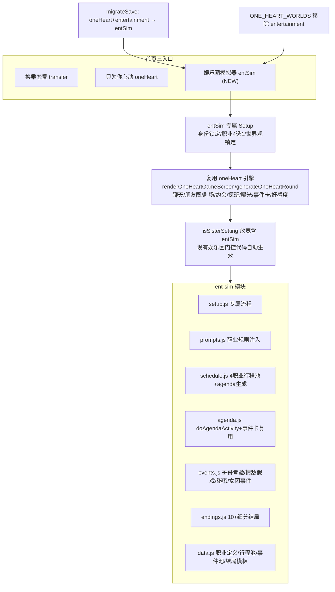

## 产品概述

新增首页第三入口「娱乐圈模拟器」(gameMode='entSim')，作为与「换乘恋爱」「只为你心动」并列的独立模式。玩家身份锁定为队友的妹妹（亲哥是 SEVENTEEN 成员），同时是圈内艺人，职业 4 选 1（练习生/爱豆/solo歌手/演员）。世界观锁定娱乐圈。复用 oneHeart 恋爱引擎（聊天/朋友圈/剧场/约会/探班/曝光/事件卡/好感度），但娱乐圈特化逻辑集中到独立模块 src/ent-sim/，不再散布污染 oneHeart。旧 oneHeart 的 entertainment 世界观移除并入新模式，旧存档迁移。

## 核心功能

**模式入口与 Setup**

- 首页第三按钮「娱乐圈模拟器」，点击设 gameMode='entSim'
- 专属精简 setup：身份锁定队友妹妹、职业 4 选 1（练习生/爱豆/solo歌手/演员+自定义）、世界观锁定娱乐圈、选男主+哥哥+情敌（复用成员选择）、选写作风格
- 旧 oneHeart entertainment 世界观从选项移除；旧存档迁移（oneHeart+entertainment → entSim）

**每日可点日程表**

- 每天生成女主本人的工作/生活日程（1 主+可选副活动），按钮卡片呈现
- 按 4 职业分流专属行程池：练习生(练习室/月末评价/出道组竞争)、爱豆(回归/打歌/签售/Vlive/合宿)、solo歌手(专辑/demo/音源/独立舞台)、演员(片场/试镜/拍摄/杀青)
- 按真实娱乐圈质感分支：录节目遇哥哥团员、练习刷手机看新闻、签售被粉丝问恋爱、拍画报撞见某人、休息日独处触发秘密/朋友圈/剧场
- 点击按钮→生成场景剧情+2-3 分支选项+轻量好感/曝光副作用，已执行置灰

**男主与感情推进**

- 上心种子事件(setup生成200字固定存档，类型随机，音乐类硬约束女主主动哼唱→男主旁听)
- 专属小动作(开局选1主+1备)
- 心动时刻(好感破20进暧昧期，300字高光)
- 男主告白(好感>=60且哥哥非protective，接受/拒绝/拖延)

**哥哥系统**

- 递进考验2-3次(中局试探/后局设局安排妹妹情敌独处/结局前把关)
- 三重身份张力(亲哥+情敌队友+男主队友，察觉情敌异常私下警告)
- 团队支线(创作瓶颈/黑粉/队友矛盾，绝不SOLO不分开)

**女主秘密**

- 2-3个随机全围绕EXO追星，男主发现=好感契机/被撞破=曝光素材/哥哥知道=调侃

**曝光与地下恋**

- 情敌假戏真做(营业CP被拍→危机公关→澄清/不回应/借机公开)
- 5种掩护手段各有代价，累计3次粉丝起疑曝光+
- 曝光阶梯后果+热度衰减(低调日自动减+手动公关2次)
- 彻底曝光公开抉择=结局高潮

**社交与剧场**

- 朋友圈暗斗彩蛋(随机50%)、聊天"正在输入"时长随好感、剧场全开5种按阶段解锁

**结局**

- 10+细分(HE公开婚礼/地下永久/带球跑、NE和平分手/远距离/暧昧未明、BE曝光塌房/情敌上位/哥哥反对、隐藏和情敌在一起)
- 情敌隐藏结局优先检测

## 技术栈

- 语言/运行时：JavaScript(ES Modules)，Vite 5.4 构建，浏览器原生运行(vanilla JS，无组件库)
- 复用现有约定：`var` 不用 let/const、字符串 `+` 拼接、AI 文本 `escHtml()` 转义、禁 alert/confirm 用 showToast/showConfirmModal、`GS` 引用不可替换、新增状态字段在 state.js:defaultGameState() 定义 + migrateSave() 兜底
- 不引入新依赖，不引入 Tailwind（项目用 CSS 变量体系 style.css）

## 实现方案

采用「独立模式 + 引擎复用 + 逻辑抽模块」策略。entSim 在核心调度上等价于 oneHeart（复用 renderOneHeartGameScreen / generateOneHeartRound / buildOneHeartSystemPrompt / 聊天 / 朋友圈 / 剧场 / 约会 / 探班 / 曝光 / 事件卡 / 好感度引擎），但 setup 走专属流程、娱乐圈特化逻辑集中到 src/ent-sim/。

### 关键技术决策

1. **模式标识与门控放宽**：新增 `gameMode='entSim'`。新增辅助函数 `isEntSimMode()`（utils.js）。`isSisterSetting()` 放宽为 `(gameMode==='oneHeart' && worldSetting==='entertainment' && role==='哥哥') || gameMode==='entSim'`——entSim 下 worldSetting 恒为 'entertainment'、role 恒为 '哥哥'（setup 锁定），故现有 isSisterSetting 门控代码自动对 entSim 生效。核心调度点（renderGameScreen `:1408`、bindGameEvents `:1821`、renderAll CSS `:76`、validator `:36/89`）的 `gameMode==='oneHeart'` 检查改为 `gameMode==='oneHeart' || gameMode==='entSim'`（或经 isEntSimMode 辅助）。

2. **entSim 专属 setup**：renderSetupWizard 中 `gameMode==='entSim'` 分流到 ent-sim/setup.js 的 `renderEntSimSetup(step)`。流程精简：Step1(API+模式)→Step2(选男主+职业4选1+女主名/年龄/外貌/性格)→Step3(选哥哥+情敌+写作风格)→Step4(确认+生成种子事件/小动作/女团背景/秘密)→Step5(游戏)。身份/世界观不选（锁定）。

3. **Prompt 复用与扩展**：buildOneHeartSystemPrompt 已有 `if (isSisterSetting())` 块（prompts.js 队友妹妹专属块 1092-1174 + 女团背景 1039-1042），isSisterSetting 放宽后自动对 entSim 生效。entSim 额外注入：4 职业规则差异化（恋爱禁令/回归节奏/同行共鸣/粉丝经济）、男主称呼演进（第一次叫"XX的妹妹"→熟络后直呼名）、日程表 encounterHint 引导。新增 `buildEntSimPromptSuffix(profession)` 追加职业专属规则。

4. **日程表数据生成**：generateOneHeartSchedule（game-engine.js:2314）末尾扩展生成 `GS.entSimTodayAgenda`（女主当日活动）。4 职业各有专属行程池（ent-sim/data.js），按 profession 抽取。每项 `{id, task, place, cat, type(team|solo), encounterHint}`。空白日（每5天 oneHeartBlankDay）→ agenda 仅含休息/独处活动。

5. **日程表执行**：新增 `doAgendaActivity(activityId)`（ent-sim/agenda.js）。点击→构造合成事件 `{type:'agenda_'+cat, scenario:encounterHint, options:按cat分支}`→复用 generateEventStory（game-engine.js:3805）生成 150-200 字短故事→按 cat 应用确定性轻量副作用（拍摄/签售→exposureRisk+1~3；练习看新闻→好感±1~2；休息→触发秘密/朋友圈）→标记 entSimAgendaDone[id] 置灰。

6. **旧 entertainment 世界观移除与迁移**：data.js:960-963 从 ONE_HEART_WORLDS 移除 entertainment 项；worlds/index.js:14 从 _all 移除 entertainment。migrateSave（state.js:505+）新增：`if (GS.gameMode==='oneHeart' && GS.worldSetting==='entertainment') { GS.gameMode='entSim'; }`。

7. **结局判定**：重写 evaluateEnding（ent-sim/endings.js）返回 10+ 细分 type，按哥哥立场×情敌倾向×曝光×是否公开×好感组合。情敌隐藏结局优先检测（aff<40 && rivalAff>=50 && _rivalConfessionAccepted）。

8. **渐进落地**：现有散布在 oneHeart 的娱乐圈代码（行程条/曝光/探班/约会/营业CP）通过 isSisterSetting 放宽后自动对 entSim 生效，暂不硬搬。新功能（日程表/4职业池/哥哥递进/秘密/告白/掩护/结局）直接写进 src/ent-sim/。

### 性能与可靠性

- 日程生成为数组随机抽取(O(1))，跨天随 generateOneHeartSchedule 一起生成
- 场景 AI 生成复用 generateEventStory，失败走兜底文案不阻塞
- 事件复用 _pendingEvents 队列(上限2)，不刷屏
- 结局判定纯同步函数无 AI 调用
- 存档迁移在 migrateSave 一次性执行，旧存档无感知升级

## 实现注意

- isSisterSetting 放宽后，5 个调用文件（validator.js/utils.js/ui-renderer.js/ui/narrative-box.js/prompts.js）的现有娱乐圈逻辑自动对 entSim 生效，无需逐个改——但需验证 entSim 下 worldSetting/role 已在 setup 锁定为 'entertainment'/'哥哥'，否则 isSisterSetting 的 oneHeart 分支条件不满足
- entSim setup 必须在 Step4 开始时锁定 GS.worldSetting='entertainment' + GS.oneHeartRelationCharacter.role='哥哥'，确保 isSisterSetting 返回 true
- 4 职业行程池的 cat 字段需与 encounterHint 映射一致（team→遇哥哥团员/solo→看新闻/粉丝→被问恋爱/拍摄→被拍/休息→独处）
- 女团队友具象化的化名池需避免与 SEVENTEEN 成员名冲突
- validator 门控从 oneHeart 放宽到含 entSim，但不改语义（stage<1 禁 hotKw+softKw 但不禁"关心/在意/眼神/试探"）

## 架构设计



## 目录结构

```
src/
├── ent-sim/                    # [NEW] 娱乐圈模拟器独立模块
│   ├── index.js                # 模块入口，导出所有 entSim 函数
│   ├── setup.js                # entSim 专属 setup 流程渲染+绑定(身份锁定/职业4选1/世界观锁定/男主哥哥情敌选择)
│   ├── prompts.js              # buildEntSimPromptSuffix(profession) 4职业规则差异化注入; userMessage 第3轮情敌改"再次出现"
│   ├── schedule.js             # 4职业专属行程池定义 + generateEntSimAgenda(女主日程生成，复用generateOneHeartSchedule扩展)
│   ├── agenda.js               # doAgendaActivity(activityId) 日程执行+encounterHint分支+复用generateEventStory+轻量副作用
│   ├── events.js               # 娱乐圈事件池: 哥哥递进考验/情敌假戏真做/女主秘密/女团行业事件/4职业行业事件
│   ├── endings.js              # evaluateEntSimEnding 10+细分type+情敌隐藏结局优先检测
│   └── data.js                 # ENT_SIM_PROFESSIONS(4职业定义)/4职业行程池/事件池/结局模板/encounterHint映射
├── ui-renderer.js              # [MODIFY] step1第三按钮modeEntSim(:298-303); modeSel三选一(:221);
│                               #   renderGameScreen/bindGameEvents/renderAll 扩展含entSim; setup分流entSim→ent-sim/setup.js
├── utils.js                    # [MODIFY] 新增isEntSimMode(); isSisterSetting()放宽含entSim(:31-34)
├── state.js                    # [MODIFY] gameMode默认'transfer'(不变); defaultGameState新增entSimTodayAgenda/entSimAgendaDone/
│                               #   _mainConfessionDone/entSimSecret/_brotherTestPhase/entSimCoverUsed/entSimManualPRUsed/entSimExposurePublic;
│                               #   migrateSave新增 oneHeart+entertainment→entSim 迁移(:505+)
├── game-engine.js              # [MODIFY] generateOneHeartSchedule(:2314)末尾扩展entSim agenda生成;
│                               #   checkOneHeartEvents扩展entSim事件触发; generateOneHeartRound门控含entSim
├── prompts.js                  # [MODIFY] buildOneHeartSystemPrompt 加 entSim 职业规则注入分支;
│                               #   buildOneHeartUserMessage 第3轮情敌文案改"再次出现"(entSim); 称呼演进注入
├── validator.js                # [MODIFY] checkOneHeartPacing(:36)/checkOneHeartAddressing(:89) 门控放宽含entSim
├── data.js                     # [MODIFY] ONE_HEART_WORLDS 移除 entertainment 项(:960-963);
│                               #   buildHeroineGirlGroup 增强(队友具象化:化名+性格+关系标签)
├── worlds/index.js             # [MODIFY] _all 数组移除 entertainment(:14)
├── app.js                      # [MODIFY] import ent-sim/index.js
└── style.css                   # [MODIFY] 新增 .entsim-mode 样式标识 + 日程卡片按钮样式(复用现有玻璃拟态变量)
```

## 关键代码结构

```javascript
// utils.js — 门控放宽
export function isEntSimMode() {
  return GS.gameMode === 'entSim';
}
export function isSisterSetting() {
  if (GS.gameMode === 'entSim') return true; // entSim 身份/世界观/关系均锁定
  return GS.gameMode === 'oneHeart' && GS.worldSetting === 'entertainment'
    && GS.oneHeartRelationCharacter && GS.oneHeartRelationCharacter.role === '哥哥';
}

// state.js — migrateSave 存档迁移
if (GS.gameMode === 'oneHeart' && GS.worldSetting === 'entertainment') {
  GS.gameMode = 'entSim';
}

// ent-sim/data.js — 4 职业定义
export var ENT_SIM_PROFESSIONS = [
  { id: 'trainee', name: '练习生', schedulePool: 'TRAINEE_POOL', icon: '🎤' },
  { id: 'idol', name: '爱豆', schedulePool: 'IDOL_POOL', icon: '✨' },
  { id: 'solo', name: 'solo歌手', schedulePool: 'SOLO_POOL', icon: '🎵' },
  { id: 'actor', name: '演员', schedulePool: 'ACTOR_POOL', icon: '🎬' }
];

// ent-sim/agenda.js — doAgendaActivity 概要
export async function doAgendaActivity(activityId) {
  // 1. 取 activity from GS.entSimTodayAgenda
  // 2. 构造合成事件 {type:'agenda_'+cat, scenario:encounterHint, options:按cat分支}
  // 3. 复用 generateEventStory 生成短故事 → 存入 oneHeartEventCards
  // 4. 按 cat 应用确定性轻量副作用(exposureRisk/affection/rivalTendency)
  // 5. GS.entSimAgendaDone[activityId]=true; saveGame(); renderAll();
}
```

## 设计风格

entSim 模式沿用项目现有玻璃拟态+深色紫调风格，与 oneHeart/transfer 视觉统一但通过 `.entsim-mode` CSS 标识做微差异化（主色微调向娱乐圈质感偏移）。新增两块 UI：首页第三模式入口卡片、entSim 专属 setup 流程、游戏内每日日程卡片。

### 首页模式选择（Step1）

- 现有 2 个模式按钮下方新增第三按钮「娱乐圈模拟器」，emoji 用星标，描述"你是队友的妹妹，也是圈内艺人"。三按钮等宽排列，选中态高亮边框+背景渐变。

### entSim Setup 流程

- Step2：上半选男主（复用成员网格），下半选职业（4 个圆角卡片：练习生/爱豆/solo歌手/演员，每个带图标+一句话描述），再下方女主基础信息（姓名/年龄/外貌/性格，复用现有 chip 组件）
- Step3：选哥哥+情敌（复用成员网格，自动排除男主），选写作风格（复用 style-grid）
- Step4：确认卡片（男主/职业/哥哥/情敌/风格一览），开始游戏按钮

### 游戏内每日日程卡片

- 位于剧情区下方操作区 `#oneHeartScheduleStrip` 内，与探班按钮并排
- 标题条：「今日日程 · Day N」+ 天气点缀
- 活动按钮组：1-3 个圆角玻璃按钮横排，每个含图标(按 cat 映射：📺录节目/🎤练习/✍️签售/📷拍摄/🌙休息)+活动名(13px)+地点小字(11px)
- hover 微抬升 translateY(-2px)+边框高亮 0.2s 缓动
- 已执行态：变灰+图标加勾+禁用
- 休息日态：仅 1 个「休息日·独处」按钮，文案"今天没有行程，做点自己的事"
- 移动端窄屏自动换行两列，可点区域≥44px

## Agent Extensions

### SubAgent

- **code-explorer**
- Purpose: 在 entSim-skeleton 任务中搜索 gameMode==='oneHeart' 的全部调度点（renderGameScreen/bindGameEvents/renderAll/validator/prompts/game-engine），确保门控放宽无遗漏
- Expected outcome: 输出所有需从 oneHeart 放宽到含 entSim 的精确行号清单，保证零回归