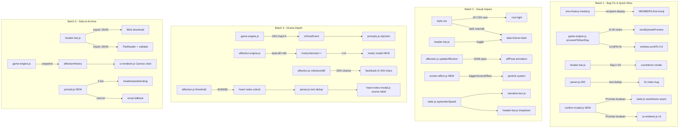

## 用户需求

整合原 plan 的 7 项未实现功能 + 新提的优化建议，形成一个大 plan，分 4 批实施。核心目标：让游戏更好玩、更有冲突感、让玩家更能感受视觉小说的冲击。

## 产品概览

对《换乘恋爱 x SEVENTEEN》进行全面提升，涵盖 Bug 修复、视觉冲击、戏剧深度、数据存档四大方向，共 17 项改动。不改变现有游戏流程和核心架构，在此基础上增强体验层。

## 核心功能

**第一批 - 低成本高冲击 + Bug修复：**

- 短信历史收件人醒目化（加成员 emoji + 视觉标识，不改数据结构）
- 下集预告（每天结束生成 1 句悬念预告，淡入显示后进入次日）
- 倒计时仪式感（Day 10 起 Header 显示距离最终选择天数）
- 修复 proceedToNextDay 缺少 scrollTo
- 修复 parser.js 心动笔记 index 交叉取值 Bug
- confirm() 替换为自定义确认弹窗（5 处）

**第二批 - 视觉冲击：**

- CSS 变量化重构 + 深色模式 + 内联样式清理
- 好感度飘字动画（+N/-N 从 Header 飘出淡出）
- 关键时刻全屏特效框架（心碎粒子/X 揭露闪光/好感度里程碑光效）
- 打字机速度可调/可关闭

**第三批 - 戏剧深度：**

- X 幽灵存在（Day 3-5 随机碎片化痕迹，制造悬疑压迫感）
- 修罗场强度数值化（好感度双高时递进冲突，强度达标触发二选一事件）
- 成员记忆闪回（好感度 80+ 触发 200 字回忆闪回）
- 心动笔记好感度阶段解锁（阈值 40/60/80 解锁，含 Bug 修复）

**第四批 - 数据存档：**

- 存档导出导入（JSON 序列化/反序列化，无后端依赖）
- 统计可视化（结局画面 Canvas 折线图，好感度+喝酒量+冲突强度）
- 成员立绘框架（按好感度 5 档选图，onerror 回退 emoji）

## Tech Stack

- 现有项目：Vanilla JS (ES Modules) + Vite 5.4，Node.js 18+
- 代码约定：使用 `var` 而非 `let/const`，字符串拼接用 `+`，不使用模板字符串
- 状态版本：v21 -> v22（新增字段需同步 `defaultGameState()` + `migrateSave()`）
- 不引入新依赖（Canvas 2D 原生 API、CSS 变量、requestAnimationFrame 均为浏览器原生）
- 安全红线：所有 AI 生成文本插入 DOM 前必须 `escHtml()`；禁止 `alert()/confirm()`，用 `showToast()/showConfirmModal()`

## Implementation Approach

### 第一批策略

**A. 短信历史收件人醒目化**：`sms-history-modal.js:9-14` 当前是简单 div 列表，"发给 XXX" 用 11px 灰色小字。改为：每条短信卡片左侧加成员 emoji 圆形色块标识，收件人信息提升为 14px 加粗 + 成员 emoji。`smsHistory` 数据项已含 `{day, target, name, content}`，`target` 是 memberId，用 `MEMBERS.find` 取 emoji 即可，**不改数据结构、不动发送逻辑**。

**B. 下集预告**：在 `proceedToNextDay`（`game-engine.js:1009`）生成次日剧情前，调用 AI 生成约 30 字悬念预告。新增 state 字段 `nextEpisodePreview`。UI 层创建全屏淡入遮罩 div，3 秒后自动消失。复用 `compressTodayForInjection()` 的上下文。为控制 API 调用成本，预告文案直接附加到次日 prompt 的 user message 前单独生成（短文本、低 temperature=0.6）。

**C. 倒计时仪式感**：`header-bar.js:14-20` 渲染区域，当 `GS.day >= 10 && !GS.gameOver` 时插入 `⏳ 距离最终选择还有 X 天`（X = 12 - GS.day），红色字体 + 微脉冲动画。纯条件渲染，无新字段。

**D. scrollTo 修复**：`game-engine.js:1032` `if (window.__renderAll) window.__renderAll();` 后加 `setTimeout(function(){ window.scrollTo(0,0); }, 100)`，等渲染完成后滚动。

**E. parser.js Bug 修复**：`parser.js:262` 当前 `var nextNote = notes[GS.heartNotes[targetId].length]` 用 array.length 当下标。改为遍历 `HEART_NOTE_TEMPLATES[id]`，找第一个 `text` 不在 `GS.heartNotes[id]` 已有笔记中的项（按 text 去重），确保好感度解锁和秘密任务解锁不会重复。

**F. confirm() 替换**：新建 `modals/confirm-modal.js`，`showConfirmModal(message, opts)` 返回 `Promise<boolean>`。**不**复用 `modal-factory.js` 的 `createModal`（其遮罩点击会关闭弹窗，不适合破坏性操作），自己创建 overlay 并显式阻止遮罩 click 关闭。替换 5 处：`state.js:305`、`state.js:317`（双层嵌套 confirm Bug）、`ui-renderer.js:242`、`ui-renderer.js:803`、`ui-renderer.js:851`。`resetGame()` 需改 `async function`。

### 第二批策略

**G. CSS 变量化 + 深色模式**：`style.css`（1150 行，0 个 CSS 变量，80+ 处硬编码颜色）提取约 25 个 `--xxx` 变量到 `:root`，`[data-theme="dark"]` 覆盖。关键变量：`--bg-gradient/--bg-card/--text-primary/--text-muted/--accent-primary/--border-soft/--bg-soft`。主题切换：`header-bar.js` 新增按钮，`document.documentElement.setAttribute('data-theme', theme)`，持久化 `localStorage('svt_theme')`，支持 `prefers-color-scheme` auto 模式。内联样式清理：`ui-renderer.js`、`header-bar.js`、`sms-history-modal.js`、`affection-panel.js`、`heart-notes-modal.js` 中的 `style="color:#xxx"` 改 CSS class 或 `var()`。

**H. 好感度飘字动画**：`affection.js:5` `updateAffection()` 中好感度变化时创建 `<span class="aff-float">` 挂到 `#affectionHint`，`style.css` 新增 `@keyframes affFloat`（translateY(-40px) + opacity 0->1->0），1.2s 后 `remove()`。正数绿色 `#2e7d32`，负数红色 `#c62828`。防抖：同一成员 300ms 内只显示一次（`skeleton/affection-engine.js` 批量结算会连续触发多个 `updateAffection`）。

**I. 全屏特效框架**：新建 `screen-effect.js`，导出 `triggerScreenEffect(type)` 接口。类型：`heartbreak`（心碎粒子下落）、`revelation`（X 揭露闪光）、`milestone80`（80 好感度光效）。纯 CSS `@keyframes` + 一个 `requestAnimationFrame` 粒子系统（Canvas 或 DOM 粒子）。触发点：`affection.js:19` 里程碑 80 处 + X 身份揭露处 + 最终选择确认处。性能：粒子数量限制 30 个，1.5s 后自动清理 Canvas/DOM。

**J. 打字机速度可调**：`state.js` `defaultGameState()` 新增 `typewriterSpeed: 30`（0=即时显示，10-100=ms/字符），`migrateSave` v22 兜底。`narrative-box.js:168` `startTypewriter(containerId, speed)` speed=0 时跳过逐字直接 `container.innerHTML = fullHtml`。`ui-renderer.js:45,47` 硬编码 `30` 改为 `GS.typewriterSpeed || 30`。`header-bar.js` 新增速度下拉（即时/慢/中/快/关）。

### 第三批策略

**K. X 幽灵存在**：新增 state 字段 `xGhostEvent`。在 `generatePhaseNarrative`（`game-engine.js:46`）开头，Day 3-5 且 `!GS.xGhostEvent` 时 15% 概率触发。事件类型：未署名纸条/陌生号码未接来电/不属于任何人的物品。`prompts.js` 注入对应 prompt 规则，要求 AI 在剧情中自然穿插描写，不揭示 X 身份。每位成员每局只触发一次。

**L. 修罗场强度数值化**：新增 state 字段 `rivalryIntensity`（初始 0）。在 `settlePendingAffChanges`（`skeleton/affection-engine.js`）结算后检测：两位成员好感度均 >= 60 时强度 +1。`prompts.js` `buildUserMessage` 中根据强度注入递进规则：强度 >= 2 时注入更激烈 prompt（正面争吵/冷战/逼表态）；强度 >= 4 时触发"二选一修罗场事件"弹窗（新建 modal，给出"维持现状"和"做出选择"两个选项，选择后注入对应剧情走向）。

**M. 成员记忆闪回**：新增 state 字段 `flashbackShown`（`{ memberId: false }`）。好感度达 80 且该成员未闪回过时，在 `generatePhaseNarrative` 生成剧情前 20% 概率触发。从 `GS.dailySummaries` 提取该成员相关片段，调用 AI 生成 200 字回忆闪回文本。UI 渲染用半透明边框 + 暖色调（`background:rgba(255,224,178,0.15);border-left:3px solid #ffb74d`）包裹，前置 `💭 记忆闪回` 标签。每位成员每局只触发一次。

**N. 心动笔记好感度阶段解锁**：`data.js:373` `HEART_NOTE_TEMPLATES` 约定 index 0/1/2 对应阈值 40/60/80（好感度解锁），index 3/4 对应秘密任务解锁。`affection.js:19` 里程碑检测后增加笔记解锁逻辑（按 text 去重）。`parser.js:247` `completeSecretMission` 配合 Bug 修复 E（从 index 3 开始找未解锁的）。`heart-notes-modal.js:27` 笔记来源标签区分"好感度解锁"/"秘密任务解锁"，笔记对象扩展为 `{text, unlockedAt:{day, source:'affection'|'mission', threshold?, mission?}}`，向后兼容旧数据（无 source 字段默认 mission）。

### 第四批策略

**O. 存档导出导入**：导出 `JSON.stringify(GS)` -> `new Blob([json])` -> `<a download>` 下载，文件名含日期。导入 `<input type="file" accept=".json">` -> `FileReader.readAsText` -> `JSON.parse` -> 版本校验（检查 `parsed.version` 和 `parsed.selectedMembers` 数组）-> `showConfirmModal` 确认 -> `setGS(parsed)` -> `saveGame()` -> `renderAll()`。`header-bar.js` 新增按钮（现有 10 个按钮不可覆盖，追加到 `header-btns` 内）：💾 存档导出、📂 存档导入（与现有 📥 导出剧情 txt 区分图标）。

**P. 统计可视化**：`state.js` 新增 `affectionHistory: []`。`game-engine.js:1009` `proceedToNextDay` 中在 `skeletonResetDay()` 之前快照 `{day: GS.day, aff: Object.assign({}, GS.affection), drinkCounts: Object.assign({}, GS.drinkCounts), rivalryIntensity: GS.rivalryIntensity || 0}`。通关时也快照最终值（Day 12）。`ui-renderer.js:627` `renderEndingScreen` 在"数据总览"后、`ending-actions:649` 前插入 `<div id="affectionChartArea">`。Canvas 2D 手绘折线图：X 轴 Day 1-12 等分，Y 轴 -100 到 100，3 条成员折线各一种颜色，每个数据点标圆点，图例显示成员名+颜色。DPR 适配：`canvas.width = rect.width * devicePixelRatio`，`ctx.scale(dpr, dpr)`。可选叠加喝酒量副曲线（右 Y 轴）。

**Q. 成员立绘框架**：新建 `portrait.js`：`getMemberPortrait(memberId, aff)` 按 `affection.js:26-33` 的 5 档（cold/calm/care/love/passion）返回 `/assets/members/{memberId}/{tier}.png`，`getMemberAvatar(memberId)` 返回 `/assets/members/{memberId}/avatar.png`。展示位置：`header-bar.js:18-20` 小头像 36px、`affection-panel.js` 半身立绘、结局画面 `renderEndingScreen` 成员反应旁。onerror 回退：`<span style="display:none">{emoji}</span>`。图片放 `public/assets/members/` 下（Vite public 静态资源映射根路径），无图时优雅回退，后期放入图片即自动加载。

## Implementation Notes

- **CSS 变量重构范围**：style.css 80+ 处硬编码颜色，建议全局搜索颜色值逐一替换为 `var(--xxx)`。内联 `style="color:#xxx"` 是最容易遗漏的部分，需逐文件排查。
- **飘字动画性能**：`skeleton/affection-engine.js` 的 `settlePendingAffChanges` 可能批量结算多个好感度变化，必须防抖处理避免同时创建多个 DOM 元素。用模块级变量 `_lastFloatTime` + `_lastFloatMember` 记录上次飘字，300ms 内同成员跳过。
- **全屏特效性能**：粒子数量硬限 30 个，`requestAnimationFrame` 循环 1.5s 后 `cancelAnimationFrame` + 清理 DOM/Canvas。避免在低性能设备上卡顿。
- **存档导入安全**：必须校验 JSON 结构完整性（`parsed.version` 存在、`parsed.selectedMembers` 是数组、`parsed.affection` 是对象），防止恶意/损坏文件导致 GS 被覆盖后白屏。校验失败用 `showToast` 提示。
- **migrateSave v21->v22**：新增字段 `typewriterSpeed/theme/affectionHistory/rivalryIntensity/xGhostEvent/flashbackShown/nextEpisodePreview` 需兜底初始化。`resetGame` 保留 `theme`（深色偏好不重置）和 `typewriterSpeed`（用户偏好），`affectionHistory` 清空。
- **下集预告 API 成本**：每次进入下一天多一次约 30 字的 AI 调用。可接受——12 天游戏周期内仅 11 次额外调用。若 API 不可用则静默跳过，不阻塞游戏流程。
- **向后兼容**：`heartNotes` 项结构扩展为含 `source` 字段，旧数据无 `source` 时默认为 `'mission'`，渲染时按此逻辑显示标签。

## Architecture Design



## Directory Structure

```
src/
├── style.css                         [MODIFY] CSS 变量化重构(25个) + 深色主题 + affFloat动画 + 全屏特效样式 + 闪回样式 + 倒计时样式 + 确认弹窗样式 + Canvas容器样式
├── state.js                          [MODIFY] 新增 typewriterSpeed/theme/affectionHistory/rivalryIntensity/xGhostEvent/flashbackShown/nextEpisodePreview 字段 + migrateSave v22 + resetGame 改 async + 替换 confirm() x2
├── affection.js                      [MODIFY] 飘字动画触发 + 好感度阈值40/60/80解锁心动笔记 + 里程碑80触发全屏特效
├── game-engine.js                    [MODIFY] proceedToNextDay 加 scrollTo + affectionHistory快照 + 下集预告生成 + X幽灵触发 + 修罗场强度检测 + 替换 confirm()(如有)
├── parser.js                         [MODIFY] completeSecretMission 心动笔记按text去重(index bug修复) + 秘密任务从index3开始
├── prompts.js                        [MODIFY] 注入X幽灵prompt + 修罗场强度递进prompt + 闪回prompt + 下集预告prompt
├── data.js                           [MODIFY] HEART_NOTE_TEMPLATES 注释标注 index0-2好感度解锁/index3-4任务解锁
├── ui-renderer.js                    [MODIFY] 绑定新Header按钮 + 读取打字机速度 + 结局画面Canvas图表 + 替换confirm() x3 + 内联样式清理
├── ui/
│   ├── header-bar.js                 [MODIFY] 新增深色模式按钮 + 打字机速度下拉 + 存档导出导入按钮 + 倒计时显示 + 立绘头像 + 内联样式清理
│   └── narrative-box.js             [MODIFY] speed=0时即时显示全文
├── modals/
│   ├── confirm-modal.js              [NEW] showConfirmModal 返回Promise<boolean>，阻止遮罩点击关闭
│   ├── sms-history-modal.js          [MODIFY] 收件人显示加成员emoji+醒目标识，不改数据结构
│   └── heart-notes-modal.js          [MODIFY] 笔记来源标签区分好感度/任务解锁 + 内联样式清理
├── modals.js                         [MODIFY] 导出 showConfirmModal
├── modals/
│   └── index.js                      [MODIFY] 导出 showConfirmModal
├── modals/
│   ├── affection-panel.js            [MODIFY] 立绘插入 + 内联样式清理
│   └── rivalry-modal.js              [NEW] 修罗场二选一事件弹窗(强度>=4触发)
├── screen-effect.js                  [NEW] 全屏特效框架 triggerScreenEffect(type)，粒子系统
├── portrait.js                       [NEW] 成员立绘工具函数 getMemberPortrait/getMemberAvatar
└── skeleton/
    └── affection-engine.js           [MODIFY] 结算后检测修罗场强度(双成员好感度>=60时+1)
```

## Key Code Structures

### showConfirmModal 接口

```javascript
// modals/confirm-modal.js
// opts: { title: '确认', confirmText: '确定', cancelText: '取消' }
// 返回: Promise<boolean> -- true=确认, false=取消
// 不复用 createModal（遮罩点击会关闭），自己创建 overlay 显式阻止遮罩 click
export function showConfirmModal(message, opts) {
  return new Promise(function(resolve) {
    // 创建 overlay，遮罩 click 只 resolve(false) 不 remove
    // 确认按钮 -> resolve(true) + remove
    // 取消按钮 -> resolve(false) + remove
  });
}
```

### CSS 变量结构（部分关键变量）

```css
:root {
  --bg-gradient: linear-gradient(135deg, #fce4ec 0%, #f8e8e8 30%, #fff5f5 60%, #fce4ec 100%);
  --bg-card: #fff;
  --text-primary: #3d2c2c;
  --text-muted: #8b6b6b;
  --accent-primary: #e91e63;
  --border-soft: #e0c0c0;
  --bg-soft: #fff5f5;
  /* ... 约25个变量 */
}
[data-theme="dark"] {
  --bg-gradient: linear-gradient(135deg, #1a1a2e 0%, #16213e 50%, #1a1a2e 100%);
  --bg-card: #1e1e2e;
  --text-primary: #e0d8d8;
  --text-muted: #999;
  --accent-primary: #f06292;
  --border-soft: #3a3a4e;
  --bg-soft: #2a2a3e;
  /* ... 对应覆盖 */
}
```

### affectionHistory 数据结构

```javascript
// state.js defaultGameState()
affectionHistory: []
// game-engine.js proceedToNextDay() 中
// 每项: { day: 1, aff: {'scoups':5,'jeonghan':0,'mingyu':-2}, drinkCounts: {'scoups':0,...}, rivalryIntensity: 0 }
```

### triggerScreenEffect 接口

```javascript
// screen-effect.js
// type: 'heartbreak' | 'revelation' | 'milestone80'
// 创建全屏 Canvas overlay，粒子系统 1.5s 后自动清理
export function triggerScreenEffect(type) {
  // 限制粒子数 <= 30
  // requestAnimationFrame 循环
  // 1.5s 后 cancelAnimationFrame + Canvas remove
}
```

## 设计方向

本次改造不重构页面布局，而是通过 CSS 变量系统实现深色模式主题切换，并新增多个视觉增强层（飘字动画、全屏特效、记忆闪回、倒计时）来强化视觉小说的冲击力。

## 深色模式设计

浅色主题保持现有粉色系风格不变。深色主题采用深邃的暗紫蓝色调，保持恋爱的浪漫氛围同时减轻长时间阅读的视觉疲劳。CSS 变量切换由浏览器原生处理，零 JS 重绘开销。

- 背景：从粉色渐变变为深蓝紫渐变（#1a1a2e -> #16213e）
- 卡片/Header：深灰紫底色（#1e1e2e），柔和阴影
- 强调色：保持粉色系但提亮（#f06292），确保暗背景上可读性
- 特殊元素（导演OS/观察员OS/采访间）：保持色相但降低明度

## 新增视觉元素

- 好感度飘字：从 Header 好感度区域向上飘出，绿色+N/红色-N，1.2s 淡出
- 全屏特效：心碎粒子下落/X揭露白色闪光/80好感度金色光效，1.5s 消散
- 记忆闪回：半透明暖色边框包裹，左侧琥珀色竖线，前置标签
- 倒计时：Day 10 起 Header 红色微脉冲文字
- 下集预告：全屏淡入遮罩，居中悬念文字，3s 后淡出

## 内联样式处理

现有代码中大量使用 `style="color:#xxx"` 内联样式，深色模式下这些颜色会与暗背景冲突。需将关键内联颜色替换为 CSS class 或 `var()` 引用，这是 CSS 变量重构中最容易遗漏的部分。

## Agent Extensions

### SubAgent

- **code-explorer**
- Purpose: 在实施前对 style.css 中 80+ 处硬编码颜色进行批量搜索定位，确保 CSS 变量化重构不遗漏
- Expected outcome: 生成完整的颜色值->CSS变量映射清单，供实施时逐一替换