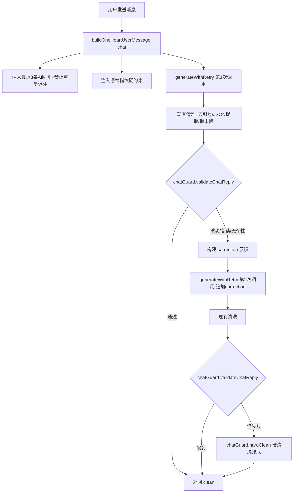

## 产品概述

针对 1v1「只为你心动」模式的聊天系统，通过代码层约束（后处理 + 重试 + Prompt 增强）解决三类问题：AI 破功（带旁白/提好感度/说导演话）、回复复读机（你呢/哈哈/嗯嗯重复）、内容质量差（语气不像成员/亲密度不对）。不涉及 UI 改动，纯逻辑层优化。

## 核心功能

- 破功检测与清洗：正则识别导演式旁白、好感度数值泄漏、游戏机制术语，命中后注入 correction 反馈重试 1 次，仍失败则硬清洗兜底返回
- 跨轮次复读检测：对比最近 3 条 AI 回复的归一化文本相似度，命中后注入"你最近回复是 X/Y/Z，禁止重复"重试 1 次
- 语气指纹校验：检测回复是否过短/无个性（纯应答词），命中后重试并强化口头禅约束
- Prompt 增强：聊天记录中显式标注最近 AI 回复为"禁止重复项"，人设摘要升级为"语气指纹硬约束"，增加正反例对比

## 技术栈

- 纯 JavaScript（ES Modules），Vanilla JS + Vite
- 无新依赖，全部使用浏览器原生 API + 正则
- 遵循项目代码风格：`var` 而非 `let/const`，字符串拼接用 `+`

## 实现方案

### 核心思路

新建 `src/chat-guard.js` 模块，封装三类检测器（破功/复读/语气指纹），在 `sendChatMessage()` 的后处理流程中调用。检测命中时，构建 correction 反馈字符串追加到 userMsg，复用 `generateWithRetry` 进行 1 次重试。重试仍失败时，执行硬清洗（正则删除旁白/数值）后返回，不阻塞流程。

### 关键技术决策

1. **独立模块而非内联**：检测逻辑约 150 行，抽成 `chat-guard.js` 保持 `game-engine.js` 可读性，与现有 `validator.js` 模式一致
2. **最多重试 1 次**：每次重试增加 2-4 秒延迟，1 次是体验与质量的平衡点。与现有 `validateOneHeartNarrative` 的重试模式一致（game-engine.js:1640-1644）
3. **correction 注入方式**：追加到 userMsg 末尾，格式 `[修正] ...`，与现有 pattern 一致（game-engine.js:1642）
4. **复读检测用归一化 Jaccard 相似度**：比简单字符串比较更鲁棒，能识别"你呢"和"你呢你呢"这类变体
5. **兜底策略优先级**：先重试 > 再硬清洗 > 最后原样返回。绝不返回空字符串（当前行为已保证）

### 性能考量

- 检测函数均为 O(n) 正则匹配 + O(k) 集合运算（k=最近回复数，固定 3），无性能瓶颈
- 重试仅在有问题时触发（预估 10-15% 的消息），正常路径零额外开销
- `chatReply` token 上限 1000（data.js:960），重试成本可控

## 实现要点

- **破功检测正则**需覆盖：`/(他|她).{0,8}(说|道|笑|回答|回复|低声|轻声|淡淡)/`、`/语气(带着|透着|含着)/`、`/保持.*?风格/`、`/心里(想|觉得)/`、`/好感度/`、`/初识期|暧昧期|暧昧升温|热恋期/`、`/因为.*?关系.*?所以/`
- **复读检测**：归一化 = 去标点 + 去空格 + 转小写，Jaccard 相似度阈值 0.6，同时维护一个"高频应答词"黑名单（你呢/哈哈/嗯嗯/好的/是啊/确实/哦/嗯），连续 2 轮命中即触发
- **correction 反馈**要具体，如 `"[修正] 你的回复包含导演式旁白「他冷淡地说」，请直接输出角色说的话，不要任何旁白描述"`，而非泛泛的"请重新生成"
- **Prompt 增强**：在 `buildOneHeartUserMessage('chat')` 中，聊天记录渲染时，对最后 3 条 AI 回复追加 `（禁止重复此回复）` 标注；人设摘要行追加 `你的回复必须体现你的说话特色（口头禅/习惯用语），禁止用所有人都适用的通用回复`

## 架构设计



## 目录结构

```
src/
├── chat-guard.js          # [NEW] 聊天回复守卫模块
│   ├── detectDirectorSpeak(text)      检测导演式旁白/心理描写
│   ├── detectAffectionLeak(text)      检测好感度数值/等级/游戏机制泄漏
│   ├── detectRepeatReply(text, recentReplies)  跨轮次复读检测（Jaccard相似度+应答词黑名单）
│   ├── detectGenericReply(text, member)  检测无个性通用回复
│   ├── validateChatReply(text, ctx)    主校验入口，返回 {valid, issues, severity}
│   └── hardClean(text)                 硬清洗兜底（正则删除旁白/数值/术语）
│
├── game-engine.js         # [MODIFY] sendChatMessage() 集成 chat-guard
│   └── 行 2388-2467 区域：
│       1. 首次生成后调用 validateChatReply
│       2. 命中则构建 correction + 重试1次
│       3. 重试后仍命中则 hardClean 兜底
│
├── prompts.js             # [MODIFY] buildOneHeartUserMessage('chat') 增强
│   └── 行 1177/1222-1231 区域：
│       1. 人设摘要追加语气指纹硬约束
│       2. 聊天记录最后3条AI回复标注"禁止重复"
│       3. 硬性规则新增第9条：回复必须体现成员语言特色
│
└── app.js                 # [MODIFY] 新增 import './chat-guard.js'
```