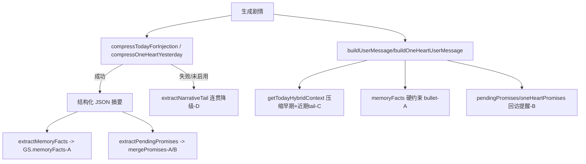

## 用户需求

对现有记忆系统做四项增强（A+B+C+D 全选），解决 AI 长期遗忘关键信息、约定凭空蒸发、当天后段细节被压缩抹平、压缩失败降级生硬截断四类痛点。两类游戏模式（换乘恋爱 transfer / 只为你心动 oneHeart）均需覆盖。

**另含 1v1 亲密门控修复（方案 C 衍生项 E）**：修复「好感度 30 + 玩满 4 回合即触发埋肩窝/蹭脖子级软亲密」的门控漏洞——校验器黑名单只挡硬亲密（抱紧/亲吻/告白），不挡软亲密，且满 4 回合后初识期软 prompt 整体松开。需补软亲密关键词 + 加好感度感知硬门槛。

**另含 1v1 时间/疲劳/日程条移除（项 F）**：彻底去掉 1v1 的 24h 时钟（修 8 点→点选项→18 点跳变）、偶像疲劳值、娱乐圈行程条；探班改为随时可点的独立按钮（每天一次、与约会互斥），剧情照常推进。约会保留为独立按钮（保留好感度/阶段门槛、去掉时段/翘班/深夜区分）。用户明确：疲劳系统一并去掉（彻底无时间/状态概念）。

**另含 换乘随机事件去重（项 G）**：修复「换乘恋爱模式的随机日常事件（RANDOM_EVENTS_POOL，仅 18 项）老是重复出现」的问题——`shouldTriggerRandomEvent()`（`utils.js:160`）只按 `cond` 加权随机抽，无任何去重，同一事件在多天反复触发。参考 1v1 的 `oneHeartRandomUsed` 环形缓冲，给换乘模式加 `GS.randomEventsUsed` 去重：抽前剔除已触发 id，池空则本轮不触发（宁可少事件也不重复）。

**另含 曝光风险减值（项 H）**：保留 1v1 的「曝光风险」数值与所有曝光/被拍逻辑（删除牵连面太广故不删），仅新增`accumulateExposureRisk()` 下限 0 + 每日自然衰减 + 低调日额外减值机制，解决"只增不减"。危险来源并存「哥哥不同意」与「曝光」两路。

**另含 哥哥立场重锚（项 I）**：将 `brotherStance` 的 `protective` 语义从「提醒曝光风险」改为「反对/担忧这段关系」——哥哥不反对人，但在意被家人/公司发现；重新校准 `evaluateEnding` 中 protective 的评分（原 +4「不反对」→ 调整为不加分甚至略减，因如今 protective=反对）。曝光相关的 prompt 文案（protective 描述、B3 妹妹掩护降曝光、行程约束的「被拍风险」）一并改为哥哥视角的张力。

**另含 探班强制场景切换 + 行程作 AI 上下文（项 J）**：探班指令改为「强制场景切换」——像约会一样独立成段、带过渡描写，结尾停在探班一刻，不与主线缠续；并防止「上午哥哥说没事、下午探班又写哥哥」的重复（近期已出现哥哥桥段时，探班用过渡自然避开）。当日行程数据保留并继续作为 AI 背景上下文注入（非强制展示），玩家不去探班时 AI 凭行程自然写「他照常去工作」。UI 行程条按项 F 删除。

**另含 哥哥好感增益上调 + 降低 supportive 阈值（项 K）**：用户要求哥哥好感（`oneHeartBrotherAff`）"加多一点"。两路调整：① 上调所有**正向**增益 delta 约 1 档（探班哥哥 +3→+5、好感里程碑 +3→+5、撒娇 +2→+3、报备 +1→+2、探口风 +1~2→+2~3、男主约会示好 +1→+2、男主请哥哥吃饭事件 +2→+3、中局"谈谈" +2→+3）；② 将推 `supportive` 立场的阈值由 `>=20` 降到 `>=15`，更易摸到「支持」结局。负向 delta（哥哥查岗/提醒/起疑/曝光翻车）维持不变，以保证仍有张力。

## 产品概述

在不改变现有「分层+压缩」架构的前提下，增加一层**结构化事实记忆**（偏好/禁忌/过敏原/约定）并硬注入 prompt；把约定从「每天覆盖」改为「跨天累积+回访提醒」；把当天上下文注入从「要么全量要么压缩摘要」改为「压缩早期+近期原文 tail」混合；把压缩失败/未启用的降级从「生硬 slice 原文」改为「抽取连贯 narrative tail」。

## 核心特性

- A 结构化事实记忆：新增 `GS.memoryFacts`（按 角色→类别 存储），每日摘要抽取 revealedInfo 并归类合并去重，作为硬约束 bullet 注入 transfer 与 1v1 两条 prompt 路径，跨天持久累积。
- B 约定跨天追踪+回访：transfer 的 `GS.pendingPromises` 由「每日覆盖」改为「跨天合并去重」，prompt 注入强化「必须推进/收尾」回访提醒；1v1 复用已成熟的 `oneHeartPromises` 生命周期（自动检测+履行标记）。
- C 混合当日注入：新增 `getTodayHybridContext()`，注入 = 压缩早期摘要 + 近期 narrative tail，替换 prompts.js 中两处 `getTodayFullTextCapped()`，避免缓存抹平后段细节。
- D 连贯降级：压缩失败/未启用 AI 时的兜底由 `full.slice(0,N)` 改为共享的 `extractNarrativeTail(text,N)`，规避断句与丢约定；1v1 昨日压缩兜底一并改造。
- E 1v1 亲密门控修复：给 `checkOneHeartPacing` 补「软亲密」关键词黑名单（埋肩窝/蹭脖子/靠肩/赖在身上/鼻尖蹭/把头埋进 等），并在 stage 门控之外新增**好感度感知硬门槛**——好感度 < 40 时禁止软亲密级接触（与 `oneHeartRomanceStage` 双闸并联）；满 4 回合（stage≥1）后不再整体关闭初识期校验，仅在 stage 明确期（≥2）才放开软亲密。
- F 移除 1v1 时间/疲劳/日程条：删 24h 时钟推进（`game-engine.js:2521-2546`）、`idolFatigue` 全部更新与 `IDOL_FATIGUE_BEATS` 分支、娱乐圈行程条 UI（`renderOneHeartScheduleStrip`）；探班改为无参 `doVisitMember()` 独立按钮（每天一次、与 `oneHeartDateToday` 互斥）；约会 `initiateOneHeartDate()` 去时段/翘班/深夜区分、保留好感度/阶段门槛；清理 prompt 全量时间注入与 `validator.js` 用餐时段兜底。
- G 换乘随机事件去重：给 `shouldTriggerRandomEvent()`（`utils.js:160`）加 `GS.randomEventsUsed` 去重（参考 1v1 的 `oneHeartRandomUsed`）；`state.js` 的 `defaultGameState`+migrate 兜底加 `randomEventsUsed:[]`；抽前剔除已触发 id，候选池空则本轮返回 null（不重复触发）。与 A-F 正交（仅动 utils.js 触发函数 + state.js 字段）。
- H 曝光风险减值（保留曝光系统）：保留 `GS.exposureRisk`/`accumulateExposureRisk`/`SCANDAL_EVENTS` 及全部触发点与显示，新增「自然每日衰减 + 低调日额外减值」机制并加下限 0，解决"只增不减"；危险来源并存「哥哥不同意」与「曝光」两路。
- I 哥哥立场重锚：`brotherStance` 的 `protective` 语义由「提醒曝光风险」改为「反对/担忧这段关系」（在意被家人/公司发现，不反对人），重校 `evaluateEnding` 中 protective 评分；曝光相关 prompt 文案一并转哥哥视角。
- K 哥哥好感增益上调 + supportive 阈值降低：上调全部正向 `oneHeartBrotherAff` 增益 delta 约 1 档（探班/里程碑/撒娇/报备/探口风/约会示好/男主请吃饭事件/中局谈谈），并将推 `supportive` 阈值由 `>=20` 降到 `>=15`；负向 delta 维持不变。与 I 并存（I 管语义、K 管数值与易达性）。
- J 探班强制场景切换 + 行程作 AI 上下文：探班指令改「强制场景切换」（带过渡描写、结尾收在探班、防重复哥哥桥段）；当日行程数据保留并继续作为 AI 背景上下文注入（非强制展示），玩家不探班时 AI 凭行程自然写「他照常去工作」。UI 行程条按 F 删除。

## 技术栈

- JavaScript (ES Modules) + Vite，Vanilla JS；仅改既有模块，不引入新依赖。
- 遵循 AGENTS.md：`var` 声明 + 字符串拼接（禁模板字符串）；AI 文本注入为系统约束，不经 escHtml；保留 `app.js.backup`。

## 现状精准落点（已核对行号）

- `src/memory.js`：`getTodayFullTextCapped`(47-51) 超 `TODAY_TEXT_CAP=12000`(data.js:13) 返回 `[已压缩]+slice(0,4000)`；`getTodayNarrativeTail`(53-86) 已能从 JSON blocks 抽纯 narrative 并做引号边界对齐；`compressTodayForInjection`(119-147) 兜底在 130/144 用 `slice(0,4000)`；`compressOneHeartYesterday`(186-236) 兜底在 221/229 用 `slice(0,1000)`；`dedupeEventLog`(241-254) 指纹去重可复用。
- `src/prompts.js`：transfer `buildUserMessage` 内 688-694 已注入 `GS.pendingPromises`（标「必须实现·不可遗忘」），703/727 注入 `todayRevealedInfo`，712/780 用 `getTodayFullTextCapped()`；1v1 `buildOneHeartUserMessage` 1531 注入 `oneHeartPromises`（标「等待自然实现」）。**缺口**：transfer 每天 `GS.pendingPromises` 被整体覆盖（game-engine.js:1431），跨天不累积；无结构化 facts 硬注入。
- `src/game-engine.js`：1431-1432 `GS.pendingPromises = extractPendingPromises(summary); GS.todayRevealedInfo = extractRevealedInfo(summary);` 为每日写入点；3192 `detectOneHeartPromises` 为 1v1 约定检测。
- `src/promises.js`：`extractPendingPromises` / `extractRevealedInfo` 从 JSON 摘要解析。
- `src/state.js`：defaultGameState 已含 `pendingPromises:[]`(186)、`todayRevealedInfo:''`(187)；migrate 兜底 391-392。
- **F 时间/疲劳/日程条落点（已核对）**：`state.js:70` `idolFatigue`(`state.js:574` migrate)、`state.js:94-97` `oneHeartDayClock/oneHeartTimeOfDay/oneHeartRoundsToday/oneHeartDaySegment` 及其 migrate(`state.js:534-539`)、`state.js:55-57` `oneHeartSchedule/oneHeartVisitLocked`；`game-engine.js:2088` `generateOneHeartSchedule`（含 `idolFatigue` 恢复+累积 `2102/2141`、翘班 +8 `2273`）、`2198-2217` `doVisitMember`（时段吸附 `2198-2202` + 时间门控 `2188-2193`）、`2220-2240` `initiateOneHeartDate`（依赖 `oneHeartSchedule.main` 的 `freeWindows/busySlot` 与 `timeOfDay` 槽位）、`2521-2546` 时钟推进；`prompts.js:1475-1494`(sceneTime 声明+单调+用餐锚定+深夜收尾)、`1255-1261`(_tod 活动)、`1310`(时钟显示)、`1503`(sceneContext.timeOfDay)、`1507-1517`(男主当日行程约束)、`1666-1678`(探班场景含 timeOfDay)、`1736-1742`(idol beat 分支)、`14`(IDOL_FATIGUE_BEATS 导入)；`validator.js:28-41` `checkTimeMealMismatch`（用 `oneHeartDayClock`）及其调用；`ui-renderer.js:2352-2472` `renderOneHeartScheduleStrip`、`1495` `#oneHeartScheduleStrip` 容器、`1065-1068/2688-2693`（新一天重置时钟）、`12` 导入 `doVisitMember/generateOneHeartSchedule`；`utils.js:47-80` `ONE_HEART_DAY_CLOCK_SCHEDULE` + 4 个 period 函数；`worlds/entertainment.js:112-118` `IDOL_FATIGUE_BEATS`；`parser.js:667-684` `sceneTime` 回退到 `oneHeartTimeOfDay`。

## 实现方案

### A 结构化事实记忆

- `state.js` 新增 `memoryFacts: {}`（默认 `{heroine:{preferences:[],taboos:[],allergens:[]}}` 形态，但允许动态增成员键），defaultGameState(~184) 与 migrate(~391) 兜底；**确认保存序列化器未将其列入剥离名单**（与 dailySummaries 同待遇，需持久化）。
- `promises.js` 新增 `extractMemoryFacts(summaryJson)`：解析 JSON 的 `revealedInfo[]`，按关键词分类（「过敏」→allergens；「忌/不吃/讨厌/禁忌/过敏源」→taboos；「喜欢/爱/偏好」→preferences；默认 taboos），按是否含成员名归到对应 `memberId` 或 `heroine`，返回 `{heroine:{...}, '<id>':{...}}`。
- `memory.js` 新增 `mergeMemoryFacts(existing, incoming)`：按「角色+类别」用指纹（前8+后8字）去重合并，复用 `dedupeEventLog` 思路。
- `game-engine.js:1431-1432` 改为：`GS.pendingPromises = mergePromises(GS.pendingPromises, extractPendingPromises(summary)); GS.memoryFacts = mergeMemoryFacts(GS.memoryFacts, extractMemoryFacts(summary));`
- 注入：在 `prompts.js` transfer（703/727 附近追加 memoryFacts bullet）与 1v1（1531 附近）各加一段紧凑 `[已知信息·硬约束·请勿违反]` 列表（女主/成员：偏好、禁忌、过敏原）。

### B 约定跨天追踪+回访

- `memory.js` 新增 `mergePromises(oldArr, newArr)`：字符串数组去重合并（保留既有，新增不重复）。
- `game-engine.js:1431` 用 `mergePromises` 替换直接赋值，约定跨天累积不丢。
- `prompts.js:688-694` 强化 transfer 约定注入文案：明确要求 AI「在后续合适时机自然推进或收尾每条未兑现约定，不得凭空遗忘」；1v1 已有 `oneHeartPromises` 生命周期+1531 注入，验证充分即可，可选微调措辞。

### C 混合当日注入

- `memory.js` 新增 `getTodayHybridContext()`：若 `full.length>TODAY_TEXT_CAP` 且已有 `_todayCompressedSummary`，返回 `摘要 + '\n\n[近期剧情原文]\n' + extractNarrativeTail(full, HYBRID_TAIL_CHARS)`；否则返回全量。
- `prompts.js` 712 与 780 两处 `getTodayFullTextCapped()` 替换为 `getTodayHybridContext()`（需从 memory.js 导入），保证当天后段以原文 tail 始终在场；`consequence` 分支(728) 已用 tail 不受影响。

### D 连贯降级

- `memory.js` 抽出共享 `extractNarrativeTail(text, charCount)`（由现有 `getTodayNarrativeTail` 内部逻辑重构为可接收任意文本），`getTodayNarrativeTail` 改为调用它。
- `compressTodayForInjection` 130/144 的 `full.slice(0,4000)` 改为 `extractNarrativeTail(full, 4000)`；`compressOneHeartYesterday` 221/229 的 `slice(0,1000)` 改为 `extractNarrativeTail(yJoined, 1000)`。降级得到连贯近期叙事而非断句原文。

### E 1v1 亲密门控修复（方案 C 衍生）

**问题定位**（已核对）：

- `validator.js` 的 `checkOneHeartPacing`(47-59) 仅在 `stage < 1`（初识期）生效；拦截词仅为硬亲密（发视频/视频通话/深夜来你房间/来你住处/来你房间/表白/我喜欢你/我爱你/抱住你/抱紧你/亲吻/脱掉/同床/强吻/把你拉进）。「埋肩窝/蹭脖子/靠肩/赖在身上」等软亲密不在名单 → 绕过。
- 满 4 回合后 `oneHeartRomanceStage >= 1`，该校验器 `validator.js:50` 直接 `return` 整体关闭；初识期软 prompt（`prompts.js:1416`「严禁过度肢体接触」）也随之松开。
- 好感度在 1v1 中只是 `prompts.js:788` 注入的软描述（「中性·略有好感」），**无任何硬门控数值**；`oneHeartRomanceStage` 只按生成回合数推进，与好感度无关（`game-engine.js:2073-2084`）。

**修复方案**：

- `validator.js` 黑名单新增软亲密关键词组：`埋进肩窝 / 埋进颈窝 / 鼻尖蹭 / 蹭你 / 蹭着 / 靠在你肩 / 靠上你的肩 / 赖在你 / 赖在身上 / 贴着你 / 把头埋进 / 下巴抵在 / 蹭了蹭你的`。命中即拦截（与现有 `return '[修正]' + ...` 同处理）。
- 新增好感度感知硬门槛（与 stage 双闸并联，任一不满足即拦截）：
- 好感度 `aff < 40` 时，软亲密级接触一律禁止（即便 stage≥1）；
- 好感度 `aff >= 40` 但 `stage < 2`（未进入明确期）时，软亲密仍只允许「轻依赖/撒娇」级（埋肩窝/蹭脖子），禁止「同床/共浴/脱衣」级；
- 好感度 `aff >= 60` 且 `stage >= 2` 才放开全部软亲密。
- 满 4 回合不再整体 `return` 关闭校验：改为按 `stage` 分级放开（stage 0 全禁软亲密；stage 1 仅允许轻依赖；stage ≥ 2 由好感度阈值决定）。
- `prompts.js:1416` 初识期 prompt 强化措辞：除「严禁过度肢体接触」外补充「未建立明确亲密关系前不得描写把头埋进肩窝、鼻尖蹭颈窝等越界亲近」，与校验器双保险。
- 好感度读取来源：`GS.oneHeartAffection`（1v1 单成员好感度，需确认字段名，实现时读取 `getOneHeartAffection()` 或等价取值函数）。

### F 移除 1v1 时间/疲劳/日程条，探班独立化

**目标**：彻底去掉 1v1 的 24h 时钟、偶像疲劳值、娱乐圈行程条；探班改为随时可点的独立按钮（每天一次、与约会互斥），剧情照常推进。约会保留为独立按钮（保留好感度/阶段门槛、去掉时段/翘班/深夜区分）。与 A-E 正交（A-E 动 memory/validator 亲密门控；F 动时钟/疲劳/日程条/探班约会，二者在 prompts.js 改不同位置，不冲突）。

**时钟移除**：

- 删 `game-engine.js:2521-2546`（及 `2547+` 的 else 分支）的时钟推进逻辑（含 `sceneTime` 吸附 `getOneHeartPeriodStartHour`）。
- 删 `utils.js:47-80` 的 `ONE_HEART_DAY_CLOCK_SCHEDULE` 与 `getOneHeartTimePeriod/PeriodEndHour/PeriodIndex/PeriodStartHour`（不再被引用）。
- `state.js` 删 `oneHeartDayClock/oneHeartTimeOfDay/oneHeartRoundsToday/oneHeartDaySegment`（默认 `94-97`）及其 migrate(`534-539`)、reset（`ui-renderer.js:1065-1068,2688-2693` 一并去掉这几行）。

**疲劳移除**：

- 删 `state.js:70` `idolFatigue` 字段与 `state.js:574` migrate 行。
- 删 `game-engine.js:2102`（每日恢复）、`2141`（按行程累积）、`2273`（翘班+8）的 `idolFatigue` 更新。
- 删 `prompts.js:14` 的 `IDOL_FATIGUE_BEATS` 导入；`prompts.js:1736-1742` 分支简化为 `_idolPool = (extra && extra.isVisit) ? IDOL_PUBLIC_BEATS : IDOL_PRIVATE_BEATS`。
- 删 `worlds/entertainment.js:112-118` 的 `IDOL_FATIGUE_BEATS` 定义（或整池留空）。

**日程条移除 + 探班/约会独立化**：

- 删 `ui-renderer.js:2352-2472` `renderOneHeartScheduleStrip`，新增 `renderOneHeartActions()`（仅娱乐圈世界观）：渲染 **探班**（随时可点）与 **约会**（按门槛灰化）两个独立按钮，替换原 `#oneHeartScheduleStrip` 容器内容（`ui-renderer.js:1495`）。
- `generateOneHeartSchedule`(`game-engine.js:2088`) 改造：不再生成时段/行程/`idolFatigue`；仅对「队友的妹妹」设定随机设定 `brotherAtHome`（保留哥哥在家/不在家张力），`GS.oneHeartSchedule` 置 `null`。`bindOneHeartEvents` 内调用 `renderOneHeartActions()`。
- `doVisitMember()`（`game-engine.js:2188-2217`）：去掉 role/时段/`oneHeartSchedule`/时间门控依赖，改为无参 → 直接访问 `GS.oneHeartMember`，场景生成走「强制场景切换」分支（详见项 J，不再续写主线）。门控：① `oneHeartVisitLocked==='done'`→"今天已探过"；② `oneHeartDateToday`→"今天已约会"；③ 每天一次。
- `initiateOneHeartDate(opts)`（`game-engine.js:2220-2240`）：去掉 `timeOfDay/slot/sneakOut/哥哥临时变更` 与对 `oneHeartSchedule.main` 的依赖；保留门槛（先只做普通约：好感≥20 或 stage≥1）；置 `oneHeartDateToday=true`；并加 `if (GS.oneHeartVisitLocked==='done')` 互锁提示。"偷偷约(翘班)"变体（好感≥40 或 stage≥2）作为可选后续，先做普通约。

**prompt 时间注入清理（`prompts.js`）**：

- 删 `1475-1494` 的 `[场景状态] sceneTime 声明 + 单调不回退 + 用餐锚定 + 深夜收尾` 整块（改为中性"你们随时可以相处，剧情自然流动，无需声明具体时段"）。
- 删 `1255-1261` 的 `_tod` 活动描写（不再注入时段化动作）。
- 删 `1310` 的 `· 时钟 X时`。
- 改 `1503` 的 `sceneContext.timeOfDay` 要求（去掉时段字段或固定为空）。
- 改 `1507-1517` 男主当日行程约束：整段删除，或降为"他今天有工作，但你们可随时见面"的轻约束。
- 改 `1666-1678` 探班场景：去掉 `timeOfDay` 字段，用通用探班语境。
- `validator.js`：删 `checkTimeMealMismatch`(`28-41`) 及其调用（不再有时钟，无需用餐时段兜底）。

**parser 清理**：`parser.js:667-684` 的 `sceneTime` 回退到 `oneHeartTimeOfDay` 逻辑移除（不再强制时段）。

### G 换乘随机事件去重

**目标**：修复换乘模式随机日常事件（RANDOM_EVENTS_POOL，仅 18 项）在多天里反复出现的 bug。1v1 模式已有 `oneHeartRandomUsed` 去重，换乘模式缺这套。与 A-F 正交（仅动 `utils.js` 触发函数 + `state.js` 字段，不触碰记忆/亲密门控/时钟）。

**根因（已核对）**：`shouldTriggerRandomEvent()`（`utils.js:160-195`）每到一个非约会日、非强制时段先 15% 概率判定，再用加权随机从 `RANDOM_EVENTS_POOL` 抽一个；只按 `cond` 过滤 + 随机选，**无已触发去重**，同一 id 在 Day 2/Day 5/Day 9 都能重抽。游戏 12 天 × 多时段，18 个事件极易被反复抽中。

**修复方案**：

- `state.js`：`defaultGameState` 新增 `randomEventsUsed: []`（与 `oneHeartRandomUsed` 并列，约 line 53 附近）；migrate 兜底（`~391` 区域）加 `if (!Array.isArray(GS.randomEventsUsed)) GS.randomEventsUsed = [];`。该字段随 `resetGame` 重置（隶属默认 state，无需额外处理）；保存序列化器不剥离（与 `oneHeartRandomUsed` 同待遇）。
- `utils.js` `shouldTriggerRandomEvent()` 改造：
- 在 `eligible` 过滤后、加权随机前，先剔除已触发 id：`var avail = eligible.filter(function(e){ return GS.randomEventsUsed.indexOf(e.id) < 0; });`
- 若 `avail.length === 0`：本轮返回 `null`（宁可该时段不触发事件，也不重复已出现过的事件）；`GS.todayRandomEventTriggered` 不置位。
- 加权随机从 `avail` 中抽取；命中后 `GS.randomEventsUsed.push(picked.id)`；为防无限增长（虽然 18 项不会），超过池大小则 `shift()` 最早一个（与 1v1 一致，环形缓冲）。
- 细节：保持现有 15% 概率、约会日/强制时段/秘密任务互斥/当天一次（`todayRandomEventTriggered`）等逻辑不变，只在抽选环节加去重层。
- 注意：候选池 `avail` 为空时应返回 `null` 而非从全池 fallback 重抽（避免重复是核心目标）。

**验证**：开新局玩到 Day 6+，确认同一随机事件 id 不重复出现；旧存档（无 `randomEventsUsed`）经 migrate 兜底为 `[]` 后可正常工作。

### H 曝光风险减值（保留曝光系统）

**目标**：保留 1v1 的「曝光风险」数值与全部曝光/被拍逻辑，仅新增减值（衰减）机制，解决此前"只有加值没有减值、一路累加直到 60 触发事故硬重置"的问题。用户明确：删除牵连面太广，故不删，只加减值。与 A-G、I、J 正交（仅动曝光值的处理，不删字段/事件池/显示）。

**根因（已核对，同前）**：`GS.exposureRisk`（`state.js:49` + migrate `572`）只在 `accumulateExposureRisk()`（`game-engine.js:1962-1974`）里累加，调用点仅 `initiateOneHeartDate`（`2264-2270`：公开+10/翘班+20/深夜+15）。`>=60` 时触发 `pickSmallEvent('scandal', SCANDAL_EVENTS)`（`1969`）+ `oneHeartScandalCount++` + `updateBrotherStance(-3,'公众曝光翻车')` + toast「绯闻预警…被拍」。此外 `game-engine.js:3124-3127`（`aff>=50` 8% 随机触发绯闻）、`2858-2862`（妹妹身份掩护 shield 阻止 scandal 计数）也是曝光链路。`SCANDAL_EVENTS`（`data.js:1162` 起）保留。`evaluateEnding`（`2027/2044/2054/2057`）scandal 计量保留。UI 显示两处：`ui-renderer.js:2445-2451`（行程条内曝光）、`1547`（结局仪表盘 曝光风险）保留。

**修复方案（只加减值，不删任何东西）**：

- `accumulateExposureRisk(amount)`（`game-engine.js:1962`）：加下限 `GS.exposureRisk = Math.max(0, Math.min(100, (GS.exposureRisk||0) + (amount||0)))`，支持负值且不破 0/100（原函数只有 `Math.min(100,...)`，负值会无限下降）。
- 新增**自然每日衰减**：在 1v1 进入新一天时（`justEnteredNewDay` 或 `proceedToNextDay` 的 1v1 分支）调用 `GS.exposureRisk = Math.max(0, GS.exposureRisk - DAILY_EXPOSURE_DECAY)`；`DAILY_EXPOSURE_DECAY` 建议 12（约 5 天从 60 回落到 0）。保留 `>=60` 触发 scandal 后回落到 30 的逻辑不变。
- 新增**低调日额外减值**：当天若未触发任何「公开/翘班/深夜」高风险约会（即本次进入新一天时 `oneHeartDateToday` 为假，或当天约会是普通约且未被记为高风险），进入新一天时在每日衰减基础上再 `GS.exposureRisk = Math.max(0, GS.exposureRisk - LOWKEY_BONUS)`；`LOWKEY_BONUS` 建议 5。等价于"你低调行事，曝光自然降温"。
- 探班 `doVisitMember()`：探班属私密行为，原本不加曝光风险，保持中性不增不减（如需正向反馈可 `accumulateExposureRisk(-3)`，先不做以免过度）。
- 其余（`SCANDAL_EVENTS` / `aff>=50` 随机 / 妹妹掩护 shield / `evaluateEnding` scandal 计量 / UI 显示 / `game-engine.js:18` 的 `SCANDAL_EVENTS` 导入）**全部保留不动**。
- 常量定义：`DAILY_EXPOSURE_DECAY` / `LOWKEY_BONUS` 放 `data.js`（与 `TODAY_TEXT_CAP` 等同区）或 `game-engine.js` 顶部，二选一。

**验证**：开新局走娱乐圈·队友的妹妹，连续多日只做普通互动、不约公开/翘班/深夜，确认曝光风险逐日下降而非只增不减；约公开/翘班/深夜仍会加；>=60 仍触发绯闻事故并回落 30；结局仪表盘曝光项仍在；哥哥 `protective` 立场仍可触发（见项 I）。

### I 哥哥立场重锚（唯一危险来源）

**目标**：将 `brotherStance` 的 `protective` 语义从「提醒曝光风险」改为「反对/担忧这段关系（在意被家人/公司发现）」。曝光风险系统保留（见项 H）且已加自然衰减不再只增不减；哥哥反对仍是独立于曝光的主要危险来源，两路并存。与 H 并存。

**修复方案**：

- `prompts.js`：`_bsMap`（`1683-1688`）中 `protective` 描述改为「反对（担忧这段关系被家人/公司发现，反对的是'被发现'而非这段感情本身）」；`_bsInstr`（`1692`）`protective` 分支改为「哥哥更在意这段关系被家里/公司察觉，会反复提醒'别让家里知道'/'先别摊牌'，但不反对你们在一起」；B3（`1716`）「妹妹身份掩护·降曝光」改为「妹妹身份掩护·降低被家人/公司发现的风险（对外解释为来找哥哥）」。
- `prompts.js:1512` 行程约束的「被拍风险」措辞改为「被家人/公司发现的风险」视角。
- `game-engine.js` `evaluateEnding`（`2050`）：`protective` 评分由 `+= 4`（原注释"提醒曝光但不反对"）改为 `+= 0`（如今 protective=反对，与 testing 同档不加分；可据手感微调为略减）。
- 哥哥 `protective` 时仍触发「拦门/提醒」桥段（`prompts.js:1708-1713`），但措辞由「现在公开太危险（被拍）」改为「现在让家里/公司知道太危险」。

**验证**：哥哥走到 protective 时，prompt 与剧情张力围绕"被家里/公司发现"而非"被拍"；结局评分不再因曝光翻车重罚，哥哥反对成为主要扣分项。

### J 探班强制场景切换 + 行程作 AI 上下文

**目标**：探班指令改为「强制场景切换」——像约会一样独立成段、带过渡描写，结尾停在探班一刻，不与主线缠续；并防止「上午哥哥说没事、下午探班又写哥哥」的重复。当日行程数据保留并继续作为 AI 背景上下文注入（非强制展示），且每条行程标注「团队/单人」类型（`team`=能遇见很多人、`solo`=单独），让 AI 区分私密感与曝光；玩家不去探班时 AI 凭行程自然写「他照常去工作」。与 F（删 UI 行程条、doVisitMember 无参化）配套。

**修复方案**：

- `prompts.js` 探班指令（`1666-1678`）改为强制场景切换：
- 前缀改为 `[INSTRUCTION] 强制场景切换·探班`；明确要求**先写一段从当前所在处前往他工作现场的过渡**（如"你合上笔记本，借口去洗手间，溜出了门"），再进入探班正文；结尾停在探班结束的温情/张力一刻，**不得续写主线推进或约会**。
- 去掉对 `timeOfDay` 字段的硬依赖（改为"你来到他工作的地方/休息室，偷会他"），与 F 去掉时段一致。
- **防重复哥哥**：读取当日标志 `GS._brotherShownThisDay`（项 I/J 新增，主流程生成后若含哥哥桥段则置 `true`）。若该标志为真，探班 prompt 追加「本段避免再大段写哥哥，用过渡自然带开（如'趁哥哥在忙，你溜去他工作现场'）」，解决"早上哥哥说没事、下午探班又是哥哥"的违和。
- `game-engine.js` `generateOneHeartRound`：主流程（`phase`）生成后，若本段 narrative 含哥哥相关桥段（粗判关键词如 `哥哥`/`哥` 且为 related 角色），置 `GS._brotherShownThisDay = true`；每天重置（新一天 `justEnteredNewDay` 时清 `false`）。
- 行程上下文（保留并区分团队/单人，非强制展示）：`generateOneHeartSchedule` 仍生成 `GS.oneHeartSchedule` 数据，每条行程新增 `type: 'team' | 'solo'` 字段——`team`=团体行程（能遇见很多人，曝光风险天然更高、私密性低），`solo`=单人工作/录影（更私密）。`prompts.js:1507-1517` 的 `[男主当日行程]` 段在注入时为每条标注类型（如「09:00 团体舞蹈排练·团队」/「14:00 个人声乐课·单人」），AI 据此区分"他今天在团体里（周围很多人）"还是"他单独在工作室"，影响探班/剧情中的私密感与曝光判断；玩家不探班时自然写"他照常去工作"。UI 行程条按 F 删除，不再单独展示。
- `doVisitMember()`（`game-engine.js:2188-2217`）：保持 F 的「无参 → 直接访问 `GS.oneHeartMember`、每天一次、与 `oneHeartDateToday` 互斥」门控；场景生成走新的强制场景切换分支（`isVisit` 仍传入 `generateOneHeartRound`，但 prompt 走 J 的强制切换逻辑），不再续写主线。

**验证**：点探班后生成的是独立探班场景（有过渡、结尾收在探班），不会和上下剧情缠成一条线；同一天内若哥哥已出现过，探班不再大段重复哥哥；不点探班时，当日剧情里他会自然去工作。

### K 哥哥好感增益上调 + 降低 supportive 阈值

**目标**：用户要求哥哥好感（`oneHeartBrotherAff`）"加多一点"。分两路：① 上调所有**正向**增益 delta 约 1 档；② 推 `supportive` 立场的阈值由 `>=20` 降到 `>=15`。负向 delta（哥哥查岗/提醒/起疑/曝光翻车）**维持不变**，保证仍有张力。与 I 并存（I 管语义、K 管数值与易达性）。

**根因（已核对，全部在当前代码）**：

- 立场推导中心在 `updateBrotherStance()`（`game-engine.js:1941-1958`），阈值 `after >= 20 ? 'supportive' : (after >= 0 ? 'consultant' : (after >= -20 ? 'testing' : 'protective'))`（`1948`）；另有一处冗余推导 `GS.oneHeartBrotherAff >= 20 ? 'supportive' : ...`（`1983`，`checkOneHeartRomanceStage` 末尾），两处需同步改。
- 正向增益点（均为 `updateBrotherStance(<delta>, ...)`）：
- `BROTHER_EVENTS`（`worlds/entertainment.js:123-148`）：`bro_bless` 半认可 `stanceDelta: 3`（`:136`）、`bro_meet` 男主请哥哥吃饭 `stanceDelta: 2`（`:146`）；负向 `bro_check -2`/`bro_warn -2`/`bro_doubt -1` 不动。
- 「找哥哥聊聊」`handleBrotherChat`（`game-engine.js:1995-1997`）：报备 `delta: 1`、探口风 `(_bsNow==='testing'||'protective') ? 2 : 1`、撒娇 `delta: 2`。
- 探班哥哥 `doVisitMember`（`game-engine.js:2208`）：`updateBrotherStance(3, '探班哥哥，兄妹更亲近')`。
- 男主约会示好（`game-engine.js:2251`）：`updateBrotherStance(1, '男主借约会向哥哥示好…')`（仅 `brotherHome` 分支）。
- 好感里程碑（`game-engine.js:2352`）：`updateBrotherStance(3, '感情稳定，哥哥也放心些')`（aff 跨 40/60/80 各一次）。
- 中局"谈谈"（`game-engine.js:2361`）：`updateBrotherStance(2, '中局哥哥"谈谈"，更认可男主')`。

**修复方案（只动正向 delta 与阈值，负向不动）**：

- `worlds/entertainment.js`：
- `bro_bless` `stanceDelta: 3` → `5`（`:136`）。
- `bro_meet` `stanceDelta: 2` → `3`（`:146`）。
- `game-engine.js` `handleBrotherChat`（`1995-1997`）：
- 报备 `delta: 1` → `2`。
- 探口风 `(_bsNow === 'testing' || _bsNow === 'protective') ? 2 : 1` → `? 3 : 2`。
- 撒娇 `delta: 2` → `3`。
- `game-engine.js` `doVisitMember`（`2208`）：`updateBrotherStance(3, ...)` → `updateBrotherStance(5, '探班哥哥，兄妹更亲近')`。
- `game-engine.js` 男主约会示好（`2251`）：`updateBrotherStance(1, ...)` → `updateBrotherStance(2, ...)`。
- `game-engine.js` 好感里程碑（`2352`）：`updateBrotherStance(3, ...)` → `updateBrotherStance(5, ...)`。
- `game-engine.js` 中局"谈谈"（`2361`）：`updateBrotherStance(2, ...)` → `updateBrotherStance(3, ...)`。
- `game-engine.js` `updateBrotherStance` 阈值两处同步改（`1948` 与 `1983`）：
- `after >= 20 ? 'supportive'` → `after >= 15 ? 'supportive'`；`GS.oneHeartBrotherAff >= 20 ? 'supportive'` → `>= 15`。
- 同步更新上方注释（`1939`）：`>=20 supportive / 0~20 consultant / -20~0 testing / <-20 protective` → `>=15 supportive / 0~15 consultant / -20~0 testing / <-20 protective`（注意 consultant 区间由 [0,20) 变为 [0,15)，仍保留四态区分；因增益上调，正常通关更易落在 >=15）。
- **不动**：`bro_check/bro_warn/bro_doubt` 负向事件、`accumulateExposureRisk` 中曝光翻车 `updateBrotherStance(-3,...)`（`1969`）、`doVisitMember` 探情敌 `updateBrotherStance(-2,...)`（`2211`）、`pickOneHeartBrotherEvent` 负向事件、以及 I 的 protective 语义/prompt 改造。

**验证**：开新局走娱乐圈·队友的妹妹，多触发上述正向行为（找哥哥聊聊每日 1 次、探班、约会、推好感过 40/60/80），确认 `oneHeartBrotherAff` 上升更快、`brotherStance` 在更小数值即切到 `supportive`（💚），结局更易摸到「支持」；同时故意触发曝光翻车/探情敌，确认负向扣分仍生效、仍可落到 testing/protective，张力不丢。

## 性能与可靠性

- 全部为 O(块数/条目数) 的本地字符串与正则操作，无新增 AI 调用；memoryFacts 注入为紧凑 bullet，token 增量可控（<200 token/代）。
- 复用现有 `dedupeEventLog` 指纹去重，避免事实重复膨胀。
- 向后兼容：旧存档无 `memoryFacts`→migrate 兜底 `{}`；`todayRevealedInfo` 保留并存，不删。
- 压缩失败兜底仍保证不抛错、不阻断主流程（catch 内退化）。

## 架构设计



## 目录结构

```
src/
├── data.js        # [MODIFY] 新增 export var HYBRID_TAIL_CHARS（混合后段 tail 字符数，约 3000），置于 TODAY_TEXT_CAP 附近；[MODIFY][H] 新增 DAILY_EXPOSURE_DECAY / LOWKEY_BONUS 常量
├── state.js       # [MODIFY] defaultGameState(~184) 增加 memoryFacts:{}；migrate(~391) 兜底；确认保存序列化器不剥离 memoryFacts；
                    #   [MODIFY][H] exposureRisk 保留（不删）；仅 accumulator 加下限、加每日衰减/低调日减值
├── promises.js    # [MODIFY] 新增 extractMemoryFacts(summaryJson)：解析 revealedInfo 并归类(偏好/禁忌/过敏原)按角色归属
├── memory.js      # [MODIFY] 抽出 extractNarrativeTail(text,charCount) 共享；新增 getTodayHybridContext()(C)、
│                 #   mergeMemoryFacts()(A)、mergePromises()(B)；compress* 兜底改用 extractNarrativeTail(D)
├── game-engine.js # [MODIFY] 1431-1432 改为 mergePromises 累积约定(B) + mergeMemoryFacts 并入事实(A)；
                    #   [MODIFY][H] accumulateExposureRisk 加 Math.max(0,...) 下限 + 新增每日衰减/低调日减值（SCANDAL_EVENTS/aff>=50/妹妹shield/evaluateEnding 全部保留）；[MODIFY][J] generateOneHeartRound 置 _brotherShownThisDay、doVisitMember 走强制场景切换（行程条保留 team/solo 标注）；
                    #   [MODIFY][K] handleBrotherChat 三项 delta 上调(1995-1997)、doVisitMember 探班+3→+5(2208)、约会示好+1→+2(2251)、里程碑+3→+5(2352)、中局谈谈+2→+3(2361)、updateBrotherStance 阈值 >=20→>=15(1948/1983 两处)
├── prompts.js     # [MODIFY] 导入 getTodayHybridContext；712/780 替换(C)；703/727 与 1531 附近注入 memoryFacts(A)；
                    #   688-694 强化 transfer 约定回访提醒(B)；1416 初识期软 prompt 强化(E)；
                    #   [MODIFY][I] protective/B3/行程约束 改哥哥视角；[MODIFY][J] 探班指令(1666-1678)改强制场景切换
└── validator.js   # [MODIFY] checkOneHeartPacing 补软亲密关键词 + 好感度感知硬门槛(stage 双闸并联)(E)；
                    #   删 checkTimeMealMismatch 时间用餐兜底(F)
├── utils.js       # [MODIFY][F] 删 ONE_HEART_DAY_CLOCK_SCHEDULE 与 4 个 period 函数（不再引用）；
                    #   [MODIFY][G] shouldTriggerRandomEvent 加 randomEventsUsed 去重层
├── state.js       # [MODIFY][A] defaultGameState 加 memoryFacts；[MODIFY][G] 加 randomEventsUsed:[] 与 migrate 兜底
├── parser.js      # [MODIFY][F] 删 sceneTime 回退到 oneHeartTimeOfDay 的时段强制
├── ui-renderer.js # [MODIFY][F] 删 renderOneHeartScheduleStrip，新增 renderOneHeartActions（探班/约会独立按钮）；
                    #   1495 #oneHeartScheduleStrip 容器改为承载独立按钮；去新一天时钟 reset(1065-1068/2688-2693)；
                    #   [MODIFY][H] 行程条内曝光显示(2445-2451)与结局仪表盘曝光项(1547) 保留（不删）；仅改 generateOneHeartSchedule 行程加 team/solo 标注（J）
└── worlds/entertainment.js # [MODIFY][F] 删 IDOL_FATIGUE_BEATS 定义（或置空）；[MODIFY][K] BROTHER_EVENTS 的 bro_bless +3→+5、bro_meet +2→+3（负向事件不动）
```

## 关键代码结构

```js
// state.js —— 记忆事实存储形态
GS.memoryFacts = {
  heroine: { preferences: [], taboos: [], allergens: [] },
  // '<memberId>': { preferences: [], taboos: [], allergens: [] }  // 动态增
};

// promises.js —— 结构化抽取
function extractMemoryFacts(summaryJson) // -> { heroine:{...}, '<id>':{...} } | null
// memory.js —— 合并与混合
function mergeMemoryFacts(existing, incoming) // -> 去重合并后的 GS.memoryFacts
function mergePromises(oldArr, newArr)        // -> 去重合并后的约定数组
function getTodayHybridContext()              // -> 压缩摘要 + 近期 narrative tail
function extractNarrativeTail(text, charCount) // -> 连贯近期正文(引号边界对齐)

// validator.js —— 1v1 亲密门控(E)
// checkOneHeartPacing 黑名单 + 软亲密关键词；好感度(aff) 与 stage 双闸：
//   aff<40 全禁软亲密；aff>=40 && stage<2 仅允许轻依赖；aff>=60 && stage>=2 放开
```